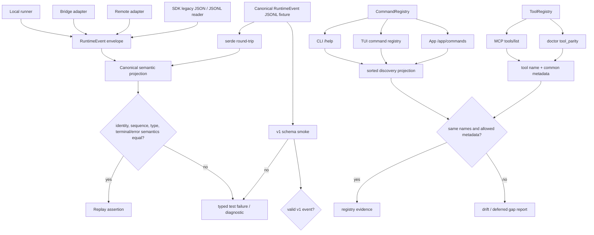

# Phase 3: 契约与 Schema 基线 - Research

**Researched:** 2026-08-09
**Domain:** Rust RuntimeEvent v1、JSON Schema 合同、跨入口 replay 与 registry discovery
**Confidence:** HIGH

<user_constraints>
## User Constraints (from CONTEXT.md)

### Locked Decisions

## Phase Boundary

本阶段为全部入口建立统一的、版本化的、可重放的 RuntimeEvent 契约和 ToolRegistry/CommandRegistry 发现契约，并证明跨入口一致性。这是 M0 Walking Skeleton 的最后一块拼图。

本阶段不修改产品能力行为，不实现新 pack 功能，只做契约收口、跨入口一致性测试和负向 fixture 套件。

## Implementation Decisions

### RuntimeEvent 契约（CORE-01）
- **D-01:** RuntimeEvent v1 schema 已 pinned（`docs/schemas/kiana-runtime-event.v1.schema.json`），9 个 payload 变体，所有 required 字段已完整。**不需要修改 schema**；Phase 3 的任务是证明跨入口一致性。
- **D-02:** `kiana-types/tests/runtime_event_schema.rs` 已覆盖全变体序列化（190 行，9 变体 + stop_reason + changed_files）。Phase 3 新增的是**跨入口等价矩阵测试**（同一 fixture 序列经 bridge/remote SDK adapter 的投影等价）。
- **D-03:** legacy session 兼容（JSON → JSONL）已实现。Phase 3 为版本迁移补一个**显式迁移合同测试**（兼容 adapter round-trip）。
- **D-04:** 不兼容输入的**负向 fixture 套件**（损坏/未知 schema/越界）需要新增；对标 stream-json 输入错误合同的已有模式。

### ToolRegistry/CommandRegistry（CORE-04）
- **D-05:** ToolRegistry（kiana-tools）与 CommandRegistry（kiana-commands）均已存在并被 runner/MCP/TUI/app-server 消费。**不需要修改 registry 实现**；Phase 3 新增**统一发现一致性测试**：CLI help 命令列表、TUI command registry、App `/app/commands`、doctor tool_parity 四面对同一组命令和工具的命名/权限/生命周期一致。
- **D-06:** `connector` 域当前不在 registry 中（Phase 14 加入）。Phase 3 明确标记 connector 为 registry gap，不试图实现。
- **D-07:** 并发语义测试（读并发/写串行）需新增；利用现有 `read_only`/`concurrency_safe` 字段编写断言。

### M0 范围
- **D-08:** M0 闭环 = FEAT-03-01 + FEAT-03-04。成功标准：`cargo test -p kiana-types runtime_event` + `cargo test -p kiana-types --test runtime_event_schema` + 新增的跨入口一致性测试均通过；`kiana doctor --json` 的 `reference_capabilities` + `/app/commands` 响应已覆盖 registry 全量。

### the agent's Discretion

CONTEXT.md 未单独提供此标题；本研究只在上述锁定范围内决定 fixture 的组织方式、语义投影字段和集合归一化方式。 `[VERIFIED: .planning/phases/03-contract-schema-baseline/03-CONTEXT.md]`

### Deferred Ideas (OUT OF SCOPE)

## Deferred

- connector domain 进入 registry（Phase 14）
- registry 并发写串行化的具体实现（当前为单线程；Phase 6 做 RuntimeHost 抽取后才有意义）
- 事件 schema v2 向后兼容升级路径（写文档但不实现 code）
</user_constraints>

<phase_requirements>
## Phase Requirements

| ID | Description | Research Support |
|----|-------------|------------------|
| CORE-01 | 所有 turn、stream delta、tool call/result、permission、error、usage 和 terminal result 都输出版本化 typed RuntimeEvent；每个入口能重放同一事件序列 | The pinned envelope, nine tagged payloads, local runner, bridge/remote adapters, SDK JSONL reader, App events view, and negative fixture boundary are mapped below. `[VERIFIED: kiana-types/src/runtime.rs:4-154; docs/schemas/kiana-runtime-event.v1.schema.json:1-219; kiana-entrypoints/src/runner.rs:64-249; kiana-entrypoints/src/cli.rs:10402-10434]` |
| CORE-04 | command、tool、MCP workbench、connector 通过唯一 registry 暴露 schema、版本、权限、生命周期和结构化错误；读工具可安全并发，写工具串行或隔离 | Registry ownership, discovery projections, existing permission/concurrency metadata, connector gap, and the required M0 evidence boundary are documented below. `[VERIFIED: kiana-tools/src/registry.rs:5-109; kiana-commands/src/registry.rs:5-92; kiana-tools/src/tool.rs:305-324; .planning/phases/03-contract-schema-baseline/03-CONTEXT.md:D-05-D-07]` |
</phase_requirements>

## Project Constraints (from AGENTS.md)

- Keep Rust 2021, Tokio, Cargo workspace layering, and the workspace `rust-version = "1.96"`; shared contracts belong in `kiana-types` or another already-established low-level crate. `[VERIFIED: AGENTS.md; Cargo.toml:2,45-70]`
- All product surfaces must consume the same runtime, session, tool, policy, and event contracts; do not duplicate core logic for Desktop, Web, TUI, MCP, or capability packs. `[VERIFIED: AGENTS.md; ARCHITECTURE.md]`
- Keep registry registration in `ToolRegistry`/`CommandRegistry`, keep surfaces thin, and preserve append-only event/artifact patterns for durable work. `[VERIFIED: AGENTS.md; ARCHITECTURE.md; kiana-tools/src/registry.rs:5-109; kiana-commands/src/registry.rs:5-92]`
- Put command behavior in `kiana-commands`, entrypoint routing in `kiana-entrypoints`, and network access behind `kiana-services` or policy-aware tool surfaces. `[VERIFIED: AGENTS.md; CONVENTIONS.md; ARCHITECTURE.md]`
- Update `docs/schemas/` and schema smoke coverage whenever a public JSON, stream, app-server, MCP, or proof contract changes. `[VERIFIED: AGENTS.md; scripts/schema-contract-smoke.sh:683-720]`
- Preserve fail-closed ProjectTrust, permission, sandbox, network, and external-side-effect boundaries. An unauthenticated App endpoint must remain rejected. `[VERIFIED: AGENTS.md; kiana-entrypoints/src/cli.rs:6192-6199]`
- Keep local-first data and credentials in the existing local/session or keychain/vault boundaries; do not introduce account, sync, telemetry, or provider behavior in this phase. `[VERIFIED: AGENTS.md; .planning/phases/03-contract-schema-baseline/03-CONTEXT.md:Phase Boundary]`
- Preserve cross-platform target constraints and do not add platform-specific dependencies for this contract-only phase. `[VERIFIED: AGENTS.md; Cargo.toml; platform-specific workspace crates]`
- Use `snake_case` module and function names, `Command` trait implementations with `CommandContext`, `anyhow` at command boundaries, typed `thiserror` in libraries, and contextual filesystem errors. `[VERIFIED: AGENTS.md; CONVENTIONS.md; kiana-commands/src/types.rs:58-75; kiana-entrypoints/src/sdk.rs:1216-1287]`
- Run `cargo fmt --all --check`; use workspace tests with `--locked --offline --no-fail-fast`; do not use production `unwrap`/`expect` except for impossible invariants. `[VERIFIED: AGENTS.md; CONVENTIONS.md]`
- Keep `deny.toml` dependency policy intact, do not add wildcard/unknown dependencies, and do not add an external schema package just for this phase. `[VERIFIED: AGENTS.md; deny.toml; Cargo.toml; Cargo.lock]`
- Preserve research provenance, license boundaries, release evidence, and scope-control requirements; an unverified capability must not be counted as complete. `[VERIFIED: AGENTS.md; .planning/REQUIREMENTS.md:32-40]`

## Summary

The current contract is a flattened `RuntimeEvent` envelope with `event_id`, `session_id`, `turn_id`, optional `parent_turn_id`, non-negative `sequence`, `timestamp`, and an internally tagged `type` payload. The Rust enum and pinned JSON Schema agree on nine tags: `user_message`, `assistant_message`, `stream_delta`, `tool_call`, `tool_result`, `permission_request`, `session_event`, `error`, and `result`; the schema carries the v1 identity in its `$id` and file name rather than adding a `version` field to every event. `[VERIFIED: kiana-types/src/runtime.rs:4-51; docs/schemas/kiana-runtime-event.v1.schema.json:1-51]`

The adapters already emit deterministic `event_id = session_id:turn_id:sequence`, but bridge, remote, runner, TUI, and App views transform provider-specific payloads differently. Stream deltas are not byte-identical across adapters, result events apply adapter-specific defaults such as `model_stop`, and usage is nested in provider stream/result data rather than represented by a tenth `RuntimeEventPayload` variant. The phase should therefore compare a canonical semantic projection and preserve the pinned nine-variant schema. `[VERIFIED: kiana-bridge/src/sdk_message_adapter.rs:67-120,683-697; kiana-remote/src/sdk_message_adapter.rs:200-242,393-409; kiana-entrypoints/src/runner.rs:134-249; kiana-types/src/runtime.rs:39-51]`

The registries are already the construction source for normal tools and commands, but their `HashMap` iteration order is unspecified and discovery surfaces expose different projections. App commands and doctor sort their snapshots; MCP currently returns the registry order; `/help` is a static grouped string rather than a registry-derived list. The plan should normalize by name/set, compare only common metadata per surface, and make the static help drift visible without changing the registry implementation. `[VERIFIED: kiana-tools/src/registry.rs:5-25; kiana-commands/src/registry.rs:5-26; kiana-entrypoints/src/cli.rs:6202-6237; kiana-commands/src/doctor.rs:459-498; kiana-entrypoints/src/mcp.rs:137-155; kiana-commands/src/help.rs:36-50]`

**Primary recommendation:** Build one checked-in canonical event fixture plus an expected semantic projection, run it through each available adapter/replay view, and add a separate registry discovery test that compares sorted command/tool projections while explicitly recording the connector and lifecycle/version gaps as deferred. Use the existing schema smoke script and structured stream-json error shape for negative fixtures; do not modify the pinned schema or add dependencies. `[VERIFIED: .planning/phases/03-contract-schema-baseline/03-CONTEXT.md:D-01-D-08; scripts/schema-contract-smoke.sh:683-720; kiana-entrypoints/src/cli.rs:820-839]`

## Architectural Responsibility Map

| Capability | Primary Tier | Secondary Tier | Rationale |
|------------|-------------|----------------|-----------|
| RuntimeEvent envelope and v1 tag contract | Shared contract (`kiana-types` + `docs/schemas`) | Schema smoke / test fixtures | The Rust type owns serialization shape and the pinned JSON Schema owns required fields, bounds, enum tags, and extra-property rejection. `[VERIFIED: kiana-types/src/runtime.rs:4-154; docs/schemas/kiana-runtime-event.v1.schema.json:1-219]` |
| Provider-to-runtime event adaptation | Adapter/runtime (`kiana-entrypoints`, `kiana-bridge`, `kiana-remote`) | Shared contract | Adapters choose payload mapping and deterministic IDs while constructing the shared `RuntimeEvent`. `[VERIFIED: kiana-entrypoints/src/runner.rs:64-249; kiana-bridge/src/sdk_message_adapter.rs:12-205,683-697; kiana-remote/src/sdk_message_adapter.rs:141-310,393-409]` |
| JSONL session migration and replay ownership | Session persistence (`kiana-entrypoints/src/sdk.rs`) | App/TUI projections | The SDK store reads legacy JSON first, falls back to `events.jsonl`, checks event session ownership, and rebuilds message projections. `[VERIFIED: kiana-entrypoints/src/sdk.rs:1216-1312; 1315-1380]` |
| App/TUI event projection | Surface projection (`kiana-entrypoints`) | Shared `RuntimeEvent` | App and TUI consume the same event payload variants but render client-specific views; tests must compare semantic fields, not rendered text. `[VERIFIED: kiana-entrypoints/src/cli.rs:9999-10327; kiana-entrypoints/src/tui.rs:1960-2069]` |
| Command discovery | Command registry (`kiana-commands`) | CLI, TUI, App Server | `CommandRegistry` owns registration and hidden filtering; each surface should consume its list and expose a normalized discovery projection. `[VERIFIED: kiana-commands/src/registry.rs:5-92; kiana-entrypoints/src/cli.rs:6202-6237; kiana-entrypoints/src/tui.rs:69-149,406]` |
| Tool/workbench discovery and concurrency metadata | Tool registry/execution (`kiana-tools`) | MCP and doctor | `ToolRegistry` owns tools; `Tool` exposes schema/workbench/read-only/concurrency metadata; execution uses those flags for safe read batching. `[VERIFIED: kiana-tools/src/registry.rs:5-43; kiana-tools/src/tool.rs:305-324; kiana-tools/src/tool_execution.rs:87-153,329-409]` |

## Standard Stack

### Core

| Library / component | Version | Purpose | Why Standard |
|---------------------|---------|---------|--------------|
| Rust workspace | 2021 edition; `rust-version = 1.96` | Runtime, adapters, registries, and tests | This is the existing workspace contract; the live compiler is Rust `1.97.1`, which satisfies the declared minimum. `[VERIFIED: Cargo.toml:2,45-70; rustc --version]` |
| `kiana-types` | workspace crate | Shared `RuntimeEvent` envelope and payload types | It is the only existing low-level owner of the event contract; adding a parallel JSON shape would violate project layering. `[VERIFIED: kiana-types/src/runtime.rs:4-154; AGENTS.md]` |
| `serde` | `1.0.228` locked | Derive serialization/deserialization and the internally tagged payload enum | The existing runtime and adapter code derive `Serialize`/`Deserialize` from it. `[VERIFIED: Cargo.lock:4487-4516; kiana-types/src/runtime.rs:1-51]` |
| `serde_json` | `1.0.150` locked | JSON values, JSONL records, and contract assertions | Runtime payloads intentionally use `Value`, and SDK/App paths serialize one event per JSONL line. `[VERIFIED: Cargo.lock:4517-4530; kiana-types/src/runtime.rs:1-3; kiana-entrypoints/src/sdk.rs:1260-1279]` |
| Pinned RuntimeEvent JSON Schema | `kiana-runtime-event.v1` / Draft 2020-12 declaration | Required fields, conditional payload requirements, enum tags, bounds, and closed object keys | Context explicitly pins this file; Phase 3 must prove it, not edit it. `[VERIFIED: docs/schemas/kiana-runtime-event.v1.schema.json:1-219; 03-CONTEXT.md:D-01]` |

### Supporting

| Library / component | Version | Purpose | When to Use |
|---------------------|---------|---------|-------------|
| `tokio` | `1.52.3` locked | Async adapter and tool execution tests | Use existing async test/runtime patterns; do not introduce a second executor. `[VERIFIED: Cargo.lock:4987-5004; kiana-tools/src/tool_execution.rs:87-153]` |
| `BTreeMap` / `BTreeSet` | Rust standard library | Deterministic semantic projections and discovery-name sets | Use for stable comparisons; current bridge projection code already imports ordered collections. `[VERIFIED: kiana-bridge/src/sdk_message_adapter.rs:9; kiana-commands/src/doctor.rs:459-498]` |
| `scripts/validate-json-schema.py` | repository script | Contract-boundary validation for positive and negative fixtures | Use it with the pinned schema in smoke/tests; it implements the repository's supported subset, not a new runtime dependency. `[VERIFIED: scripts/validate-json-schema.py:55-161; scripts/schema-contract-smoke.sh:683-720]` |
| `scripts/schema-contract-smoke.sh` | repository Bash script | End-to-end positive schema contract smoke | Extend only with Phase 3 fixtures and preserve its fail-closed exit behavior. `[VERIFIED: scripts/schema-contract-smoke.sh:1-6,683-720]` |

### Alternatives Considered

| Instead of | Could Use | Tradeoff |
|------------|-----------|----------|
| Raw serialized-event equality | Canonical semantic projection | Raw bridge/remote payloads differ while envelope identity and type semantics can still agree. Use projection and retain adapter-specific payload assertions. `[VERIFIED: kiana-bridge/src/sdk_message_adapter.rs:67-120; kiana-remote/src/sdk_message_adapter.rs:200-242]` |
| HashMap iteration order | Sorted vectors or `BTreeSet` name sets | Registry list order is not a contract; App/doctor already sort while ToolRegistry/MCP do not. `[VERIFIED: kiana-tools/src/registry.rs:5-25; kiana-entrypoints/src/cli.rs:6225-6230; kiana-commands/src/doctor.rs:472-484]` |
| A new `version` field or tenth usage variant | The pinned schema `$id` plus existing `stream_delta`/`result` metadata | The locked schema and Rust enum have no event `version` or `usage` payload variant; adding either would violate D-01. `[VERIFIED: kiana-types/src/runtime.rs:39-51; docs/schemas/kiana-runtime-event.v1.schema.json:1-51; 03-CONTEXT.md:D-01]` |

**Installation:** No installation command. This phase adds no external package; run the existing Cargo and repository-script commands below and keep `Cargo.lock` unchanged. `[VERIFIED: Cargo.toml; Cargo.lock; 03-CONTEXT.md:Phase Boundary]`

**Version verification:** Locked versions were checked with `Cargo.lock` and `cargo info --offline`; no dependency update is part of this phase. `[VERIFIED: Cargo.lock:818-819,4487-4518,4987-4988,5436-5437; cargo info --offline]`

## Package Legitimacy Audit

No external packages are installed or recommended for Phase 3, so the package legitimacy gate is not applicable. Existing locked workspace dependencies are reused without changing `Cargo.toml` or `Cargo.lock`. `[VERIFIED: Cargo.toml; Cargo.lock; git status --short]`

## Architecture Patterns

### System Architecture Diagram

The phase data flow is reconstructed from the shared type, adapter, persistence, surface, and registry implementations. `[VERIFIED: kiana-types/src/runtime.rs:4-154; kiana-entrypoints/src/runner.rs:64-249; kiana-entrypoints/src/sdk.rs:1216-1380; kiana-entrypoints/src/cli.rs:6199-6237; kiana-tools/src/registry.rs:5-109; kiana-commands/src/registry.rs:5-92]`



### Pattern 1: Canonical envelope plus internally tagged payload

**What:** Keep one `RuntimeEvent` envelope and let `RuntimeEventPayload` serialize with `#[serde(tag = "type", rename_all = "snake_case")]`; compare the serialized tag and required fields against the pinned schema. `[VERIFIED: kiana-types/src/runtime.rs:4-51; docs/schemas/kiana-runtime-event.v1.schema.json:5-51]`

**When to use:** Every local runner, bridge, remote adapter, session reader, TUI replay, and App event reader path. `[VERIFIED: kiana-entrypoints/src/runner.rs:64-249; kiana-bridge/src/sdk_message_adapter.rs:12-205; kiana-remote/src/sdk_message_adapter.rs:141-310; kiana-entrypoints/src/cli.rs:10402-10434; kiana-entrypoints/src/tui.rs:1960-2069]`

**Example:**

```rust
let value = serde_json::to_value(&event)?;
assert_eq!(value["type"], expected_type);
let round_trip: kiana_types::RuntimeEvent = serde_json::from_value(value)?;
```

The round-trip assertion follows the existing `runtime_event_schema` test style. `[VERIFIED: kiana-types/tests/runtime_event_schema.rs:8-190]`

### Pattern 2: Semantic projection for cross-entry replay

**What:** Project each event to the fields whose meaning is shared across adapters: `event_id`, `session_id`, `turn_id`, `parent_turn_id`, `sequence`, `type`, terminal `status`/`stop_reason`, error `code`/`message`, and tool identity. Keep raw `message`, `delta`, `input`, `content`, and provider metadata in adapter-specific assertions because their source shapes differ. `[VERIFIED: kiana-bridge/src/sdk_message_adapter.rs:21-120; kiana-remote/src/sdk_message_adapter.rs:148-281; kiana-entrypoints/src/cli.rs:10312-10327]`

**When to use:** The bridge/remote matrix and App/TUI replay tests. Do not compare provider-specific stream envelopes byte-for-byte. `[VERIFIED: .planning/phases/03-contract-schema-baseline/03-CONTEXT.md:D-02; kiana-bridge/src/sdk_message_adapter.rs:67-74; kiana-remote/src/sdk_message_adapter.rs:200-209]`

**Example:**

```rust
#[derive(Debug, PartialEq, Eq)]
struct EventKey {
    event_id: String,
    session_id: String,
    turn_id: String,
    parent_turn_id: Option<String>,
    sequence: u64,
    type_tag: String,
    stop_reason: Option<String>,
}

fn project(event: &kiana_types::RuntimeEvent) -> EventKey {
    use kiana_types::RuntimeEventPayload;

    let (type_tag, stop_reason) = match &event.payload {
        RuntimeEventPayload::UserMessage(_) => ("user_message", None),
        RuntimeEventPayload::AssistantMessage(_) => ("assistant_message", None),
        RuntimeEventPayload::StreamDelta(_) => ("stream_delta", None),
        RuntimeEventPayload::ToolCall(_) => ("tool_call", None),
        RuntimeEventPayload::ToolResult(_) => ("tool_result", None),
        RuntimeEventPayload::PermissionRequest(_) => ("permission_request", None),
        RuntimeEventPayload::SessionEvent(_) => ("session_event", None),
        RuntimeEventPayload::Error(_) => ("error", None),
        RuntimeEventPayload::Result(result) => {
            ("result", Some(result.stop_reason.clone()))
        }
    };

    EventKey {
        event_id: event.event_id.clone(),
        session_id: event.session_id.clone(),
        turn_id: event.turn_id.clone(),
        parent_turn_id: event.parent_turn_id.clone(),
        sequence: event.sequence,
        type_tag: type_tag.to_string(),
        stop_reason,
    }
}
```

The field list is derived from the envelope and App view, not from a new contract. `[VERIFIED: kiana-types/src/runtime.rs:4-15; kiana-entrypoints/src/cli.rs:10312-10327]`

### Pattern 3: Fixture-driven compatibility migration

**What:** Keep a fixture that can be written as legacy session JSON, rebuilt to `events.jsonl`, read through `read_session`, and compared to the original message projection. Also exercise JSONL-only reads and session ownership rejection. `[VERIFIED: kiana-entrypoints/src/sdk.rs:1216-1312; kiana-entrypoints/src/sdk.rs:1333-1380; kiana-entrypoints/src/sdk.rs:1833-2014]`

**When to use:** The explicit JSON-to-JSONL compatibility contract required by D-03; it is a migration proof, not a new storage format. `[VERIFIED: 03-CONTEXT.md:D-03]`

### Pattern 4: Registry discovery projection

**What:** Create default registries through `create_default_command_registry()` and `create_default_registry()`, collect visible names and common metadata, sort or use sets, then compare each surface. Preserve per-surface fields (`slash`, `routes_to`, `source`, MCP `inputSchema`, doctor `read_only`/`concurrency_safe`) instead of pretending the JSON objects are identical. `[VERIFIED: kiana-commands/src/registry.rs:24-92; kiana-tools/src/registry.rs:24-109; kiana-entrypoints/src/cli.rs:6202-6237; kiana-entrypoints/src/mcp.rs:137-155; kiana-commands/src/doctor.rs:459-498]`

**When to use:** CLI help/TUI/App command names and ToolRegistry/MCP/doctor tool metadata. Compare commands with commands and tools with tools; do not merge the two namespaces. `[VERIFIED: kiana-entrypoints/src/tui.rs:69-149; kiana-entrypoints/src/repl.rs:4-49; kiana-entrypoints/src/mcp.rs:137-155]`

### Pattern 5: Two-layer negative validation

**What:** Use Rust deserialization for typed tag/required-field rejection and the repository schema validator for `minLength`, `minimum`, conditional required fields, and `additionalProperties: false`. Reuse `kiana.stream-json-input-error.v1` as the structured diagnostic shape for stream-json input failures. `[VERIFIED: kiana-types/src/runtime.rs:39-123; docs/schemas/kiana-runtime-event.v1.schema.json:108-217; scripts/validate-json-schema.py:65-161; kiana-entrypoints/src/cli.rs:820-839,954; kiana-entrypoints/tests/cli_stream_json.rs:5-39]`

**When to use:** Unknown type, missing payload fields, empty IDs/stop reason, negative sequence, extra keys, malformed JSONL, and cross-session event fixtures. The test must fail if an invalid fixture is accepted. `[VERIFIED: docs/schemas/kiana-runtime-event.v1.schema.json:15-37,55-106,108-217; kiana-entrypoints/src/sdk.rs:1273-1287]`

### Anti-Patterns to Avoid

- **Editing the pinned schema to make fixtures pass:** D-01 pins the v1 file; repair adapter/fixture behavior or record a contract gap instead. `[VERIFIED: 03-CONTEXT.md:D-01; docs/schemas/kiana-runtime-event.v1.schema.json:1-219]`
- **Comparing raw bridge and remote JSON:** Their stream/result payloads are intentionally provider-shaped; compare the semantic projection and then test adapter-specific metadata separately. `[VERIFIED: kiana-bridge/src/sdk_message_adapter.rs:67-120; kiana-remote/src/sdk_message_adapter.rs:200-242]`
- **Relying on HashMap order:** Treat order as non-contractual and compare sorted names or sets. `[VERIFIED: kiana-tools/src/registry.rs:5-25; kiana-commands/src/registry.rs:5-26]`
- **Adding a tenth `usage` event or a per-event version field:** The pinned schema and enum do not contain either; usage must remain inside existing payload data for this phase. `[VERIFIED: kiana-types/src/runtime.rs:39-123; docs/schemas/kiana-runtime-event.v1.schema.json:39-106]`
- **Claiming full CORE-04 from M0 discovery tests:** Connector registration, unified lifecycle/version metadata, and write serialization are explicitly deferred or absent; report those gaps rather than marking them implemented. `[VERIFIED: 03-CONTEXT.md:D-05-D-07; .planning/features/03-FEATURES.md:43-77]`

## Don't Hand-Roll

| Problem | Don't Build | Use Instead | Why |
|---------|-------------|-------------|-----|
| Runtime event shape | A second struct, custom tag enum, or ad hoc JSON map | `kiana_types::RuntimeEvent` and `RuntimeEventPayload` | The shared type already defines the envelope and all nine tags. `[VERIFIED: kiana-types/src/runtime.rs:4-123]` |
| Schema validation | A new validator or hand-written production parser | `docs/schemas/kiana-runtime-event.v1.schema.json` plus `scripts/validate-json-schema.py` in contract smoke | The repository already owns the pinned schema and validator behavior. `[VERIFIED: docs/schemas/kiana-runtime-event.v1.schema.json:1-219; scripts/validate-json-schema.py:55-189]` |
| Adapter IDs and event constructors | Per-adapter ID formats | Existing `RuntimeEvent::new`/adapter helper constructors | Runner, bridge, and remote already use the same deterministic ID formula. `[VERIFIED: kiana-entrypoints/src/runner.rs:233-249; kiana-bridge/src/sdk_message_adapter.rs:683-697; kiana-remote/src/sdk_message_adapter.rs:393-409]` |
| Registry registration | A new registry or copied command/tool list | `create_default_command_registry()` and `create_default_registry()` | Existing surfaces consume these construction roots. `[VERIFIED: kiana-commands/src/registry.rs:35-92; kiana-tools/src/registry.rs:52-109; kiana-entrypoints/src/cli.rs:6202-6205]` |
| Tool scheduling | A new executor or lock protocol | `execute_tool_calls_with_permission_handler` and current read-only/concurrency-safe flags | Existing code batches only approved read-safe calls, clones context, merges read state, and restores original order. `[VERIFIED: kiana-tools/src/tool_execution.rs:87-153,329-409]` |
| Legacy session migration | A one-off conversion script that bypasses the store | `read_session`, `write_session`, `append_runtime_events_for_missing_messages`, and existing JSONL-only tests | The current store already handles JSON fallback, event-tree rebuild, and session ownership checks. `[VERIFIED: kiana-entrypoints/src/sdk.rs:1216-1380; kiana-entrypoints/src/sdk.rs:1833-2014]` |
| Structured stream errors | A new incompatible error envelope | `stream_json_input_error_payload` and `kiana.stream-json-input-error.v1` | Existing CLI tests pin code, line, schema, and message behavior. `[VERIFIED: kiana-entrypoints/src/cli.rs:820-839; kiana-entrypoints/tests/cli_stream_json.rs:5-39]` |

**Key insight:** Phase 3 is a proof and normalization phase. New parallel contracts would create exactly the cross-entry drift that the fixture matrix is meant to expose. `[VERIFIED: 03-CONTEXT.md:Phase Boundary; ARCHITECTURE.md]`

## Runtime State Inventory

This phase includes a legacy JSON-to-JSONL compatibility contract, so runtime state is inventoried even though no rename is planned. `[VERIFIED: 03-CONTEXT.md:D-03]`

| Category | Items Found | Action Required |
|----------|-------------|------------------|
| Stored data | Legacy `<session_id>.json` files and event-tree `<session_id>/events.jsonl` files are both read by the SDK session store. `[VERIFIED: kiana-entrypoints/src/sdk.rs:1216-1224,1251-1312]` | Add round-trip tests for JSON-backed, JSONL-only, and rebuilt sessions; no destructive data migration. `[VERIFIED: kiana-entrypoints/src/sdk.rs:1315-1362,1833-2014]` |
| Live service config | No external service configuration is part of this local file-backed migration path. `[VERIFIED: kiana-entrypoints/src/sdk.rs:1216-1380; 03-CONTEXT.md:Phase Boundary]` | None; keep the test local and deterministic. |
| OS-registered state | None; this phase changes no process, task-scheduler, launchd, or systemd registration. `[VERIFIED: 03-CONTEXT.md:Phase Boundary; git status --short]` | None. |
| Secrets/env vars | Session roots may be selected by `KIANA_SDK_SESSIONS_DIR`, `KIANA_HOME`, or `HOME`; these names are not being renamed. `[VERIFIED: kiana-entrypoints/src/cli.rs:10436-10445]` | Set an isolated session root in tests and verify both formats without changing secret names. |
| Build artifacts / installed packages | No package or build-artifact change is requested by the locked local session migration contract; `Cargo.lock` remains the existing workspace lock. `[VERIFIED: 03-CONTEXT.md:D-03; Cargo.lock; git status --short]` | None; run locked/offline tests. |

## Common Pitfalls

### Pitfall 1: Treating the schema `$id` as a serialized version field

**What goes wrong:** A fixture or implementation adds `version`, or a test expects a tenth event variant, even though the pinned envelope has no such field. `[VERIFIED: kiana-types/src/runtime.rs:4-15,39-51; docs/schemas/kiana-runtime-event.v1.schema.json:1-51]`

**How to avoid:** Pin the schema path/`$id` in the fixture harness and keep the serialized event fields exactly within the schema. `[VERIFIED: docs/schemas/kiana-runtime-event.v1.schema.json:1-12,108]`

**Warning signs:** `additionalProperties` failures, an enum-count mismatch, or a proposed `RuntimeEventPayload::Usage`/`version` change. `[VERIFIED: docs/schemas/kiana-runtime-event.v1.schema.json:39-51,108]`

### Pitfall 2: Raw equality across adapters

**What goes wrong:** Bridge wraps stream data in a map while remote uses the provider event directly, and result defaults/metadata differ. `[VERIFIED: kiana-bridge/src/sdk_message_adapter.rs:67-120; kiana-remote/src/sdk_message_adapter.rs:200-242]`

**How to avoid:** Compare the shared semantic projection and assert raw provider fields only within the adapter-specific test. `[VERIFIED: kiana-entrypoints/src/cli.rs:10312-10327]`

**Warning signs:** A failure only in `delta`, provider metadata, or error details while identity/type/sequence agree. `[VERIFIED: kiana-bridge/src/sdk_message_adapter.rs:67-120; kiana-remote/src/sdk_message_adapter.rs:200-242]`

### Pitfall 3: Assuming Serde rejects all unknown fields

**What goes wrong:** Serde's default JSON behavior ignores unknown fields, while the pinned schema rejects them; `flatten` also cannot be combined with `deny_unknown_fields` according to the official Serde docs. `[CITED: https://serde.rs/container-attrs.html#deny_unknown_fields; https://serde.rs/attr-flatten.html; VERIFIED: kiana-types/src/runtime.rs:13-14]`

**How to avoid:** Keep typed deserialization tests and schema-smoke negative fixtures as separate checks; never treat a serde round-trip as proof of `additionalProperties: false`. `[VERIFIED: scripts/validate-json-schema.py:109-118; docs/schemas/kiana-runtime-event.v1.schema.json:108]`

**Warning signs:** An extra top-level key passes `serde_json::from_value` but fails `scripts/validate-json-schema.py`. `[VERIFIED: scripts/validate-json-schema.py:109-114; docs/schemas/kiana-runtime-event.v1.schema.json:108]`

### Pitfall 4: Encoding usage as a new variant

**What goes wrong:** The requirement mentions usage, but the pinned enum has nine variants and the current provider usage appears in stream/result data. `[VERIFIED: .planning/REQUIREMENTS.md:36; kiana-types/src/runtime.rs:39-51; kiana-entrypoints/src/runner.rs:5891-5894,9803-9806]`

**How to avoid:** Include usage-bearing stream/result payloads in the fixture and compare the usage projection without changing the schema. `[VERIFIED: kiana-entrypoints/src/runner.rs:170-223; docs/schemas/kiana-runtime-event.v1.schema.json:53-106]`

**Warning signs:** A proposed tenth type tag or a schema edit to make an otherwise valid usage fixture pass. `[VERIFIED: 03-CONTEXT.md:D-01; docs/schemas/kiana-runtime-event.v1.schema.json:39-51]`

### Pitfall 5: Assuming schema enforces sequence uniqueness or ordering

**What goes wrong:** The schema only requires an integer `sequence >= 0`; duplicate, skipped, or out-of-order values are not rejected by schema alone. `[VERIFIED: docs/schemas/kiana-runtime-event.v1.schema.json:31-34]`

**How to avoid:** Make replay tests assert deterministic IDs, per-session/turn ordering, terminal position, and any duplicate policy explicitly. `[VERIFIED: kiana-entrypoints/src/runner.rs:233-249; kiana-entrypoints/src/sdk.rs:1269-1290]`

**Warning signs:** All lines validate but replay projection changes after reordering or duplicate insertion. `[VERIFIED: docs/schemas/kiana-runtime-event.v1.schema.json:31-34; kiana-entrypoints/src/sdk.rs:1269-1297]`

### Pitfall 6: Comparing registry list order

**What goes wrong:** Tool and command registries use `HashMap`; MCP returns unsorted values while App and doctor sort. `[VERIFIED: kiana-tools/src/registry.rs:5-25; kiana-commands/src/registry.rs:5-26; kiana-entrypoints/src/mcp.rs:137-155; kiana-entrypoints/src/cli.rs:6225-6230; kiana-commands/src/doctor.rs:472-484]`

**How to avoid:** Normalize by visible name and compare sorted vectors or sets; assert order only where a surface explicitly promises it. `[VERIFIED: kiana-entrypoints/src/cli.rs:6225-6230; kiana-commands/src/doctor.rs:472-484]`

**Warning signs:** A test is flaky or fails only because `tools[0]` changed. `[VERIFIED: kiana-entrypoints/src/mcp.rs:137-155; kiana-entrypoints/src/mcp.rs:691-715]`

### Pitfall 7: Treating discovery projections as identical JSON

**What goes wrong:** App includes command routing/source fields, MCP exposes input schema/workbench, and doctor exposes read-only/concurrency/workbench; no surface currently emits every CORE-04 field. `[VERIFIED: kiana-entrypoints/src/cli.rs:6202-6237; kiana-entrypoints/src/mcp.rs:137-155; kiana-commands/src/doctor.rs:459-498; kiana-tools/src/tool.rs:305-324]`

**How to avoid:** Define common projections (name, enabled/permission where present, workbench, schema identity where present) and record missing version/lifecycle/connector fields as explicit gaps. `[VERIFIED: 03-CONTEXT.md:D-05-D-06; .planning/features/03-FEATURES.md:43-64]`

**Warning signs:** A test either ignores a missing field or compares unrelated command and tool namespaces. `[VERIFIED: kiana-commands/src/registry.rs:24-26; kiana-tools/src/registry.rs:24-25]`

### Pitfall 8: Static `/help` drift

**What goes wrong:** `/help` is a hard-coded grouped text and can omit commands that are in the registry. `[VERIFIED: kiana-commands/src/help.rs:36-50; kiana-commands/src/registry.rs:35-92]`

**How to avoid:** Add a test or a small command-surface projection that obtains names from the existing registry; do not duplicate registration logic or change `CommandRegistry` itself. `[VERIFIED: 03-CONTEXT.md:D-05; kiana-commands/src/registry.rs:5-26]`

**Warning signs:** App/TUI registry counts grow while the slash help output remains unchanged. `[VERIFIED: kiana-entrypoints/src/cli.rs:6231-6235; kiana-commands/src/help.rs:36-50]`

### Pitfall 9: Confusing contract-smoke validation with runtime strictness

**What goes wrong:** The App event reader deserializes with Serde and does not call the Python schema validator, so a serde-accepted extra key is not evidence of strict schema enforcement. `[VERIFIED: kiana-entrypoints/src/cli.rs:10402-10434; scripts/validate-json-schema.py:164-189]`

**How to avoid:** Keep the schema validator in the contract test/smoke boundary and document whether production ingestion is expected to enforce the same closed-key rules; do not silently claim it already does. `[VERIFIED: 03-CONTEXT.md:D-04; scripts/schema-contract-smoke.sh:698-720]`

**Warning signs:** A negative fixture is tested only through App/TUI replay or only through Serde, not both layers. `[VERIFIED: kiana-entrypoints/src/cli.rs:10418-10431; scripts/validate-json-schema.py:109-114]`

### Pitfall 10: Losing migration ownership or accepting cross-session events

**What goes wrong:** JSONL events can be parsed but belong to another session; the SDK and App readers explicitly reject that mismatch. `[VERIFIED: kiana-entrypoints/src/sdk.rs:1280-1287; kiana-entrypoints/src/cli.rs:10424-10430]`

**How to avoid:** Include a cross-session negative fixture and test JSON-backed, JSONL-only, and rebuilt paths under an isolated `KIANA_SDK_SESSIONS_DIR`. `[VERIFIED: kiana-entrypoints/src/sdk.rs:1256-1264,1833-2014; kiana-entrypoints/src/cli.rs:10436-10445]`

**Warning signs:** A migration test checks message count but not `session_id`, `event_id`, `sequence`, or ownership errors. `[VERIFIED: kiana-entrypoints/src/sdk.rs:1269-1297]`

## Code Examples

Verified patterns from the repository:

### Runtime event schema and round-trip check

```rust
let event_value = serde_json::to_value(&event).expect("test fixture serializes");
assert_eq!(event_value["type"], "result");
let decoded: kiana_types::RuntimeEvent =
    serde_json::from_value(event_value).expect("v1 event round-trips");
assert_eq!(decoded.session_id, "session-1");
```

This follows the existing event schema test and adapter tests. `[VERIFIED: kiana-types/tests/runtime_event_schema.rs:22-33,97-129; kiana-bridge/tests/runtime_event_adapter.rs:33-42; kiana-remote/tests/runtime_event_adapter.rs:22-30]`

### Deterministic semantic projection

```rust
let projection = (
    event.event_id.clone(),
    event.session_id.clone(),
    event.turn_id.clone(),
    event.parent_turn_id.clone(),
    event.sequence,
    event_type(&event.payload),
    terminal_stop_reason(&event.payload),
);
```

Use the adapter helper's existing `session:turn:sequence` constructor and keep provider-specific `Value` payloads out of the equality tuple. `[VERIFIED: kiana-entrypoints/src/runner.rs:233-249; kiana-bridge/src/sdk_message_adapter.rs:683-697; kiana-remote/src/sdk_message_adapter.rs:393-409]`

### Registry discovery normalization

```rust
let mut names: Vec<String> = registry
    .list()
    .into_iter()
    .map(|entry| entry.name().to_string())
    .collect();
names.sort();
names.dedup();
```

The App and doctor surfaces already use the same sort-before-serialization pattern. `[VERIFIED: kiana-entrypoints/src/cli.rs:6202-6230; kiana-commands/src/doctor.rs:459-484]`

### Negative fixture contract

```bash
if python3 scripts/validate-json-schema.py \
    docs/schemas/kiana-runtime-event.v1.schema.json \
    tests/fixtures/runtime-event-extra-field.json; then
  echo "invalid fixture unexpectedly passed" >&2
  exit 1
fi
```

The validator exits non-zero and prints the offending property for schema failures. `[VERIFIED: scripts/validate-json-schema.py:164-189]`

## State of the Art

| Old Approach | Current Approach | When Changed | Impact |
|--------------|------------------|--------------|--------|
| Provider-shaped messages and per-surface replay logic | One `RuntimeEvent` envelope with nine tagged payloads and a pinned v1 schema | Existing Phase 3 baseline, verified 2026-08-09 | New adapters must map into shared fields; schema changes are out of scope. `[VERIFIED: kiana-types/src/runtime.rs:4-154; docs/schemas/kiana-runtime-event.v1.schema.json:1-219]` |
| Raw JSON equality across adapters | Semantic projection plus adapter-specific payload checks | Phase 3 planning decision | Prevents false failures from bridge/remote provider shape differences. `[VERIFIED: 03-CONTEXT.md:D-02; kiana-bridge/src/sdk_message_adapter.rs:67-120; kiana-remote/src/sdk_message_adapter.rs:200-242]` |
| Registry iteration order as observed output | Sorted discovery projections and name-set comparisons | Existing App/doctor behavior; MCP remains unsorted | Makes tests deterministic and exposes MCP/help drift. `[VERIFIED: kiana-entrypoints/src/cli.rs:6225-6230; kiana-commands/src/doctor.rs:472-484; kiana-entrypoints/src/mcp.rs:137-155]` |
| Serde-only confidence for closed schema behavior | Separate serde structural tests and JSON Schema negative fixtures | Phase 3 requirement | Detects the known difference between unknown-field tolerance and `additionalProperties: false`. `[VERIFIED: kiana-entrypoints/src/cli.rs:10418-10431; scripts/validate-json-schema.py:109-114]` |

**Deprecated/outdated:**

- Treating `/help`'s static groups as the complete command catalog is outdated for a registry-backed surface. `[VERIFIED: kiana-commands/src/help.rs:36-50; kiana-commands/src/registry.rs:35-92]`
- Treating connector discovery or registry write serialization as Phase 3 deliverables contradicts the locked deferred boundary. `[VERIFIED: 03-CONTEXT.md:D-06-D-07; .planning/features/03-FEATURES.md:67-77]`

## Assumptions Log

All implementation claims in this document are verified against the current checkout or cited to official documentation. No training-only assumptions are used. `[VERIFIED: provenance audit of this document]`

| # | Claim | Section | Risk if Wrong |
|---|-------|---------|---------------|
| - | None | - | The planner should still resolve the open questions below before treating M0 evidence as full CORE-01/CORE-04 completion. |

## Open Questions

1. **Does Phase 3 close full CORE-04 or only the locked M0 discovery slice?**
   - What we know: The roadmap assigns CORE-04 to Phase 3, while D-05/D-06 defer connector registration and the feature ledger marks unified lifecycle/version/error exposure partial. `[VERIFIED: .planning/ROADMAP.md:109-121; 03-CONTEXT.md:D-05-D-08; .planning/features/03-FEATURES.md:43-64]`
   - What's unclear: Whether the planner should mark CORE-04 pending after M0 tests or add non-registry surface projections for the missing fields.
   - Recommendation: Plan only the locked M0 proof, report connector/lifecycle/version/write-serialization gaps explicitly, and do not claim full CORE-04 closure without a new decision. `[VERIFIED: 03-CONTEXT.md:D-05-D-07]`

2. **Where must strict `additionalProperties: false` be enforced?**
   - What we know: The schema smoke validator rejects extra keys, while SDK/App runtime readers currently deserialize with Serde. `[VERIFIED: docs/schemas/kiana-runtime-event.v1.schema.json:108; scripts/validate-json-schema.py:109-114; kiana-entrypoints/src/sdk.rs:1273-1279; kiana-entrypoints/src/cli.rs:10418-10424]`
   - What's unclear: Whether production ingestion needs a Rust runtime validator in a later phase or whether Phase 3 is contract-test-only.
   - Recommendation: Keep Phase 3 negative fixtures explicit about the two layers and avoid adding a hand-rolled runtime schema validator; raise a follow-up decision if runtime strictness is required. `[VERIFIED: 03-CONTEXT.md:D-04; AGENTS.md]`

3. **What is the canonical usage projection?**
   - What we know: The requirement names usage, but the v1 enum has no `usage` variant and provider usage appears in stream/result data. `[VERIFIED: .planning/REQUIREMENTS.md:36; kiana-types/src/runtime.rs:39-51; kiana-entrypoints/src/runner.rs:5891-5894,9803-9806]`
   - What's unclear: Whether the fixture should read usage from `stream_delta.delta`, result metadata, or both for each provider.
   - Recommendation: Define one fixture projection that accepts existing provider locations and never changes the pinned event shape. `[VERIFIED: docs/schemas/kiana-runtime-event.v1.schema.json:53-106; 03-CONTEXT.md:D-01]`

4. **How is MCP included in the replay matrix?**
   - What we know: MCP exposes the shared `ToolRegistry` through `tools/list` but has no direct `RuntimeEvent` reader in `kiana-entrypoints/src/mcp.rs`. `[VERIFIED: kiana-entrypoints/src/mcp.rs:137-155; rg RuntimeEvent kiana-entrypoints/src/mcp.rs]`
   - What's unclear: The feature ledger says five entry points, but the current MCP surface is a tool discovery/call protocol rather than an event replay surface.
   - Recommendation: Test MCP in the registry discovery matrix and test RuntimeEvent replay only through surfaces that actually consume the event tree; record the missing MCP replay endpoint as a gap rather than inventing one. `[VERIFIED: .planning/features/03-FEATURES.md:31-41; 03-CONTEXT.md:Phase Boundary]`

5. **How should the existing dirty WIP tests be reconciled?**
   - What we know: `kiana-types/tests/runtime_event_schema.rs` currently has an extra closing brace at line 317, and `kiana-remote/tests/runtime_event_adapter.rs` is an untracked WIP file. `[VERIFIED: git diff -- kiana-types/tests/runtime_event_schema.rs; git status --short; kiana-types/tests/runtime_event_schema.rs:317]`
   - What's unclear: Whether those edits belong to the Phase 3 executor or another concurrent workstream.
   - Recommendation: Preserve them, inspect and integrate rather than revert, and make Wave 0 resolve compile/format ownership before relying on focused test results. `[VERIFIED: AGENTS.md; git status --short]`

## Environment Availability

| Dependency | Required By | Available | Version | Fallback |
|------------|-------------|-----------|---------|----------|
| Rust compiler | Runtime and unit/integration tests | yes | `rustc 1.97.1` | None needed. `[VERIFIED: rustc --version; Cargo.toml:45-46]` |
| Cargo | Workspace tests and formatting | yes | `cargo 1.97.1` | None needed. `[VERIFIED: cargo --version]` |
| Python 3 | Schema smoke validator | yes | `Python 3.13.12` | None needed; `scripts/validate-json-schema.py` is repository-local. `[VERIFIED: python3 --version; scripts/validate-json-schema.py:1]` |
| Bash | `schema-contract-smoke.sh` | yes | `/usr/bin/bash` | None needed. `[VERIFIED: command -v bash; scripts/schema-contract-smoke.sh:1]` |
| Bubblewrap | Not required by this contract-only phase | yes | `0.6.1` | Not used; sandbox behavior remains out of scope. `[VERIFIED: command -v bwrap; bwrap --version; 03-CONTEXT.md:Phase Boundary]` |

**Missing dependencies with no fallback:** None detected. `[VERIFIED: rustc --version; cargo --version; python3 --version; command -v bash]`

**Missing dependencies with fallback:** None detected. `[VERIFIED: same environment probes]`

## Validation Architecture

### Test Framework

| Property | Value |
|----------|-------|
| Framework | Cargo/Rust unit and integration tests in the workspace. `[VERIFIED: AGENTS.md; Cargo.toml]` |
| Config file | `Cargo.toml` workspace; no separate test runner config. `[VERIFIED: Cargo.toml; rg --files ".*test.*config.*"]` |
| Quick run command | `cargo test -p kiana-types --test runtime_event_schema --locked --offline` |
| Full suite command | `cargo test --workspace --locked --offline --no-fail-fast -- --test-threads=1` |

### Phase Requirements -> Test Map

| Req ID | Behavior | Test Type | Automated Command | File Exists? |
|--------|----------|-----------|-------------------|-------------|
| CORE-01 | All nine payload tags serialize and round-trip through the pinned v1 field shape | unit/integration | `cargo test -p kiana-types --test runtime_event_schema --locked --offline` | Existing file, but current dirty WIP must be repaired first. `[VERIFIED: kiana-types/tests/runtime_event_schema.rs:8-190,192-317]` |
| CORE-01 | Bridge and remote produce equal canonical identity/type/sequence/terminal projections from equivalent fixture cases | integration | `cargo test -p kiana-bridge --test runtime_event_adapter --locked --offline` and `cargo test -p kiana-remote --test runtime_event_adapter --locked --offline` | Adapter tests exist; unified fixture/projection is a Wave 0/implementation gap. `[VERIFIED: kiana-bridge/tests/runtime_event_adapter.rs:1-320; kiana-remote/tests/runtime_event_adapter.rs:1-71]` |
| CORE-01 | Legacy JSON write/rebuild and JSONL-only read preserve messages and event ownership | unit/integration | `cargo test -p kiana-entrypoints sdk_session_store --lib --locked --offline` | Existing SDK tests cover adjacent behavior; explicit migration contract is missing. `[VERIFIED: kiana-entrypoints/src/sdk.rs:1833-2014]` |
| CORE-01 | Unknown type, missing required payload, empty/negative bounded fields, extra key, malformed line, and cross-session event are rejected | unit/smoke | `cargo test -p kiana-types runtime_event_rejects --locked --offline`; `cargo test -p kiana-entrypoints --test cli_stream_json --locked --offline`; `bash scripts/schema-contract-smoke.sh` | Some typed/stream checks exist; consolidated fixtures are a Wave 0 gap. `[VERIFIED: kiana-types/tests/runtime_event_schema.rs:192-233; kiana-entrypoints/tests/cli_stream_json.rs:5-39; scripts/schema-contract-smoke.sh:683-720]` |
| CORE-04 | CLI help, TUI registry, and App `/app/commands` expose the same visible command-name set | integration | `cargo test -p kiana-entrypoints registry_discovery_consistent_across_surfaces --locked --offline` | New cross-surface test required; App handler and TUI registry already exist. `[VERIFIED: kiana-entrypoints/src/cli.rs:6186-6237; kiana-entrypoints/src/tui.rs:69-149]` |
| CORE-04 | ToolRegistry, MCP `tools/list`, and doctor `tool_parity` agree on sorted tool names and common metadata | integration | `cargo test -p kiana-entrypoints mcp::tests::list_tools_exposes_default_registry --lib --locked --offline`; `cargo test -p kiana-commands doctor_json_reports_tool_parity_snapshot --lib --locked --offline` | Existing independent tests exist; unified projection test required. `[VERIFIED: kiana-entrypoints/src/mcp.rs:690-715; kiana-commands/src/doctor.rs:1444-1470]` |
| CORE-04 | Read-only/concurrency-safe calls batch without reordering; writes do not enter the read batch | unit/integration | `cargo test -p kiana-tools registry --locked --offline` plus a focused `tool_execution` concurrency fixture | Existing flags and batching exist; explicit Phase 3 assertions are a gap. `[VERIFIED: kiana-tools/src/registry.rs:194-205; kiana-tools/src/tool_execution.rs:87-153,329-409]` |

### Sampling Rate

- **Per task commit:** Run the smallest affected Cargo test and the fixture validator command for that contract. `[VERIFIED: AGENTS.md; scripts/validate-json-schema.py:164-189]`
- **Per wave merge:** Run all focused package tests plus `bash scripts/schema-contract-smoke.sh`. `[VERIFIED: scripts/schema-contract-smoke.sh; AGENTS.md]`
- **Phase gate:** Run the full locked/offline workspace suite and `cargo fmt --all --check`; do not claim closure while the existing dirty test syntax error remains. `[VERIFIED: AGENTS.md; git diff -- kiana-types/tests/runtime_event_schema.rs:317]`

### Wave 0 Gaps

- [ ] Repair/integrate the existing `kiana-types/tests/runtime_event_schema.rs` WIP extra brace before any test result is trusted. `[VERIFIED: kiana-types/tests/runtime_event_schema.rs:317]`
- [ ] Format and assign ownership for the untracked `kiana-remote/tests/runtime_event_adapter.rs`. `[VERIFIED: git status --short; kiana-remote/tests/runtime_event_adapter.rs:1-71]`
- [ ] Add one canonical nine-variant/usage-bearing JSONL fixture and its semantic projection helper. `[VERIFIED: 03-CONTEXT.md:D-02; kiana-types/src/runtime.rs:39-51]`
- [ ] Add bridge/remote/local/App replay-equivalence assertions with adapter-specific raw-field checks. `[VERIFIED: .planning/features/03-FEATURES.md:31-41; current adapter/app paths]`
- [ ] Add negative fixtures and make the validator-success path fail the test. `[VERIFIED: 03-CONTEXT.md:D-04; scripts/validate-json-schema.py:164-189]`
- [ ] Add the command/tool registry discovery projection test and explicitly assert connector/lifecycle/version gaps. `[VERIFIED: 03-CONTEXT.md:D-05-D-06; kiana-entrypoints/src/cli.rs:6202-6237; kiana-commands/src/doctor.rs:459-498]`
- [ ] Add focused read-concurrency/write-exclusion assertions without changing the registry implementation. `[VERIFIED: 03-CONTEXT.md:D-05-D-07; kiana-tools/src/tool_execution.rs:329-409]`

## Verification Snapshot

- `bash scripts/schema-contract-smoke.sh` passed all slices, including the pinned RuntimeEvent positive fixtures. `[VERIFIED: command exit 0 on 2026-08-09]`
- Bridge adapter tests passed 5/5, remote adapter tests passed 3/3, stream-json structured-error test passed 1/1, tool registry tests passed 4/4, MCP list-tools test passed 1/1, and doctor tool-parity test passed 1/1. `[VERIFIED: cargo test command outputs on 2026-08-09]`
- `cargo test -p kiana-types --test runtime_event_schema --locked --offline` is blocked by the pre-existing extra closing brace at `kiana-types/tests/runtime_event_schema.rs:317`; this is a dirty-worktree issue, not a research-document failure. `[VERIFIED: cargo compiler output; git diff -- kiana-types/tests/runtime_event_schema.rs]`
- `cargo fmt --all --check` is blocked by formatting in the pre-existing untracked `kiana-remote/tests/runtime_event_adapter.rs` and the same malformed runtime schema test file. `[VERIFIED: cargo fmt output; git status --short]`

## Security Domain

### Applicable ASVS Categories

| ASVS Category | Applies | Standard Control |
|---------------|---------|------------------|
| V2 Authentication | yes for App discovery/replay endpoints | Preserve the existing bearer authorization check and add an unauthenticated negative test; do not bypass it in fixtures. `[VERIFIED: kiana-entrypoints/src/cli.rs:6192-6199]` |
| V3 Session Management | yes | Validate requested session IDs, event session ownership, and legacy JSONL migration boundaries. `[VERIFIED: kiana-entrypoints/src/sdk.rs:1246-1287; kiana-entrypoints/src/cli.rs:10402-10430]` |
| V4 Access Control | yes | Keep tool permission checks and read-only/concurrency flags as the source for execution/discovery assertions. `[VERIFIED: kiana-tools/src/tool_execution.rs:164-175,329-359; kiana-tools/src/tool.rs:305-324]` |
| V5 Input Validation | yes | Use typed Serde rejection plus pinned schema negative fixtures for tags, required fields, bounds, and extra keys. `[VERIFIED: kiana-types/src/runtime.rs:39-123; docs/schemas/kiana-runtime-event.v1.schema.json:15-217; scripts/validate-json-schema.py:95-161]` |
| V6 Cryptography | no new control | No cryptographic implementation is introduced; preserve existing authentication/integrity layers and do not hand-roll hashes or signatures. `[VERIFIED: 03-CONTEXT.md:Phase Boundary; AGENTS.md]` |

### Known Threat Patterns for Rust JSONL and Registry Surfaces

| Pattern | STRIDE | Standard Mitigation |
|---------|--------|---------------------|
| Unknown/extra event fields | Tampering | Schema `additionalProperties: false` negative fixture plus typed deserialization checks. `[VERIFIED: docs/schemas/kiana-runtime-event.v1.schema.json:108; scripts/validate-json-schema.py:109-114]` |
| Cross-session event injection | Spoofing / Elevation | Compare each event's `session_id` with the requested session and fail closed. `[VERIFIED: kiana-entrypoints/src/sdk.rs:1280-1287; kiana-entrypoints/src/cli.rs:10424-10430]` |
| Replay ambiguity from duplicate/out-of-order sequence | Tampering / Repudiation | Assert deterministic `event_id`, sequence ordering, terminal position, and explicit duplicate policy in replay tests; schema alone only checks `sequence >= 0`. `[VERIFIED: kiana-entrypoints/src/runner.rs:233-249; docs/schemas/kiana-runtime-event.v1.schema.json:31-34]` |
| Discovery drift exposing wrong permission/concurrency metadata | Elevation | Compare common registry projections against Tool metadata and doctor/MCP/App outputs; keep permission checks in execution. `[VERIFIED: kiana-tools/src/tool.rs:305-324; kiana-tools/src/tool_execution.rs:329-359; kiana-commands/src/doctor.rs:459-498]` |
| Unauthenticated App command/event access | Spoofing / Information Disclosure | Preserve bearer auth and test `401` before checking payload equality. `[VERIFIED: kiana-entrypoints/src/cli.rs:6192-6199]` |

## Sources

### Primary (HIGH confidence)

- `kiana-types/src/runtime.rs:4-154` - RuntimeEvent envelope, nine payload variants, deterministic SDK message adapter. `[VERIFIED: codebase]`
- `docs/schemas/kiana-runtime-event.v1.schema.json:1-219` - Pinned v1 schema, required fields, conditional branches, bounds, and closed keys. `[VERIFIED: codebase]`
- `kiana-entrypoints/src/runner.rs:64-249` - Local runner event mapping and ID construction. `[VERIFIED: codebase]`
- `kiana-bridge/src/sdk_message_adapter.rs:12-205,598-697` - Bridge event mapping, tool lifecycle projection, and IDs. `[VERIFIED: codebase]`
- `kiana-remote/src/sdk_message_adapter.rs:141-409` - Remote event mapping, defaults, and IDs. `[VERIFIED: codebase]`
- `kiana-entrypoints/src/sdk.rs:1216-1380,1833-2014` - Legacy JSON/JSONL session read/write/rebuild behavior. `[VERIFIED: codebase]`
- `kiana-tools/src/registry.rs:5-109`, `kiana-commands/src/registry.rs:5-92`, `kiana-tools/src/tool.rs:305-324` - Registry ownership and metadata. `[VERIFIED: codebase]`
- `kiana-entrypoints/src/cli.rs:6186-6237,9999-10434`, `kiana-entrypoints/src/mcp.rs:137-155`, `kiana-commands/src/doctor.rs:459-498` - Discovery and replay surfaces. `[VERIFIED: codebase]`
- `scripts/validate-json-schema.py:55-189`, `scripts/schema-contract-smoke.sh:683-720` - Repository validation and smoke behavior. `[VERIFIED: codebase]`

### Secondary (MEDIUM confidence)

- None; no phase-critical claim depends on an external secondary source.

### Tertiary (LOW confidence)

- `[CITED: https://serde.rs/enum-representations.html]` - Internally tagged enum representation used by `RuntimeEventPayload`.
- `[CITED: https://serde.rs/attr-flatten.html]` - Flatten semantics and incompatibility with `deny_unknown_fields`.
- `[CITED: https://serde.rs/container-attrs.html#deny_unknown_fields]` - Default unknown-field behavior and strict attribute semantics.
- `[CITED: https://json-schema.org/understanding-json-schema/reference/conditionals]` - `if`/`then` conditional validation semantics.
- `[CITED: https://json-schema.org/understanding-json-schema/reference/object#additionalproperties]` - `required` and `additionalProperties: false` semantics.

The official documentation was fetched through the available web-fetch fallback; the confidence classifier returned LOW for that provider, so those citations are background only. All phase-critical claims are verified against the repository. `[VERIFIED: gsd-tools classify-confidence --provider webfetch --verified; codebase sources above]`

## Metadata

**Confidence breakdown:**
- Standard stack: HIGH - locked workspace versions and repository scripts were inspected; no new package is proposed. `[VERIFIED: Cargo.lock; Cargo.toml; scripts/validate-json-schema.py]`
- Architecture: HIGH - event, adapter, persistence, registry, App, MCP, TUI, and doctor paths were read directly. `[VERIFIED: sources in Primary]`
- Pitfalls: HIGH for current-code behavior, LOW for external documentation background - pitfalls are backed by direct source/tests; official docs were fetched through a LOW-confidence fallback. `[VERIFIED: source hierarchy and classifier output]`

**Research date:** 2026-08-09 `[VERIFIED: current_date]`
**Valid until:** 2026-09-08 for the locked workspace baseline; re-check after any RuntimeEvent/schema or registry surface change. `[VERIFIED: current pinned schema and Cargo.lock]`
