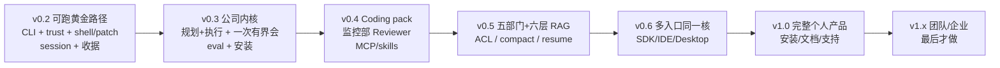

# Kiana 产品方案（v0.2 → 完整产品）

Date: 2026-08-22
Status: **执行真相源**（替代已删除的 24-phase / Project OS / 104 需求语料）
Proof level allowed now: `local_behavior` only
Companion: [COMPANY.md](COMPANY.md)（公司编排北星）、[PROCESS.md](PROCESS.md)、[PHASES.md](PHASES.md)

本文件回答三件事：

1. 现在仓库里**实际是什么**（brownfield，不是愿景图）。
2. 按 `reference/` 里 coding agent 的 **git 提交顺序**，从 0 做到完整产品要经过哪些站。
3. 这些站如何落到 **Kiana 现有 crate**，而不是再造一套 Claude Code 克隆。

旧 `AGENTS.md` 里的「三能力包 + Desktop + 企业版」是北星，**不是当前完成定义**。没有矩阵条目、owner、测试和证据的能力，不得计入完成。

---

## 1. 代码真相（必须先承认）

Kiana 是带 **两条 agent 运行时** 的 brownfield Rust workspace。

| Spine | 路径 | 模型可见工具 | 谁在用 |
|---|---|---|---|
| **Owned harness（产品）** | `kiana-entrypoints/src/harness_run.rs` → `kiana-daemon::DaemonHost` → `kiana-core::ControlPlane` → `kiana-runner::KianaHarness` | 只有 `shell` + `apply_patch`（broker 成 `shell.exec` / `apply_patch`） | `kiana run`；print/SDK 经 `execute_owned_harness_turn` |
| **Legacy runner（冻结）** | `cli.rs`（~25k）+ `runner.rs`（~11k）+ `kiana-tools`（50+ tools） | Read/Edit/Grep/Bash/MCP/Team/Cron… | **TUI 仍走这条**（`tui.rs` → legacy SDK/stream） |

Owned harness 是 Codex 形：模型不下发工具执行，副作用由 daemon broker。把 `kiana-tools` 做成 Claude Code 50-tool 对等 **不是** 完成路径。

### 质量 vs 名字

真实质量（有代码体积）：

- `kiana-entrypoints`、`kiana-tui`、`kiana-commands`、`kiana-tools`、`kiana-components`

薄但真实的控制面：

- `kiana-daemon` / `kiana-core` / `kiana-runner` / `kiana-policy` / `kiana-ports`

名字还在、产品未完成：

- `kiana-eventlog::MemoryEventLog` — 进程结束收据消失（EVD 未真）
- `kiana-capability-broker` / `kiana-client` / `kiana-gates` / `kiana-workflow` — 有类型，不是 Project OS
- chrome / computer-use / url-handler / screen-capture — 完整产品后期，v0.2 冻结

测试现状：`kiana-entrypoints/tests/cli_run.rs` / `cli_print.rs` 只证明 **fake-script 路由** 和无模型 fail-closed。它们不是 live provider、真实写盘、resume、持久收据。

默认沙箱 **read-only**；未信任 → `project_untrusted` deny。这是正确的 week-1 形状（Codex 在开源第 2 天就修了 suggest 模式自动跑 shell）。

---

## 2. 北星与完成边界

**北星（不变）：** 本地优先的 Company OS：五个 PMP 过程组是部门，部门内是独立上下文的角色，部门内可开有界 Symposium，记忆按公司/部门/角色/项目/用户分层 ACL。工人仍是 `KianaHarness`。见 [COMPANY.md](COMPANY.md)。

**Claude Code 公开行为** 是 Coding pack 的后期审计基线，不是现在的退出门。`reference/` 只提供：

- **产品站顺序**（git 演进，见 PROCESS.md）
- **公开行为审计**（clean-room，不抄专有源码）
- **许可证兼容的模式**（Codex Apache-2.0 的 shell/apply_patch 形状已经在 `kiana-runner` 注释里写明来源）

当前可宣称的证明级别只有 `local_behavior`。`gaps_found`、测试条数、旧 PLAN 重建、招满角色但没人会写盘，都不算完成。

---

## 3. 完整产品阶梯（git 顺序，不是愿望清单）

真实产品几乎都走同一条路。Kiana 按 **版本里程碑** 走完这条路；每个版本内部再用 PROCESS.md 的内环。



### v0.2 — Runnable Local Agent（当前执行，对应站 1–5）

用户可见闭环（工人是 `role=builder`，不是上帝 agent）：

```bash
kiana trust .
kiana run --sandbox workspace-write -- "create a file named GOLDEN_PATH.txt containing hello"
```

必须为真：信任、真 provider、受限 shell/patch、失败可见、continue/cancel、重启后收据还在、收据含 `role=builder`。

TUI 若不能接到同一 `DaemonHost`，就显式 park，不假装完成。**v0.2 Phase 4 已 park：** `kiana tui` 仍走 legacy SDK/stream；产品路径只有 `kiana run` / print。

### v0.3 — Trusted Workbench + 公司内核（站 6–8）

- 规划部 + 执行部：PM/Architect 一次有界 Symposium → 一个 WorkPacket → 独立上下文 Builder
- 每个发言者私有 session；共享的是黑板和 DecisionRecord，不是融历史
- PM/Architect 不写 src；跨部门只交包；冻结 TeamCreate/SendMessage 总线
- 一条已经很好的 CLI；TUI **迁到同一 spine**（或保持 park）
- 黄金路径 eval（录制/重放真实 turn，不是 fake-script 路由）
- 安装 / 升级 / 回滚必须跑 demo
- 工具面仍然是 harness；不复活 50-tool 注册表

### v0.4 — Coding pack 基线（站 9–10）

- 对 Claude Code **公开行为** 做审计矩阵（Read/Grep/Glob/Bash/Edit/Web 等），每项：owner、Kiana 实现位置、测试、证据、许可证
- MCP client、skills/hooks：挂在 daemon broker 上，不进 `runner.rs`
- 多供应商：能力不一致必须显式报告/降级，禁止静默装等价
- `reference/claude-code-rev-main` 与 `claude-code-main (2)` 是 **非 git dump**，只许行为层对照

### v0.5 — 长任务 + 五部门 + 六层 RAG（站 11）

- 立项/规划/执行/监控/收尾都是部门对象；work packet 为跨部门唯一派工单位
- RAG 六层：Company / Department / Role / Project / User / Instance scratch；`memory.search`/`write` 带 `role_id`+`department_id`，命中进收据
- 部门可开会；跨部门联席必须显式、限时；决议进部门 RAG
- 自有 prompt / context / control flow（12-factor 2/3/8）
- compact / pause / resume；作者 ≠ 评审
- GSD/OpenSpec/pm-skills/coleam00-Archon 变成过程实现，不恢复 24-phase 语料

### v0.6 — 多入口同一核（站 12）

顺序（git 共识：先做一个入口做到能用，再复制协议）：

1. Headless SDK / print / RPC（已有雏形，必须 100% harness）
2. IDE（Continue/Cline 证明 IDE 可以是第一入口，但 Kiana 已经选了 CLI）
3. Desktop / Web（OpenHands/orca/emdash 是桌面优先产品；Kiana 不是）

任何新入口必须打 `DaemonHost`。禁止为 Desktop/Web 复制核心循环。

### v1.0 — 完整个人产品

完成定义（git + 12-factor + GSD ship）：

- 安装、升级、回滚、恢复
- 安全默认 fail-closed
- 文档与支持
- Coding pack 达到公开行为审计的「核心路径」而不是 100% 工具数
- Daily / Research 只有在同一核上能跑通一条黄金路径时才算产品，否则保持 pack 草案

### v1.x — 团队 / 云 / 企业（站 13，最后）

Codex 到 2025-07-11 才有 `codex apply` 远程 patch；cline hub drain/upgrade 是 2026-08 的事。租户、RBAC、审计、数据保留必须隔离。Open Core 个人版不掺进企业契约。

---

## 4. 当前里程碑：v0.4（Phase 1–2 已本地绿）

历史 GSD Phase 1–24 计数作废。v0.2 与 v0.3 均已本地绿。v0.4 Phase 1 Reviewer≠作者已本地绿。v0.4 Phase 2 公开行为矩阵草稿已签字（`docs/coding-pack-matrix.md`）。下一站是 MCP client 经 daemon，不是五部门。

| Phase | 目标 | 需求 | 成功标准 |
|---|---|---|---|
| 1 Reviewer ≠ author | 监控部 Reviewer 新 session；确定性门 | REV-01 | **已本地绿：** `kiana run --review`；`gate/REVIEW.json`；不跑模型；不能 `apply_patch` src |
| 2 Coding pack matrix | 先文档后代码 | CODE-01 | **已签字：** `docs/coding-pack-matrix.md`；每项 owner/测试/证据/许可证/是否本期 |
| 3+ MCP / skills / provider | 矩阵要才做 | CODE-02..04 | 下一刀 CODE-02；未实现 |

主文件：`harness_run.rs`、`cli.rs`（`run_main`/`print_main`）、`kiana-daemon/`、`kiana-core/`、`kiana-runner/`、`kiana-services/src/api/provider.rs`、`kiana-eventlog/`。

---

## 5. 冻结（直到声明的版本打开）

| 冻结项 | 直到 |
|---|---|
| `kiana-tools` 新工具、`runner.rs` 扩张 | v0.4 审计条目要求，且走 broker 而不是 legacy loop |
| `kiana-coordinator` TeamCreate/SendMessage | 永远不作为产品总线；跨部门走 work packet；部门内走 Symposium |
| MCP / chrome / computer-use | v0.4 / v0.6 |
| 新的重复控制面 crate | 永远不。先填现有 `kiana-core`/`daemon` |
| 恢复 24-phase / schema 手册当进度 | 永远不 |
| 把 38 个 reference 当完成矩阵打勾 | 永远不；reference 是顺序与审计源 |
| 拆 `cli.rs` 当目标 | 只在挡住 spine 时拆 |
| IDE / Desktop / Web / 云 / 企业 | v0.6 / v1.x |
| Research / Daily pack 当完成 | v1.0 且黄金路径已在同一核上 |

---

## 6. 与 reference 的许可证边界

- **可借鉴实现形状：** Codex（Apache-2.0）shell + apply_patch、OpenHands MIT、aider、pi、deepseek-harness、12-factor、GSD、OpenSpec、superpowers、planning-with-files。
- **只许公开行为 clean-room：** `reference/claude-code-rev-main`、`claude-code-main (2)`、以及任何专有产品。禁止把 dump 源码搬进 Kiana。
- **`claude-code-rust` 是反面教材：** 第 1 天提交「完整功能 + 发布 v1.0.0」，随后修编译、再补 MCP。Kiana 不走这条。

---

## 7. 下一步

阶梯在本文件，git 证据在 PROCESS.md，**逐期剧本在 PHASES.md**。

**v0.4 Phase 2 已签字。执行下一站只打开 v0.4.2 CODE-02**：MCP client 经 daemon，挂在 harness 上。不要同时开工五部门 / 六层 RAG / JointSymposium / skills-on-harness / 解冻 TeamCreate/SendMessage。不要把 `kiana-tools/mcp_tool.rs` 或 `kiana-entrypoints/src/mcp.rs`（Kiana 当 MCP server）标成完成。
