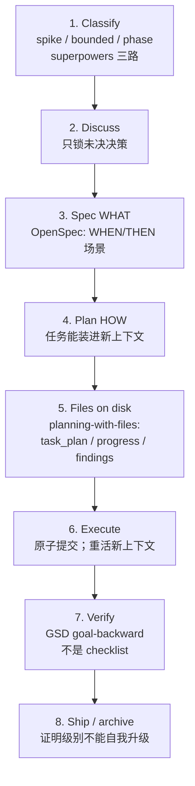

# Kiana 开发流程：从 0 到完整产品

Date: 2026-08-22
Status: 方法真相源（git 证据 → 外环产品站 → 内环建造 SOP）
Companion: [COMPANY.md](COMPANY.md)（公司编排）、[DESIGN.md](DESIGN.md)、[PHASES.md](PHASES.md)

本流程不是「把 reference/ 里 60+ 个仓库做一遍」。它是从那些仓库的 **提交顺序** 里抽出来的、已经被市场验证过的建造法。Kiana 按这个顺序走；每站的实现映射见 DESIGN.md。

证据边界：

| 仓库类 | 例子 | 能当什么证据 | 不能当什么 |
|---|---|---|---|
| 产品 coding agent（完整 git） | aider, cline, Roo-Code, OpenHands, Codex, continue, orca, pi, emdash, herdr, opencode, goose, crush | 外环站顺序、第一入口选择、安全何时进入；opencode/goose 是 CLI+Desktop 同核的当代对照 | 逐文件抄袭；把 Kiana 工人换成别人的 SDK |
| 近期完整 harness | deepseek-harness, grok-build, mini-swe-agent | 现代 harness 分层；mini 证明「bash-only 线性历史」也能干活 | grok-build 无从 0 演进史；mini **没有** `apply_patch`，Kiana v0.2 仍锁 shell+apply_patch |
| 方法论 | 12-factor-agents, superpowers, OpenSpec, GSD, planning-with-files, pm-skills, architect-loop, gstack, spec-kit, claude-task-master | 内环：如何做每一站；spec-kit=constitution/specify/plan/tasks；task-master=PRD→任务图 | 不能替代黄金路径产品；Node 任务板不是运行时 |
| 记忆/图 | MemPalace, graphify, memorix, GitNexus, graphiti, letta-code, beads | v0.5+ 六层 RAG：时序图、记忆块/MemFS、git 任务图 | 不是 v0.2；不要把 Python/Go 服务嵌进 `kiana-core` |
| 框架 | langchain, autogen, MetaGPT, openai-agents-python, adk-python, agno, pydantic-ai, agent-framework | 反模式 + 可偷的对象：handoff、Sequential/Parallel/Loop、typed deps、checkpoint/HITL | 不作为 Kiana 骨架；不恢复 TeamCreate/SendMessage |
| 非 git dump | claude-code-rev-main, claude-code-main (2) | 公开行为对照 | 无 git，不能当演进证据 |
| 浅克隆 | Schr0d/Archon, get-shit-done, OpenSpec(部分), superpowers(部分) | 当前树形状 | 不要编造早期历史 |
| 过程引擎 | coleam00/Archon（`reference/Archon-Knowledge`）；adk Sequential/Loop；pydantic_graph | YAML DAG、fresh_context、bash/AI 混排、人审批门；过程=软件 | 不当工人运行时；不当部门编制 |
| 组织/会议 | Agency Swarm, ChatDev, CrewAI, autogen group-chat, pm-skills meeting family, gastown, a2a | 定向通信、公司隐喻、Role Card、Mayor/Rig/mailbox/handoff | 自由群聊总线；Mayor 当上帝 agent；20–30 agent 规模当 v0.2 |
| 并行 swarm | ruflo（`plugins/ruflo-swarm`、`v3/@claude-flow/swarm`）；container-use | worktree 隔离、层次拓扑、工人池、有界 MessageBus；git 环境隔离与合并 | Queen/BFT/100-agent hive-mind；TeamCreate/SendMessage；Dagger 当工人运行时 |
| 记忆产品页 | `letta` / `letta-oss`（同一份 archived stub） | 只有定位/归档说明 | **源码看 `letta-code`** |
| 只读、禁止运行 | gpt-pilot（HEAD=`9b763fd` 已删恶意 telemetry loader） | 历史「PRD→整应用」叙事 | 仓库曾被投毒且已停更；**不要执行** |

2026-08-22 已 `git fetch` + `git pull --ff-only`：当时 39 个 git 目录相对 `origin/HEAD` 为 0 behind；2 个 dump 跳过。
同日补浅克隆：`Archon-Knowledge`（coleam00/Archon）、`agency-swarm`、`ChatDev`、`crewAI`、`letta`（落地页/现已确认是 archived stub）。

### 2026-08-22 第二批浅克隆（补缺口，`--depth 1`）

现 `reference/`：63 个 git + 2 个 dump。下列是相对第一批的**加法**，不是产品。一律只读；`gpt-pilot` 额外禁止运行。

| 目录 | 上游 | 为什么补 | 偷什么 | 不偷什么 |
|---|---|---|---|---|
| `opencode` | sst/opencode | 当代 peer harness/TUI/Desktop | CLI+Desktop 同核、session | TS 栈；安装脚本当产品 |
| `goose` | block/goose | Rust 本地优先，recipes，CLI+Desktop+API | recipe 当后期部门技能；ACP | 把 Kiana 换成 goose |
| `crush` | charmbracelet/crush | 小 TUI agent + LSP 上下文 | 小 session TUI | Charm 专有栈 |
| `mini-swe-agent` | SWE-agent/mini-swe-agent | 最小 coding loop | 线性历史、动作独立、sandbox 可换 | 丢掉 `apply_patch`；无工具调用当教条 |
| `spec-kit` | github/spec-kit | spec-driven；对照 OpenSpec | constitution / specify / plan / tasks 工件 | 替换 OpenSpec/GSD |
| `container-use` | dagger/container-use | 并行 agent 隔离 | git 环境 + merge；给 v0.6 Builder | Dagger 当工人；当 v0.2 |
| `graphiti` | getzep/graphiti | 时序知识图 → 部门/用户/项目 RAG | `valid_at`/`invalid_at`、provenance、ontology | Python 服务进 core |
| `letta-code` | letta-ai/letta-code | 真·记忆 OS（`letta` 是 stub） | memory block、MemFS、memory-confinement、agent-scoped skills | Letta Cloud；换掉 `KianaHarness` |
| `letta-oss` | letta-ai/letta | 与 `letta` 重复的归档说明 | 无 | 当源码 |
| `openai-agents-python` | openai/openai-agents-python | 官方 handoff；Agency Swarm 包它 | 类型化 handoff、guardrail、HITL、sandbox agent | SDK 当运行时；handoff 复制全历史 |
| `adk-python` | google/adk-python | Sequential/Parallel/Loop 当软件 | 部门过程=Sequential/Loop；Parallel 仅执行部+隔离 | Google ADK 当产品 |
| `agno` | agno-agi/agno | Team / knowledge / memory / session | Team≠Agent；知识按队隔离 | Python 框架当核 |
| `claude-task-master` | eyaltoledano/claude-task-master | 规划部 PRD→任务 | parse-prd / expand-task 技能形状 | Node 任务板当运行时 |
| `beads` | steveyegge/beads | git 任务图 / 项目记忆 | claimable graph、依赖、跨 agent 账本 | 替换 WorkPacket；当公司 OS |
| `gastown` | steveyegge/gastown | 最接近「coding 公司」 | mailbox+identity+handoff、git 账本、merge queue、容量阀、watchdog | Mayor 上帝；polecat 术语产品化；工人=Claude Code；v0.2 招 20 人 |
| `agent-framework` | microsoft/agent-framework | Magentic workflow、checkpoint、HITL | 可恢复过程 + 人审批 | Magentic-One 当 Mayor |
| `pydantic-ai` | pydantic/pydantic-ai | 类型化 agent/deps/graph | RoleContract=typed deps；过程图 | Python 运行时 |
| `a2a` | a2aproject/A2A | Agent Card / 任务生命周期 | 角色发现与能力广告；WorkPacket 生命周期 | v0.2 实现完整 A2A |
| `gpt-pilot` | Pythagora-io/gpt-pilot | 历史 0→产品叙事 | 最多读「PRD→任务→实现」阶段名 | **禁止运行**（曾投毒、已停更） |

刻意没 clone：CAMEL（与 ChatDev/MetaGPT 重叠）、mem0（graphiti+letta-code+MemPalace 够）、完整 SWE-agent（mini 够）、langgraph（langchain 已在 + ADK/Archon DAG 够）、LightRAG/ragflow（体积/重叠）、mastra/kilocode（栈或 Roo 重叠）、e2b/daytona（container-use 覆盖隔离）。

---

## 外环：产品站（按 git 时间，不是按 PPT）

### 共同结论（先读这个）

1. **先有一条能改文件的黄金路径，再谈平台。** aider 2023-04-03「chat works」，04-06 才「roughed in edit」。deepseek 2026-06-11 先 `echo-agent` 再在 7 月加 MCP/TUI。
2. **Trust/sandbox 是第 1–2 周的事，不是企业阶段。** Codex 2025-04-18 就修了 suggest 模式自动执行 shell（#197）；OpenHands 2024-03-21 就有 Minimal Docker Sandbox；cline 第 3 天禁止在 `/` 上递归列文件。
3. **只选一个第一入口。** CLI（aider/Codex/pi/grok）、IDE（cline/Roo/Continue）、Desktop（OpenHands/orca/emdash）。第二入口最早也是几天到几周后，且打同一核。Kiana 已经选了 CLI。
4. **工具从 2 个长到 N 个，不是从 50 个开始。** Codex 模型面长期是 `shell` + `apply_patch`；MCP types 到 2025-05-02 才进 crate。
5. **Session/cancel 紧跟黄金路径。** cline 第一周就有 `abortTask`；pi 2025-11-12 才 `--resume`（在 agent/TUI 能跑之后）；deepseek 6 月就有 SessionId，7 月才脚本化 permission。
6. **持久证据晚于「能跑」，但必须在「能吹牛」之前。** aider 5 月 transcript；Codex 2025-07-24 才把 git metadata 写入 rollout。
7. **Eval 对齐黄金路径。** aider 2023-06-23 才 `benchmark.py`；OpenHands 因为研究定位，第 9 天就 SWE-Bench+Docker。Kiana 不是论文产品，eval 跟在 v0.3。
8. **MCP/skills/plugins 是乘法，不是骨架。** deepseek MCP 2026-07-07（loop 之后约 4 周）；orca MCP inspector 2026-05-15（产品已能跑终端两个月后）。
9. **远程/团队/企业是最后一站。** Codex `codex apply` 远程 2025-07-11；cline hub drain/upgrade 2026-08。
10. **声称 1.0 的那天往往还在修编译。** `claude-code-rust` 2026-04-01 同一天 Initial +「发布 v1.0.0」。这是 Kiana 明确拒绝的形状。

### 站 0 — 问题与完成定义

**git：** 每个能活下来的仓库，README 在第一周就写清「用户拿它干什么」。deepseek 第二天就把 MVP 需求和分析链进 AGENTS.md。

**Kiana 完成定义：** 见 DESIGN §2。Done = 用户在受信仓库里用真模型改到文件，并能在重启后指出证据。不是 crate 数量。

**内环产出：** `PROJECT.md` 一段话 + 一条 demo 命令。已有。

### 站 1 — 黄金路径（v0.2 Phase 1）

| 产品 | 时间 | 提交 |
|---|---|---|
| aider | 2023-04-03–08 | initial → chat→coder → BEFORE/AFTER edit |
| cline | 2024-07-05–09 | VSCode sidebar + API key 持久化 + 工具消息 + abort |
| OpenHands | 2024-03-13–20 | init → websocket → First pass at a control loop |
| Codex | 2025-04-16 | CLI + shell + 无效命令处理 + rate limit retry |
| deepseek | 2026-06-11 | agent loop plugin + runnable echo-agent |
| orca | 2026-03-16 | Basic terminal support（桌面第一入口） |
| pi | 2025-08-09 | 已能跑的 agent CLI（开源时已是 v0.5.x） |
| grok-build | 2026-07-16 | 开源即 harness+TUI，无从 0 历史 |

**Kiana：** `kiana run` / print → `DaemonHost` → `KianaHarness`，真 provider，`shell`/`apply_patch`。

### 站 2 — 编辑落地 + git 安全（v0.2 Phase 1 内）

aider 用了几天从「tiny context edit」走到 diff/merge 格式。Codex 2025-04-22 就在处理 `apply_patch` 相对路径。不要先做 Read/Edit/Grep 三件套再做 patch。

**Kiana：** 保持 Codex 形两工具。文件变更必须发生在 project root 内。

### 站 3 — Trust / sandbox fail-closed（v0.2 Phase 1，不可后移）

| 产品 | 时间 | 证据 |
|---|---|---|
| Codex | 2025-04-17/18/24 | sandbox 文档 → suggest 模式误执行修复 → `codex_execpolicy` |
| OpenHands | 2024-03-21 | Minimal Docker Sandbox |
| cline | 2024-07-08 | Prevent listFiles in root |
| aider | 2023-05-28 | run 输出进 chat 前要用户批准 |
| emdash | 2025-10-02 | `CODEX_SANDBOX_MODE`，默认 workspace-write |
| orca | 2026-03-19 | Linux sandbox errors |

**Kiana：** 已有 untrusted deny + 默认 read-only。Phase 1 必须让 `workspace-write` 在受信项目里真的能写，未受信继续 deny。

### 站 4 — Resume / cancel / 可见失败（v0.2 Phase 2）

| 产品 | 时间 | 证据 |
|---|---|---|
| cline | 2024-07-09 | abort button + abortTask |
| Codex | 2025-04-17 | command history persistence |
| pi | 2025-10-06 / 11-12 | session storage → `--resume` |
| emdash | 2025-09-14 | session persistance of chats |
| deepseek | 2026-07-08 | scripted permission answers；后来才有 stable session snapshots |

假成功是产品毒药。12-factor #9：错误要 compact 且用户可见。

### 站 5 — 持久证据（v0.2 Phase 3）

aider transcript（2023-05-12）、Codex rollout+git metadata（2025-07-24）、deepseek SQLite session（2026-08-18）。Kiana 现在是 `MemoryEventLog`，**这一站没做完就不能宣称任务可证**。

### 站 6 — 把第一入口做好（v0.3）

Codex TUI 2025-04-25（开源后 9 天）仍是同一 CLI 产品的全屏模式，不是第二个产品。pi 第二天就开始 TUI 渲染质量。Kiana TUI 体积很大但走 legacy runner：v0.3 要么迁过去，要么 park。**禁止**同时开 IDE/Desktop。

### 站 7 — Eval 对齐黄金路径（v0.3）

aider `scripts/benchmark.py`（开源后 ~11 周）。OpenHands 研究型提前。Kiana：一条 fixture 仓库 + 真/录制 provider + 「文件出现且收据可指」断言。fake-script 路由测试降级为回归，不再当 PATH 完成。

### 站 8 — 安装 / 升级 / 回滚（v0.3）

Codex 第 1 天就有 release script。pi 开源当天在修 npm global bin。emdash 一周内 macOS DMG。Kiana 已有 `install.sh` / `scripts/release-smoke.sh`：必须改成验证 v0.2 demo，而不是已删的 schema 语料。

### 站 9 — 工作台变宽（v0.4）

在黄金路径稳定后，按 **公开行为审计** 加能力，每项带测试。仍然走 daemon broker。不要把 `kiana-tools` 50 个工具「接上」当完成。

### 站 10 — MCP / skills / plugins（v0.4）

deepseek MCP client 2026-07-07；Codex mcp-types 2025-05-02；orca MCP inspector 2026-05-15。Skills 生态（awesome-agent-skills, skills, ECC）是目录，不是运行时。Kiana 已有 `kiana-skills` 加载器：v0.4 才接到 harness。

### 站 11 — 长任务 OS（v0.5）

这是 **产品能力** 和方法论交汇处。来源：

- 12-factor: 自有 prompt/context/control flow；统一执行状态与业务状态；launch/pause/resume；任何入口触发同一核
- GSD: discuss → plan → execute → verify → ship；产物落盘
- OpenSpec: spec 是 WHAT，change 是一次变更，verify 后 archive
- planning-with-files: `task_plan.md` / `findings.md` / `progress.md` 活过 `/clear`
- superpowers: brainstorm → spec 签字 → 计划细到 junior 能做 → TDD 子 agent
- architect-loop: orchestrator 持有证据，builder 一次一个 issue
- pm-skills: 产品决策与建造分离

Kiana 曾经用 24-phase Project OS **跳过了站 1**。那是 git 里没有人走通的路。v0.5 才把 workflow/eventlog 做成用户可感知的长任务。

### 站 12 — 多入口同一核（v0.6）

12-factor #11。Codex 2025-09-30 才把 `codex mcp` 拆成 `mcp-server` 与 `app-server`。Continue 从第一周就是 IDE。Kiana 的第二入口必须是 SDK/print 彻底离开 `runner.rs`，然后才是 IDE。Desktop/Web 更后。

### 站 13 — 团队 / 云 / 企业（v1.x）

最后做。需要单独的租户与审计边界。git 里没有「先做企业再做能改文件」的成功故事。

---

## 内环：每一站怎么建造

外环决定 **做什么**。内环决定 **一个上下文窗口里怎么做完**。Kiana 默认用这条，不另发明。



### 运行时不变量（12-factor，对 owned harness 强制）

1. NL → 结构化 tool call，不是自由文本副作用
2. Prompt 归产品所有
3. Context window 归产品所有
4. 工具 = 结构化输出 + broker 执行
5. 执行状态与业务状态统一（session/run/receipt 同一事实源）
6. 可 launch / pause / resume
7. 人的批准也是一种 tool
8. 控制流归产品所有（禁止「loop until vibes」）
9. 错误 compact、可见、可机器读
10. 小而专注的 agent（harness 不做 50 工具上帝进程）
11. 任何入口打同一 daemon
12. Stateless reducer：重放事件能重建，而不是改内存对象

### 证明级别（Kiana 强制，来自本仓库既有偏好）

| 级别 | 含义 | 谁能宣称 |
|---|---|---|
| `source` | 代码/文档存在 | 随时 |
| `local_behavior` | 本机跑出用户可见行为 | v0.2 的上限 |
| `target` / `live` / `physical` | 目标环境、线上、真机 | 需单独授权与证据 |

`gaps_found`、sample_only、测试条数、过期规划表 **不是** 关闭条件。

### 人类门（不可被 auto 跨过）

- 信任模型 / sandbox 默认值
- 许可证（尤其 Claude Code dump）
- 真 provider 密钥与付费
- 企业租户边界
- 「这算 1.0 了吗」的产品签字

### Git 工作方式

- 原子提交，只 stage 本任务文件
- 不把窄任务做成全仓清理
- 不相关 dirty 文件保持不动
- 长任务用 named tmux（本机既有偏好）

---

## 反模式清单（git 与本仓都 demonstrably 失败过）

1. 从 50-tool Claude Code 对等开始（Kiana `kiana-tools` + 旧 104 req）
2. 先做 Project OS / 治理语料，再做能改文件（已删除的 24-phase）
3. 两条运行时并存还宣称「一个产品」（当前 TUI vs `kiana run`）
4. 用 crate 数量或 reference 打勾当完成
5. 第 1 天宣称 v1.0.0（claude-code-rust）
6. 把方法论仓库（GSD/OpenSpec）当成要吸收的产品功能
7. 把 langchain/autogen 的「prompt + bag of tools」当骨架（12-factor 明确反对）
8. 在黄金路径不稳时加 MCP/企业/Desktop
9. 抄专有 dump
10. 让证明级别偷偷升级

---

## 对照：Kiana 现在卡在哪一站

| 站 | 状态 | 证据 |
|---|---|---|
| 0 完成定义 | 本方案已重写 | DESIGN.md / PROCESS.md |
| 1 黄金路径 | **未完成** | 只有 fake-script 路由测试 |
| 2 编辑落地 | 代码有 `apply_patch` broker | 缺 live/录制写盘证明 |
| 3 trust/sandbox | 策略在，默认 read-only | 缺受信 workspace-write 的 local_behavior |
| 4 session | 部分 legacy `events.jsonl` | harness 会话未接通 |
| 5 收据 | `MemoryEventLog` | 重启即消失 |
| 6 第一入口做好 | CLI 雏形；TUI 在错误的 spine | 双运行时 |
| 7–13 | 未打开 | 冻结 |

所以：**完整方案存在，执行入口只有 v0.2 Phase 1。** 每一期的工作包、允许改的文件、该读的 `reference/` 路径见 [PHASES.md](PHASES.md)。

---

## 一页 SOP（以后每个 phase 都贴这个）

```text
1. 读 DESIGN.md 当前版本 + 本站 git 教训
2. Classify: spike / bounded / phase
3. Discuss 只问代码+git 回答不了的决策
4. Spec: 用户场景 WHEN/THEN，证明级别写死
5. Plan: 任务可进新上下文；列出冻结项
6. 落盘 task_plan.md / progress.md / findings.md
7. Execute: 只改 spine 需要的文件；原子提交
8. Verify: 对着成功标准跑，而不是对着 checkbox
9. 证明仍是 local_behavior，除非用户另开证明任务
10. 不打开下一站，除非本站成功标准全绿
```
