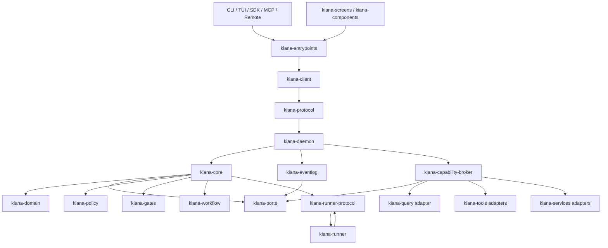

# Kiana

Kiana 是一个 local-first 的 AI Agent 产品工作区。同一个 Rust 核心为 Coding、Academic Research 和 Daily Work 提供统一的 runtime、session、tool、policy、workflow 和 event contracts，并向 CLI/TUI、SDK/RPC/MCP、Desktop、Web/App Server 暴露一致能力。

项目仍处于架构迁移期。当前代码可以编译和测试，但不能据此宣称已经完成 Claude Code、Claude Desktop 或 `reference/` 能力的完整替代。能力完成度以 capability matrix、测试、运行级 smoke 和发布证据为准。

## 架构



控制平面不变量：

- 产品入口不能直接调用 Tool、Service、Task 或 Query implementation。
- `kiana-core` 独立确定 capability、operation 和 risk，不接受客户端自签权限。
- `kiana-daemon` 是 concrete adapter、EventLog 和 broker 的组合根。
- 外部副作用必须经过 ProjectTrust、policy、gate、approval 和可恢复事件合同。
- `reference/**` 只作为审计输入，不参与 workspace 构建，也不能绕过许可证和安全治理。

当前 `kiana architecture status --json` 报告：

```json
{
  "schema": "kiana.architecture-status.v1",
  "control_plane": "kiana-core",
  "composition_root": "kiana-daemon",
  "legacy_edges_remaining": 10
}
```

已迁移到 `Client -> Protocol -> Daemon -> Core -> Broker` 的 Context Query 包括 `repo-map`、`artifact-graph`、`artifact-readiness`、`search`、`vector-search` 和 `pack`。`index`、`artifacts`、`artifact-store` 与 `ingest` 仍保留 legacy 实现，等待 LocalWrite approval/resume 合同完成后迁移；因此 `kiana-commands -> kiana-query` 依赖暂时不能删除。

## 快速开始

要求 Rust toolchain 满足 workspace `rust-version`，当前为 Rust 1.96。

```bash
# 开发构建
cargo build -p kiana-entrypoints --bin kiana --locked

# 查看命令
./target/debug/kiana --help

# 交互式 REPL，需要真实终端
./target/debug/kiana

# 非交互式 prompt
ANTHROPIC_API_KEY=<key> ./target/debug/kiana -p "summarize this repository"

# TUI
./target/debug/kiana tui

# 当前控制平面状态
./target/debug/kiana architecture status --json
```

Provider 可以通过配置文件或环境变量选择。完整配置见 [CONFIG.md](CONFIG.md)。

```bash
# Anthropic
export ANTHROPIC_API_KEY="sk-ant-..."

# OpenAI-compatible
export KIANA_PROVIDER="openai-compatible"
export KIANA_OPENAI_API_KEY="sk-..."
export KIANA_OPENAI_BASE_URL="https://api.openai.com/v1"

# Ollama
export KIANA_PROVIDER="ollama"
export KIANA_OLLAMA_BASE_URL="http://localhost:11434"
export KIANA_OLLAMA_MODEL="llama3.1"
```

新项目默认是 `unknown` trust，项目级 skills、hooks、MCP、agents 和变更类能力会 fail closed。人工审查后显式授权：

```bash
kiana trust status
kiana trust trust
```

## Workspace

当前 Cargo workspace 有 37 个 crate，按职责分为：

```text
Control plane
  kiana-client / kiana-protocol / kiana-daemon / kiana-core
  kiana-domain / kiana-ports / kiana-policy / kiana-gates
  kiana-capability-broker / kiana-eventlog

Execution
  kiana-runner-protocol / kiana-runner / kiana-workflow
  kiana-commands / kiana-tasks / kiana-tools / kiana-query
  kiana-services / kiana-skills

Product surfaces
  kiana-entrypoints / kiana-remote / kiana-bridge
  kiana-screens / kiana-components / kiana-ink

Native integrations
  kiana-chrome-mcp / kiana-computer-mcp / kiana-computer-input
  kiana-screen-capture / kiana-url-handler / kiana-modifiers
```

`Cargo.toml` 和 `cargo metadata --no-deps` 是成员列表的事实源。新增共享契约优先进入 `kiana-domain`、`kiana-ports`、`kiana-protocol` 或 `kiana-types`，不要在 surface crate 复制 wire shape 和核心逻辑。

## 验证

```bash
cargo fmt --all --check
cargo test --workspace --locked --offline --no-fail-fast
bash scripts/schema-contract-smoke.sh
bash scripts/release-smoke.sh
```

Linux 无桌面输入会话时，`kiana-computer-input::tests::test_init` 可能因原生输入后端不可用失败；应把它作为平台环境边界单独报告，不能把 focused test 通过描述为 workspace 全绿。

## 文档入口

- [使用指南](USAGE.md)
- [配置说明](CONFIG.md)
- [安装说明](INSTALL.md)
- [发布说明](RELEASE.md)
- [项目定义](.planning/PROJECT.md)
- [当前路线图](.planning/ROADMAP.md)
- [控制平面架构设计](docs/superpowers/specs/2026-07-17-kiana-control-plane-architecture-design.md)
- [Command Query 迁移计划](docs/superpowers/plans/2026-07-18-kiana-command-query-migration.md)
- [Reference 能力迁移](docs/reference-migration-roadmap.md)
- [商业发布就绪清单](docs/commercial-release-readiness.md)
- [安全策略](SECURITY.md)

## License

MIT OR Apache-2.0。`reference/` 下各项目遵循各自许可证；Kiana 是否复用源码必须经过独立许可证审计。
