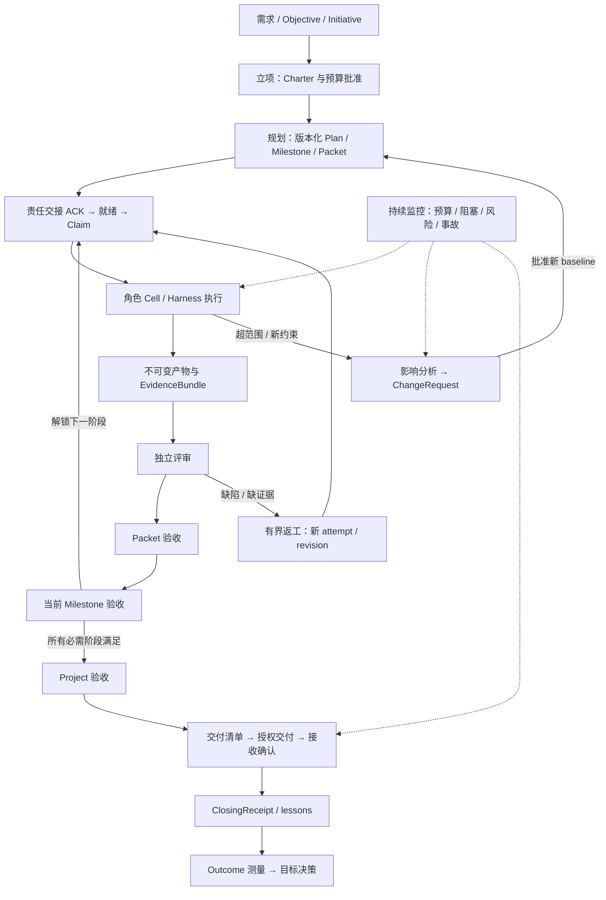
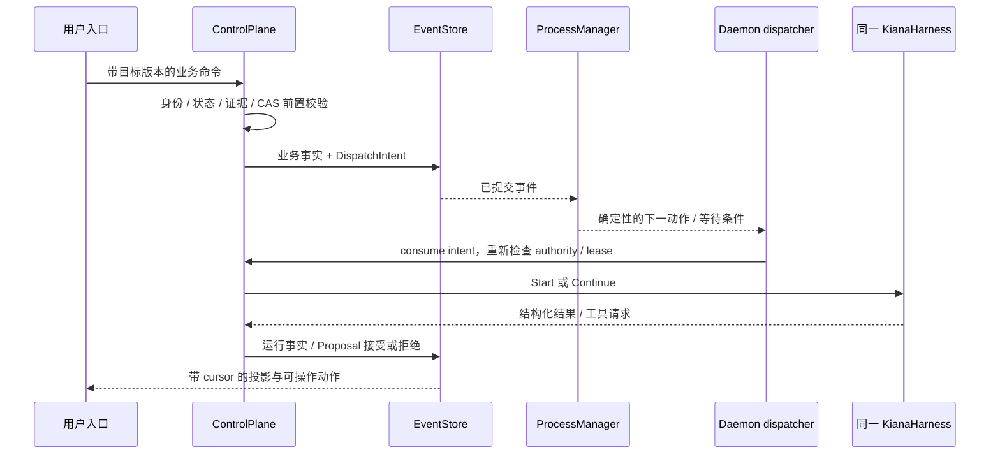

# CompanyOS：组织与业务的代码设计

> 日期：2026-09-12。性质：本次用户要求下的目标设计与实施合同，**未实现/未验收的内容不能读成现状**。
> 范围：[module-map.md](module-map.md) 的「1. CompanyOS：组织与业务」。研究来源与覆盖范围见 [调研记录](reference-agent-audit/company-os-organization-business-survey-2026-09-12.md)；可派发步骤见 [roadmap 末尾 CO-01–CO-48](roadmap.md#companyos-business-steps)。
> 基线：`db77c24` + 2026-09-12 共享工作树 WIP。当前实现证明仍看 [CURRENT_STATUS.md](../CURRENT_STATUS.md)。

## 1. 设计结论与本次决定

CompanyOS 要把一个需求变成可追踪的交付：能回答为什么做、由谁负责、下一步为何可执行、谁依据什么接受结果、实际交给了谁，以及是否达到原始目标。组织结构、业务状态、运行实例分别保存，通过明确的 ID、版本和事件连接。

五部门是常设职责，不是一个必须按顺序走完的五节点模型循环。规划、执行和监控可以在不同 packet 上同时工作；跨部门交接的是工作与证据，持续运行的 Agent 实例只是临时资源。

| 设计决定 | 本次采用的做法 | 原因 |
|---|---|---|
| 公司如何推进工作 | 确定性 ProcessManager 计算下一动作，ControlPlane 审批并执行命令；角色用已有 KianaHarness 完成有界任务 | 业务流程可以重建、暂停和审查，不依赖某个长对话存活 |
| 是否从头重写 Company | 在已有 CompanyCommand/CompanyState、角色目录和 collaboration 路径上补合同与接线 | 工作树已有较多实现；先核实再复用，避免平行实现 |
| 项目如何分阶段交付 | Packet、Milestone、Project 三种验收目标各自冻结快照 | 前一里程碑可以先验收，后续里程碑随后开工 |
| 角色如何拥有权限 | 服务端 RoleAssignment 与业务命令权限矩阵；Sponsor 是人类权威，SponsorProxy 只给建议 | 角色名字、prompt、开会投票不自动获得批准权 |
| 业务层是否直接调用模型和工具 | 只提交经授权的 Run/Capability 请求；模型结构化输出进入 Proposal 入口 | 扩展组织职责无需另建执行链 |
| 数据如何落盘 | EventStore 为事实源；Artifact 保存不可变内容版本；投影可删除重建 | 同时解决历史标准漂移、重启和回执可复核 |
| 首个产品形态 | 本地单组织、多个业务项目可明确区分；先证明一个 coding 项目的完整闭环 | 组织职责完整不要求先部署远程租户系统 |

本次按用户说明处理旧限制：旧文档的「只写六行卡」「九个命令已冻结」「不允许新增业务步骤」等不能阻止补全设计。需要改变既有行为的地方列出迁移与验收，而非静默改变原意。下面仍保留授权、可核验事实和执行边界，是本设计选择的运行规则，不是因为旧冻结表必须原样沿用。

## 2. 当前源码可复用什么，具体还缺什么

| 源码落点 | 当前观察 | 本次补齐目标 |
|---|---|---|
| [roles.rs](../kiana-domain/src/roles.rs) | 五部门、九个内置角色目录已存在 | 稳定角色版本、实例身份、任命与撤销；其余专业岗位按任务启用 |
| [company.rs（domain）](../kiana-domain/src/company.rs) | 初读为 40 个命令，追加前复核已为 46 个；十类业务对象与 transition 已存在于 WIP | 引用完整性、可达状态、逐层验收、基线变更应用与历史兼容 |
| [work_packets.rs](../kiana-domain/src/work_packets.rs) | WorkPacket 有责任/范围字段，但 `validate()` 限定 Builder；另有 Cell/Grant/Lease 契约 | 版本化通用部门工单；交接 ACK、claim 与 attempt 分离 |
| [symposiums.rs](../kiana-domain/src/symposiums.rs)、[collaboration.rs](../kiana-core/src/collaboration.rs) | 有会议、发言者 session、Review/Closing 工件和 Builder 执行路径 | 会议产物转业务 Proposal；多角色结果合同；固定工件路径的多项目隔离 |
| [company.rs（core）](../kiana-core/src/company.rs) | principal/workspace stream + CAS；StartRun 先登记预留再调用 spawn；显式 reconcile | 稳定组织/工作区 ID、持久 DispatchIntent、相同逻辑命令的稳定响应与恢复消费 |
| CompanyState.runs | 以 packet ID 保存单个 CompanyRun | 一个 packet revision 可有多个不可变 attempt，每次 Run 独立；旧结果仍可查询 |
| StartRun / RequestAcceptance | 后续 Milestone 可等待前者 Accepted；RequestAcceptance 又等待全项目 packet 完成 | 消除分阶段交付的等待环；CO-27 的 M1→M2 反例优先验收 |
| CriteriaSnapshot / CompanyReview / PacketReview | 合并去重文本标准，以文本为 Boolean 结果键；项目验收只带一个主要 author Run，WIP 另增 packet review | Criterion ID、来源版本、覆盖关系与逐条证据；多作者完整集合 |
| [packet_graph.rs](../kiana-domain/src/packet_graph.rs)、[handoff.rs](../kiana-domain/src/handoff.rs) | WIP 已有唯一 ready 函数、claim/renew/reclaim、planning→Builder ACK；StartRun 会检查并记录接单 | 复用当前接线，扩为跨部门责任交接、按类型满足依赖、epoch fencing 与多 attempt |
| RequestChange / DecideChange | 已记录请求和决定，并更新 Project 的 scope_baseline、success_criteria 与 version | Charter/Plan/Milestone/Packet 的整组基线更新、受影响授权失效与证据复用规则仍须补齐 |
| CompanyArtifact / company_proof | 保存受限文本快照，引用时重读可变原文件并比较 | 不可变 ArtifactVersion 是历史证据；“当前工作区是否仍相同”另列新鲜度检查 |
| Delivery / ClosingReceipt | 已有本地交接记录和确认命令，成功关闭引用单个验收/评审 | 多产物 manifest、明确接收者、未知结果对账、失败/取消/豁免关闭收据 |
| [workflow durable planner](../kiana-workflow/src/durable.rs)、[core automation](../kiana-core/src/automation.rs) | 复核时 WIP 已新增 plan_command、版本化 WorkflowDefinition、人工等待/信号、trigger 与 core 的执行接线 | 在同一 planner/command route 上补 Company 业务节点、角色切换、持久自动唤醒及恢复验收；不另建 workflow 引擎 |

上述是源码级缺口，不是本次运行过的失败测试。旧 roadmap 卡写“没有类型”与当前 WIP 冲突时，以此表提示重新核验，不能直接勾完成。

## 3. 组织、岗位和责任

### 3.1 四层对象

```text
Organization ── Membership / RoleAssignment / PolicyProfile
  ├─ DepartmentSpec@version ── RoleSpec@version
  └─ Objective → Initiative → Project
                               ├─ WorkspaceBinding
                               ├─ Charter@version / Plan@version
                               └─ Milestone → WorkPacket@revision
                                                ├─ Handoff / Claim
                                                └─ PacketAttempt → Cell → Session → Run
```

`Project` 是业务交付单元，`WorkspaceBinding` 是它被允许使用的本地工作区。路径字符串不是 ProjectId，也不是 OrganizationId。工作区改名不应新建公司；迁移绑定须重新验证路径身份和授权。直接 `run` 使用显式 standalone 范围，不能被自动收进某个项目的交付证据；受 Company 管理的写范围仍要经过对应授权。

`RoleSpec` 描述岗位模板，`RoleAssignment` 描述哪个主体在何范围担任该岗位，`AgentInstance/Cell` 描述一次临时执行。一个人可以管理多个岗位，独立评审仍必须使用与作者不同的 agent principal/role instance/session，并排除所有待验收结果的作者集合。

### 3.2 部门与岗位目录

| 部门 | 岗位 | 业务职责与主要产物 | 默认生效范围 |
|---|---|---|---|
| 人类治理 | Sponsor | 定目标、预算、go/no-go、实质变更、豁免、最终交付决策 | 通过 HumanTask/命令表达，不伪装成一个模型 Run |
| Initiating | Analyst、RiskScout、StakeholderMapper、SponsorProxy；Chair 可由软件担任 | 问题与机会、风险初表、干系人、CharterProposal | 调研只读；SponsorProxy 不能批准自己的建议 |
| Planning | PM、Architect、Estimator、QA Planner、Security | PlanProposal、WorkGraph、Criterion、预算估计、影响分析 | 产出计划和建议，源码写权限不随岗位名获得 |
| Executing | Builder、可选 Tech Lead、Integrator | 受限实现、EvidenceBundle、IntegrationResult | Builder 按 packet 写集；Integrator 单独领取集成范围 |
| Monitoring | Reviewer、QA、Change Controller、Auditor | ReviewResult、VerificationEvidence、ChangeImpact、Incident | 可复核事实；QA 执行测试使用隔离验证环境；不改作者原始证据 |
| Closing | Closer、Librarian、Retro Facilitator | DeliveryManifest、ClosingReceipt、LessonCandidate、OutcomePlan | 交付与收尾按批准范围；知识晋升走 Memory 治理 |

岗位编制先从现有九个内置角色覆盖首个流程真正需要的岗位，其余使用同一注册机制按需加入。岗位存在不立即占用一个模型进程。RoleSpec 固定 prompt/model/context/output contract 版本，并记录工件、工具与知识范围；角色专业知识来自受信角色包。

### 3.3 责任与权限不能混在一起

每个 packet 包含 `accountable_principal_id`（对交付负责）、`assignee_assignment_id`（执行任命）、`acceptor_assignment_id`（业务接收者），另有可为空的 reviewer/consulted 集合。负责人可以委派劳动，但责任仅在目标接收者提交匹配版本的 ACK 后转移。

`Handoff` 是业务责任交接；`Claim` 是临时执行认领；`DelegationPacket` 是父子 Cell 的运行授权。三者各有 ID 和事件。Handoff 过期仍由原负责人处理；Claim 过期先 fencing 并确认旧工作停止，不能直接假定“可以重跑”；Delegation 不改变项目 owner。

命令按 `principal kind × assignment × project scope × object state × baseline revision` 判断。所有赋权只取交集。人类审批、业务验收、工具授权各是不同目的的决定：一次同意规划不会顺带批准发布、外网调用或改验收标准。

## 4. Rust 模块落点与调用关系

下表中的新增路径是建议落点，尚未存在的文件不表示已有实现。可保留现有文件并抽取小模块，但只保留一个权威实现。

| crate / 模块 | 负责 | 对外契约 |
|---|---|---|
| `kiana-domain::{company,roles,work_packets,symposiums}`；按需新增 `organization`、`criteria` | 值对象、纯不变量、版本化业务事实、状态转移 | `CompanyCommand`、`CompanyEvent`、`CompanyState`、`AcceptanceTarget`、`PacketAttempt` |
| `kiana-protocol` | 客户端请求、响应、业务查询、Company 事件投影 DTO | 延用 envelope；新增显式版本或可兼容字段 |
| `kiana-ports` | 身份解析、Artifact 内容读取、时钟、事件/审批等外部接口 | core 只依赖低层契约 |
| `kiana-core::company`；按需拆 `company/{commands,proofs,acceptance,delivery,projection}` | 校验 authority、组织/业务命令、CAS、证据绑定与效果意图 | `handle_company_command`、只读 snapshot/query；仍属 ControlPlane |
| `kiana-workflow::{durable,company_process}`（后者拟新增） | 在既有纯 planner 上映射 Company 模板、业务节点与输入/输出；ProcessState 关联既有 WorkflowInstance | `advance(state, event, recorded_time)` 是业务适配合同；复用 `plan_command`，不访问网络、文件或模型 |
| `kiana-daemon::company_dispatch`（拟新增） | 订阅事件、唤醒、重启扫描、执行意图消费、读模型缓存 | 每个动作回到 ControlPlane；复用同一 Harness |
| `kiana-runner` | 执行角色任务并返回结构化候选结果 | 现有 Start/Continue/Cancel 与结果校验；不直接修改 CompanyState |
| `kiana-query` / daemon memory adapter | 按组织/项目/部门筛选上下文与经验 | Memory candidate、provenance、检索证据；不决定业务状态 |
| entrypoints / client / Web / Desktop | 自然语言需求录入、任务视图、人工决定、交付查看 | 调用同一协议，展示服务器提供的 permitted actions |

首个实现采用公司/工作区范围的串行 command stream，解决同一项目内跨对象原子决策。未来拆聚合时再引入跨 stream 的流程协议；本次不要求替换 EventStore 或添加一套平行数据库。Org 的只读跨项目总览可以组合多个授权 stream，不能因此跨项目执行。

共享 WIP 的 workflow 已有独立事件流：Company 的事实/派发意图先在 Company stream 原子提交，再用稳定 intent ID 调用既有 workflow/core 命令并记录消费事实。不能假设两个 stream 自动具备跨流事务，也不能用复制 WorkflowInstance/调度状态的方式建立第二事实源。通用授权、效果和恢复细节与 roadmap 已追加的 ControlPlane 专项共用实现。

## 5. 核心数据合同

### 5.1 稳定引用与版本

```rust
// 目标合同示意；不是可直接粘贴的现有 Rust API。
ArtifactRef { artifact_id, version, content_hash, schema, provenance, scope }
EvidenceRef { event_id, run_id, invocation_id, artifact_ref, evidence_kind }
BaselineRef { charter_version, plan_version, criteria_hash, scope_hash }
AcceptanceTarget { Packet(packet_id, revision), Milestone(id, version), Project(id, baseline) }
PacketAttempt { attempt_id, packet_ref, run_id, cell_id, lease_epoch, ordinal,
                cause, status, supersedes_attempt, evidence_refs }
```

同名路径不代表同一工件。文本、patch、测试输出、构建产物统一通过 ArtifactVersion 引用；大内容单独存储，事件保存摘要与引用。Blob 持久化且可读取后才能提交引用事件；事件提交失败留下的孤立 blob 可回收。事实已提交而文件不可读时记录完整性故障，不重新生成内容假装原件还在。

`revision` 是聚合 CAS 版本，`baseline_version` 是批准的范围/标准版本，`attempt.ordinal` 是运行尝试次数，`event_cursor` 是投影位置。进度事件增加 revision 不改变 baseline；换模型或重试也不改变成功标准。

### 5.2 标准、覆盖与证据

`Criterion` 至少包含稳定 ID、来源对象及版本、行为描述、输入条件、通过条件、验证方法、所需证据类型、必需/可豁免标记、适用范围。`CriterionLink` 明确 `refines`、`covers` 和 `verifies`，并保存规划批准的关系。

旧规范用文本集合的 `⊆` 表示“不放宽上层标准”，不足以实现：项目的“登录可靠”不应与 packet 的测试函数名逐字相等。采用 **有来源的覆盖图**：每个下层标准都指向上层目标，所有必需上层标准都有覆盖或明确待后续里程碑覆盖；语义充分性由独立规划/评审证据证明，不能用字符串去重或 LLM 自评自动证明。

`ReviewResult` 用 Criterion ID 关联 `Pass | Fail | InsufficientEvidence | NotApplicable`、证据引用与理由。`NotApplicable` 不默认算通过；标准的撤销/豁免需要独立决定。Criterion 文本重名仍是不同对象，不可在 `BTreeMap<String, bool>` 中碰撞消失。

### 5.3 计划和通用工单

`Charter` 保存问题、目标、范围、非目标、干系人、成功标准、风险和 ProjectBudget 引用。`Plan` 保存 Charter 版本、Milestone、WorkPacket 版本图、排期/预算假设、验收覆盖图与批准决定。二者是 Project 的版本化工件。

通用 `WorkPacket` 增加受版本控制的工作种类与输入/输出合同，允许分析、规划、实现、验证、交付准备、经验整理等职责。只读分析包可以没有源码写集，但必须有读取范围和输出合同；实现包必须有明确写集。旧 v1 Builder packet 保留原语义，不能通过把原 Builder 断言改宽来宣称兼容。

立项和规划也需要运行角色任务，不能先要求它们引用尚不存在的已批准 Plan。输入依据采用带类型的 `Intake | Initiative | Charter | Plan` 版本引用：受理/分析包绑定用户明确提交的需求、允许读取的资料和有界调研预算；规划包绑定已批准 Charter；实现包必须绑定已批准 Plan。前两类只能写受控提案工件，不能写项目源码或批准自身结果。Initiative 转项目时登记 scope/ref 映射，不默认继承所有历史检索权限。

依赖边区分：`RequiresArtifact`、`RequiresRunSuccess`、`RequiresAcceptance`，另把 `parent/child` 分解关系与 `related` 信息关系独立保存。计划默认让需要可信交接的跨部门包依赖 Acceptance；仅执行顺序依赖可明确声明 RunSuccess。任何默认值都不能把旧的严格依赖降成“模型已经说完成”。

### 5.4 命令、事实与重试

命令请求包含 schema、command ID、idempotency key、目标 ID、expected revision、payload digest。身份和时间来自服务端；模型不能提交 CompanyProof、owner 或最终 actor 字段自证权威。

命令按次序执行：解析 → 当前身份与角色范围校验 → 幂等记录查找 → 读取目标与依赖版本 → 证据校验 → 纯决策 → CAS 提交事实与效果意图 → 返回 CommandReceipt → 消费意图。相同逻辑命令返回原事件/结果引用；不同 payload 使用相同 key 被拒绝。新 session 可以在重新认证并证明相同主体与作用域后查询原 receipt；不能因为 session 改了就重复派工。

事件保存已接受的事实、输入版本、authority 快照及决策版本。历史重建使用版本固定的 `apply(event)`，不能用最新角色政策重新审判过去的合法事件。现有 v1 是“记录命令后重新 transition”的形态，必须提供冻结的 v1 replay adapter；新事实模型显式升级版本，保留旧 stream 校验。

`DispatchIntent` 和其消费回执可由同一 stream 的事件重建，不能仅存内存。意图提交后进程崩溃，恢复先查询 Run/Invocation 事实：确定未派发才重派；已派发则跟踪原 Run；无法确定则进入 Reconciliation。副作用通道的目标是“不会盲目重复”，不是无条件 exactly-once。

## 6. 业务过程与状态



### 6.1 关键状态与决定者

| 对象 | 正常推进 | 失败/等待出口与决定者 |
|---|---|---|
| Initiative | Intake → Triaged → Assessed → Approved → ConvertedToProject | 资料不足返回待补；Sponsor Reject；重复转换返回原 Project |
| Project | Proposed → Chartering → Approved → Planned → Active → ReadyForAcceptance → Accepted → Closed | 暂停、变更、取消、失败不等于成功关闭；每个可运行阶段都有停止出口 |
| WorkPacket | Draft → Approved → Accepted（接单 ACK）→ Ready → Claimed → Running → EvidenceReady → Reviewing → Completed | ACK 与最终验收名词分清；v1/v2 的状态映射显式登记；缺证据、拒收、取消、Unknown 都有责任人 |
| PacketAttempt | Reserved → Dispatched → Running → Completed/Failed/Cancelled/Unknown | 旧终态不复活；新执行是新 attempt；Unknown 先对账 |
| Milestone | Planned → Active → ReadyForAcceptance → Accepted → Closed | Blocked、Rejected/Rework、Cancelled；只等待本阶段必需 packet |
| Acceptance | Requested → EvidencePending → ReadyForDecision → Accepted/Rejected/Waived → Closed | 每次申请固定 target、baseline、作者集合、证据清单；补件记录新 evidence revision 并使旧 review 失效 |
| Delivery | Prepared → Approved → DispatchRequested → Delivered → Confirmed | 未派发拒绝、取消；派发后无确认进 DeliveryUnknown；对账确认/失败；不能只从 Delivered 才允许 Unknown |
| ChangeRequest | Draft → ImpactAssessed → PendingDecision → Approved → Implementing → Verified → Closed | 拒绝不改基线；批准不等于已经应用；失败保留原/候选基线的明确状态 |
| Outcome | Planned → Measuring → Realized/PartiallyRealized/NotRealized | 缺测量证据继续待测或显式 unknown observation，不能把缺数据当成功 |

这张表是新增合同方向，不改变现有 enum 的 wire 值。CO-08 负责给每个状态确定版本、合法前置和旧值映射。生命周期状态、健康度（at risk）、阻塞原因与是否可执行尽量分列，避免为了表示“Active 且预算阻塞”增加大量组合状态。

### 6.2 分层验收

Packet 验收只消费当前 packet revision 的有效 attempt、输出及冻结标准。Milestone 验收消费该阶段计划中所有必需 packet 的验收引用；Project 验收消费全部必需 Milestone 和项目级整体验证。可选项、取消项、被替代项要有 disposition 决定，不能靠过滤所有历史失败项让项目变绿。

有多个作者时，review 的作者回避集合来自全部受评 output 的 provenance。换一个 session 的同一 Builder 实例不算独立 Reviewer；模型供应商相同与否也不代替身份隔离。QA 可以运行独立测试，但运行通过只是 Evidence，不自动批准业务验收。

### 6.3 返工与变更

返工满足原 baseline：执行失败可生成新 attempt；需要新交付单元时创建 successor packet 并记录 `supersedes`，明确后续依赖引用替代链的哪个有效版本。不能把旧失败 Run 改成 Completed，也不能把旧拒绝 Acceptance 删除。

变更改变 baseline：ChangeImpact 列出影响的 Charter、Criterion、Milestone、Packet、运行、预算、交付。批准后使用 CAS 发布整组新引用；受到影响的未开始工作取消派发，已运行工作按 pause/cancel/fence 策略处理；旧 Approval、Review、Acceptance、DeliveryProposal 被标为对新版本不可用。未受影响的证据能否复用，由显式 provenance/影响检查决定。

## 7. 会议与模型输出怎样进入业务系统

会议不是每单任务的必经步骤。已有明确标准且无争议时走异步 Proposal；需要权衡、冲突解决或跨职责共识时创建 Symposium。会议也要绑定 Project/baseline 和输出合同，不能只留下“大家同意”的文本。

1. 创建会议：agenda、chair、具名 attendee assignment、可见输入、截止时间、轮次/费用/消息上限、必出产物。
2. AntiMeetingCheck 记录选用会议或异步处理的原因；跳过会议不跳过授权和产物验证。
3. 每次发言使用独立角色 session；只提供议程、已发布 blackboard 和授权检索。私有 brief/scratch 不合并。
4. Claim/Vote/Draft 带 speaker identity、输入版本、证据引用；重复、越界、迟到贡献被拒绝。会议中成员变更增加 epoch。
5. 软件主持按固定规则调度；预算耗尽或无进展，产出未决分歧/升级任务，不伪造通过票。
6. 形成 DecisionProposal，记录备选、选择理由、反对意见、未决项、责任人和待生成工件。
7. 有权业务角色或 Sponsor 提交接受决定；ControlPlane 校验后登记 DecisionRecord，并形成 Plan/Packet/Change 的候选命令。
8. 决议纪要按 ACL 发布；记忆侧只创建 candidate。事实已经存在，不必等待向量索引才允许业务继续。

模型输出采用 `CompanyProposal`：包含 proposal ID、任务/角色实例、输入基线、output schema、候选内容、证据引用与不确定项。输出经 Runner 格式校验后由 core 再验权。普通 assistant 文本、代码注释、README 或工具 stdout 中出现命令 JSON 都不会被自动执行。

Builder 是否提供规划事实由任务明确决定；咨询可用只读调查包。即使后续选择允许特定参会，也必须显式授权与隔离其上下文，不能因读到了会议邀请就自动获得会议或审批权限。

## 8. 持久推进、调度与恢复



`ProcessTemplate` 固定版本/hash，节点类型限于角色任务、确定性验证、人工等待、交接、fork/join 和终态收尾。模板选择“下一步做什么”，不定义新的工具执行入口。一个 ProjectProcess 有稳定 ID、节点状态、已消费 event cursor、wait key 和已发出的 intent IDs。

现有 WorkflowInstance 绑定一个 role_id，跨部门过程不能靠修改调用者角色让 PM 变成 Builder。业务节点引用明确的 RoleAssignment；在既有 core route 创建该任命下受限的子实例/Run，调度主体仅持有相应派工委托，执行权限仍按交集校验。一个角色完成后消费其结果，再为下一任命生成新意图。Sponsor 节点创建 HumanTask，不创建冒充人类的 Run。

每个意图采用 `(process_id, node_id, activation_id, action_index)` 生成稳定身份；当前事件重放只重建同一意图，不产生新模型请求。事件通知可重复/丢失，后台根据已提交意图扫描补齐；订阅缓存不能成为唯一派工源。

调度先处理恢复与停止确认，再按依赖、优先级、截止时间、等待时长、部门容量、预算和路径冲突挑候选。候选选择是确定性的，实际执行前再 CAS claim；计划出来能执行不代表拿到了执行许可。跨项目公平队列与 Portfolio/Program 依赖是后续扩展，沿同一 claim 协议。

恢复分为只读折叠与有副作用的恢复命令：

| 崩溃点 | 重启后的规定行为 |
|---|---|
| 业务事实/意图尚未提交 | 无已授权任务；重试命令先查幂等记录 |
| 意图已提交，尚未记录派发 | 核对稳定 execution request；有可靠“未派发”依据才派发 |
| 已有 RunStarted，无终态 | 重建并暂停；检查进程/Invocation/approval 后显式恢复原 Run |
| 工具已产生效果，结果未落账 | 保持 Unknown，查询/补偿/人工对账；不能自动再执行 |
| 人工决定已提交，下一节点未推进 | 消费原决定一次，重建相同 intent；不再问同一个问题 |
| Artifact 已保存，业务事件未提交 | Blob 保留为未引用候选；不能推导已交付 |
| 业务事件已提交，投影/UI 未更新 | 依据 cursor 补投影；不重放业务副作用 |

## 9. 暂停、风险、事故与预算

暂停区分“停止派发新工作”与“停止正在执行的工作”。命令明确目标范围和模式；后者必须确认效果进程停止。Resume 校验最新 assignment epoch、baseline、审批有效性、预算和工作区状态，并恢复原先健康/变更等待状态。

取消请求先持久化，再 fencing 未开始意图并通知已运行 Cell。所有受影响 Run 被确认停止后才能 Project Cancelled；有无法确认的效果则记录 Incident 与 Unknown。超预算不能通过换 attempt、换角色或换部门清零；预算预留、实际消耗、释放和不确定费用分列。

Risk 是可能发生的事，Incident 是已经观察到的异常。Risk 包含 trigger、概率/影响、缓解 owner；触发后关联 Incident。Incident 具有影响范围、timeline、恢复负责人、升级期限、证据和对账状态。模型 progress report 可提示卡住，但只有运行事实和授权命令改变业务状态。

失败、拒绝或依赖破坏时停止依赖它的未开始工作；已启动 sibling 按该次已批准计划的 failure policy 继续独立工作或取消，成功结果保留。不能把“任何 sibling 失败”机械扩大到全公司所有项目，也不能默默继续被失败依赖阻塞的任务。

## 10. 交付、收尾和成果

`DeliveryManifest` 绑定 Acceptance、全部 ArtifactVersion、接收者、目标位置/渠道、基线、预期确认方式与授权摘要。本地第一版可生成可检查的交付目录/归档和 manifest，用户通过同一客户端确认收到具体版本；记录 `local_package`，不冒充上传、发布或对外发送。

执行交付前写 DispatchRequested；交付动作通过 Broker。成功得到效果证据后才 Delivered，接收者确认才 Confirmed。Crash/timeout 可从任何已开始派发状态进入 Unknown。重复请求返回同一 delivery，不重新发布；内容、目的地或接收者改变需要新版本和新决定。

`ClosingReceipt` 按 `close_kind = success | failed | cancelled | waived` 生成。成功要求各层验收、确认交付、独立评审和阻塞事故清零；失败/取消也要求停止确认、剩余义务、未解决项与责任安排。豁免记录哪些标准被豁免、谁决定、有效范围，不把 waived 标记为全部通过。未决真实效果保留 Unknown，不能用“归档”掩盖。

收尾汇总目标/项目/各 packet 与 attempt、预算消耗、所有验收与交付引用、角色实例、主要决策、失败与残余风险；可生成 lesson candidate，但不自动修改角色、policy 或历史事实。经验审批失败不撤销已经完成的交付。

Outcome 在立项时就定义 metric、baseline、target、方向、单位、测量窗口、采样与聚合规则、数据来源、owner 和目标判定条件。交付后追加 observation，保存观测时间与记录时间、原始证据和去重键。窗口内可以采集，最终判定按预定规则与窗口进行；迟到数据需显式修订评估，不覆盖原记录。

例如“登录错误率从 2% 降到 0.2%”不能由测试通过证明；测试只支撑软件交付验收。实际服务观测或明确标为 fixture 的模拟观测分别产生不同 proof。Objective Achieved 必须由 Sponsor 对有依据的 Outcome 做决定，不能由关闭项目自动设置。

## 11. 用户操作与可查询视图

默认用户流程：输入目标 → 检查立项草案 → 批准范围/预算 → 查看计划与负责人 → 观察执行/处理必要决定 → 查看验收证据 → 接收交付 → 查看结果测量。字段可由角色起草，人类只处理实质目标、范围、预算或权限缺口；不要求用户手写数十种命令 JSON。

至少提供以下服务器投影：组织/部门工作量、项目概览、里程碑与工单图、待人处理 Inbox、证据/工件详情、交付与收尾、Outcome。每个阻塞项能回答“为什么卡住、由谁处理、可采取什么动作”，每个完成项能点到证据与版本。

HumanTask 类型包括 CharterApproval、PlanChange、RuntimeApproval、AcceptanceDecision、DeliveryConfirmation、IncidentResolution。都绑定 target/version/digest、允许决定集、决定者、过期时间、优先级、状态与原始请求 ID。重复/陈旧操作返回已有决定或冲突；UI 不自行改变 CompanyState。CLI、Workbench、Web、Desktop 对同一目标显示相同允许动作。

## 12. 兼容、测试与首个演示

兼容需要逐项处理：v1 Builder WorkPacket、旧 CompanyCommand/Event、固定 `plan/DECISION.json` / `packet/TASK.json` / `gate/REVIEW.json` 工件、历史无组织 ID 的 Run、旧文本 Criterion。历史读取保持原语义，新执行用升级后的合同；无法无损映射的旧数据允许只读，列出人工补齐项。不能将 `deny_unknown_fields` DTO 的变化随意称作 additive 兼容。

每个步骤先验证拒绝与中断，再验证成功；domain 测试证明不变量，实际 `DaemonHost::handle` 场景证明接线，独立新进程与磁盘 fixture 证明恢复范围。不同测试层的结论分别记录。详细测试名和命令在 roadmap。

首个 coding fixture 使用一个 Objective、两个有依赖的 Milestone、三个 packet：M1 的 API 修复与测试完成并先验收；随后 M2 的界面/调用端适配才解锁。至少一次 Reviewer 拒绝后返工、一次暂停恢复、一次重启后处理既存 HumanTask。最终得到三层验收、交付包、用户接收记录和 ClosingReceipt；Outcome 用冻结窗口的 fixture 数据单独测量并明确其证明范围。

第二个模板使用“只读调研 → 报告验证 → 本地报告交付”，检验组织与业务合同没有暗藏“每个角色必须写 src”的假设。真实模型验证在最后单独执行，不把 cassette 的成功扩写为 live，也不要求先接入外部业务系统才能完成本地 CompanyOS 闭环。
