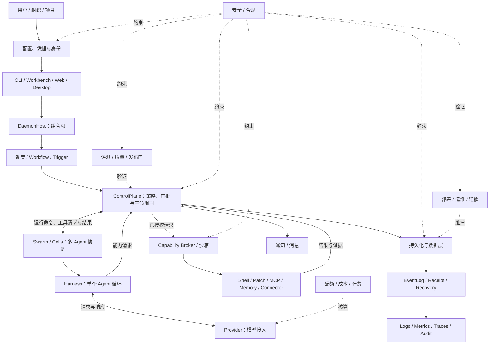

# Kiana 大模块地图

> 文档性质：源码导读（Informative），用于解释产品边界、职责和连接关系，不定义新架构规范。
> 整理日期：2026-09-14；参考当前源码、`CURRENT_STATUS.md` 和路线图。
> 模块存在不代表能力已经验收；实现状态和证明范围以 [CURRENT_STATUS.md](../CURRENT_STATUS.md) 为准。

Kiana 不应只按 Rust crate 画地图。一个产品模块可能跨多个 crate，一个 crate 也可能承载多个模块。下面把容易被混在一起的配置、数据、可观测性、调度、集成、通知、质量、成本、部署和安全单独列出来，并标明它们与现有执行主链的关系。

## 产品模块

| # | 大模块 | 负责什么 | 当前代码锚点与边界 |
|---:|---|---|---|
| 1 | **CompanyOS：组织与业务** | 组织、部门、角色、目标、项目、工单、会议、派发、评审、验收、交付和收尾；回答“谁做什么、怎么算完成” | [领域契约](../kiana-domain/src/lib.rs)、[组织协作](../kiana-core/src/collaboration.rs)、[Company 命令](../kiana-core/src/company.rs)、[治理产物](../kiana-core/src/artifacts.rs)；业务对象不能绕过 ControlPlane 直接执行副作用 |
| 2 | **配置、凭据与身份** | API key、OAuth、模型凭据、配置来源、项目可信度、用户/租户身份、RBAC、角色绑定和密钥轮换 | [模型配置](../kiana-provider/src/config.rs)、[DaemonHost 身份](../kiana-daemon/src/lib.rs)、[项目可信度与策略](../kiana-policy/src/lib.rs)、[角色目录](../kiana-domain/src/roles.rs)；Provider 只消费已准入的模型路由，不能成为用户身份或项目权限的事实源。当前主要是本地身份和配置边界，租户、OAuth 生命周期、密钥轮换仍需单独验收 |
| 3 | **ControlPlane：控制与授权** | 命令入口、生命周期、ProjectTrust、RBAC/策略、审批、预算、取消、路径锁、能力授权和恢复前检查 | [kiana-core](../kiana-core/src/lib.rs)、[Policy](../kiana-policy/src/lib.rs)、[Gates](../kiana-gates/src/lib.rs)；所有有副作用的动作都必须回到这里，不能在 UI、Provider、Connector 或 Workflow 中另起权限判断 |
| 4 | **Harness：Agent 运行时** | 驱动一次 Agent 执行，调用模型、接收工具调用、等待工具结果、继续下一轮、压缩上下文、限制步数并支持受控继续 | [KianaHarness](../kiana-runner/src/harness.rs)、[Runner 协议](../kiana-runner-protocol/src/lib.rs)、[上下文压缩](../kiana-runner/src/compact.rs)；Harness 只负责规范的单次运行循环，不负责绕过 ControlPlane 执行工具 |
| 5 | **Provider：模型接入** | 模型路由、请求编译、鉴权头、流式响应、工具调用解析、超时、重试分类、能力声明和模型用量回传 | [Provider crate](../kiana-provider/src/lib.rs)、[Daemon 模型适配](../kiana-daemon/src/model_client.rs)；Anthropic、OpenAI 兼容、Ollama 等协议属于模型接入，不等于外部业务集成，也不拥有用户或项目身份 |
| 6 | **Capability：工具执行与沙箱** | 将已授权请求分发到 shell、文件补丁、MCP、Memory 等执行器，并落实进程、文件、网络和路径边界 | [Capability Broker](../kiana-capability-broker/src/lib.rs)、[工具适配](../kiana-daemon/src/harness_capabilities.rs)、[沙箱](../kiana-daemon/src/harness_sandbox.rs)、[MCP 适配](../kiana-daemon/src/harness_mcp.rs)；MCP 是工具协议，不是全部集成能力 |
| 7 | **Context / Memory：上下文与知识** | 仓库索引、代码地图、检索、记忆读写、记忆治理、访问范围和上下文预算；回答“这次运行应该看到哪些资料” | [kiana-query](../kiana-query/src/lib.rs)、[Memory 执行](../kiana-daemon/src/harness_memory.rs)、[Memory 检索](../kiana-daemon/src/memory_retrieval.rs)、[压缩](../kiana-runner/src/compact.rs)；索引和记忆是数据消费者，不能取代事实账本 |
| 8 | **持久化与数据层** | EventLog、ApprovalStore、Memory、索引、工单、收据等对象的 schema、迁移、备份、恢复、保留和存储适配 | [EventStore 接口](../kiana-ports/src/lib.rs)、[事件存储](../kiana-eventlog/src/lib.rs)、[审批存储](../kiana-daemon/src/approval_store.rs)、[Memory 存储](../kiana-eventlog/src/memory.rs)；这里定义数据生命周期和存储边界，不能因为 EventLog 存在就推断已经有完整备份、迁移或保留策略 |
| 9 | **Event / Receipt / Recovery：执行事实与恢复** | 保存执行事实，生成 Receipt，投影运行状态和历史，处理审批恢复、结果未知、重放和恢复前校验 | [事件投影](../kiana-core/src/projection.rs)、[历史](../kiana-core/src/history.rs)、[收据](../kiana-core/src/receipts.rs)、[恢复](../kiana-core/src/recovery.rs)；EventLog 是事实源，但不等价于指标、Trace、审计报表或所有业务数据 |
| 10 | **可观测性与审计** | 结构化 logs、metrics、traces、token/成本观测、健康检查、告警、操作审计和安全调查 | [Runtime 事件](../kiana-core/src/events.rs)、[运行流](../kiana-daemon/src/run_stream.rs)、[domain signal contracts](../kiana-domain/src/observability.rs)、[audit taxonomy/reducer](../kiana-domain/src/audit.rs)、[core audit facade](../kiana-core/src/audit.rs)、[audit projection/checkpoint](../kiana-core/src/audit_projection.rs)、[audit query core/cursor](../kiana-core/src/audit_projection.rs)、[audit export/manifest/delivery](../kiana-core/src/audit_export.rs)、[observability incident/recovery projection](../kiana-core/src/incident_projection.rs)、[audit query wire/client](../kiana-protocol/src/lib.rs)、[span lifecycle projection](../kiana-core/src/span_projection.rs)、[model attempt projection](../kiana-core/src/model_attempt_projection.rs)、[capability attempt projection](../kiana-core/src/capability_attempt_projection.rs)、[operational metrics projection/governance](../kiana-core/src/metrics.rs)、[health/readiness projection](../kiana-core/src/health.rs)、[bounded observability queue](../kiana-ports/src/observability_queue.rs)、[trace export/context adapter](../kiana-core/src/trace_export.rs)、[provider safe telemetry](../kiana-provider/src/telemetry.rs)、[daemon model boundary](../kiana-daemon/src/model_client.rs)、[broker/handler boundary](../kiana-core/src/capabilities.rs)、[ports and fake sinks/observer](../kiana-ports/src/lib.rs)、[EventStore commit observer](../kiana-eventlog/src/stream.rs)、[correlation links](../kiana-domain/src/correlation.rs)、[redaction profiles](../kiana-domain/src/redaction.rs)、[脚本与 CI](../scripts/)、[当前状态证据](../CURRENT_STATUS.md)；EventLog 记录产品事实，不能自动替代指标、分布式追踪、告警或合规审计管线，后者需要独立 schema 和保留边界；OA-00–OA-19 的当前信号归属与缺口见 [Observability/Audit 基线](roadmap/observability-audit-baseline.md) |
| 11 | **调度、工作流与触发器** | 队列、定时、重试、幂等、持久工作流、Webhook/事件触发和运行编排 | [Workflow](../kiana-workflow/src/lib.rs)、[自动化](../kiana-core/src/automation.rs)、[协议命令](../kiana-protocol/src/lib.rs)；`kiana-workflow` 当前主要是小型状态机定义，不能据此推断已有完整持久工作流引擎或可靠调度器 |
| 12 | **多 Agent 协调 / Swarm** | Cell、SpawnPlan、预算、并发、路径锁、工单派发、监督、合并和跨角色协作 | [Cell 注册表](../kiana-core/src/cell_registry.rs)、[协作](../kiana-core/src/collaboration.rs)、[Swarm](../kiana-core/src/swarm.rs)、[领域模型](../kiana-domain/src/swarm.rs)；这是产品级协调模块，单个 Agent 的模型循环仍由 Harness 驱动；详细代码设计、处理流和实施步骤见 [roadmap §30](roadmap.md#swarm-coordination-design) |
| 13 | **集成与连接器** | GitHub、Jira、Slack、Notion、浏览器、搜索、OAuth、Webhook 以及其他外部系统的账号绑定、限流、映射和失败处理 | [连接器领域模型](../kiana-domain/src/connectors.rs)、[Daemon 连接器](../kiana-daemon/src/connectors.rs)、[MCP stdio](../kiana-daemon/src/mcp_stdio.rs)；当前源码可核对的实现边界是 `local_fixture`，MCP 只描述部分工具调用通道，连接器还需要凭据、对象映射、幂等和外部结果确认；详细设计、处理流程和 `INT-00`–`INT-33` 见 [连接器专项](roadmap/integrations-connectors.md) |
| 14 | **通知与消息** | 审批、任务、会议、工单变更、失败、提醒和实时协作消息；包含订阅、投递、去重和已读状态 | [运行流订阅](../kiana-daemon/src/run_stream.rs)、[协议事件](../kiana-protocol/src/lib.rs)、[人类操作入口](../kiana-entrypoints/src/workbench_chat.rs)、[通知与消息专项](roadmap.md#notification-messaging-design)；当前主要是运行流和入口展示，尚无可以替代业务事件的独立通知总线 |
| 15 | **Skills / Plugins / Hooks：扩展** | 加载技能说明、插件、钩子和本地扩展，在受信任范围内接入运行阶段 | [Skills](../kiana-skills/src/lib.rs)、[技能注入](../kiana-daemon/src/harness_skills.rs)、[前置钩子](../kiana-daemon/src/pre_tool_hooks.rs)；项目本地资源必须先过 ProjectTrust，扩展不能新增第二条执行路径 |
| 16 | **UI / Entrypoints：用户入口** | CLI、终端工作台、Web、Electron、状态卡、审批卡、对话、文件变化、收据和实时进度展示 | [入口注册](../kiana-entrypoints/src/lib.rs)、[CLI](../kiana-entrypoints/src/cli.rs)、[Web](../kiana-entrypoints/src/web.rs)、[Desktop](../contrib/desktop/main.js)；UI 只能投影状态和事件，不能自行创建 Agent loop 或权限边界 |
| 17 | **评测与质量** | 评测集、回归用例、评分、实验、数据收集、黄金轨迹、smoke 和发布门 | [crate 测试](../kiana-domain/src/tests.rs)、[脚本](../scripts/)、[CI](../.github/workflows/)、[质量规范](coding-pack-matrix.md)；CI 通过不等于产品能力完成，评测结果需要绑定源码快照和证据等级 |
| 18 | **计费、配额与成本** | token 核算、模型/工具预算、限流、配额、账单维度、成本归属和超额处理 | [用量领域模型](../kiana-domain/src/usage.rs)、[模型预算](../kiana-core/src/model_budget.rs)、[Provider 用量](../kiana-provider/src/response.rs)；当前有运行预算和部分用量记录，不应推断已有账单系统、组织级计费或完整成本报表；实际代码设计、处理流程和 `BQ-*` 实施步骤见 [计费专项](roadmap.md#billing-quota-cost-plan) |
| 19 | **部署、运维与迁移** | 升级、备份、恢复演练、多环境配置、本地/云部署、版本迁移、健康检查和运维工具 | [发布脚本](../scripts/)、[Desktop 壳](../contrib/desktop/)、[schema 版本](../kiana-domain/src/contracts.rs)、[运行配置](../kiana-daemon/src/lib.rs)；本地优先不等于已经具备云部署、多环境迁移或自动备份；实际代码设计、处理流程和 `DEP-*` 实施步骤见 [roadmap §36](roadmap.md#deployment-operations-migration-design) |
| 20 | **安全与合规** | 加密、秘密处理、审计、隐私、数据保留、删除、最小权限、供应链和合规证明 | [安全宪法](company-os-security-constitution.md)、[Policy/Gates](../kiana-policy/src/lib.rs)、[脱敏](../kiana-domain/src/redaction.rs)、[数据治理](../kiana-core/src/data_governance.rs)；安全控制分布在执行链中，合规要求仍需独立的策略、证据和生命周期设计；完整的威胁模型、代码边界、处理流和 SC-00–SC-43 实施卡见 [roadmap §37](roadmap.md#security-compliance-plan) 与 [安全与合规专项](roadmap/security-compliance.md) |

## 产品平面与事实源

产品模块跨越多个 crate。先按产品平面阅读，可以看出哪些模块共同决定一次运行，哪些模块只保存或解释已经提交的事实：

| 产品平面 | 包含模块 | 共同问题 | 统一约束 |
|---|---|---|---|
| **权威与准入** | 配置/凭据/身份、ControlPlane、安全与合规 | 谁在什么项目里，以什么版本和权限提出请求 | 主体、ProjectTrust、assignment、policy、approval、budget 和 epoch 由服务端解析；调用者自报字段不能成为授权事实 |
| **执行与编排** | Harness、Provider、Capability、调度/Workflow/Trigger、Swarm、集成/连接器 | 已准入的请求如何排队、执行、重试和收敛结果 | 所有副作用复用 `DaemonHost → ControlPlane → Broker`；Workflow、Swarm 和 Connector 都不能另起执行循环或权限中心 |
| **事实与查询** | 持久化/数据层、Event/Receipt/Recovery、Context/Memory、通知/消息 | 哪些内容是事实，哪些内容可以重建、缓存或投递 | EventLog/事实存储是唯一写入权威；Receipt、Memory、Index、Notification 和 RunStream 都是带 cursor/generation 的投影或派生视图 |
| **产品交付** | CompanyOS、扩展、UI/Entrypoints | 组织如何消费、协作和操作这些事实 | 业务命令和人类动作回到 ControlPlane；扩展先过 ProjectTrust；所有入口投影同一状态和事件 |
| **质量与运维** | 可观测性/审计、评测/质量、计费/配额/成本、部署/运维/迁移 | 如何证明、计量、维护和发布一次运行 | Logs/Metrics/Traces/Audit 分开建模；质量门只能提交质量事实；运维必须经过 health、backup、migration、lease/fence 和回滚门 |

下面的事实源矩阵用于审查“谁拥有字段”和“谁只能读取”。它是阅读辅助，不是对当前完成度的声明。

| 事实域 | canonical owner | 可派生的视图或适配器 | 不能从中推断 |
|---|---|---|---|
| 配置、凭据、身份 | `ConfigSnapshot`、`SecretRef`/`CredentialLease`、`Principal`/`Assignment`、`AuthoritySnapshot` | Provider route、Connector binding、UI profile | API key 可用不等于项目授权；Provider account 不等于 Kiana 主体 |
| 命令、策略、审批 | ControlPlane admission、Grant、Approval、Budget reservation | pending inbox、UI action、dispatch queue | UI 点击、模型文本或通知 ACK 不等于已批准或已执行 |
| 运行事实与结果 | EventLog/Transition、Invocation、Receipt、RecoveryCase | Run/Cell/History projection、reconciliation view | Transcript、缓存、单次 handler 返回值不等于事实或现实业务 outcome |
| 工作流、Swarm、连接器 | Workflow definition/version、DispatchIntent、Connector operation/receipt | queue、child summary、external reconciliation | child completed、HTTP 2xx 或 MCP tool result 不等于外部效果已确认 |
| 观测、审计、通知 | committed event 投影出的 `Metric`、`Trace`、`AuditRecord`、`Notification` | dashboards、Human Inbox、RunStream、outbox | trace/metric 丢失不能改变授权；实时流或投递 ACK 不等于终局事实 |
| 用量、成本、部署、安全 | `UsageRecord`/`CostLedger`、`ReleaseManifest`/`OperationJournal`、DataClass/retention policy | quota summary、health/doctor、quality and release reports | 估算 cost 不等于 measured invoice；health 通过不等于业务成功；合规设计不等于外部认证 |

## 一次运行如何经过这些模块



图中有几条必须保持的边界：

- **配置、凭据与身份**提供可验证的配置和主体绑定；Provider 不能把“有 API key”当成“有权执行这个项目”。
- **持久化与数据层**负责 schema、迁移、备份和保留；EventLog 只是一类事实存储，Memory、索引、工单和 Receipt 仍各有自己的数据合同。
- **EventLog / Receipt / Recovery**负责执行事实和恢复判断；logs、metrics、traces 和审计查询需要额外的观测模型。
- **Workflow / Trigger**可以安排和重试命令，但命令每次真正执行仍必须回到同一个 ControlPlane。
- **Connector**可以代表外部系统提交能力请求，但不能直接执行外部副作用；OAuth 和账号绑定归配置、凭据与身份模块管理。
- **通知**是已提交事件的投递视图，不是新的事实源；用户界面只能消费它并提交带版本/幂等键的 ControlPlane 动作。可靠通知必须能从 EventLog/Human Inbox 查询补回，实时流本身不构成送达或应用证明。
- **Swarm**可以拆分和协调 WorkPacket，但子 Cell 的权限只能是父级能力的交集。

## 连接模块的基础设施

| 组件 | 职责 | 代码入口 |
|---|---|---|
| **DaemonHost** | 组合根：把控制面、模型适配器、Harness、Broker、事件存储、审批存储和入口适配器组装起来 | [kiana-daemon](../kiana-daemon/src/lib.rs) |
| **Domain** | 提供共享 ID、角色、工单、能力请求、状态、CompanyOS、连接器和用量契约 | [kiana-domain](../kiana-domain/src/lib.rs) |
| **Ports** | 定义 ControlPlane 与 Runner、Broker、EventStore、ApprovalStore、ModelBudget 等实现之间的接口 | [kiana-ports](../kiana-ports/src/lib.rs) |
| **Protocol / Client** | 定义入口与 daemon 之间的 versioned envelope、命令、响应和 UI 事件，并提供客户端调用 | [kiana-protocol](../kiana-protocol/src/lib.rs)、[kiana-client](../kiana-client/src/lib.rs) |
| **Runner Protocol** | 定义 ControlPlane 与 Harness 之间的运行命令、工具结果和执行事件 | [kiana-runner-protocol](../kiana-runner-protocol/src/lib.rs) |

DaemonHost 负责组装，ControlPlane 负责决策和推进状态，Harness 负责模型循环，Data layer 负责保存和恢复数据，Observability 负责解释运行情况。它们职责不同，不能把某个组合根或某类事件当成其他模块的替代品。

## 当前实现的阅读边界

- `kiana-workflow` 当前主要提供小型状态机定义；不能仅凭 crate 存在推断已经有完整持久工作流引擎。
- Swarm / 多 Agent 协作现在主要涉及 core 中的 Cell、SpawnPlan、预算、路径锁、工单派发和合并；它已经是产品模块，但仍要按 `CURRENT_STATUS.md` 的证据等级判断完成度。
- `kiana-eventlog`、审批存储、Memory 和索引分别承担不同的数据责任；是否 durable、可迁移、可备份，必须看各自的测试和证据。
- Provider 的模型凭据、DaemonHost 的本地主体、Policy 的项目可信度和 Domain 的角色目录目前是分布式边界；后续实现应通过明确的配置/身份契约收敛，不能靠隐式字段约定。
- `kiana-tools`、`kiana-commands`、旧 SDK/runner 等仍包含兼容实现；排查产品行为时，应从 DaemonHost 的实际调用链追踪到具体函数。

## ER-00 事实边界基线（2026-09-14）

本节绑定源码快照 `0a29de510c240584a972dad6ef14c4ca6a0dfced`，只记录
Event / Receipt / Recovery 的当前事实边界，不把后续 ER 步骤的目标写成已实现。
可复核的文件 hash、事件 inventory 和 source-only 证据索引见
[ER-00 基线矩阵](roadmap/event-receipt-recovery-baseline.md)。

| 事实域 | 当前权威 | 只能作为派生视图或缓存的对象 |
|---|---|---|
| 命令提交 | `TransitionBatch`、`CommandReceipt`、`CommitOutcome`、`EventStorePort` | handler 返回值、UI command response |
| 运行事件 | `RuntimeEvent` 写入 `MemoryEventLog` 或 `JsonlEventLog` | transcript、`RunStream`、日志和通知投递 |
| Run/Invocation 状态 | EventLog 中的 `run.*`、`capability.*`、`approval.*`，由 core projection 折叠 | ControlPlane 内存 map、实时状态卡 |
| Receipt | `kiana-core::receipts` 从过滤后的 EventStore 事件重建 | Receipt JSON、单次调用输出；Receipt 不证明外部效果 |
| Approval/Recovery | approval 事件、journal approval store、run snapshot/checkpoint 与 proof | pending 列表、审批卡、Runner continuation 缓存 |
| Context/Memory/Index | 各自的领域记录和受控 adapter | `.kiana` context/index cache、cache report、代码地图 |

当前执行事实边界为：

```text
request/command -> ControlPlane admission -> EventStore commit/receipt
  -> Broker/Runner effect -> result/terminal event -> Receipt projection
```

EventStore 端口默认对事务、command receipt、cursor 和全量读取返回明确的
unsupported 错误；`read_all` 的 unsupported 与真实读取失败必须区分。空账本会
得到 `receipt_not_found` 或 `run_not_found`，而不是被当成读取失败或成功。缺少或
冲突的终态、效果已有但结果事件未提交时，Receipt/投影保持 `ResultUnknown`。
`MemoryEventLog` 的 `durable_commits=false`；JSONL 的 atomic/durable 标志和锁、
torn-tail 处理是 adapter 的源码能力声明，不能单独升级为已验证的磁盘恢复证明。

最小关联链目前由 `request_id`、`command_id/command_digest`、`run_id`、
`session_id`、turn payload、`capability_request_id`、`approval_id`、`event_id`、
aggregate/stream version、idempotency key 以及 `CommandReceipt` cursor 组成。
部分 legacy event 仍缺少完整的 causation/typed turn 链，外部 effect 的 exactly-once
和 reconciliation 也尚未建立；这些属于 ER-01、ER-02、ER-13、ER-14+ 的后续范围。

## CAP-00 能力执行基线（2026-09-14）

本节绑定源码快照 `b49cd62772943aa117c8ea4adec383580f739237`，只记录 Capability
在 `DaemonHost → ControlPlane → Broker → Handler` 主链中的当前接线和缺口。模型可见
工具仍固定为 `shell`、`apply_patch`、`mcp`、`memory.search`、`memory.write`；
operator-only action、HTTP MCP 和动态工具扩展不因存在 descriptor 就变成当前可用能力。

可复核的文件 hash、六条调用链、超时分层、失败分类和 GitHub CI 验收索引见
[CAP-00 Capability 基线](roadmap/capability-baseline.md)。本步骤是 source/static 文档
交付，不提升任何产品 capability 的 `proof_level`；后续 CAP/CP/H 步骤必须在开始时
重新核对源码快照和 hash，避免把 WIP 漂移当成已接线。

## 如何判断完成程度

这张图描述职责和边界，具体能力仍须结合证据。[状态账本](../CURRENT_STATUS.md) 记录当前源码快照、命令、测试和证明等级。规范里的 `target`、`partial`、`deferred` 或模块名称本身，都不能推断功能已经交付。

进一步阅读：[白话总览](company-os-overview.md)、[CompanyOS 平台架构](company-os-platform-architecture.md)、[实施大纲](company-os-implementation-outline.md)、[执行路线图](roadmap.md)。
