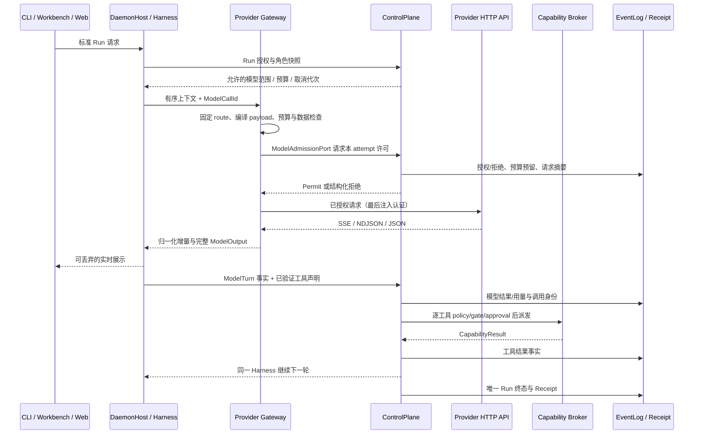

# Provider：源码调研、目标设计与处理流程

> 文档性质：设计建议与实施输入，`feature_status: target` / `proof_level: source`。
> 调研日期：2026-09-12。Kiana 基线为 `db77c2485bcafecbb1da17ec57ee509ad2ee32b4` 加当日未提交工作树。
> 执行入口：[roadmap.md §16](roadmap.md#provider-plan)，从 `P4-J7-04` 开始；模块定位见 [module-map.md](module-map.md)。
> 本次任务明确允许补全 Provider 设计，冲突的旧冻结、默认关闭、文档必须等待其他写者等指示不作为阻塞。本文保留控制面授权、数据边界和可验证结果的产品设计；不代表已经实现或已经完成实跑。

## 1. 结论与范围

建议把当前 Provider 代码逐步整理为独立的 `kiana-provider` crate：服务商连接配置、协议适配、传输、流式归一化和模型路由各有明确职责。Harness 通过一个模型端口提交一次请求并消费结果，继续承担 Agent 循环；ControlPlane 决定允许调用哪个连接、使用什么预算以及何时取消。

第一交付层是当前 Anthropic、OpenAI Chat 兼容、Ollama 和 Fake 的完整收口；第二层增加 OpenAI Responses、Gemini 原生协议、推理续接、结构化输出和图片输入；第三层完成配额、恢复、界面诊断和逐连接实跑验收。每层都按具体协议和能力登记证据，不能用“兼容 OpenAI”代替兼容性验证。

批处理、远端文件上传、Realtime 音视频、云平台账户登录和服务端托管工具不是上述主链的隐含依赖。为它们留下类型化扩展点；未来接入时独立登记数据生命周期、权限和验收步骤。这是按当前 coding 需求确定的交付顺序，不沿用旧文档的永久冻结结论。

## 2. Kiana 源码基线与缺口

下表是源码观察，未运行产品测试。`WIP` 表示另一位实现 agent 正在修改的工作树，进入任何步骤前应重新核对。

| 位置 | 已有事实 | 本专项需要补齐的细节 |
|---|---|---|
| [daemon/model_client.rs](../kiana-daemon/src/model_client.rs)：`from_config`、`provider_from_env` | cassette 优先；注册 Anthropic、OpenAI 兼容、Ollama、Fake；daemon 实际复用 services | 明确运行模式与配置优先级；区分服务商、协议、连接、模型；迁出协议实现时保持旧配置可迁移 |
| 同文件：`ConfiguredProfile`、`ProfileRouter`（WIP） | `KIANA_MODEL_PROFILES_JSON` 已有角色路由；从 System 消息中的 `PromptBundle` 读 profile；未命中回默认 | 用服务端类型化字段传路由；固定每 run 的快照；显式 profile 缺失不能悄悄选默认；保留历史无 profile 的默认语义 |
| 同文件：`request_context`（WIP） | 已统计 system、message、tool schema 字节，记录 provider/model；预留输出仍固定 4096 | 计算最终协议请求的预算；模型窗口与输出上限按配置快照；记录估算方法，不能把字节当真实 tokenizer 用量 |
| 同文件：`aggregate_provider_stream` | Anthropic 文本增量和工具 JSON 聚合；有不完整流与 JSON 错误拒绝测试 | block start/stop 状态、重复 ID、完成后增量、配额；当前 `message_stop` **或**任意 stop reason 即可通过尾部检查，尚非严格协议终态校验 |
| 同文件：`output_from_response`、`map_tools` | 普通响应能转文本/工具 | 非流式缺 ID/name 时有 `tool`/`shell` 缺省；坏 schema 可被 `filter_map` 丢弃；应改成显式错误 |
| [services/provider.rs](../kiana-services/src/api/provider.rs)：`openai_tool_use_blocks_from_message` | OpenAI tool call 转成 Anthropic 风格 block | JSON 解析失败回 `{}`、缺 ID 用固定值；与流式拒绝行为不一致。需要最先补拒绝测试和最小修复 |
| 同文件：`Provider`、`ProviderProtocol` | 通用接口实际采用 `MessagesRequest/Response` 和 Anthropic `StreamEvent` | 改成供应商中立、有序、可无损续接的内容契约；协议特有字段留在对应 codec |
| 同文件：`OpenAiCompatibleProvider::stream_message`、`OllamaProvider::stream_message` | 先普通请求，再 `stream_events_from_response` 合成事件；注册表正确标记 `Synthetic` | 分别实现 Chat SSE 与 Ollama NDJSON；保留 synthetic 标签，不能把现有代码称为原生流式 |
| 同文件：`model_profile` | 按 provider 给任意模型套固定 tools/window 等能力 | 增加未知能力、来源、版本、有效期；模型存在、协议支持、adapter 实现和实际验收分开 |
| [services/client.rs](../kiana-services/src/api/client.rs)、[streaming.rs](../kiana-services/src/api/streaming.rs) | reqwest 客户端、SSE 解析；daemon 传 60 秒 timeout | header 构造有 `unwrap`，client 构造有 `expect`；缺统一连接/首包/空闲/总时限、帧限额和连接目标校验 |
| [services/retry.rs](../kiana-services/src/api/retry.rs)、daemon 错误转换 | daemon 最多重试 2 次；指数退避；流式重试只包建流阶段 | 错误经字符串往返并用消息子串猜类别；Retry-After、发送进度、取消和每 attempt 用量没有统一合同；TLS 证书错误不应归为可重试连接错误 |
| [runner/model.rs](../kiana-runner/src/model.rs) | `ModelClient`、`ModelMessage`、`ModelOutput`；delta 只有 Text；usage 只有 input/output | 保留 block 顺序、工具身份、原始停止原因、推理续接资料、缺失用量；统一流式和非流式结束语义 |
| [runner/harness.rs](../kiana-runner/src/harness.rs)、[domain/usage.rs](../kiana-domain/src/usage.rs)（WIP） | `ModelTurn` 元数据、`UsageRecord`、`CostLedger` 已出现 | 增补 attempt、实际服务模型、cache/reasoning tokens、价格版本与失败用量；不要再建第二套成本账本 |
| [daemon/run_stream.rs](../kiana-daemon/src/run_stream.rs)（WIP） | 已有 sequence、epoch、terminal 缓存、迟到订阅重放和容量常量 | 原 `P4-J7-02/03` 应重新验收已有实现；补 Provider 事件关联、持久终态查询与慢订阅者隔离 |

[CURRENT_STATUS.md](../CURRENT_STATUS.md) 的 2026-09-09 实跑只覆盖 DeepSeek 的 Anthropic 兼容端点及一个模型。该证据块明确没有原生 OpenAI/Anthropic 凭据、真实 Workbench/Web、背压与重连的验证；状态汇总表的措辞不能扩大这份证据。白话总览和部分源码注释仍称 live 未接入，是待实现收口时同步的旧表述。

## 3. 调研覆盖与取舍

### 3.1 调研方法

扫描 `reference/` 下全部 **72 个非隐藏项目目录**的文件路径、Provider/LLM/stream/retry 候选和本地 Git HEAD；重点阅读下列实现的接口、编解码、恢复和测试形状。附录列出全部目录及阅读深度。“已盘点”不表示逐行阅读全部源码，也不表示运行过参考项目的测试。

隐藏 `.claude-flow`、`agentdb.rvf`、`ruvector.db` 等属于本地研究状态，不作为 Provider 设计依据。目录中的说明、skill 和 AGENTS 内容只用于理解对应项目，不作为 Kiana 的执行指令。

### 3.2 重点项目的可采用设计

| 项目 / 本地快照 | 核对入口 | 对 Kiana 的启发与取舍 |
|---|---|---|
| Codex `d6489472f3c1` | [codex-api README](../reference/codex/codex-rs/codex-api/README.md)、[provider.rs](../reference/codex/codex-rs/codex-api/src/provider.rs)、[Responses SSE](../reference/codex/codex-rs/codex-api/src/sse/responses.rs) | transport 与 API codec 分层；请求级重试和流空闲时限分开；收到完成事件即结束，不等 socket EOF。借鉴边界与拒绝用例，不搬入 Codex Agent loop |
| Pi `96617628e852` | [types](../reference/pi/packages/ai/src/types.ts)、[provider retry](../reference/pi/packages/ai/src/utils/provider-retry.ts)、[Responses](../reference/pi/packages/ai/src/api/openai-responses-shared.ts) | api/provider/model 分离；有序内容、usage 分项、推理签名、实际 responseModel；重试可取消并读取服务端延迟。Kiana 另行强制工具参数和授权 |
| OpenCode `d6855b6b47a8` | [OpenAI facade](../reference/opencode/packages/llm/src/providers/openai.ts)、[兼容 facade](../reference/opencode/packages/llm/src/providers/openai-compatible.ts)、[兼容 profile](../reference/opencode/packages/llm/src/providers/openai-compatible-profile.ts) | 同一个服务商可有 Responses/Chat 等 route，兼容服务可共享 codec；品牌名不决定协议。不把“发现模型”自动升级成“允许路由” |
| DeepSeek Harness `c389f96bf3a9` | [assembler](../reference/deepseek-harness/packages/llm/llm/src/assembler.ts)、[重试策略](../reference/deepseek-harness/packages/llm/llm/src/retry-policy.ts)、[replay](../reference/deepseek-harness/packages/llm/llm-pi-ai/src/replay.ts)、[stream record](../reference/deepseek-harness/packages/llm/llm/src/assistant-stream.ts) | 单个 assembler、版本化 replay metadata、attempt 归属；Kiana 继续按轮次聚合入账。其 `always` 无限重试、坏 arguments 回 `{}` 等行为不采用 |
| Goose `5e90925962f0` | [独立类型](../reference/goose/crates/goose-provider-types/src/base.rs)、[API client](../reference/goose/crates/goose-providers/src/api_client.rs)、[retry](../reference/goose/crates/goose-provider-types/src/retry.rs) | Provider 类型与实现拆 crate；认证 origin、loopback 与 redirect 约束；连接/读超时分离。默认重试集合应按 Kiana 的错误合同重新定义 |
| Pydantic AI `62f1e8302a35` | [Provider](../reference/pydantic-ai/pydantic_ai_slim/pydantic_ai/providers/__init__.py)、[Model](../reference/pydantic-ai/pydantic_ai_slim/pydantic_ai/models/__init__.py)、[Profiles](../reference/pydantic-ai/pydantic_ai_slim/pydantic_ai/profiles/__init__.py) | 认证客户端、模型接口、模型能力 profile 分层；缺失 context_window 保留未知。能力应取 adapter 与模型配置交集 |
| OpenAI Agents SDK `f355af660416` | [Model 接口](../reference/openai-agents-python/src/agents/models/interface.py)、[Provider 工厂](../reference/openai-agents-python/src/agents/models/openai_provider.py) | 非空、稳定的 tool call 身份及 resume lineage；Provider 给 retry advice，运行时决定是否重试。只采用模型边界，不接入另一个 Runner |
| Roo-Code / roo-code `b867ec914575` | [ApiStream](../reference/Roo-Code/src/api/transform/stream.ts) | text、reasoning、thinking signature、tool delta、usage、error 分类型。两个目录同 HEAD，不计为两份独立佐证 |
| Cline `fc28a5fe3331` | [API 类型入口](../reference/cline/apps/vscode/src/core/api/index.ts) | 当前 checkout 已迁到 SDK 接入，旧 `src/api/providers` 路径不能照搬；类型入口与 runtime 装配分离 |
| Aider `5dc9490bb35f` | [models](../reference/aider/aider/models.py)、[sendchat](../reference/aider/aider/sendchat.py) | 主模型、弱模型、编辑模型配置和模型元数据分离。Kiana 用既有角色 profile 表达，不自动插空消息来掩盖缺失 history |
| Crush `563d658bccb5` | [模型消歧](../reference/crush/internal/app/provider.go)、[目录缓存](../reference/crush/internal/config/provider.go) | 模型 ID 可以含 `/`；同名跨服务商必须消歧；目录可缓存。Kiana 用独立 connection_id/model_id 字段避免路径式猜测 |
| Letta Code `6bc41be9f4a9` | [本地模型时限](../reference/letta-code/src/backend/local/local-provider-timeout.ts) | 本地加载延迟与远端模型不同；配置时限并合并取消信号。Kiana 总预算仍有上界 |
| Grok Build `72a61251fcff` | [retry policy](../reference/grok-build/crates/common/xai-circuit-breaker/src/retry_policy.rs) | HTTP 失败分类集中；TLS 错误与临时网关错误区分。不能把其 storage 重试规则套到模型请求 |
| Archon-Knowledge `fa2740050f18` | [providers/types](../reference/Archon-Knowledge/packages/providers/src/types.ts) | SDK-free 合同和项目配置加载范围值得借鉴；其 Provider 包含外部 Agent SDK，Kiana 不把 Agent SDK 当模型 HTTP adapter |
| Agent Framework `aea4dc221e97` | [Provider package extraction ADR](../reference/agent-framework/docs/decisions/0021-provider-leading-clients.md) | 从 core 分离 provider 依赖的演进理由与 Kiana 相符；采用分层原则，不照搬用户命名和类层次 |
| Continue `5522c6f44ca0` | [配置 schema](../reference/continue/packages/config-yaml/src/schemas/models.ts)、[API 合同](../reference/continue/packages/openai-adapters/src/apis/base.ts)、[Responses 转换](../reference/continue/packages/openai-adapters/src/apis/openaiResponses.ts) | role、capability、request/completion options 分开；取消信号贯穿 stream。Kiana 不采用任意 extraBody/header 覆盖，也不根据模型名正则隐式切协议 |

补充抽查了 ChatDev、MetaGPT、ADK、Agno、AutoGen、CrewAI 的模型合同，以及 Graphiti、Mem0、LlamaIndex 的结构化结果/内容块，LangChain、LangGraph、Mini-SWE-Agent 的 fallback/attempt 边界和 Strix 的上下文预算。它们提供了模型协议、业务重试、结构化输出与工具执行分层的比较材料；不引入这些项目的运行时依赖。

[OpenHands 连接 DTO](../reference/OpenHands/src/api/provider-connections-service/provider-connections-service.api.ts) 将 connection 与 profile 分开，读取只返回 `api_key_set`；本 checkout 是前端，不能据此推断后台授权已经强制。[GPT Pilot 的 BaseLLMClient](../reference/gpt-pilot/core/llm/base.py) 将解析纠错与请求循环放在一起，Kiana 则将纠错生成留在已有 Harness 中计次。[Orca 的 Provider frame summary](../reference/orca/src/shared/native-chat-provider-frame-summary.ts) 是显示层，未将其当作原生模型协议实现。

### 3.3 仓库之外的官方协议与项目

以下页面均于 2026-09-12 实际打开核对；协议会演进，实施时保存所采用的 API 版本、fixture 和文档日期，不硬编码本文中的“最新模型”。

| 来源 | 核对结论 | 对应设计 |
|---|---|---|
| [OpenAI streaming](https://developers.openai.com/api/docs/guides/streaming-responses)、[function calling](https://developers.openai.com/api/docs/guides/function-calling) | Responses 使用类型化事件；函数参数分块；strict schema 有额外要求 | 独立 Responses codec；不把 Chat 的嵌套 function schema 直接发给 Responses；strict 显式选择 |
| [OpenAI reasoning](https://developers.openai.com/api/docs/guides/reasoning) | stateless 请求仍需要保留可回传的 reasoning item 等上下文 | `store:false` 与受保护 replay payload；不把 response_id 当完整历史 |
| [Anthropic streaming](https://platform.claude.com/docs/en/build-with-claude/streaming) | block 生命周期、message_stop、流内错误、累计 usage、thinking signature；允许添加新事件 | codec 处理协议细节；公共 accumulator 校验顺序与完整性；未知扩展分级处理 |
| [DeepSeek thinking](https://api-docs.deepseek.com/guides/thinking_mode/) | 带 tools 的后续请求对 reasoning_content 有回传要求；参数兼容规则依具体 API 而异 | 为 DeepSeek 连接固定协议与 dialect；不能简单丢弃 reasoning，也不假设任意 OpenAI 模型的参数适用 |
| [Gemini Interactions](https://ai.google.dev/gemini-api/docs/interactions-overview)、[streaming](https://ai.google.dev/gemini-api/docs/streaming)、[thought signatures](https://ai.google.dev/gemini-api/docs/thought-signatures) | 当前文档使用 Interactions：step 事件、requires_action、interaction.completed；支持 stateless，工具/系统指令/生成配置需逐次提交 | 单列 `gemini_interactions`。旧 GenerateContent 的候选/Part 协议不能混进同一 decoder；默认显式 `store:false` |
| [Ollama streaming](https://docs.ollama.com/api/streaming)、[chat](https://docs.ollama.com/api/chat) | NDJSON；done/done_reason、tool_calls、prompt_eval_count/eval_count、加载时间 | 独立 NDJSON framing；工具参数按对象处理；本地模型用量与加载延迟分开 |
| [LiteLLM Router](https://docs.litellm.ai/docs/routing) | deployment 级健康、cooldown、重试与路由管理 | 在 Kiana 内实现有界配额与路由；LiteLLM 可作为显式配置的兼容端点，不成为必要服务或权限权威 |
| [vLLM OpenAI-compatible server](https://docs.vllm.ai/en/latest/serving/online_serving/openai_compatible_server/) | endpoint 兼容受模型和 chat template 等条件影响 | 把 vLLM/本地网关视为独立 deployment；实际支持矩阵通过 fixture 和实跑确认 |

## 4. 代码归属与核心接口

### 4.1 目标布局（下列新文件均为拟新增）

```text
kiana-domain/src/model.rs       # 请求/内容/用量/错误/模型调用身份，序列化合同
kiana-domain/src/model_route.rs # ModelProfile、RouteDecision、连接的非敏感引用
kiana-ports/src/model.rs        # ModelClient、ModelAdmissionPort 等对象安全端口
kiana-provider/src/
  lib.rs                       # 小型公开 API
  config.rs                    # 已解析的连接与策略快照，纯函数校验
  credentials.rs               # credential_ref 解析；只在出站时取得 secret
  catalog.rs                   # registry / ModelCapabilities / 来源与新鲜度
  route.rs                     # 纯路由选择；输出候选与原因，不能授权
  gateway.rs                   # prepare → admission → 单次传输/受控重试 → normalized
  request.rs                   # canonical 请求编译与 ToolNameMap
  transport/{http,sse,ndjson}.rs
  stream/{event,accumulator}.rs
  retry.rs                     # 分类、Retry-After、时限内退避
  protocols/{anthropic,openai_chat,openai_responses,ollama,gemini_interactions}.rs
  compatibility.rs             # 版本化 dialect profile；不散落 model 名字符串猜测
  testing.rs                   # FakeTransport / clock / failure injection
kiana-daemon/src/model_client.rs # 构造与注入，逐步缩为装配代码
kiana-daemon/src/model_admission.rs # 窄端口接回 ControlPlane
```

依赖方向为 `domain ← ports ← provider`；runner 依赖 domain/ports；daemon 组装 core、runner、provider。Provider 不依赖 core、entrypoints、query、legacy services 或 Broker 执行器。core 的既有依赖边界测试继续生效。

现有 `ModelClient` 先下沉并在 runner 原路径 re-export，降低迁移面。现有 `kiana-services::api::provider` 在兼容窗口内用 facade/显式转换委托新实现；新 crate 不反向依赖 services。daemon 的其他 legacy 依赖另行处理，此次只证明 Provider 分支已迁出。

`ProviderAdapter` 是新 crate 内部的 codec 接口；`ModelClient` 是 Harness 唯一模型端口。原有 `complete` 和 `complete_streaming` 在兼容层共享同一个归一化 assembler；新端口以有界 `ModelStream` 为主，非流式只是收集它的结果，不自行再调用一次模型。

与同期追加的 roadmap §14 ControlPlane 专项共用合同：`CP-06/07/08` 拥有事务、持久事实和撤销代次，`CP-11` 拥有预算账本，`CP-13/14` 拥有许可消费与结果结算，`CP-18/19/20` 拥有恢复和 Unknown 对账。Provider 只提供模型请求摘要、协议结果和用量，不另建 grant、审批、资源账本或恢复循环。名称在实施时归并到这些既有合同。

同期的 [Harness 调研](harness-runtime-research.md) 与 roadmap §15 的 `H04/H05/H06` 覆盖相同消息、停止原因和流聚合合同，应与本专项 `-06/-14` 合为一份交付。提取后 wire codec 和唯一 accumulator 归 provider，runner 只判断归一化结果对下一步的含义；H04 所述 daemon adapter 缩为装配。这里进一步明确 `ModelClient` 下沉 ports、runner/model re-export，执行时同步 Harness 的端口归属说明，不能保留两套端口或聚合器。H20/H21 提供 `ResolvedStepContext` 与预算输入，本专项只编译最终 wire；H22 的压缩生成、H27 的业务结束判定仍由 Harness 负责。

### 4.2 合同细节

| 对象 | 最少字段 / 语义 |
|---|---|
| `ProviderConnection` | connection_id、provider_id、protocol、base_url、credential_ref、dialect_version、transport_policy、config_revision；同一品牌可有多个账户/部署 |
| `ModelCapabilities` | stream 模式、tools、tool_choice、parallel_tool_calls、input modalities、structured output、reasoning、replay、context_window、max_output；能力为 supported/unsupported/unknown，带来源、版本和校验日期 |
| `ModelProfile` | 角色/工作类型使用的配置：连接、模型、effort、输出限额、所需能力、fallback 白名单、数据与预算约束；与当前 services 中叫 ModelProfile 的能力表区分并迁移命名 |
| `RouteDecision` | 复用质量规范已有概念；记录 selected connection/model、profile version、reason、预算影响、候选过滤原因、fallback 来源；不得含 key |
| `ModelCallId` / `ModelAttemptId` | 一次逻辑生成与一次真实出站尝试分别标识；隶属 Session/Turn/Run/step。每个真实 attempt 与控制面 ExecutionId 一一关联，复用其结算身份；重试增加 attempt，不另建消费账本 |
| `ModelRequest` | 有序消息、工具目录快照、生成选项、response schema、受控 role/profile 引用、数据来源；不从 prompt 内容解析权限或选路 |
| `PreparedModelCall` | 纯编译产物：不可变 wire payload、非敏感 payload digest、route/config/schema/data revision、输出上限与预算估计；认证 secret 不进入可持久化 DTO；发包内容必须与获批摘要一致 |
| `ContentBlock` | text、可公开 reasoning summary、tool call、tool result、image/artifact ref、opaque replay ref；顺序稳定，不能将 text/tool 两个列表分别拼接后假装无损 |
| `ToolCall` | 内部 call_id、原始 wire ID、block/item/index、工具名、已验证参数；native 协议必须给出的字段缺失时报错。允许无 wire ID 的协议单独定义确定性本地 ID |
| `ToolResult` | 与 invocation/call_id 关联的状态、内容和 provenance；成功、拒绝、取消、执行失败、结果未知分开；Provider 只编码既有结果 |
| `ModelFinish` | end_turn、tool_use、length、refusal、pause、cancelled、error、incomplete；保留 raw reason。Provider finish 不等于 Run terminal |
| `Usage` | input/output/cache_read/cache_write/reasoning 分项、字段是否已知、是否为累计值、source、complete；不伪造缺失值，不重复相加 reasoning/cache 子集 |
| `ModelError` | stable code、class、connection/model/attempt、HTTP status、allowlisted request id、Retry-After、submission_state、partial_output、sanitized message；核心逻辑不再读取错误消息子串 |
| `ModelCallPermit` | 控制面 opaque permit 的模型用途视图，关联 call/attempt/ExecutionId/route/payload digest/authority epoch/预算预留/有效期；使用 CP-13 同一验证、单次消费端口，公开 DTO/UUID/hash 均不自行产生授权 |

新增持久字段先登记 schema/upcaster；旧 cassette 与旧事件的缺失字段按明确的 legacy 版本读取。若旧 text/tool 字段与新 block 字段同时出现且矛盾，拒绝歧义；不能长期保留两个可独立改写的权威表示。

### 4.3 配置、模型目录与路由

配置采用一次解析、不可变快照。显式运行配置优先于命名 profile，profile 优先于用户级默认和兼容环境变量，最后才是内置缺省。旧 cassette 优先行为保留在 legacy 模式；新配置同时显式指定 live 与 cassette 应报冲突，避免测试和实跑互相替代。非法 streaming/timeout/数字选项报错，不当成 auto。

改变连接时按整个 connection 对象解析，不能继承旧服务商的 API key 或 base_url。项目配置即使通过 ProjectTrust，也只能引用操作者允许的连接和 profile；不能新增出站目标、改认证头或放宽敏感数据发送范围。角色 profile 的默认继承关系在配置中显式登记；未知名称 fail-closed。

模型目录由内置钉版数据、操作者声明、显式 discovery 和具体验收记录组成。`/models`、`/api/tags` 能说明存在性，不能单独证明 tools、streaming 或上下文上限。effective capabilities = adapter 已实现 ∩ 所选模型/部署已知能力 ∩ policy 允许能力；unknown 通过配置/验证解决，不能默认为 true。目录刷新生成新 revision，不改变运行中的 snapshot。

不按 `provider/model` 的第一个 `/` 猜身份；保留合法的完整模型 ID。用 requested model、服务端 reported model、可用时的固定版本三栏记录 gateway alias 的实际落点，缺失实际信息时不宣称版本已固定。

## 5. 一次调用的完整流程



`ModelAdmissionPort` 只接受经过编译的非敏感摘要并返回控制面的裁决；Provider 本身没有授权权。组合根使用不会造成强引用环的 control handle/Weak 连接；ControlPlane 不持锁等待 Runner/HTTP。若需要人工处理，通过既有 pending/action 协议暂停，不能让同步 token 回调递归调用 `drive_run`。开始发送、退避结束、恢复与 fallback 时均重验代次和有效期。

工具参数的增量仅供受控展示。只有完整 message 的协议终态、所有 block 完整、工具身份与参数校验通过后，才形成可派发的 ToolCall。Provider 不能执行函数、自动补工具输出或开启服务商托管工具。`memory.search` 等 wire 名称映射保存双向表和 hash；碰撞、陌生返回名、不同内容复用同 ID 都明确拒绝。

## 6. 协议、流式与终态

### 6.1 协议矩阵

| protocol | 请求与增量 | 成功/交接判定与重点 |
|---|---|---|
| `anthropic_messages` | system 独立；有序 content blocks；tool_use/tool_result；SSE | 原生路径要求有效 message_stop 与一致的 block/stop 状态；end_turn、tool_use、max_tokens、refusal、pause 分开；累计 usage 取快照 |
| `openai_chat` | messages；嵌套 function tool；tool_calls[index]；SSE data | 按 choice/index 聚合，n=1；保留 tool_call_id；usage-only 空 choices 合法；有效 finish_reason 和结束条件共同验证，`[DONE]` 单独不能证明成功 |
| `openai_responses` | instructions/input items；平铺 function tool；有类型 SSE | call_id、item_id、output_index 分开；核对 output_item 完成与 response.completed；failed/incomplete 不算成功；tool calls 可结束模型响应但尚未结束 Run |
| `ollama_chat` | `/api/chat`；NDJSON；工具 arguments 可直接为对象 | 要有 done=true；带 tools 的结果形成 tool_use；工具名到结果的配对保持确定性；加载耗时单列，无 ID 时在协议边界生成并持久化关联 |
| `gemini_interactions` | 显式 stateless；step.start/delta/stop；interaction 事件 | interaction.completed 的 status=requires_action 映射工具交接，completed 映射正常完成；函数参数分块、signature、usage 分层；不能看到 completed 字样就结束 Run |
| `fake` / cassette | 同一中立事件接口；可注入故障和时钟 | 明确 synthetic/local fixture；不读真实凭据、不出网、不计为 live |

DeepSeek、OpenRouter、vLLM 等按 **connection + protocol + dialect_version** 注册，不各复制一套 Harness。DeepSeek 的 Anthropic/Chat/Responses 接法分别验收；API 品牌兼容不能自动共享 thinking、usage、terminal 或参数规则。Azure/Bedrock/Vertex 等将来需要独立认证和部署元数据，不能仅改字符串前缀就宣称支持。

### 6.2 有界 assembler

每次 attempt 只有一个 assembler。状态为 created → streaming → finished / failed / cancelled / incomplete；block 有 opened → receiving → closed。采用确定性顺序，并区分以下情况：

- 底层 TCP 任意切块、UTF-8 跨块、CRLF、SSE 注释、多行 data 与 NDJSON 尾行，由 framing 解决。
- 每帧、每行、每个 arguments、总响应、block 数、tool call 数、队列长度均有配置上限；解压后字节也计入限额。
- 重复 block start、未 start 的 delta、closed 后修改、相同 ID 不同内容、未闭合 block 的终态均报结构化错误。
- 不能按相同文本去重：连续两个“哈”是合法输出。只有协议提供且验证过的事件 ID/sequence 才能判重；没有上游序号就不宣称支持上游断点续传。
- 未知、纯扩展元数据可有界忽略并记协议告警；未知可执行工具、未知必需内容块或矛盾终态拒绝。不要一律吞掉未知事件，也不要把所有新增元数据当 fatal。
- 到达合法终态后立即停止读取并释放流，不等服务端关闭 TCP；最终消息由同一 accumulator 产生，不能从 UI 拼回。

默认限额应先用现有大 patch/tool-result fixtures 测量，再形成 profile 常量；测试包含“小限额必拒”和“已支持大输入仍成功”，避免凭空设上限破坏原功能。

### 6.3 三条完成边界

1. 网络结束：EOF 只表示连接结束。
2. 模型完成：完整响应或合法工具交接；length/refusal/pause/incomplete 单独处理。
3. Run 完成：由 ControlPlane 根据工具结果、审批和生命周期落账。

`--no-stream` 控制用户看到的交付方式；上游如必须使用 streaming，也可在有界范围内收集后展示，Receipt 要如实记录 upstream native / delivery buffered。不得为了隐藏增量额外发第二次请求。

## 7. 超时、取消、重试和 fallback

### 7.1 时限与错误矩阵

queue_wait、connect、response_headers、first_semantic_event、read_idle、attempt_total、run_deadline 分开。ping 可维持网络活跃，但不能无限延长首个有效内容或总运行期限。本地模型允许配置加载等待，所有等待仍受 run deadline 和 cancellation 控制。

| 失败 | 默认行为 | 保留的信息 |
|---|---|---|
| 未配置、参数/schema 不支持、未知模型能力 | 出站前拒绝；不自动改模型 | rejected route、具体字段、未尝试标记 |
| 401/403、TLS/证书/目标地址错误、policy deny、过期许可 | 不普通重试；认证刷新仅在明确配置的认证机制中有界执行 | 稳定码、可操作提示，无原始认证数据 |
| 429、明确可重试 5xx/529、发送前连接失败 | 仅在已授权 attempts/预算/时限内退避 | HTTP status、Retry-After、attempt、下一次服务端时间 |
| 请求可能已送达但响应未知 | 记录 submission_state=unknown；默认不自动重发 | provider request id（如有）、未结用量、未知响应范围 |
| 已见内容后断流、坏 JSON、矛盾终态、输出配额超限 | 本 attempt 失败；保存可展示 partial，不能变成完整 history/工具调用 | incomplete/invalid_response、partial 引用、usage completeness |
| 取消/预算耗尽/事件落盘失败 | 立即停止等待和生产；无迟到派发；缺事实不得假成功 | 取消原因、最后已提交游标、未结资源 |

一个重试执行器负责真实尝试；HTTP 库/SDK 自带重试关闭或明确计入同一个 attempt 账本。Retry-After 支持秒数与 HTTP-date；超出允许等待或剩余预算时停止，不能提前重试违反服务端要求。clock、sleep 和 jitter 可注入，测试不靠真实长 sleep。

模型响应未知与工具执行的 `capability.result_unknown` 分开建模：模型中断不证明工具已运行，但可能已消耗服务商 token。只有 Broker 确实派发且结果无法核验的能力进入对应 Invocation 对账；两者都不能被普通 retry 隐藏。

### 7.2 容量与 fallback

按 connection/credential quota group/model 限制并发、RPM/TPM、等待队列和 attempt 预算；按 session 保证公平。资源以 RAII guard 释放，退避不占网络并发槽。circuit breaker 按部署隔离，有界 half-open；auth 配置错误不在后台无限健康探测。

fallback 默认无候选；配置中列出候选与优先级后，重新检查所需能力、上下文窗口、数据发送范围、预算和授权代次。敏感上下文不能因云端报错而自动发到另一家公司。已交付增量的请求不在同一可见结果中拼接另一个模型的回答；需要新 attempt/显式恢复边界及清楚的 UI 状态。

上游网关可能内部切模型；记录可获得的实际落点及未知项。禁止用户侧“连接丢了”重发 Run 来补流；客户端重连仅恢复展示。

## 8. 上下文、推理、结构化输出和数据

### 8.1 请求编译与工具合同

编译器接收已经选定的 prompt bundle、ContextPlan、ToolCatalogSnapshot 和 route；保留安全指令优先级与来源。预算涵盖最终发送的 system、历史、tool schema、图片/文档开销、输出预留及 framing。模型名不能用作 tokenizer 精确度的证明；估算不确定时采取保守上界并记录方法。

工具 schema 编译为供应商接受的形式，不修改内部权威 schema。OpenAI strict 模式要求 object 的 additionalProperties=false 和 required 规则；与当前可选字段兼容时可做带映射证明的 nullable 转换，否则显式 strict=false 或拒绝该 profile，不能擅自放宽内部校验。服务商返回合法 JSON 后仍走 Kiana 参数验证与 ControlPlane。

### 8.2 推理与 replay

保留 **可公开 reasoning summary** 与 **协议必须回传的 opaque/推理材料** 的区别。Anthropic signature/redacted block、Responses reasoning item、DeepSeek reasoning_content、Gemini thought signature 的规则分别由 codec 实现，不用一个文本字段互相转换。

需要精确回传的内容不得重新摘要、换序、redact 后充当原始材料，也不进入 Memory、普通日志、Receipt 或默认 UI。进程内先采用受限寿命缓冲；跨重启使用受保护的短期 replay artifact，EventLog 只记 hash/ref、版本和授权范围。加密密钥由操作者级存储管理，不能存在项目目录或事件里。

replay 绑定 connection、provider/protocol/dialect、模型、effort、content order、prompt/tool snapshot、数据授权和有效期。材料缺失、撤销、过期、损坏或不兼容时明确报 `provider_resume_material_unavailable` 等稳定码。旧的脱敏 history 只适合它能证明的恢复范围，不能据此声称无损重放。

`store:false` 是客户端请求策略，不是“服务商不保留任何数据”的承诺；账户与 API 的保留政策另行核对。远端 response/interaction ID 只作优化引用，Kiana 事件与受保护材料仍是本地恢复依据。

### 8.3 结构化结果、图片与扩展能力

结构化输出和工具调用使用独立选项。指定 response schema 后，完成响应必须通过 schema 校验；拒绝/截断/空结果分别返回，不剥代码围栏后随意补 JSON。需要模型修复时让 Harness 发起新的、有预算的请求，Provider 内不藏修复循环。

图片输入从既有 Artifact/用户选定文件获得经授权的引用；读取前校验路径、trust、ProcessingGrant、MIME、尺寸、字节数和内容 hash。远端 URL 不默认抓取，Provider 不能自行 `read_file` 或访问任意 URL。工具返回图片也走同一数据通道；不支持相应 modality 的模型在出站前拒绝。

首次只实现图片输入所需的协议转换。文档上传、batch submit/poll/cancel、实时音视频和服务端工具另走独立步骤，不能靠透传任意 `extra_body` 开启。若将来需要 provider 扩展参数，用按 protocol/version 校验的命名空间和 allowlist，核心 model/tools/auth/store 字段不可覆盖。

## 9. 用量、事实、恢复和用户体验

模型调用的事件至少覆盖 prepared、authorized/denied、attempt started、retry scheduled、attempt finished/failed/cancelled 和 final usage correction；以现有 `ModelTurn`/`RuntimeEvent` 合同演进，具体 kind 在 schema 步骤中登记。增量展示有自己的 sequence；持久 EventLog 的 sequence、上游 sequence 与 UI cursor 不混用。

一条可追溯链为 Session → Turn → Run → step → ModelCallId → attempt/ExecutionId → provider request/response ID → tool wire ID → InvocationId → Receipt。这是关联链，不把同一轮的多个工具声明混成单次模型执行；沿用 CP-02 对 legacy Continue 的版本迁移。记录实际请求的 hash、版本、endpoint 的安全标识、time-to-first-event、总时长、重试/取消原因和已知 usage。清洗错误正文、URL query、header、流式文本和诊断输出；不记录 API key、完整 prompt 或裸 replay 材料。

复用现有 `UsageRecord/CostLedger`，按 attempt 保留失败尝试的用量和未知项。累计流式 usage 采用最后有效快照；provider 的 delta usage 才相加。input/output/cache/reasoning 的含义和包含关系有版本化转换表。价格来自带币种和有效期的 RateCard；unknown price/cost 保持 null，不以零充数；预算预留与最终观测消费分别记账，幂等结算与 correction 事件防重复扣减。

恢复边界是**完整、已落账的模型轮次**。重启重建上下文、route 和调用账本，显式 resume 再次授权；不回放网络请求或已执行工具。模型请求在途时 crash，留下未知 attempt 与用量；pending tool 的重建必须查既有 Invocation 事实。不能因为 UI 少了半句就重新生成一次。

CLI/Workbench/Web/Desktop 共享只读模型目录与诊断 DTO。展示连接、模型、stream 类型、等待/重试/取消状态及可理解的错误；编辑配置通过 daemon 命令，秘密值不回显。当前运行固定快照，配置更新用于下一次允许的调用边界；UI 能区分“已保存配置”“本地校验通过”“真实请求验证通过”。

`model catalog/smoke` 现有命令和 [provider-live-smoke.sh](../scripts/provider-live-smoke.sh) 也要追踪到实际调用链：读目录不等于获准出站，探测仍使用同一网关、授权、预算和回执。调用模型做连通性检查会产生真实请求，应由用户显式发起；自动打开设置页不能探测或下载模型。

## 10. 验收策略与迁移顺序

先复现非法 tool JSON/身份、截断流、错误 header、未知能力与路由、取消和泄密路径；再建立每个 protocol 的完整工具往返。编译器/assembler 用 deterministic fixture 验证；HTTP 适配使用 loopback server，覆盖切块、延迟、错误 MIME、重定向和半关闭；产品链断言模型请求次数、Broker dispatch 次数、真实文件效果及 Receipt。

新旧 adapter 在**同一录制 fixture 的离线回放**上比较。不能为迁移对真实服务双发请求。每迁一个协议撤掉该协议的旧生产实现，仅保留兼容 facade；出现差异用显式错误/迁移记录说明。测试名称、目标 crate、阶段依赖与每步退出条件全部写在 [roadmap §16](roadmap.md#provider-plan)。

### 10.1 本次调研回执

```text
source_snapshot: db77c2485bcafecbb1da17ec57ee509ad2ee32b4 + WIP captured 2026-09-12 16:48:24 +08:00;
  product source copies and SHA-256: /tmp/kiana-provider-research-20260912-nakfkz6t/snapshot.json
worktree_status: pre-existing broad WIP, including roadmap/model client/runner/domain;
  this task adds this research document and appends roadmap §16 only;
  ControlPlane §14 and Harness §15 were appended concurrently by other agents and are preserved
command_argv: git status --short; git rev-parse HEAD; rg --files / rg -n;
  scoped source reads; Python reference inventory and source hashing;
  official documentation web search/open;
  python3 /tmp/kiana-provider-research-20260912-nakfkz6t/validate_provider_documents.py;
  git diff --check -- docs/roadmap.md docs/provider-design-research.md
cwd/environment: /media/shirosora/4A183E5C183E46EB/codestorage/kianacode; Linux; 2026-09-12
fixture/cassette: none; source/official-doc research only; no provider API call
exit_code: source inventory and snapshot capture=0; document validation=0; scoped git diff --check=0;
  detailed receipt: /tmp/kiana-provider-research-20260912-nakfkz6t/validation.json
status change: no product feature_status promotion; new roadmap tasks remain queued/target
proof-level change: none; source-level design only
limitations: current WIP can change; local reference HEADs are not verified upstream latest;
  catalog scan is not exhaustive semantic audit; no cargo tests, CI, reference-project execution,
  credentials, billable inference, independent runtime review or live validation
reviewer: Codex root document/source review; no independent reviewer
```

文档校验覆盖 28 张新增卡、原 P/CP 索引与新增卡构成的 133 个依赖节点（无环）、126 条本地链接和全部 72 个 reference 目录；追加前 221,132 字节正文逐字节保留。Harness 对照表是交付归属映射，不冒充新的依赖边。最终核验时，`daemon/lib.rs`、`domain/usage.rs`、`daemon/run_stream.rs` 已有其他写者更新，因此 §2 的源码观察严格对应下列取样版本，实施 `P4-J7-04` 时重新核对。

关键源码取样摘要如下；这是上述 WIP 的文件身份，不是测试通过证明。完整副本保存在会话临时目录，仓库内保留这些摘要供后续对账。

| 取样文件 | SHA-256 |
|---|---|
| `kiana-daemon/src/model_client.rs` | `a025eb26c1104b571117a55b685c1efe344973f15e3df4b90c309b6cb4d9cb0e` |
| `kiana-daemon/src/lib.rs` | `86f976e043c3d6918a9e1933d7b3b6dc314880451d8961df4c6bc22a02da4e94` |
| `kiana-services/src/api/provider.rs` | `0d40ac404838850f514a8eb9592b91f41471aaddb4479dace5f67376adf5883f` |
| `kiana-services/src/api/client.rs` | `28267e54be068fe4bd18a887543bee1ae3aebaa2d2a300b0b9dba00bd3afc5a5` |
| `kiana-services/src/api/messages.rs` | `e7f62dc0f207baed0d6d8d3d557e043712675aea4022a719cb6da926ff78b1df` |
| `kiana-services/src/api/streaming.rs` | `53a356646cc86e3d639daee1a6e440c764f76e07d030003193c15b3dd89964cd` |
| `kiana-services/src/api/retry.rs` | `61ed78278b5ae82ba4d953037c2ff286d86e760c7a09fcc68d887f0caed7da4b` |
| `kiana-runner/src/model.rs` | `aa7dee5053343968450849795c4b0a35e61ddbec6836f4bb93ff9e2f3b4cd53f` |
| `kiana-domain/src/usage.rs` | `9865877afda7553d5912dc6dc4d8e33fbe319745efd4882d627656a8555bd2a9` |
| `kiana-daemon/src/run_stream.rs` | `dcdfaa87f54b42c6c0cece688640ae9b0aab1d25b837cef4c3718ef669ce02dd` |

### 10.2 全部 reference 目录盘点

深度：**重点**＝阅读关键接口/实现片段；**补充**＝抽查合同/相关机制；**目录**＝路径与相关性筛选，未作实现结论；**索引**＝文档/重复/缺源码。HEAD 是本地 checkout 的版本标识，不代表上游最新或整个 worktree 已验证。

| 项目目录 | 本地 HEAD | 深度 | 核对范围 / 限制 |
|---|---|---|---|
| [12-factor-agents](../reference/12-factor-agents) | `d20c728368bf` | 目录 | Agent 工程原则材料；目录筛选 |
| [Archon](../reference/Archon) | `55ef3bc7bff2` | 目录 | 编排/任务运行框架；仅筛 Provider 候选路径 |
| [Archon-Knowledge](../reference/Archon-Knowledge) | `fa2740050f18` | 重点 | SDK-free 合同；含 Agent SDK 的部分不接入 |
| [ChatDev](../reference/ChatDev) | `4fb2db0ea903` | 补充 | 抽查 runtime 的模型响应合同 |
| [ECC](../reference/ECC) | `5064474d4d76` | 目录 | 流程/规范/技能材料；没有据此认定 Provider 行为 |
| [GitNexus](../reference/GitNexus) | `b1d87c1f33d7` | 目录 | 代码/知识/记忆索引；本次只盘点相关路径 |
| [MemPalace](../reference/MemPalace) | `000524b111e7` | 目录 | 代码/知识/记忆索引；本次只盘点相关路径 |
| [MetaGPT](../reference/MetaGPT) | `11cdf466d042` | 补充 | 抽查 BaseLLM 合同 |
| [OpenHands](../reference/OpenHands) | `f7fb0c4b21f5` | 补充 | 本 checkout 的连接配置前端；未审后台模型实现 |
| [OpenSpec](../reference/OpenSpec) | `e062b9572be9` | 目录 | 流程/规范/技能材料；没有据此认定 Provider 行为 |
| [Roo-Code](../reference/Roo-Code) | `b867ec914575` | 重点 | 类型化 stream；与 roo-code 同 HEAD |
| [a2a](../reference/a2a) | `98853be376c8` | 目录 | 协议、隔离或 durable workflow；非本次模型 codec 重点 |
| [adk-python](../reference/adk-python) | `b0180620f4c2` | 补充 | 抽查 base_llm 合同 |
| [agency-swarm](../reference/agency-swarm) | `5cd5a0d9c4ad` | 目录 | 编排/任务运行框架；仅筛 Provider 候选路径 |
| [agent-framework](../reference/agent-framework) | `aea4dc221e97` | 重点 | Provider 客户端分包 ADR |
| [agno](../reference/agno) | `f974c175c6f5` | 补充 | 抽查模型基类 |
| [ai-coding-guide](../reference/ai-coding-guide) | `d187dbdb83fa` | 目录 | Agent 工程原则材料；目录筛选 |
| [aider](../reference/aider) | `5dc9490bb35f` | 重点 | 角色模型配置、模型元数据与请求 |
| [architect-loop](../reference/architect-loop) | `164d32c36eeb` | 目录 | 编排/任务运行框架；仅筛 Provider 候选路径 |
| [autogen](../reference/autogen) | `027ecf0a379b` | 补充 | 抽查模型客户端合同 |
| [awesome-agent-skills](../reference/awesome-agent-skills) | `8873794bcb26` | 目录 | 流程/规范/技能材料；没有据此认定 Provider 行为 |
| [beads](../reference/beads) | `c0d8da42de5f` | 目录 | 编排/任务运行框架；仅筛 Provider 候选路径 |
| [claude-code-main (2)](<../reference/claude-code-main (2)>) | 无独立 HEAD | 索引 | 只盘点文件名；未读取/复制专有源码 |
| [claude-code-rev-main](../reference/claude-code-rev-main) | 无独立 HEAD | 索引 | 只盘点文件名；未读取/复制反编译源码 |
| [claude-code-rust](../reference/claude-code-rust) | `4b87a363fd20` | 索引 | 只筛路径；包含嵌套逆向材料，未用其实现 |
| [claude-mem-candidate](../reference/claude-mem-candidate) | `1f1c13c981a7` | 目录 | 代码/知识/记忆索引；本次只盘点相关路径 |
| [claude-memory](../reference/claude-memory) | `1f1c13c981a7` | 索引 | 与 claude-mem-candidate 同 HEAD；目录筛选 |
| [claude-task-master](../reference/claude-task-master) | `c0c98d367c55` | 目录 | 编排/任务运行框架；仅筛 Provider 候选路径 |
| [cline](../reference/cline) | `fc28a5fe3331` | 重点 | 当前 SDK 迁移后的 API 类型入口 |
| [codex](../reference/codex) | `d6489472f3c1` | 重点 | 传输、API codec、Responses 状态与流测试 |
| [container-use](../reference/container-use) | `2e43e625e952` | 目录 | 协议、隔离或 durable workflow；非本次模型 codec 重点 |
| [continue](../reference/continue) | `5522c6f44ca0` | 重点 | 角色/能力/请求配置、取消、Chat/Responses 转换 |
| [crewAI](../reference/crewAI) | `34199c21b724` | 补充 | 抽查 BaseLLM 合同 |
| [crush](../reference/crush) | `563d658bccb5` | 重点 | 模型 ID 消歧、连接与目录缓存 |
| [deepseek-harness](../reference/deepseek-harness) | `c389f96bf3a9` | 重点 | assembler、attempt、replay 与录制边界 |
| [emdash](../reference/emdash) | `c811c072b342` | 目录 | 桌面/会话集成；本次只筛相关路径 |
| [everything-claude-code](../reference/everything-claude-code) | `432485ba6b92` | 目录 | 流程/规范/技能材料；没有据此认定 Provider 行为 |
| [gastown](../reference/gastown) | `649b832b7672` | 目录 | 编排/任务运行框架；仅筛 Provider 候选路径 |
| [get-shit-done](../reference/get-shit-done) | `bdcaab2c752d` | 目录 | 流程/规范/技能材料；没有据此认定 Provider 行为 |
| [goose](../reference/goose) | `5e90925962f0` | 重点 | Provider 类型 crate、认证目标、HTTP、重试 |
| [gpt-pilot](../reference/gpt-pilot) | `9b763fdaf002` | 补充 | 抽查模型请求、解析纠错与请求日志边界 |
| [graphify](../reference/graphify) | `67f99bd0059d` | 目录 | 代码/知识/记忆索引；本次只盘点相关路径 |
| [graphiti](../reference/graphiti) | `b943c9e8486c` | 补充 | 抽查图谱用途的 LLM 客户端 |
| [grok-build](../reference/grok-build) | `72a61251fcff` | 重点 | 集中重试分类与 TLS 失败边界 |
| [gsd-core](../reference/gsd-core) | `c6df4e1e463c` | 目录 | 流程/规范/技能材料；没有据此认定 Provider 行为 |
| [gstack](../reference/gstack) | `0530392821c2` | 目录 | 流程/规范/技能材料；没有据此认定 Provider 行为 |
| [herdr](../reference/herdr) | `9e01168b140c` | 目录 | 编排/任务运行框架；仅筛 Provider 候选路径 |
| [langchain](../reference/langchain) | `e670c7a03ba3` | 补充 | 抽查 runnable fallback 边界 |
| [langgraph](../reference/langgraph) | `81bf17b23123` | 补充 | 抽查执行 attempt/retry 边界 |
| [letta](../reference/letta) | `4511fa0bc91f` | 索引 | 当前为指向 Letta Code 的说明仓库 |
| [letta-code](../reference/letta-code) | `6bc41be9f4a9` | 重点 | 本地模型超时和取消 |
| [letta-oss](../reference/letta-oss) | `4511fa0bc91f` | 索引 | 与 letta 同 HEAD，当前无旧后台实现 |
| [llama-index](../reference/llama-index) | `d2ac544a27c7` | 补充 | 抽查 LLM 有序消息和结果类型 |
| [mcp-servers](../reference/mcp-servers) | `d73f99efbfd4` | 目录 | 协议、隔离或 durable workflow；非本次模型 codec 重点 |
| [mem0](../reference/mem0) | `dae67f74f5cc` | 补充 | 抽查记忆用途的 LLM 合同 |
| [memorix](../reference/memorix) | `3a5a3c700e4d` | 目录 | 代码/知识/记忆索引；本次只盘点相关路径 |
| [mini-swe-agent](../reference/mini-swe-agent) | `04d809ceab9d` | 补充 | 抽查重试 helper |
| [openai-agents-python](../reference/openai-agents-python) | `f355af660416` | 重点 | 模型端口、调用身份与重试建议 |
| [opencode](../reference/opencode) | `d6855b6b47a8` | 重点 | 服务商 facade、Chat/Responses 与兼容 profile |
| [orca](../reference/orca) | `12f53da542d0` | 补充 | 抽查 native-chat 显示摘要；不是模型 codec 佐证 |
| [pi](../reference/pi) | `96617628e852` | 重点 | 有序内容、协议适配、推理续接、重试 |
| [planning-with-files](../reference/planning-with-files) | `0d21b6c4aa5f` | 目录 | 流程/规范/技能材料；没有据此认定 Provider 行为 |
| [pm-skills](../reference/pm-skills) | `a5115727700b` | 目录 | 流程/规范/技能材料；没有据此认定 Provider 行为 |
| [promptfoo-full](../reference/promptfoo-full) | 无独立 HEAD | 索引 | 空目录；没有可审源码或独立 HEAD |
| [pydantic-ai](../reference/pydantic-ai) | `62f1e8302a35` | 重点 | Provider/Model/Profile 合同与能力交集 |
| [roo-code](../reference/roo-code) | `b867ec914575` | 索引 | 与 Roo-Code 同 HEAD；不重复计算佐证 |
| [ruflo](../reference/ruflo) | `a295c6870315` | 目录 | 编排/任务运行框架；仅筛 Provider 候选路径 |
| [skills](../reference/skills) | `3cca18b368ae` | 目录 | 流程/规范/技能材料；没有据此认定 Provider 行为 |
| [spec-kit](../reference/spec-kit) | `4a7341a93d94` | 目录 | 流程/规范/技能材料；没有据此认定 Provider 行为 |
| [strix](../reference/strix) | `52b19233477a` | 补充 | 抽查上下文预算 |
| [superpowers](../reference/superpowers) | `b36e0829c6d0` | 目录 | 流程/规范/技能材料；没有据此认定 Provider 行为 |
| [temporal-sdk-python](../reference/temporal-sdk-python) | `22a9e41fd857` | 目录 | 协议、隔离或 durable workflow；非本次模型 codec 重点 |
