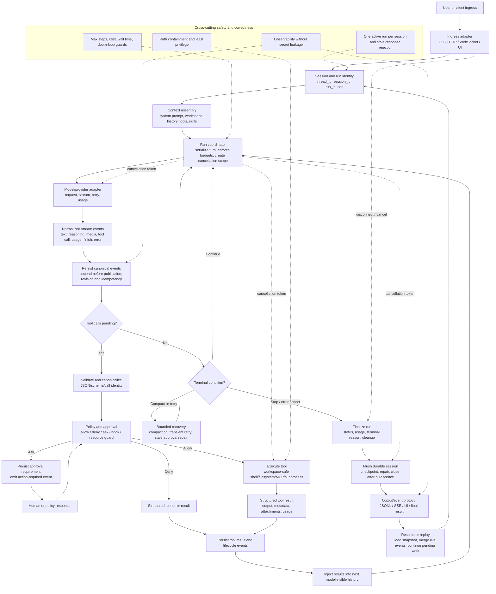

# 统一 Agent 流程

这张图表达参考项目共同实现的机制：输入如何进入 Session/Run，模型如何产生文本或工具调用，工具如何经过授权后执行，结果如何回灌下一次模型请求，以及终止状态如何变成最终输出。



## 终止状态

```text
completed          正常完成并有最终 assistant 输出
paused             等待用户输入、审批或外部事件
failed             模型、工具、协议或持久化失败
cancelled          用户/系统取消，已停止或安全收敛
result_unknown     副作用可能发生，但结果尚未确认
```

## 各项目的共同机制

| 项目 | 运行时形态 | Session/持久化 | 工具/策略模型 | 流式传输/取消 | 最值得复用的经验 |
|---|---|---|---|---|---|
| DeepSeek harness | TypeScript 事件溯源 AgentLoop | 持久化追加界面；JSONL 修复/恢复 | Central ToolRuntime，失败关闭式审批，有界并行 | 通过 provider、工具、子进程树进行强传播 | 耐久规范循环的最佳单 Agent 参考；`/media/shirosora/4A183E5C183E46EB/codestorage/kianacode/reference/deepseek-harness/packages/core/agent-loop/src/agent.ts:331-419` |
| Cline | VS Code SDK 加本地主机 | SQLite + manifest/messages + seeded recovery | Hooks、enabled policy、审批回调 | 丰富的流规范化和经过设计的 abort 队列处理 | 强大的 host/runtime/UI 分离；`/media/shirosora/4A183E5C183E46EB/codestorage/kianacode/reference/cline/sdk/packages/core/src/runtime/host/local-runtime-host.ts:394-520,1767-1959` |
| OpenCode | TypeScript/Bun HTTP/TUI | 事件优先投影到 SQLite；SSE hydration | 通配符 allow/deny/ask 权限 | 按 session 串行化的 runner、重试/压缩/中止 | 事件发布可以同时驱动持久化和 UI；`/media/shirosora/4A183E5C183E46EB/codestorage/kianacode/reference/opencode/packages/core/src/session/projector.ts:214-327` |
| Goose | Rust CLI/core 加 ACP | 持久化 session 以及 effect-before-event 状态机 | Permission manager、hooks、审批、extensions | Cancellation tokens，按步骤重新加载恢复 | effect-before-event 和按步骤重新加载是稳健的恢复原语；`/media/shirosora/4A183E5C183E46EB/codestorage/kianacode/reference/goose/crates/goose/src/agents/state_machine/session.rs:28-219` |
| Crush | Go 本地/服务器收敛 | SQLite 消息加 SSE 和 terminal RunComplete | Allowed tools、hooks、grants、shell blockers | 强大的 accepted/active/queued 取消和 RunID 关联 | 终端协调可保护有损事件传输；`/media/shirosora/4A183E5C183E46EB/codestorage/kianacode/reference/crush/internal/agent/run_complete_test.go:21-312` |
| Agent Framework | Python core + AG-UI，辅助 .NET | 原子文件/session 存储；AG-UI 快照默认为内存中 | Schema validation、中间件、可重放的审批生命周期 | 流式 SSE、有界工具循环、线程取消存在局限 | 审批应可序列化并绑定到 model call identity；`/media/shirosora/4A183E5C183E46EB/codestorage/kianacode/reference/agent-framework/python/packages/ag-ui/tests/ag_ui/test_approval_lifecycle.py:49-86,719-1045` |
| Agno | Python Agent/Model façade | DB 支持的 runs、checkpoints、continue/fork | 可序列化的 RunRequirement/HITL | 带取消持久化的同步/异步/流式变体 | 持久化暂停的 requirements，而不是不透明的 callbacks；`/media/shirosora/4A183E5C183E46EB/codestorage/kianacode/reference/agno/libs/agno/agno/run/requirement.py:13-201` |
| Letta Code | Bun/TypeScript 云端对话客户端 | 服务端有状态对话、cursor 重放、审批恢复 | Permission classification、hooks、resource-aware execution | OTID/run/seq 关联和流重连 | Resume 需要 cursors、过期审批协调和幂等 ID；`/media/shirosora/4A183E5C183E46EB/codestorage/kianacode/reference/letta-code/src/cli/helpers/stream.ts:512-924` |
| Aider | Python 同步客户端循环 | Markdown/LLM 日志；有损的可选恢复 | 强交互式文件/shell 审批 | 流式 UI、重试、Ctrl-C、较弱的进程取消 | 实用的本地防护，但日志不是事务性 session；`/media/shirosora/4A183E5C183E46EB/codestorage/kianacode/reference/aider/aider/coders/base_coder.py:1783-1974` |
| Autogen | Python AgentChat/runtime | Agent/team 状态保存/加载；runtime subscriptions 不持久化 | Workbench 工具，但没有内置审批门 | Queue/runtime 取消和流式事件 | 将编排状态与传输 runtime 分离；`/media/shirosora/4A183E5C183E46EB/codestorage/kianacode/reference/autogen/python/packages/autogen-agentchat/src/autogen_agentchat/agents/_assistant_agent.py:1117-1624` |
| CrewAI | Python Crew/Task/Agent | 事件驱动的 JSON/SQLite checkpoint 和恢复 | Hooks、人类审批、guardrails、工具限制 | Queue 支持的流式传输；worker 取消是协作式的 | checkpoint 事件覆盖很有价值，但吞掉失败很危险；`/media/shirosora/4A183E5C183E46EB/codestorage/kianacode/reference/crewAI/lib/crewai/src/crewai/state/checkpoint_config.py:160-234` |
| 12-factor-agents | TypeScript 教学循环 | 仅进程内 Map | 一个狭窄的审批分支 | 无 | 清晰的最小 reducer/event 形态，不适合作为生产基线；`/media/shirosora/4A183E5C183E46EB/codestorage/kianacode/reference/12-factor-agents/workshops/2025-05/final/src/agent.ts:83-108` |
| Mini-SWE-agent | Python 紧凑 CLI | Trajectory JSON artifact，不可恢复 | 交互式白名单/确认；其下是不受限 shell | 非流式模型，进程组超时 | 小型协议接缝和确定性 parser tests 很有用；`/media/shirosora/4A183E5C183E46EB/codestorage/kianacode/reference/mini-swe-agent/src/minisweagent/agents/default.py:87-189` |
| gpt-pilot | Python 状态驱动的编码工作流 | SQLAlchemy project-state chain 加 VFS | 围绕 task/command steps 的审批；没有原生 tool registry | Provider 流式/重试；取消不一致 | 持久化状态机动作很有用，但磁盘/DB 事务必须统一；`/media/shirosora/4A183E5C183E46EB/codestorage/kianacode/reference/gpt-pilot/core/state/state_manager.py:271-625` |
| MetaGPT | Python Team/Environment/Role | Team JSON 恢复，没有一等 session | 模型生成的 JSON commands；没有正式工具审批 | Reporter 流式传输，取消较弱 | 清晰的 role/message 路由，但模型文本不能是唯一的策略边界；`/media/shirosora/4A183E5C183E46EB/codestorage/kianacode/reference/MetaGPT/metagpt/roles/di/role_zero.py:279-414` |
| ChatDev | FastAPI/WebSocket YAML 图 | 进程内 session；只有 artifact 持久化 | Config/skills/human wait；没有通用审批 | 同步 provider，协作式取消 | 在 session 和并发保证存在后，图组合很有用；`/media/shirosora/4A183E5C183E46EB/codestorage/kianacode/reference/ChatDev/workflow/graph.py:254-341` |
| Claude-code-rust | Rust CLI REPL | 进程内对话；断开的 session managers | REPL 中没有审批/沙箱的 MCP 工具 | 阻塞/非流式主要路径 | 警示性比较：runtime/test registry 与持久化的分歧代价高昂；`/media/shirosora/4A183E5C183E46EB/codestorage/kianacode/reference/claude-code-rust/src/cli/repl.rs:99-259` |
| Agency Swarm | 外部 OpenAI Agents SDK 之上的 Python wrapper | callback 支持的扁平 history；没有一等 Agency session | SDK 所有的工具审批/guardrails | 强流式取消，非流式取消较弱 | 将 provider/SDK 关注点置于狭窄 adapter 后，不要把 history replay 误认为 session recovery；`/media/shirosora/4A183E5C183E46EB/codestorage/kianacode/reference/agency-swarm/src/agency_swarm/agent/execution_streaming.py:169-311` |
| 12-factor template | TypeScript filesystem 实验 | Async store 集成损坏；非原子 | 狭窄的 schema 驱动 actions | 无 | 采用前用端到端测试验证生成的/runtime contracts；`/media/shirosora/4A183E5C183E46EB/codestorage/kianacode/reference/12-factor-agents/packages/create-12-factor-agent/template/src/state.ts:21-47` |

## 补审项目摘要

| 项目 | 补审后的主要结论 |
|---|---|
| Codex | `CodexThread` 是持久会话边界，Turn 是可取消执行边界；core 统一处理 context、模型采样、tool approval、interrupt/suspend 和 rollout reconstruction。 |
| OpenHands | 当前参考目录实际是 Agent Canvas/SDK 适配层，不包含服务端 controller/LLM/tool executor；可验证的是 REST/WS 事件桥、confirmation policy、重连和 UI 投影。 |
| Continue | CLI、VS Code 与 GUI 共享 Core/ChatHistory/stream loop；具备 resume/fork、compaction、permission manager 和工具结果回灌。 |
| Roo Code | `Task` 分离模型 history 与 UI timeline；恢复时补齐悬空 native tool result，写操作前 checkpoint，工具事务集中审批和执行。 |
| Pi | append-only JSONL tree 支持 fork/resume/compaction；provider stream 和工具生命周期完整，但 `bash/edit/write` 默认执行依赖可选 hook 阻断。 |
| ADK Python | Runner 是单一 Event 持久化消费者；non-partial Event 落库后生产节点才继续，approval 绑定原 FunctionCall ID/name/args。 |
| OpenAI Agents Python | 非流式/流式共享 turn resolution、tools、guardrails、approval 和 persistence；RunState 版本化并支持 HITL resume。 |
| Pydantic AI | 显式 Graph `UserPrompt → ModelRequest → CallTools → End`；validate-before-defer，history 可序列化，工具和输出 retry 预算分离。 |

## 可复用模式

- 规范事件溯源 session 界面。将已提交事件作为 prompt 重建、UI 发布、重放和恢复的事实来源，而不是维护独立的临时对话数组。已在 DeepSeek harness、OpenCode、Cline、Goose 和 Crush 中验证。
- effect-before-event 或 append-before-publication 顺序。先应用持久化状态，再发布 UI 事件；将其与 revision/sequence ID 以及有损传输所需的 terminal must-deliver events 配套使用。
- 明确的 run 状态机。用合法转换和所有权表示 idle、accepted、queued、running、waiting-for-approval、compacting/retrying、completed、failed、cancelled 和 paused 状态。
- 规范化 provider 流。在工具解析、持久化、UI 翻译和循环控制之前，将 provider 特定的增量转换为稳定的内部事件代数。
- 结构化工具生命周期。使用稳定的 call ID 持久化 call、approval request、execution start、result/error 和 continuation linkage；在策略评估前验证并规范化参数。
- 可序列化的人在回路中。将审批或输入 requirements 作为绑定到 session/run/call identity 的数据存储，并具备过期、过期响应拒绝、幂等性和可恢复性。
- 将策略作为独立的 authority boundary。工具 schemas、hooks、allow/deny/ask 规则、workspace/resource guards 和审批决定必须独立于模型输出解析及具体执行器。
- 取消隔离。单一信号应到达模型流、工具主体、子进程组、队列和持久化清理；区分取消、provider error 和正常完成。
- 有界进度。强制最大迭代次数、成本、墙钟时间、输出/context 限制、重试预算、重复工具/doom-loop 检测以及强制最终化。
- Context provenance 和预算。使用 token estimates、压缩/摘要、转义、source attribution 和明确 runtime/workspace context 组装类型化区段。
- 每个 session 一个 run 的串行化加队列语义。拒绝或排队并发 prompts，在预期情况下保留 abort 后的 queued prompts，并将 terminal results 与 run IDs 关联。
- 支持重放的输出桥。使用基于 sequence/epoch/cursor 的事件传递，在 hydration 前订阅，合并 hydration 期间观察到的事件，并保留包含权威最终文本的 terminal result。
- 在 model-turn 边界建立 checkpoint。在 tool-result insertion 后、下一次 provider request 前保存；支持 fork lineage 和安全的 historical restore。
- Provider 无关的测试。用确定性的 mock model streams 覆盖完整循环，然后单独控制真实 provider 测试；覆盖 malformed streams、approvals、recovery、cancellation races、persistence failure 和 fresh-context resume。
- Capability 分层。使 ingress/UI、core orchestration、provider adapters、tools/policy、persistence 和 presentation 可独立替换；辅助 runtime 应收敛到同一 core，而不是分叉语义。

## 反复出现的风险

- 当内存状态或 Markdown/trajectory logs 被误认为可恢复 session 时，耐久性缺口会反复出现：Claude-code-rust、Aider、Mini-SWE-agent、MetaGPT、ChatDev、12-factor-agents 和 Agency Swarm 都展示了这种失败模式的变体。
- 写后持久化可能在 durable storage 之前确认事件；随后突然退出会丢失最新 turn，除非 host 明确 flush。DeepSeek harness 和 Cline 都指出了这一点。
- 事件优先设计依赖 projector/subscriber 已挂载且健康；OpenCode 和 CrewAI 表明，被吞掉的 projector/checkpoint failures 可以产生看似成功但没有 durable state 的 runs。
- 审批经常是可选的、委托给外部 SDK，或根本不存在。DeepSeek composition、Claude-code-rust、Autogen、MetaGPT、ChatDev、Agency Swarm 以及主要 CrewAI/Goose 变体都明确体现了这一点；Kiana 不能仅从 tool schemas 推断策略。
- Shell 执行是反复出现的高影响边界：不受限的 `sh -c`/`shell=True`、继承的环境、缺失的 workspace containment，以及绕过审批的 startup commands 出现在 Claude-code-rust、Aider、Mini-SWE-agent、gpt-pilot 和 reference tool paths 中。
- 取消通常是协作式的。同步 provider calls、线程支持的工具、分离的清理和进程树竞争可能使副作用在用户可见的取消之后继续运行；Agent Framework、CrewAI、Agency Swarm、ChatDev 和 Mini-SWE-agent 都记录了其变体。
- 多个活动循环实现会造成审批、重试、压缩和终止方面的语义漂移。Goose 明确保留 legacy 和 state-machine paths；Agno 重复 sync/async/stream implementations；Cline 有 compatibility layers。
- 有损事件传输需要协调。Crush、Letta Code、Cline 和 OpenCode 使用 terminal events、cursors、sequence/epoch stamps 或 hydration merging，因为普通增量可能丢失或乱序。
- Provider 边界隐藏正确性风险。Claude-code-rust、Agency Swarm、Aider、Goose 和 DeepSeek adapter paths 报告了 default URL/payload mismatches、incomplete HTTP status checks、missing streamed tool deltas、provider-owned context 和 external SDK behavior。
- 无界或边界很弱的循环很危险。12-factor-agents 有没有 recovery 的 `while (true)`；Agency Swarm 默认实际上是 unlimited turns；其他系统需要明确的 max-step、cost、timeout 或 doom-loop controls。
- 持久化与副作用可能分歧。gpt-pilot 在 DB commit 前写入文件且无法回滚；CrewAI checkpoint failures 可能被吞掉；filesystem templates 和 12-factor stores 缺乏原子性与锁定。
- 并发和身份错误可能破坏 session。ChatDev 可在 duplicate execution 时替换活动 session；12-factor-agents 接受并发 response mutation；AG-UI default stores 是进程内的，thread IDs 不是 authorization boundaries。
- 大型编排界面增加维护风险。Letta Code 非常大的 headless/UI files 和 framework compatibility shims 使 parity testing 成为必需。
- 静态源码审计无法证明 provider behavior、deployment topology、secrets handling 或 runtime timing。真实 provider 测试必须保持 environment-gated，claims 应绑定到确定性的 source-bound receipts。

## Kiana backlog 摘要

- P0 — 持久化、版本化的 turn/session ledger。让每个 user turn、model request、streamed delta、tool call/result、approval、cancellation 和 terminal outcome 都追加到一个可重放的 session surface；在 terminal publication 前持久化，支持 atomic writes、torn-tail repair、idempotency 和进程重启后的 resume。参考证据：`/media/shirosora/4A183E5C183E46EB/codestorage/kianacode/reference/deepseek-harness/packages/core/session/src/index.ts:569-747`；`/media/shirosora/4A183E5C183E46EB/codestorage/kianacode/reference/cline/sdk/packages/core/src/session/services/persistence-service.ts:102-176,309-333`；`/media/shirosora/4A183E5C183E46EB/codestorage/kianacode/reference/opencode/packages/core/src/session/projector.ts:214-327`；`/media/shirosora/4A183E5C183E46EB/codestorage/kianacode/reference/agent-framework/python/packages/core/agent_framework/_sessions.py:1872-2038`。验收：fresh-process resume 在不产生重复副作用的情况下重建准确的 model-visible history 和 pending work。
- P0 — 集中化工具 authority 和 workspace safety。为 schema validation、path containment、shell restrictions、approval/deny/ask、hooks、per-call identity 和 structured error results 定义一个 registry 和 policy boundary；审批不可用时 fail closed。参考证据：`/media/shirosora/4A183E5C183E46EB/codestorage/kianacode/reference/deepseek-harness/packages/core/tools/src/index.ts:1328-1729`；`/media/shirosora/4A183E5C183E46EB/codestorage/kianacode/reference/opencode/packages/opencode/src/permission/index.ts:27-165`；`/media/shirosora/4A183E5C183E46EB/codestorage/kianacode/reference/goose/crates/goose/src/agents/state_machine/ops_tool_approval.rs:41-153`；`/media/shirosora/4A183E5C183E46EB/codestorage/kianacode/reference/gpt-pilot/core/state/state_manager.py:588-625`。验收：没有模型生成的路径能够逃逸 workspace，并且没有 side-effecting tool 能在没有明确 policy verdict 的情况下执行。
- P0 — 将取消实现为端到端 contract。通过 ingress、provider stream、tool bodies、subprocess trees、queues、persistence flush 和 UI 传递一个 cancellation token；区分 accepted、active、queued、cancelled 和 terminal states；排空已启动工作，并为未启动工作合成 replay-safe results。参考证据：`/media/shirosora/4A183E5C183E46EB/codestorage/kianacode/reference/crush/internal/agent/agent.go:355-498,1954-2020`；`/media/shirosora/4A183E5C183E46EB/codestorage/kianacode/reference/crush/internal/agent/run_complete_test.go:21-312`；`/media/shirosora/4A183E5C183E46EB/codestorage/kianacode/reference/deepseek-harness/packages/subprocess/subprocess-local/src/spawn.ts:326-542`；`/media/shirosora/4A183E5C183E46EB/codestorage/kianacode/reference/cline/sdk/packages/core/src/runtime/host/local-runtime-host.ts:1767-1839`。验收：取消竞争不能产生错误完成或遗留孤立 tool calls。
- P0 — 定义一个规范循环和状态机。分离 ingress、context assembly、provider adapter、normalized stream events、tool policy/execution、result reinjection、termination 和 persistence；避免 Goose legacy/state-machine 以及重复的 sync/async/stream variants 等分歧的活动循环。参考证据：`/media/shirosora/4A183E5C183E46EB/codestorage/kianacode/reference/goose/crates/goose/src/agents/agent.rs:1977-1984`；`/media/shirosora/4A183E5C183E46EB/codestorage/kianacode/reference/agno/libs/agno/agno/models/base.py:733-1092,2133-2580`；`/media/shirosora/4A183E5C183E46EB/codestorage/kianacode/reference/agency-swarm/src/agency_swarm/agent/execution.py:212-346`。验收：所有前端使用相同的生命周期语义和规范化事件 contract。
- P0 — 在扩展 provider 覆盖面之前加入确定性生命周期测试。覆盖 mock model tool-call→tool-result→final response、malformed arguments、unknown tools、approval deny/resume、stream truncation/retry、每个边界处的 cancellation、persistence crash/torn-tail recovery、concurrent turns 和 fresh-process resume。参考证据：`/media/shirosora/4A183E5C183E46EB/codestorage/kianacode/reference/deepseek-harness/examples/headless-agent/tests/keyless-smoke.e2e.ts`；`/media/shirosora/4A183E5C183E46EB/codestorage/kianacode/reference/cline/sdk/packages/agents/src/agent-runtime.test.ts`；`/media/shirosora/4A183E5C183E46EB/codestorage/kianacode/reference/opencode/packages/opencode/test/session/processor-effect.test.ts`；`/media/shirosora/4A183E5C183E46EB/codestorage/kianacode/reference/crush/internal/agent/dispatch_race_test.go`。
- P1 — 在一个 adapter contract 后规范化 provider streaming。保留 text、reasoning、media、tool-call fragments、usage、finish reason、request identity、retry classification 以及 malformed/truncated-stream errors；支持 non-stream fallback 而不改变 loop behavior。参考证据：`/media/shirosora/4A183E5C183E46EB/codestorage/kianacode/reference/deepseek-harness/packages/llm/llm-deepseek/src/translate.ts:86-185`；`/media/shirosora/4A183E5C183E46EB/codestorage/kianacode/reference/cline/sdk/packages/agents/src/agent-runtime.ts:1020-1435`；`/media/shirosora/4A183E5C183E46EB/codestorage/kianacode/reference/letta-code/src/cli/helpers/stream.ts:89-495`。
- P1 — 加入有界循环控制和恢复策略。强制 max steps、cost、wall time、repeated-tool/doom-loop detection、context overflow compaction、transient retry budgets，以及强制的 tool-disabled final response。参考证据：`/media/shirosora/4A183E5C183E46EB/codestorage/kianacode/reference/agent-framework/python/packages/core/agent_framework/_tools.py:3174-3479`；`/media/shirosora/4A183E5C183E46EB/codestorage/kianacode/reference/opencode/packages/opencode/src/session/processor.ts:627-681`；`/media/shirosora/4A183E5C183E46EB/codestorage/kianacode/reference/ChatDev/runtime/node/executor/agent_executor.py:850-1017`。
- P1 — 为 CLI、web 和未来客户端暴露类型化 event/output protocol。包括 sequence/epoch 或 run IDs、terminal must-deliver events、usage、tool lifecycle、approval requests、errors 和 replay cursors；通过合并 snapshot load 期间观察到的事件来 hydrate state。参考证据：`/media/shirosora/4A183E5C183E46EB/codestorage/kianacode/reference/crush/internal/cmd/run.go:318-454`；`/media/shirosora/4A183E5C183E46EB/codestorage/kianacode/reference/cline/apps/vscode/src/sdk/sdk-message-coordinator.ts:19-100`；`/media/shirosora/4A183E5C183E46EB/codestorage/kianacode/reference/opencode/packages/tui/src/context/sync.tsx:594-667`。
- P1 — 使 context assembly 明确且有预算。将 system instructions、workspace/runtime context、relevant files、history、tool schemas 和 user input 构建为类型化区段；加入 token estimation、truncation/summary、escaping 和 prompt provenance。参考证据：`/media/shirosora/4A183E5C183E46EB/codestorage/kianacode/reference/aider/aider/coders/base_coder.py:1225-1416`；`/media/shirosora/4A183E5C183E46EB/codestorage/kianacode/reference/gpt-pilot/core/agents/convo.py:19-127`；`/media/shirosora/4A183E5C183E46EB/codestorage/kianacode/reference/deepseek-harness/packages/core/agent-loop/src/agent.ts:224-243,426-515`。
- P1 — 加入并发所有权和幂等性。每个 session 允许一个 active turn，将每个 request/tool/result 与 session、turn、run、sequence 和 call IDs 关联，拒绝过期审批，并使重复提交无害。参考证据：`/media/shirosora/4A183E5C183E46EB/codestorage/kianacode/reference/opencode/packages/opencode/src/session/run-state.ts:34-142`；`/media/shirosora/4A183E5C183E46EB/codestorage/kianacode/reference/letta-code/src/cli/helpers/accumulator.ts:1089-1318`；`/media/shirosora/4A183E5C183E46EB/codestorage/kianacode/reference/ChatDev/server/services/session_store.py:23-157`。
- P2 — 加入可选 checkpoint/fork/compaction APIs。在 tool batches 后持久化 model-visible boundaries，支持 branch lineage 和安全的 historical restore，并使 compaction/replay 可检查。参考证据：`/media/shirosora/4A183E5C183E46EB/codestorage/kianacode/reference/agno/libs/agno/agno/agent/_run.py:5994-6030,6082-6204`；`/media/shirosora/4A183E5C183E46EB/codestorage/kianacode/reference/crewAI/lib/crewai/src/crewai/state/checkpoint_config.py:160-234`；`/media/shirosora/4A183E5C183E46EB/codestorage/kianacode/reference/goose/crates/goose/src/agents/state_machine/session.rs:28-219`。
- P2 — 加入 observability 和 security receipts。记录 provider/model、policy verdict、tool arguments hash、workspace、timing、usage/cost、retry/cancellation reason 和 persistence revision，同时不泄露 secrets；暴露 structured JSONL/SSE 和 replay diagnostics。参考证据：`/media/shirosora/4A183E5C183E46EB/codestorage/kianacode/reference/deepseek-harness/examples/headless-agent/tests/fixtures/headless-driver.ts:14-31`；`/media/shirosora/4A183E5C183E46EB/codestorage/kianacode/reference/agno/libs/agno/agno/run/agent.py:143-330`；`/media/shirosora/4A183E5C183E46EB/codestorage/kianacode/reference/letta-code/src/headless.ts:2592-2679,3375-3447`。
- P2 — 仅在单 Agent contract 稳定后加入 multi-agent/workflow composition。将 delegation 建模为带 recipient identity、有界并发、继承策略和 aggregate persistence 的类型化 tool/handoff calls。参考证据：`/media/shirosora/4A183E5C183E46EB/codestorage/kianacode/reference/autogen/python/packages/autogen-agentchat/src/autogen_agentchat/teams/_group_chat/_base_group_chat.py:246-577`；`/media/shirosora/4A183E5C183E46EB/codestorage/kianacode/reference/agency-swarm/src/agency_swarm/tools/send_message.py:313-641`；`/media/shirosora/4A183E5C183E46EB/codestorage/kianacode/reference/ChatDev/workflow/graph.py:137-341`。
