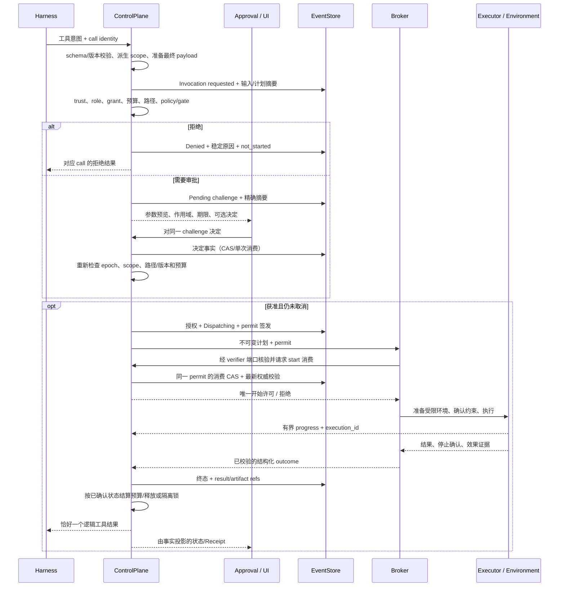

# Roadmap 专项：Capability 专项

> 返回 [Kiana 执行路线图](../roadmap.md) 的总图与当前窗口。本文保留原专项编号、状态、依赖、验收口径和证据限制；专项步骤完成不会自动改变 P 阶段状态。

## 20. Capability 专项：调研结论与实现设计（2026-09-12 追加）

> 对应 [module-map.md](../module-map.md) 的「5. Capability：工具执行与沙箱」。
> **性质：待实施设计与任务分解；全部新增 step 均为 ⏳，不表示源码已经通过验收。**
> 阅读顺序：§20.1–20.4 看依据，§20.5–20.9 看执行设计，§21 按 step 实施，§22 看验收门。
> 本追加不重排 §2 正在执行的预算、恢复和记忆任务；另一位实现 agent 先收口当前切片，再按依赖消费这里的细化任务。

### 20.1 范围、快照与旧限制的处理

本专项把 Capability 完善为可复用的**受控执行层**：从模型工具意图开始，到授权、执行环境、文件/进程/MCP/记忆操作，再到结果确认、取消、恢复和收据。沿用 `DaemonHost → ControlPlane → Broker → Handler`，每个入口和扩展调用都走这条链。

按用户 2026-09-12 的明确指示，旧文件的限制性指示与本任务冲突时忽略。具体解释如下，避免后续 agent 又被旧表阻塞：

| 旧条目 | 本专项的处理 |
|---|---|
| §5 `P1-H-01`、§10「模型可见工具固定五个」 | 五工具是兼容基线，不再是永久数量上限。先统一 registry；需要的新工具在 `CAP-30` 按版本、授权、执行器和回归一起接入 |
| §10「HTTP MCP 冻结」及平台规范中的 stdio-only 限制 | 允许规划并实施 `CAP-29` 的受控 HTTP MCP；在其前置条件与验收完成前，运行时继续如实返回 unsupported |
| §12「冻结项未打开」 | 不据此否决本专项已列出的长任务、工具扩展和平台后端；完成口径仍须有实际接线、负向测试和绑定快照的证据 |
| 旧文档要求先等待单写者交接、先请示架构再写设计 | 本次已授权调研、提出设计并追加 roadmap；直接完成文档回填。实际代码修改仍按切片集成，处理并发文件变化 |

这些解释没有把「计划」变成「当前支持」，也不把调研任务扩大成现在执行代码改造、发布或提交。

**本次证据边界：** HEAD 为 `db77c2485bcafecbb1da17ec57ee509ad2ee32b4`；源码观察基于 2026-09-12 16:45 +08:00 附近复制的未提交工作树。文件逐个复制，不是原子 checkout；研究期间源码继续变化，实施时必须重新核对。研究副本与 SHA-256 清单保存在 `/tmp/kiana-capability-research-20260912-w6cflz32/snapshot.json`，临时路径仅供本次复核，长期依据是下列源码链接、参考版本与后续证据块。本次未运行产品测试，未查询远端 CI，未提升 `CURRENT_STATUS.md` 的任何能力或证明等级。

### 20.2 当前代码能确认什么、还需补什么

以下「已有」均指上述源码观察；历史 `local_behavior` 证据仍只绑定 [CURRENT_STATUS.md](../../CURRENT_STATUS.md) 各自的快照。「缺口」是需要复现/验证的设计问题，不是本次完成的漏洞实测。

| 边界 | 已有源码 | 本专项补强点 |
|---|---|---|
| 工具目录 | WIP [tool_catalog.rs](../../kiana-domain/src/tool_catalog.rs) 已集中 schema/部分别名；[runner/tools.rs](../../kiana-runner/src/tools.rs) 消费它 | operation/risk/handler 注册仍有独立 match；单一 schema 表尚不等于 descriptor、policy 和 executor 全部一致 |
| Broker | [lib.rs](../../kiana-capability-broker/src/lib.rs) 精确匹配 `(CapabilityKind, operation)`，拒绝重复注册，不持注册锁执行长 I/O | 缺少版本化 binding、统一 prepare/result 边界；`AuthorizedCapabilityRequest::new` 只检查非空 ID，不能单独证明存在有效授权记录 |
| 授权与派发 | [core/capabilities.rs](../../kiana-core/src/capabilities.rs) 做 policy/gate/hook、Cell lease、结果关联；WIP `claim_invocation` 已追加 CAS dispatch fence | 扩展为完整 Invocation/attempt 生命周期；核验审批返回路径与普通路径一致，不能另写一套去重或状态机 |
| 执行上下文 | [events.rs](../../kiana-core/src/events.rs) 的 `stamp_request_identity` 覆写身份并计算角色/packet 路径交集 | 权威信息仍混在 JSON arguments；应独立携带完整 scope、版本、deadline、grant、锁和环境身份，缺字段不采用宽权限默认值 |
| Linux 沙箱 | [harness_sandbox.rs](../../kiana-daemon/src/harness_sandbox.rs) 有 bwrap、namespace、cap-drop、clearenv；WIP 增加 scoped bind 和保护目录 | `--ro-bind / /` 仍暴露宿主可读文件；只读挂载不隐藏凭据和 Unix socket。canonicalize 后用路径挂载仍需身份固定；不存在的精确允许路径不能靠放宽父目录解决 |
| shell | [harness_capabilities.rs](../../kiana-daemon/src/harness_capabilities.rs) 有 argv/`sh -c`、超时、进程组停止、双流各 1 MiB 读取上限 | 缺统一进程 handle、资源配额和输出元数据；kill-group 与 bwrap 内 PID namespace/new-session 的关系须实测；drain 错误不能显示成空输出正常结束 |
| patch | [apply_patch.rs](../../kiana-daemon/src/apply_patch.rs) 已有预规划、项目锁、前置条件、symlink/hardlink 拒绝、部分 dirfd/openat/renameat 与 rollback | 不能重复发明 patch 引擎；须贯通授权写集、缺失路径、提交点取消、跨文件中断恢复和有限 rollback。单文件 rename 不等于整批跨重启原子事务 |
| MCP | WIP [mcp_stdio.rs](../../kiana-daemon/src/mcp_stdio.rs) 已使用同一 bwrap planner，限制帧/通知数并核对 ID；[harness_mcp.rs](../../kiana-daemon/src/harness_mcp.rs) 校验输入及结果基本形状 | 目前每次调用内启动/发现工具；config/schema hash 主要在结果中出现，需前移到审批与派发绑定。写入背压、协商、分页、outputSchema、drift、取消确认均需完整验收 |
| Hook | [pre_tool_hooks.rs](../../kiana-daemon/src/pre_tool_hooks.rs) 处理决策，拒绝未应用的输入修改；调用 [stop_hooks.rs](../../kiana-query/src/stop_hooks.rs) | hook 自身会启动 shell；查询层的进程执行不是主 shell 的 containment。新建 Notify 也未绑定 run 取消。必须把 hook 的执行纳入同一监督边界 |
| Memory | [harness_memory.rs](../../kiana-daemon/src/harness_memory.rs) 有 ACL、collection 路径、candidate/review WIP 和阻塞文件任务 | 服务存储权限与工作区文件权限应分开；`spawn_blocking` 的 future 被丢弃后任务仍可能写盘，不能据此宣布取消成功 |
| 取消与收据 | WIP [sessions.rs](../../kiana-core/src/sessions.rs) 有 stop tracker；[receipts.rs](../../kiana-core/src/receipts.rs) 折叠 capability 事件 | tracker 按 run 存单项，不适合多个 in-flight execution；`success`、exit code、已停止、效果已确认需分维度，避免外部调用结果丢失被标成普通失败 |

**回填前的漂移复查：** 更新中的 Broker 已出现 `set_permit_verifier`，普通/可取消派发均要求 `ExecutionPermitVerifierPort::verify_and_consume`；这正是 `CAP-05` 应接续的 WIP，不能照着旧快照再造一个端口。本次未验证其存储消费、完整摘要绑定和竞态行为，因此仍按源码观察登记，具体完成度由新快照上的聚焦测试决定。

另外，[入门总览](../company-os-overview.md) 仍有「live provider 未接入」的旧说法，与现状账本和 module map 的有限 live 证据不一致。本专项不据它限制 Capability，也不顺手重写无关文档。

### 20.3 整个 reference 的覆盖登记

已枚举 `reference/` **73 个一级目录**（包含隐藏状态目录 `.claude-flow`；只数非隐藏目录则为 72），对文件索引、工具/权限/进程/沙箱相关路径做筛查，再针对直接相关实现阅读关键源码。不是对约十九万条文件索引逐文件完成安全审计；下表明确区分深度，目录存在或关键字命中均不表示实现可信。

| 覆盖层次 | 目录（保留实际大小写） | 本次用途 |
|---|---|---|
| 关键源码阅读 | `codex`、`deepseek-harness`、`grok-build`、`container-use`、`opencode`、`goose`、`crush`、`pi`、`cline`、`letta-code`、`mcp-servers`、`ruflo`、`openai-agents-python`、`pydantic-ai` | 授权/执行接缝、共享 policy、隔离、取消、结果、恢复；证据入口见下一表 |
| 执行后端与接口抽查 | `Archon-Knowledge`、`mini-swe-agent`、`adk-python`、`autogen`、`agno`、`agent-framework` | 环境生命周期、容器边界、local executor、原始 call 关联；不照搬它们的权限默认值 |
| 入口/桌面/终端结构筛查 | `OpenHands`、`Roo-Code`、`roo-code`、`continue`、`emdash`、`orca`、`herdr`、`gastown` | 终端、请求投影和 workspace 接口候选；宿主 terminal API 本身不构成 OS 隔离 |
| 编排/恢复结构筛查 | `12-factor-agents`、`Archon`、`ChatDev`、`MetaGPT`、`agency-swarm`、`crewAI`、`gpt-pilot`、`langgraph`、`temporal-sdk-python` | 任务/副作用接缝；Temporal 额外阅读 workflow sandbox，确认其用途是确定性约束 |
| 上下文/知识结构筛查 | `MemPalace`、`memorix`、`mem0`、`graphiti`、`GitNexus`、`graphify`、`llama-index`、`aider`、`claude-memory`、`claude-mem-candidate`、`letta`、`letta-oss`、`langchain` | Memory 资源命名、检索、变更归因的后续参考；不把检索范围直接转成执行授权 |
| 规划/任务/技能结构筛查 | `spec-kit`、`OpenSpec`、`superpowers`、`planning-with-files`、`pm-skills`、`get-shit-done`、`gsd-core`、`claude-task-master`、`beads`、`architect-loop` | step、依赖、证据和工件组织；不是本专项沙箱机制来源 |
| 技能集/说明结构筛查 | `ECC`、`everything-claude-code`、`awesome-agent-skills`、`skills`、`ai-coding-guide`、`gstack` | 发现扩展和测试候选；项目脚本不能因被收录就进入可信执行面 |
| 协议结构筛查 | `a2a` | task/cancel/artifact 形状候选；不替代 Capability 授权协议 |
| 安全工具/兼容树筛查 | `strix`、`claude-code-rust` | 仅登记相关后端入口；不将内嵌还原代码或专业安全工具整套接入产品 |
| 仅目录/公开行为对照 | `claude-code-rev-main`、`claude-code-main (2)` | 不把还原/专有源码作为可直接复用的实现依据；采用公开 sandbox-runtime 资料补充行为研究 |
| 非有效上游样本 | `.claude-flow`、`promptfoo-full` | 前者是工具状态目录；后者无有效源码样本且已有审计记录指出指向本仓，排除为工程证据 |

重复与漂移须去重：`Roo-Code`/`roo-code` 同一快照；`claude-memory`/`claude-mem-candidate` 同一快照；`letta`/`letta-oss` 当前只有很小的迁移/说明树。历史 [审计索引](../reference-agent-audit/README.md) 用来导航，不能替代下面按实际路径做的复核。

### 20.4 关键参考、可借鉴机制与取舍

commit 是**本地 reference HEAD 的定位信息**，不宣称等于上游最新版本或整个 checkout 未修改。每个结论只覆盖所列入口。

| 来源 / 本地 commit 前缀 | 本次复核入口 | 转成 Kiana 的设计 |
|---|---|---|
| Codex `d6489472f3c1` | [orchestrator.rs](../../reference/codex/codex-rs/core/src/tools/orchestrator.rs)、[sandboxing.rs](../../reference/codex/codex-rs/core/src/tools/sandboxing.rs)、[fd_mount.rs](../../reference/codex/codex-rs/linux-sandbox/src/fd_mount.rs) | 集中处理审批、attempt 和 backend 选择；挂载身份用 FD 核验。借鉴接口形状，保留 Kiana 自己的权限交集、单次许可及 Unknown 语义 |
| DeepSeek Harness `c389f96bf3a9` | [sandbox-policy](../../reference/deepseek-harness/packages/sandbox/sandbox-policy/src/index.ts)、[containment](../../reference/deepseek-harness/packages/fs/fs-sandbox/src/containment.ts) | 每次调用解析同一 policy/root，执行器只消费快照；路径要比较文件身份与缺失后缀。其显式 mode override 不能直接成为 Kiana 扩权入口 |
| Grok Build `72a61251fcff` | [read_deny_verify.rs](../../reference/grok-build/crates/codegen/xai-grok-sandbox/src/read_deny_verify.rs)、[types.rs](../../reference/grok-build/crates/codegen/xai-grok-sandbox/src/types.rs)、[journal.rs](../../reference/grok-build/crates/codegen/xai-workflow/src/journal.rs) | 验证实际挂载限制，不能信环境标记；记录实际 backend/profile；journal 请求摘要、序号和 divergence 检查可用于重放设计 |
| Container Use `2e43e625e952` | [environment.go](../../reference/container-use/environment/environment.go)、[filesystem.go](../../reference/container-use/environment/filesystem.go)、[state.go](../../reference/container-use/environment/state.go) | shell、文件操作与 checkpoint 共用环境身份；环境错误不能退回宿主执行。Dagger 不是 Kiana 必需依赖 |
| Archon-Knowledge `fa2740050f18` | [container.ts](../../reference/Archon-Knowledge/packages/isolation/src/backends/container.ts) | 只读 lower + 每 run upper、隔离环境的 prepare/destroy/write-back；不采用自动回退到增加 `CAP_SYS_ADMIN` 的路径 |
| OpenCode `d6855b6b47a8` | [bash.ts](../../reference/opencode/packages/core/src/tool/bash.ts)、[permission](../../reference/opencode/packages/opencode/src/permission/index.ts) | 保留 structured exit/timeout/truncated 结果、显式 permission 请求。其 V2 bash 明示使用宿主权限，不能当作 containment 已完成的范本 |
| Goose `5e90925962f0` | [tool_execution.rs](../../reference/goose/crates/goose/src/agents/tool_execution.rs) | tool result、progress notification、action-required 分离；UI 消费慢不阻塞执行，但 Kiana 终态必须由 EventLog 确认 |
| Crush `563d658bccb5` | [permission.go](../../reference/crush/internal/permission/permission.go) | 请求携带 session/tool-call，重复决定返回是否真正解决 pending；不引入 hook 自己授予权限的捷径 |
| Pi `96617628e852` | [truncate.ts](../../reference/pi/packages/coding-agent/src/core/tools/truncate.ts)、[sandbox example](../../reference/pi/packages/coding-agent/examples/extensions/sandbox/index.ts) | 输出 byte/line 双限额、结构化截断信息；sandbox example 只包 bash，不能推导所有文件工具都受限 |
| Cline `fc28a5fe3331` | [runtime-host.ts](../../reference/cline/sdk/packages/core/src/runtime/host/runtime-host.ts)、[local-runtime-host.ts](../../reference/cline/sdk/packages/core/src/runtime/host/local-runtime-host.ts) | UI 与 runtime host 的接口分离；跨边界只传可序列化身份和结果，避免 UI 持有任意执行 callback |
| Letta Code `6bc41be9f4a9` | [approval-recovery.ts](../../reference/letta-code/src/agent/approval-recovery.ts) | 将恢复策略与 I/O 分开；过时 approval 与原 call 必须重新配对，不能把重连当作重试授权 |
| MCP Servers `d73f99efbfd4` | [path-validation.ts](../../reference/mcp-servers/src/filesystem/path-validation.ts)、[lib.ts](../../reference/mcp-servers/src/filesystem/lib.ts) | 目录边界应按 component 比较，补充路径测试输入；普通路径校验不能取代 Kiana 的 dirfd、挂载和并发保护 |
| Ruflo `a295c6870315` | [envelope.ts](../../reference/ruflo/v3/@claude-flow/security/src/policy/envelope.ts) | 多维 scope 的 subset/expiry/delegation 检查可借鉴；其无 envelope/空列表的宽松语义不能带进 Kiana |
| OpenAI Agents Python `f355af660416` | [unix_local.py](../../reference/openai-agents-python/src/agents/sandbox/sandboxes/unix_local.py)、[_mount_security.py](../../reference/openai-agents-python/src/agents/sandbox/_mount_security.py) | 统一 session/PTY handle、环境白名单、credential authority 的脱敏；`UnixLocalSandbox` 明确在宿主运行，名称不代表 OS 安全边界 |
| Pydantic AI `62f1e8302a35` | [approval_required.py](../../reference/pydantic-ai/pydantic_ai_slim/pydantic_ai/toolsets/approval_required.py) | 审批暂停与工具执行接口分离；callback/布尔批准不能替代持久的精确授权 |
| Mini SWE Agent `04d809ceab9d` | [local.py](../../reference/mini-swe-agent/src/minisweagent/environments/local.py)、[docker.py](../../reference/mini-swe-agent/src/minisweagent/environments/docker.py) | 小型环境接口、命令结果与超时；local 直跑、Docker 客户端超时不等于容器内进程已停止，均需额外监督 |
| ADK / AutoGen / Agno / Agent Framework | [ADK local executor](../../reference/adk-python/src/google/adk/code_executors/unsafe_local_code_executor.py)、[AutoGen Docker](../../reference/autogen/python/packages/autogen-ext/src/autogen_ext/code_executors/docker/_docker_code_executor.py)、[Agno shell](../../reference/agno/libs/agno/agno/tools/shell.py)、[Framework tools](../../reference/agent-framework/python/packages/core/agent_framework/_tools.py) | 取 executor 生命周期、停止宽限期和原始 call 关联；工具函数可调用不表示权限和网络已隔离 |
| Temporal SDK `22a9e41fd857` | [workflow_sandbox](../../reference/temporal-sdk-python/temporalio/worker/workflow_sandbox/__init__.py) | 只取可重放逻辑与外部 effect 分离；确定性 sandbox 不承担任意 shell 的 OS 隔离 |

**本地目录之外补查的官方资料（访问日 2026-09-12）：**

| 官方资料 | 对本设计的具体约束 |
|---|---|
| [Codex Rules](https://learn.chatgpt.com/docs/agent-configuration/rules) | argv 前缀与 shell 脚本不同；仅能可靠解析的简单复合命令才逐段匹配，最严格决定胜出。Kiana 的 shell AST 分类只影响审批，OS 仍负责隔离 |
| [OpenHands Workspace](https://docs.openhands.dev/sdk/arch/workspace) | 当前本地 OpenHands 为 Agent Canvas/入口树，实际 workspace/agent-server 已拆到 SDK；吸收统一 command/file/lifecycle 接口，区分 local host 与 container 的隔离性质 |
| [Anthropic sandbox-runtime](https://github.com/anthropics/sandbox-runtime) | 将文件系统与网络限制组合、使用平台原生机制与代理；采用显式 deny/read/write/network 配置及诊断思想，默认值需按 Kiana 威胁模型重定 |
| [Bubblewrap](https://github.com/containers/bubblewrap) | bwrap 是构建隔离环境的底层组件；最终暴露哪些路径、socket 和 namespace 由调用方决定，不能仅凭后端名宣称安全 |
| [Landlock ABI](https://cdn.kernel.org/doc/html/latest/userspace-api/landlock.html) | REFER、TRUNCATE、网络能力按 ABI 探测；已打开 FD 是单独边界，不能用 kernel 版本或一个环境变量代替实际能力检查 |
| [openat2](https://man7.org/linux/man-pages/man2/openat2.2.html) | root dirfd 与 `RESOLVE_BENEATH`/`RESOLVE_NO_SYMLINKS` 等控制路径解析；不能声称它单独解决 hardlink 或整个多文件事务 |
| [MCP 2025-11-25 Tools](https://modelcontextprotocol.io/specification/2025-11-25/server/tools)、[Transports](https://modelcontextprotocol.io/specification/2025-11-25/basic/transports)、[Authorization](https://modelcontextprotocol.io/specification/2025-11-25/basic/authorization)、[Security](https://modelcontextprotocol.io/docs/2025-11-25/tutorials/security/security_best_practices) | 固定所支持的协议/schema 版本；处理分页、outputSchema、schema 变化，annotations 不能自行授予信任；HTTP 接入须处理认证及 SSRF。此处是选定互操作基线，不声明它永远是最新规范 |
| [Windows Job Objects](https://learn.microsoft.com/en-us/windows/win32/procthread/job-objects)、[AppContainer](https://learn.microsoft.com/en-us/windows/win32/secauthz/appcontainer-isolation) | 进程树管理与安全权限是不同机制；Job 的 breakaway、继承句柄和代理创建进程路径需单独验证，不能仅设置 kill-on-close 就声称完成 Windows 隔离 |
| [gVisor Security Model](https://gvisor.dev/docs/architecture_guide/security/) | 可作为更强执行后端，仍需独立配置资源上限和网络策略；不能把容器、gVisor 或 VM 名称当作无条件安全保证 |

### 20.5 代码职责与核心契约

先在现有 crate 内收敛职责；以下新增模块名是落点建议，已有等价模块应直接扩展，避免为目录整洁先做大拆分。

| 所属 | 推荐落点 / 责任 |
|---|---|
| `kiana-domain` | 扩展 `tool_catalog.rs`、`capabilities.rs`、`states.rs`、`errors.rs`：descriptor、输入摘要、scope 值对象、状态及结果；不放 Tokio/OS handle |
| `kiana-ports` | catalog、permit 校验/消费、executor、process supervision、受控存储、Clock 端口；OS 句柄留在 adapter 内 |
| `kiana-core` | 在 capabilities/approvals/recovery/sessions 中统一 prepare→authorize→dispatch→finalize；唯一决定授权、预算、锁、生命周期和事件 |
| `kiana-capability-broker` | `registry` / `dispatch` / `validation`：绑定版本与 handler，核验 permit，路由、结果 schema/关联检查；不另起 Agent loop |
| `kiana-daemon` | `execution/{scope,paths,environment,process,output,linux}`：具体路径解析、sandbox plan、子进程和输出；复用现有 patch/MCP/memory 实现 |
| `kiana-policy` / `kiana-gates` | 消费同一 descriptor 和 authority snapshot，纯函数判定；不根据执行器字符串返回重新推断权限 |
| `kiana-runner` / protocol / UI | 请求只表达意图；共享 wire 的 progress/approval/result，不能创建已授权执行计划 |

**契约建议（伪代码，字段在 `CAP-00` 对照现有 canonical 对象合并，不另建同义状态机）：**

```rust
ToolSpec {                         // 静态、可版本化的工具契约
    id, model_name, aliases, version, capability_kind, operation,
    input_schema, output_schema, schema_hash,
    effects, required_scopes, risk_policy,
    timeout_policy, retry_policy, idempotency_policy,
    cancellation_support, reconciliation_support,
}
ToolBinding { spec_id, version, executor_id, executor_version }
ToolSnapshot { catalog_epoch, visible_specs, bindings_digest }

PreparedAction {                   // 复用 CP-03；不含可执行授权/业务副作用
    invocation_id, call_id, run_id, canonical_input, input_digest,
    descriptor_ref, tool_snapshot_ref, effect_plan, environment_plan_ref,
}
ExecutionScope {                   // AuthoritySnapshot 的执行资源视图
    principal, session_id, run_id, cell_id, grant_refs, budget_lease,
    project_identity, packet_revision, environment_id, workspace_revision,
    read_roots, write_roots,
    read_denies, write_denies, memory_scopes, server_scopes,
    network_policy, credential_refs, limits, deadline,
    policy_epoch, trust_epoch, data_epoch, catalog_epoch, cancellation_epoch, fence,
}
DispatchPermit { permit_id }       // 复用 CP-13；opaque 引用本身不证明授权
ExecutionAttempt {                 // 既有 CapabilityExecution 的投影视图
    execution_id, invocation_id, attempt, permit_id, state,
}
ExecutionOutcome {                 // 兼容 CapabilityResult 的迁移目标
    execution_id, request_id, status, error_code,
    process_exit, stop_status, effect_status,
    stdout_ref, stderr_ref, preview, output_metadata,
    resource_usage, changes_ref, evidence_refs,
}
```

- **单一 registry ≠ 单一授权对象。** `ToolSpec` 管行为契约；`CapabilityGrant` 管谁能做什么；`ToolBinding` 管代码路由；`ToolSnapshot` 管本次模型看到的版本。最终权限是 grant/模板/部门/项目/packet/approval 等限制的交集，descriptor 不能自授权限。
- **字段缺失语义显式化。** 使用 `Inherit`/`DenyAll`/`AllowSet` 区分配置输入；最终 `ExecutionScope` 不含 `Inherit`。空 write/server/memory 集合表示没有权限，不能隐式变成 `.` 或 `*`。
- **模型参数与服务端权威分离。** `role_id`、`project_root`、sandbox、path_allow、grant、environment_id、server executable 等放进独立的服务端上下文。旧 cassette 的无害额外字段可由 v1 兼容层忽略；保留字、相互矛盾别名和版本不匹配必须拒绝，不能全量透传。
- **许可必须可核验且单次派发。** 复用 CP-13 的 `DispatchPermit` 与 `ExecutionPermitVerifierPort`：core 在同一控制账本事务中提交授权/once approval 消费/Dispatching/permit 签发；Broker 通过该端口请求一次 start 消费，核对最新 authority/cancel/fence 与 input/scope/descriptor/environment 摘要。消费记录仍由控制面提交到同一 journal；Broker 不另建 Invocation 账本、不直接写原始授权事件。签发与开始消费是同一许可的两个阶段，各自有 CAS 和崩溃分类。端口定义在 ports，由 core 的窄授权协调组件实现、DaemonHost 注入，避免递归 drive_run、Arc 强引用环和持控制锁跨执行 await；Broker 不依赖 core crate。进程内 opaque ID 不需要为了形式引入签名系统；跨信任进程时再扩通道身份/签名及 replay 合同。
- **Invocation 与 attempt 分离。** 复用已有稳定 ID 契约；`call_id` 属模型配对，`request_id` 属命令关联，`invocation_id` 属逻辑调用，`execution_id` 属一次尝试。Provider 重用 call ID 时按 run/turn 的契约消歧，不能全局拼一个不校验来源的字符串。

### 20.6 一次工具调用的完整处理流程



顺序细节：prepare 可做受控只读预检，不能启动未获准的项目脚本。MCP discovery 本身要启动进程，应有独立的受控 server-start 授权，先于业务调用形成快照。Hook 作为受控执行参与该流程：默认只能 allow/block/ask；若允许改写输入，必须回到 prepare，旧摘要和旧审批全部失效，并限制改写轮数，不能在已批准的请求后偷偷换参数。

### 20.7 文件、进程、服务存储使用同一权限模型

**“共享 containment”指共享解析后的权限与同一套一致性测试，不要求所有动作都变成一条 shell。** 三类 adapter 各用适当机制落实约束：

| 执行类型 | 权限与执行机制 | 必须避免的混淆 |
|---|---|---|
| shell / stdio MCP / executable hook | `ExecutionEnvironment` + OS filesystem/process/network 限制 + ProcessSupervisor | command 字符串路径扫描、工具自述 readonly、进程工作目录都不是隔离机制 |
| patch / 文件与产物服务 | root dirfd/平台 handle + 相同 read/write policy + 锁/前置条件 + 提交日志 | 检查路径后重新按字符串打开、把父目录可写当作精确文件可写、把多次 rename 当成单事务 |
| Memory / EventLog / Approval 等服务存储 | daemon 持有专用 store handle，按逻辑 namespace、owner、ACL、revision 授权 | 不把 `KIANA_HOME`、审批库、锁目录、凭据或整个记忆库挂给工作进程 |

文件策略包含**读**和**写**：默认模型工具能读本次项目快照与显式声明的工具链根；HOME/凭据、其他项目、daemon 存储、运行时 socket 默认不暴露。凭据可以经 stdout→模型/provider 外流，断网并不能代替读隔离。cache、临时目录、工具链、工作区分别声明权限和配额，`read-only` 允许私有临时文件，不允许修改源工作区。

路径解析必须处理：相对路径、`..`、绝对路径、嵌套 symlink、缺失叶子/父目录、hardlink、rename/move 两端、大小写/卷标、git worktree 的 `.git` 文件与外部 gitdir、挂载点切换。禁止写的控制路径由现有路径服务解析成真实对象，不能只硬编码项目内 `.kiana` 两个名字。

**精确写集的两个执行模式：**

1. `direct_scoped`：只适用于后端能真实落实的允许目录/文件；解析后固定身份，外层协同写者受同一锁约束。无法证明保护子目录、hardlink alias 或创建新文件仍不扩权时拒绝该模式。
2. `isolated_staged`：给任意脚本每个工作单元独立 copy/reflink/overlay 写层；不使用与宿主共享 inode 的 hardlink 副本。命令结束后，在进程已静止的条件下计算含 untracked/deleted/mode 的变更集，再经同一 ControlPlane 按原写集和前置条件发布。越界变更保留诊断并拒绝发布。此模式支持允许列表中的新文件、原子替换和稳定归因，是严格 packet 写集的推荐路径。

**工作区视图必须一致。** 环境绑定 run/packet、源 revision 和可写 lease；shell、patch、stdio MCP 的文件访问使用同一个已授权环境视图。后一条测试命令必须读到前一条 patch 的版本，不能一个操作宿主、另一个操作陈旧副本。默认完成一个 invocation 的静止、changeset 确认和受控发布后才交接下一可写 revision；跨多调用暂存须显式持有同一 lease。环境不得跨 owner 或在权限收窄后原样复用。

暂存空间可写范围与**宿主发布写集**分别写进计划：允许脚本在私有副本生成构建中间物不表示它获准改同名宿主文件。shell 退出、暂存成功、宿主发布成功分开记录；失败/取消产生的暂存修改默认不自动发布，可作为有界 Artifact 交后续独立请求处理。需要发布的范围若已由有效 grant/approval 覆盖可直接走 core 授权，不机械增加一次人工确认；新范围必须重新申请。

不能把整仓库可写挂进去，再靠执行后 `git diff` 查越界充当预防边界。暂存层可以拒绝对宿主发布，但必须同时隐藏不允许读取的数据。共享宿主目录上不遵守锁的同 UID 外部程序不受 Kiana 的逻辑锁控制；需要对抗这类并发变更时采用隔离快照/更强 OS 边界，并报告发布冲突。

### 20.8 结果、取消、重试与恢复的精确语义

保留现有 `CapabilityResult` v1 wire 兼容；不要直接把所有非零 exit 改成 broker 异常。内部 outcome 至少分为以下维度：

| 维度 | 值/含义 |
|---|---|
| 协议与执行器 | 参数拒绝、未启动、启动失败、协议错误、执行器完成 |
| 进程结果 | exit code/signal/timeout/cancel；`exit=0` 只说明进程退出状态 |
| 停止状态 | `not_started` / `confirmed` / `unconfirmed` |
| 副作用状态 | `none` / `confirmed` / `partial` / `unknown` |
| Invocation/attempt 状态 | 复用现有 requested→…→succeeded/failed/denied/cancelled/result_unknown，不新造另一套状态枚举 |

| 观察 | 处理 |
|---|---|
| 预检、审批或排队时取消，未派发 | 记录未启动与取消；关闭 pending，结果按原 call 回灌 |
| 只读命令非零退出 | 回传 exit/stdout/stderr，允许模型纠正输入；不把正常工具失败混成 daemon 崩溃 |
| 写命令超时/取消，进程组已停止 | 仍须检查暂存变更/事务日志；有部分效果就显式报告，不能宣称“未执行” |
| stdio/HTTP MCP 已发出 call，响应丢失 | `result_unknown`；取消消息或 TCP 断开不证明远端副作用没发生 |
| 收到结果但 schema/关联无效，或结果事实落盘失败 | 保留已派发事实，进入不确定处理；不自动再执行 |
| 已完成相同调用再次出现 | 核对输入/版本/owner 摘要，返回已记录结果；冲突拒绝，不能消耗新执行配额再跑 |
| 重启发现 Dispatching/Executing、没有可信终态 | 默认 Unknown/暂停；只读 reconciliation 查证，不凭 PID 或日志空白推断没有执行 |

现有平台规范「超时一律 Unknown」和 shell 的 `timed_out=true/exit=124` 存在需明确的分层口径：**进程层保留 timeout 事实；Invocation 以效果是否可确认决定终态；写操作效果无法证明时保持 Unknown。** `CAP-00` 把该解释同步到规范及测试，不能删除 timeout 断言或靠换一个 success 值掩盖差异。

取消由 supervisor **持有正在执行的任务**并等待确认：不能只 drop future，尤其不能把 `spawn_blocking` 的 JoinHandle 丢掉就放锁。停止跟踪按 execution_id，run 取消取所有 attempt/hook/MCP 的集合。PID/PGID 只作诊断；支持时使用 pidfd、namespace/cgroup 或 Windows Job Object，防止 PID 重用和另起 session 的后代。确认期限内无法收敛，保留 quarantine/fence 与 Unknown，不进入成功、重试或可写锁复用。

能力级重试默认一次。只有已证明未派发、或 descriptor 与服务端共同支持的幂等操作才可按持久化策略增加 attempt；重连/HTTP retry/模型反思不得隐式重放副作用。补偿是新的授权 Invocation；reconciliation 追加纠正证据，不改写旧终态。

### 20.9 后端选择、输出与扩展边界

| 后端 | 定位 | 必需证据 |
|---|---|---|
| Linux bwrap | 第一条交付路径；mount/PID/network namespace、最小文件视图、FD/env 清理；seccomp/可用 Landlock 增强 | 内核/userns/mount/seccomp 实际探测，读写/网络/后代停止的本机负向证据 |
| macOS 原生 | 同一 EnvironmentPort，Seatbelt profile 与平台进程控制 | 独立 Mac 实跑；Unix socket、TCC/GUI/Apple Events、后代进程都需单测外的行为验收 |
| Windows 原生 | 受限 token/AppContainer 或受控账户/ACL + Job Object + 网络规则，选定一种可验证组合 | NT 路径/UNC/reparse point/大小写、句柄继承、job breakaway、网络限制的 Windows 实跑 |
| Container / gVisor | 对不可信任意脚本提供可选更强隔离；共用计划、输出与发布流程 | image digest、非特权、资源/网络配置、无 Docker socket/宿主 HOME、backend 崩溃恢复；不能自动退回宿主 |

后端以 `BackendSupport { supported, reason, enforced_dimensions, version }` 报告能力；缺少必要维度则该调用明确不可执行。Landlock 只读/写限制、seccomp、namespace、cgroup 各自有职责，不能当作可随意互换的降级方案。`DangerFullAccess` 不作为任何错误恢复路径；若以后确需该模式，应有独立产品契约和效果披露。

输出链路从读取开始就受限：stdin/input、stdout/stderr、帧、schema 深度、通知、持久日志、预览各有上限。复用当前 shell 30 秒默认/60 秒上限和双流各 1 MiB capture 作为兼容基线；新增配置必须记录最终生效值并受 run/lease 总预算约束。长任务用独立 lease，不能靠用户参数绕过 run deadline。

大输出进入受控 Artifact，模型只拿有界 preview、byte/line counts、truncated、读取失败原因和可分页引用。脱敏和终端控制字符清理必须在落盘、模型回灌及 UI 前应用，处理跨 chunk token；禁止将原始秘密写进普通日志再事后替换。安全哈希也可能暴露低熵秘密，credential 采用引用/版本，不直接对原值做公开摘要。

MCP 的 binary/config/schema/trust 在调用前固定；tool annotations、serverInfo、health 成功响应均不能产生授权。cache key 至少包含 project/principal/server identity/权限摘要/credential version/catalog epoch；先做每 invocation 进程，复用池必须在证据齐备后才启用。HTTP MCP 的远端执行不受本机 bwrap 管理，另由 host adapter 管认证、egress、幂等和对账。

网络作为独立授权维度：默认关闭；后续使用强制代理/受控 egress，校验 DNS 解析后的 IPv4/IPv6、重定向、环回/内网/metadata、Unix socket 和认证 audience。域名白名单不是数据外发许可；向允许域发送私密内容仍需数据 scope/approval。Provider 自身的网络与工具/MCP 子进程的网络分离，provider 凭据不进入执行环境。

长任务/PTY 和动态工具只扩展 `CapabilityRequest`/协议接口：启动、查询、stdin、停止分别经过 ownership、epoch、预算与审计；输出不会反向生成权限。Tool Search 只返回经过可见性过滤的候选与 schema 引用，加载 schema 后执行仍重新过 ControlPlane。

---

## 21. Capability 详细实施 step

`CAP-00`–`CAP-34` 是本专项的工作分解号，**不是第二套 P 阶段编号**。下表给出与原单元的映射，完成后回填原单元，不能仅凭某个 CAP step 通过就将整个原单元置 ✅。表内依赖是本专项内的直接前置；原单元在 §1 的基础依赖及下述跨专项接口也必须满足。所有卡片中的测试名都是拟新增或拟加强的验收点，不是本次测试回执。

先完成 `CAP-00` 核对；不跳过 §2 当前窗口。`CAP-01`–`26` 形成第一轮本地完整执行闭环，`CAP-27`–`34` 为后续能力扩展；不因后续平台尚未交付而否认已验证的本地能力，也不能将局部通过写成全平台完成。

### 21.1 顺序与依赖总表

| Step | 交付内容 | 对应原单元 | CAP 直接依赖 | 状态 |
|---|---|---|---|---|
| `CAP-00` | 快照、冲突口径、WIP 接线清单 | `P0-A-02`、`P0-B-01`、`P1-H-01` | — | ⏳ |
| `CAP-01` | 统一 descriptor / binding / catalog | `P1-H-01` | `CAP-00` | ⏳ |
| `CAP-02` | 类型化输入、schema、canonical digest | `P1-H-02`、`P0-A-01b` | `CAP-01` | ⏳ |
| `CAP-03` | 完整 ExecutionScope 与资源解析 | `P1-H-03`、`P0-K1-01` | `CAP-02` | ⏳ |
| `CAP-04` | 状态、outcome 与稳定错误映射 | `P0-A-02`、`P0-B-01` | `CAP-02` | ⏳ |
| `CAP-05` | 可核验许可与单次 dispatch | `P0-G-04`、`P1-H-01` | `CAP-03`、`CAP-04` | ⏳ |
| `CAP-06` | 审批绑定最终计划与重校验 | `P0-F-01`、`P0-F-02` | `CAP-05` | ⏳ |
| `CAP-07` | EnvironmentPort 与 backend probe | `P1-H-03` | `CAP-03`、`CAP-04` | ⏳ |
| `CAP-08` | 基于文件身份的共享 PathResolver | `P1-H-03` | `CAP-07` | ⏳ |
| `CAP-09` | Linux 文件视图与真实写集限制 | `P1-H-03` | `CAP-08` | ⏳ |
| `CAP-10` | 隔离写层、精确新文件、受控发布 | `P1-H-03`、`P2-K4-01` | `CAP-09` | ⏳ |
| `CAP-11` | 环境、FD、socket 与默认断网 | `P1-H-03` | `CAP-09` | ⏳ |
| `CAP-12` | ProcessSupervisor 与资源上限 | `P0-J1-03`、`P1-K5-01` | `CAP-07`、`CAP-11` | ⏳ |
| `CAP-13` | 有界输出、脱敏、Artifact 引用 | `P1-J8-01`、`P2-K4-01` | `CAP-12` | ⏳ |
| `CAP-14` | shell 全链迁移与命令审批分析 | `P1-H-03`、`P0-J1-05a` | `CAP-05`、`CAP-12`、`CAP-13` | ⏳ |
| `CAP-15` | patch 一次解析与无副作用预规划 | `P1-H-03` | `CAP-02`、`CAP-08` | ⏳ |
| `CAP-16` | patch 提交/rollback/recovery journal | `P1-H-03`、`P2-K4-01` | `CAP-10`、`CAP-15` | ⏳ |
| `CAP-17` | 全 execution 集合取消与撤销 | `P0-J1-01`–`04` | `CAP-04`、`CAP-12`、`CAP-14`、`CAP-16` | ⏳ |
| `CAP-18` | Hook 的受控执行与输入改写 | `P4-L5-01`、`P1-H-03` | `CAP-06`、`CAP-12`、`CAP-17` | ⏳ |
| `CAP-19` | Memory 服务边界与写入取消 | `P1-J3-01`、`P1-J3-02`、`P2-K7-01` | `CAP-03`、`CAP-08`、`CAP-17` | ⏳ |
| `CAP-20` | MCP 配置/信任/discovery 快照 | `P1-J4-01` | `CAP-01`、`CAP-03`、`CAP-05`、`CAP-12` | ⏳ |
| `CAP-21` | stdio MCP 有界协议与生命周期 | `P1-J4-01` | `CAP-13`、`CAP-17`、`CAP-20` | ⏳ |
| `CAP-22` | MCP schema/result/drift 与池隔离 | `P1-J4-01`、`P4-L6-01` | `CAP-06`、`CAP-21` | ⏳ |
| `CAP-23` | 调度、读写冲突与公平预算 | `P4-J6-01`、`P1-C-02`、`P1-K5-01` | `CAP-10`、`CAP-17`、`CAP-19`、`CAP-22` | ⏳ |
| `CAP-24` | replay/retry/reconciliation 闭环 | `P0-F-03`、`P0-G-03`、`P0-G-04`、`P2-K6-01` | `CAP-05`、`CAP-06`、`CAP-16`、`CAP-17`、`CAP-22`、`CAP-23` | ⏳ |
| `CAP-25` | Receipt 与各入口一致投影 | `P1-J8-01`、`P0-M1-01`、`P2-M4-01` | `CAP-04`、`CAP-13`、`CAP-24` | ⏳ |
| `CAP-26` | 本地执行闭环验收门 | `P1-L1-01`、`P1-H-01`–`03`、`P1-J4-01` | `CAP-14`–`25` | ⏳ |
| `CAP-27` | 长任务 / process handle / PTY | `P0-J1-02`、`P2-M4-01` | `CAP-12`、`CAP-13`、`CAP-17`、`CAP-23`、`CAP-25`、`CAP-26` | ⏳ |
| `CAP-28` | 受控网络与凭据代理 | `P1-H-03`、`P4-K8-01` | `CAP-03`、`CAP-06`、`CAP-11`、`CAP-17`、`CAP-26` | ⏳ |
| `CAP-29` | HTTP MCP 与远端结果核验 | `P1-J4-01`、`P4-K8-01` | `CAP-22`、`CAP-24`、`CAP-28` | ⏳ |
| `CAP-30` | 动态工具搜索与扩展准入 | `P1-H-01`、`P4-L5-01`、`P4-L6-01` | `CAP-01`、`CAP-02`、`CAP-05`、`CAP-22`、`CAP-26` | ⏳ |
| `CAP-31` | macOS 原生执行后端 | `P1-H-03`、`P4-M6-01` | `CAP-07`、`CAP-08`、`CAP-10`、`CAP-12`、`CAP-26` | ⏳ |
| `CAP-32` | Windows 原生执行后端 | `P1-H-03`、`P4-M6-01` | `CAP-07`、`CAP-08`、`CAP-10`、`CAP-12`、`CAP-26` | ⏳ |
| `CAP-33` | Container / gVisor 执行后端 | `P1-H-03`、`P2-K6-01` | `CAP-07`、`CAP-10`、`CAP-12`、`CAP-26` | ⏳ |
| `CAP-34` | 扩展组合验收与发布证据 | `P1-L1-01`、`P4-L6-01`、`P4-M6-01` | `CAP-27`–`33` | ⏳ |

**与现有 ControlPlane、Harness 专项的合并点：** 它们已在本次回填前追加到 roadmap。共享合同只实现一次，CAP 负责执行器及其行为证据；CP 负责授权/账本权威，H 负责模型调用与历史接线。以下是接口交付和联合验收关系，不是要求先完成整项 CP/H 才写接口的全卡依赖，避免形成跨专项等待环。

| CAP 步骤 | 共用 CP / H 步骤 | 谁交付什么 |
|---|---|---|
| 01–04 | CP-02–CP-04、CP-14；H09–H11 | CP 定义身份、PreparedAction、AuthoritySnapshot 和结果状态；CAP 扩 descriptor/binding/ExecutionScope，H 消费同一个 catalog/结果合同 |
| 05–06 | CP-06–CP-13；H13–H14 | CP 提供 journal 事务、预算/锁和 DispatchPermit；CAP 接 Broker 的 verifier、计划摘要和调用前核验；H 等待该结果后推进 |
| 07–17、23 | CP-11、CP-12、CP-15–CP-17；H08、H12、H16、H33 | CP 提供 lease/fence/CancelRequested 和停止协议；CAP 实现 OS/文件/阻塞任务停止证据；H 排空批次并消费 StopReport |
| 13、25 | CP-14、CP-21、CP-22、CP-26；H15、H32 | CAP 产出有界输出/效果事实；CP 落账/投影，H 与入口读取同一 Artifact/Receipt，不另记一个成功状态 |
| 18–22、28–30 | CP-25；H09、H29、H30 | 共用 trust、数据权限、扩展来源和工具可见性；CAP 交付实际 hook/MCP/memory 执行与网络隔离 |
| 24 | CP-18–CP-20；H24–H25 | CP 提供恢复与对账许可；CAP adapter 返回停止/文件/远端证据；H 显式恢复，不另建 recovery journal |
| 27 | CP-13–CP-17；H17 | 一个 JobHandle 合同；CAP 实现进程与 PTY，H 发独立 start/poll/stdin/stop 请求，每次拥有自己的 Invocation/许可 |
| 26、31–34 | CP-29–CP-30；H35–H36 | 共享 fixture/evidence；CAP 补 backend×tool 矩阵，CP/H 复用其物理效果断言，不用三份 mock 各自宣布主链完成 |

落地顺序是**先共同定契约 → CP 用受控 fake executor 验证权威转移 → CAP 接真实 adapter → H 接完整工具批次 → 联合产品验收**。同一 P 单元可引用多类证据，但没有真实 adapter 的 fake 通过不能抵扣 containment/停止/恢复用例。若先前专项已有等价实现，本卡只补接线与缺失断言。

### 21.2 契约与授权

<a id="step-cap-00"></a>


#### CAP-00 — 固定可复核基线，消除计划与 WIP 重叠

- **代码/文档落点：** module map 对应入口、`CURRENT_STATUS.md`、本 roadmap、平台规范 §4/§7；不改产品行为。
- **步骤：** a. 记录 HEAD、相关 WIP 文件 hash、平台/环境；b. 按 registry、scope、cancel、patch、MCP、memory 六条调用链标注已有/未接线/未测试；c. 明确 §20.8 的 timeout 分层、五工具兼容与 HTTP 后续范围，将正式契约差异同步到对应规范；d. 按 §21.1 合并点对照 CP/H 已交付接口，为后续卡绑定实际文件/测试 owner，不各造一份同名契约。
- **先核验：** 保留原有拒绝语义，确认 `P0-J1-05a/b`、`P0-G-04` 等前置是否真实收口。已有新增代码按验收缺口补齐，不再创建同义模块。
- **退出条件：** 基线清单、依赖图和差异说明可复查；不将静态类型存在或历史 CI 直接填成完成。每个后续 step 开始前再次检查其相关文件是否漂移。

<a id="step-cap-01"></a>


#### CAP-01 — descriptor、schema、policy metadata 与 handler binding 单一来源

- **落点：** `kiana-domain/src/tool_catalog.rs`、runner/tools、policy、broker registry、daemon register。
- **步骤：** 扩展已有 catalog 为版本化 `ToolSpec`；由 catalog 生成模型 schema、规范别名、risk/effects 元数据和 expected bindings；handler 实现只在组合根绑定一次。将内置 `memory.review`/治理等非模型能力与模型可见集合明确区分。
- **先拒绝：** `duplicate_alias_or_operation_is_rejected`、`descriptor_binding_version_mismatch_never_dispatches`；同名不同 kind、未绑定 operation、伪造 readonly metadata 都不得回退到 shell。
- **成功/回归：** `tool_authority_covers_every_model_visible_tool` 覆盖 schema→mapping→policy→broker；旧五工具和合法别名仍跑通，非模型 operator 能力不会自动出现在模型 schema。
- **完成产物：** registry/binding 一致性检查在 DaemonHost 装配时执行，错误在调用模型前可见；不是再新增一份无人消费的表。

<a id="step-cap-02"></a>


#### CAP-02 — 统一参数边界与输入摘要

- **落点：** domain schema/canonical helpers、runner/tools、broker 输入校验；复用 `P1-H-02` 现有验证器后再补缺项。
- **步骤：** 明确 JSON Schema dialect/支持子集，禁止网络 `$ref`；限制 JSON bytes/depth/array；将 shell string 与 argv、patch、MCP、memory 分别解码为 typed input。规定别名冲突、未知字段和 v1→v2 兼容策略；摘要覆盖规范化参数及 descriptor 版本，不包含展示脱敏占位值。
- **先拒绝：** `reserved_authority_fields_cannot_change_execution_scope`、`schema_depth_and_reference_limits_fail_before_dispatch`、`conflicting_mcp_tool_aliases_are_rejected`；非法 argv/空 executable/NUL/错误 timeout 同样覆盖。
- **成功/回归：** `equivalent_json_inputs_have_the_same_digest`、`execution_affecting_input_changes_change_digest`；已有 cassette 无害额外字段测试保持，受保护字段不能因兼容而生效。
- **完成产物：** mapping 和 broker 使用同一校验契约；输入失败产生对应 call 的结构化结果，handler 调用计数为零。

<a id="step-cap-03"></a>


#### CAP-03 — 从 authority chain 派生不可变 ExecutionScope

- **落点：** core/events、capabilities、cell_registry、policy；daemon 的项目/存储路径服务；domain scope 值对象。
- **步骤：** 把当前 JSON stamp 拆为模型输入与服务端 context；计算父级/角色/部门/项目/packet/grant/approval 的交集，补 resource/server/memory/network 维度及 policy/trust/data/cancel epochs。路径列表区分继承与空集；所有 deadline 取最严格上限。
- **先拒绝：** `empty_effective_scope_never_becomes_workspace_write`、`forged_root_role_or_server_scope_is_rejected`、`scope_intersection_never_grows_under_delegation`；跨 project/session/Cell 及恢复后的旧 scope 都不能复用。
- **成功/回归：** `same_scope_reaches_shell_patch_mcp_and_memory` 比较实际 adapter 收到的摘要；直接 run 与 packet run 均覆盖，既有角色限制不被遗漏。
- **完成产物：** 完整 scope 可审计；缺 mandatory scope 的调用在执行前拒绝，不保留缺 `path_allow` 默认全项目的兼容捷径。

<a id="step-cap-04"></a>


#### CAP-04 — 状态与 outcome 不再依赖字符串猜测

- **落点：** domain/states、capabilities、errors，core 状态转换与 protocol/error mapping。
- **步骤：** 复用 `CapabilityExecutionState`，补全 queued/authorized/dispatching 阶段取消、启动失败、恢复未知的合法转移；引入 process/stop/effect 结果维度和稳定 failure code。保留 v1 wire 映射，明确 `CapabilityResult.success` 与子进程 exit 的含义。
- **先拒绝：** `terminal_execution_cannot_transition_to_success_again`、`unknown_effect_cannot_be_projected_as_cancelled`、`foreign_attempt_result_is_rejected`。
- **成功/回归：** `nonzero_shell_exit_remains_a_structured_tool_result`；CLI exit/HTTP status/模型回灌/是否可重试对同一错误一致；状态测试调用产品转换入口，不能只断言 enum 有成员。
- **完成产物：** 删除控制逻辑对 `contains("result_unknown")` 等文本推断的依赖；保留错误 detail 用于诊断。

<a id="step-cap-05"></a>


#### CAP-05 — 核验授权事实，原子领取一次执行

- **落点：** core/capabilities、recovery、approvals，broker/dispatch，ports，EventStore CAS。
- **步骤：** 复用 CP-13 对 `claim_invocation` 的扩展及 `DispatchPermit`，按 §20.5 区分签发与一次 start 消费；不新增独立事件存储或 HashSet。permit 绑定 principal、输入、scope、catalog/binding、environment plan、epoch 和 expiry。正常调用、审批续跑、operator/extension 入口共用同一派发函数。
- **先拒绝：** `nonempty_but_unknown_authorization_id_never_dispatches`、`concurrent_dispatch_consumes_one_permit`、`dispatch_fact_append_failure_has_zero_effects`、`old_epoch_permit_is_rejected`。
- **成功/回归：** 合法调用只进 handler 一次；相同已完成 Invocation 读取原结果；相同 identity/不同摘要返回冲突。注入 CAS 超时/竞争检查，不用进程内 HashSet 代替持久条件。
- **完成产物：** Broker 接受一个可构造 Rust 类型不再等于接受授权；记录提交与 OS spawn 之间的崩溃窗口在恢复时明确标成不确定，不宣称 exactly-once 外部效果。

<a id="step-cap-06"></a>


#### CAP-06 — 审批看见并绑定将被执行的最终计划

- **落点：** core/approvals、daemon/approval_store、protocol，CLI/Workbench/Web 审批投影。
- **步骤：** preview 显示最终 argv/patch diff/MCP server+tool、可读可写 scope、网络目标、期限与版本摘要；批准后重新检查权限、资源身份、版本、deadline、cancel epoch。一次批准只能消费绑定的 attempt；等待审批不占用运行进程配额，执行前重新预留。
- **先拒绝：** `approval_payload_or_environment_swap_is_rejected`、`approval_expiry_revoke_and_duplicate_decision_do_not_dispatch`、`approval_cannot_override_role_or_packet_denial`。
- **成功/回归：** 三入口展示同一 pending，批准只执行一次、拒绝不执行；切换项目、catalog drift、跨重启均有针对性断言。
- **完成产物：** prompt/preview 只是投影，decision 与执行事实可关联；非交互入口返回 pending/明确失败，不能默认为批准。

### 21.3 执行环境、文件与进程

<a id="step-cap-07"></a>


#### CAP-07 — EnvironmentPort 与可验证 backend 选择

- **落点：** ports，daemon/execution/environment 与现有 harness_sandbox。
- **步骤：** 定义 `probe → plan → prepare → execute → quiesce → dispose`，每个环境带 owner/scope/backend/version/plan digest；纯 plan 不启动进程。probe 验证 bwrap 可执行身份、userns、mount、网络隔离及必要 syscall/资源支持；prepared 环境由可信启动器返回实际约束回执。
- **先拒绝：** `missing_or_wrong_backend_never_falls_back_to_host`、`backend_cannot_report_unenforced_required_dimension_as_supported`；非 Linux、恶意 PATH、不可执行后端、功能被禁用分别覆盖。
- **成功/回归：** `environment_plan_is_deterministic_for_same_scope`；同一 host 的两个环境拥有独立临时目录和身份。
- **完成产物：** 本地后端可用性有稳定原因码；检查 `KIANA_SANDBOX_BACKEND` 环境标记不能作为 enforcement 证明。

<a id="step-cap-08"></a>


#### CAP-08 — 共享 PathResolver 与文件身份前置条件

- **落点：** daemon/execution/paths、patch 现有 dirfd helper、存储路径 adapter。
- **步骤：** 用 root directory handle/dirfd 相对解析；Linux 优先 `openat2`，不支持时用逐段 `openat`/O_NOFOLLOW 等经过同一测试的实现。读、覆盖、创建、删除、rename 两端区分策略；固定根及父目录身份，保留不存在后缀，避免先 lexical normalize 掩盖 symlink 语义。
- **先拒绝：** `path_swap_between_prepare_and_open_is_rejected`、`nested_symlink_and_magic_link_cannot_escape`、`rename_destination_requires_its_own_write_scope`；hardlink、目录替换、前缀碰撞、非普通文件/FIFO 均加入矩阵。
- **成功/回归：** 深层新文件、含空格/Unicode 的合法路径、git worktree 正常读取；路径 resolver 的结果实际被 shell mount、patch 和 store adapter 消费。
- **完成产物：** 共享的是 policy/identity 规则及一致性用例；不同平台采用相应 OS handle，不把字符串 helper 包一层就宣称 TOCTOU 解决。

<a id="step-cap-09"></a>


#### CAP-09 — Linux 最小文件视图与不可扩大的挂载集

- **落点：** harness_sandbox → daemon/execution/linux，复用 `bwrap_plan_scoped`。
- **步骤：** 去除默认整个宿主根可读的设计，构建工具链、项目、私有 tmp/cache 的显式视图；对 required readable system files 逐项声明。将授权 mount 源与 FD 身份绑定，应用 read/write deny 后核验最终挂载布局；保护真实 gitdir、配置、事件/审批/锁和 credential 路径。
- **先拒绝：** `shell_cannot_read_host_secret_sentinel`、`readonly_bind_of_socket_does_not_grant_host_service_access`、`allow_parent_cannot_override_protected_child`、`mount_source_swap_fails_closed`。只读取测试 fixture，不能用真实凭据做探针。
- **成功/回归：** 被允许的 `rg`/编译工具能读源文件与工具链，read-only 只能写私有 tmp；workspace-write 只写允许对象；`/tmp` 内项目和外部 gitdir 有显式覆盖。
- **完成产物：** 每一类允许挂载有来源；只断言 bwrap 参数列表不足，必须在受限进程内验证拒绝。

<a id="step-cap-10"></a>


#### CAP-10 — 为严格 packet 写集提供隔离写层

- **落点：** daemon/execution/environment、artifact/checkpoint 与 core 发布命令。
- **步骤：** 实现 `direct_scoped` 的准入检查，再实现 copy/reflink 或可用 overlay 的独立写层；记录源 snapshot/revision，拆断宿主 inode alias。shell/patch/MCP 固定同一工作区视图及 revision 交接。创建新文件不扩大为父目录 grant；结束后先静止环境，再生成完整 changeset，通过新的受控发布操作校验范围、旧文件前置条件和审批后写回。
- **先拒绝：** `hardlink_alias_in_writable_tree_cannot_modify_host_peer`、`new_allowed_file_does_not_authorize_sibling`、`out_of_scope_staged_changes_are_not_published`、`concurrent_host_edit_blocks_publish_without_overwrite`。
- **成功/回归：** 允许的新建/删除/rename/mode 修改可发布；未跟踪文件也在 changeset；失败保留有界诊断，不自动 clean/reset 工作区。
- **完成产物：** 逐步交付“隔离创建→差分预览→受控发布”，每部分独立验证；仅建立 worktree 不算 inode/宿主隔离完成。

<a id="step-cap-11"></a>


#### CAP-11 — 清理 ambient authority，落实默认断网

- **落点：** daemon/execution/linux、environment、后续所有 process adapter。
- **步骤：** 工具环境使用固定可信 PATH、合成 HOME/tmp 和白名单 env；禁传 provider key、SSH agent、loader/shell startup 控制项。关闭非指定 FD，helper 验证 mount FD 后不传给工具；限制 `/proc`、`/sys`、`/run`、IPC、设备、继承 socket 与 namespace 重建，按必要能力安装 seccomp/no_new_privs。
- **先拒绝：** `secret_env_and_inherited_fds_are_unavailable`、`direct_ipv4_ipv6_dns_and_host_unix_sockets_are_denied`、`sandbox_cannot_rejoin_host_namespace`；包含 `env -i`、自建 socket、代理变量覆盖等绕路。
- **成功/回归：** 无网本地 shell/MCP fixture 可运行；工具自身需要的受限 IPC 在沙箱内正常工作，不能误封所有本地行为。
- **完成产物：** default-deny 由 OS/强制路径实现，环境变量只是说明；工具网络与模型 provider 网络互不借权。

<a id="step-cap-12"></a>


#### CAP-12 — ProcessSupervisor 持有进程树与资源预算

- **落点：** daemon/execution/process、ports；把现有 process group/读写 helper 合并为唯一实现。
- **步骤：** 以 execution_id 注册子进程、stdin/stdout/stderr 任务及 lease；监督 spawn、leader exit、后台后代、TERM/KILL、reap 和 pipe drain。验证 bwrap namespace/new-session 的真实进程树；可用时用 cgroup/pidfd，缺关键保证的 backend 明确拒绝。设置墙钟、CPU、RSS/地址空间、进程数、FD、文件/tmp/cache 配额。
- **先拒绝：** `timeout_kills_forked_and_new_session_descendants`、`stuck_child_or_pipe_produces_unconfirmed_stop`、`process_and_output_resource_budgets_are_enforced`；fork/输出洪泛 fixture 必须额外置于测试环境硬上限内。
- **成功/回归：** 正常退出、非零退出、SIGTERM 配合和 SIGKILL 收敛都回收资源；失败的 kill/wait 不能被“timeout future 已结束”掩盖。
- **完成产物：** `StopReport` 带明确确认依据；所有等待有上限；不能仅因 leader 消失或 PGID 暂时不存在就解除整个 execution 的 fence。资源回执区分实际强制的 aggregate memory/pids 限额、单进程 rlimit 和观测值；仅设置 `RLIMIT_AS` 不能声称硬 RSS 上限，cgroup 不可用时不能把目标保证悄悄降级。

<a id="step-cap-13"></a>


#### CAP-13 — 统一有界输出与脱敏工件

- **落点：** daemon/execution/output、core redaction、受控 ArtifactStore、protocol output metadata。
- **步骤：** 分离采集配额、预览配额与持久化配额；流式计算 byte/line/hash，保留 stdout/stderr 独立来源；到达上限后按 policy 排空丢弃或终止，避免堵管道。大输出采用受控 artifact + cursor；处理无效 UTF-8、超长行、ANSI/OSC 和跨块 secret。
- **先拒绝：** `unbounded_output_cannot_exhaust_memory_or_artifact_quota`、`secret_split_across_chunks_is_not_persisted_or_rendered`、`foreign_output_artifact_cannot_be_read`。
- **成功/回归：** `drain_failure_is_visible_in_output_metadata`；Unicode 截断、精确边界、stdout/stderr 混合、文件系统满和慢 UI 均有断言。
- **完成产物：** 模型、事件与 UI 使用一致的安全投影；不把原始秘密落到临时日志，无法保真保存的敏感输入在恢复时明确不可自动重放。

<a id="step-cap-14"></a>


#### CAP-14 — shell 适配迁入统一执行器

- **落点：** harness_capabilities、broker binding、core policy；保留现有 shell wire。
- **步骤：** string 用明确的非 login shell 执行，argv 不做 shell 拼接；由 supervisor 执行批准的不可变计划。补 argv/executable/workdir/timeout 的精确校验。需要复用命令规则时，只对支持的 shell AST 逐段求最严格判定，无法可靠分析的脚本按不透明命令审批，绝不用正则宣称所有副作用可推断。
- **先拒绝：** `compound_command_cannot_borrow_safe_prefix_approval`、`argv_and_shell_string_have_distinct_execution_semantics`、`shell_cannot_replace_approved_workdir_or_profile`。
- **成功/回归：** 空格参数、管道、重定向、环境赋值在正确受限 scope 下可用；既有 stdout、timeout、wall-time、read-only/workspace-write 测试通过。
- **完成产物：** shell handler 不再自己创建第二套进程/输出控制；实际生效 deadline 取请求、run、lease 最严格值，所有截断或限额调整可见。

<a id="step-cap-15"></a>


#### CAP-15 — patch 一次解析，所有受影响路径可预览

- **落点：** daemon/apply_patch、共享 paths，core prepare 与 approval preview。
- **步骤：** 让现有 parser 产生 typed operations/affected paths；policy、scope 校验、preview 和 commit 共用该 AST，停止重复逐行提取。覆盖 add/update/delete/move 两端、文件 mode、二进制支持范围、patch bytes/hunk 数；预规划只读、不创建目录/锁外临时文件。
- **先拒绝：** `patch_preview_and_commit_use_identical_target_set`、`malformed_late_hunk_makes_no_earlier_change`、`move_source_and_target_both_require_authority`。
- **成功/回归：** 合法多文件 patch 产出准确 changeset 和 before hashes；已有 symlink/hardlink/temp collision/上下文不匹配断言保留。
- **完成产物：** patch 预览与真正执行同一请求摘要；预检失败完全没有工作区写入。

<a id="step-cap-16"></a>


#### CAP-16 — patch 提交点、有限回滚和崩溃恢复

- **落点：** apply_patch 现有 commit/rollback、core invocation、artifact/journal store。
- **步骤：** 基于锁定目录 handle 提交，开始时复验文件身份/content precondition；记录事务 ID、before/after hashes、每文件 prepared/committed 状态。明确同步落盘策略及目录 fsync；提交前可取消，提交中由 supervisor 等待安全边界。rollback 仅在目标仍匹配本事务后像时执行，防止覆盖第三方新内容。
- **先拒绝：** `patch_mid_commit_crash_is_reconciled_without_reexecution`、`rollback_never_overwrites_a_concurrent_external_edit`、`journal_write_failure_prevents_unrecorded_commit`。
- **成功/回归：** 多文件成功、可证明的全部回滚、部分提交不可恢复三类分别得到 confirmed/none/partial-or-unknown；断点放在每次写/rename/fsync/事件追加之间。
- **完成产物：** 不承诺宿主普通 FS 的多文件瞬时原子可见性；需要该性质时须另证 snapshot 根的原子切换，普通逐文件发布仍不具备它。patch journal 仅记录已获准事务的文件效果，引用同一个控制账本 Invocation/attempt，不成为第二个授权或恢复决定源。临时文件与 journal 只在有证据可安全清理时回收。

### 21.4 取消、Hook、Memory 与 MCP

<a id="step-cap-17"></a>


#### CAP-17 — 取消与撤销作用于整个 execution 集合

- **落点：** core/sessions、lifecycle、capabilities、cell_registry、broker trait；daemon supervisor。
- **步骤：** stop tracker 改为 run→execution 集合，每项有状态/epoch/stop report；取消先追加事实，再停止接单、撤销 pending/queued、广播至执行器，最后确认进程和阻塞提交任务。cleanup 使用独立有界预算，不能被已经触发的 run token 立刻打断。cancel 与 complete 竞争由 CAS 决定唯一终态，迟到结果只能追加诊断事实。
- **先拒绝：** `cancel_waits_for_all_inflight_executions_and_hooks`、`dropping_blocking_write_future_does_not_confirm_stop`、`cancel_after_dispatch_cannot_release_writable_scope_early`。
- **成功/回归：** 排队/审批/执行/提交/流式每一阶段取消，均配对原 call；保留 `cancelling_mid_stream_never_completes_or_emits_a_late_delta` 的语义。
- **完成产物：** 无法确认就 Unknown+quarantine；Cell retire 只在安全收敛后释放资源，重启也不能自动绕过未决 fence。

<a id="step-cap-18"></a>


#### CAP-18 — Hook 本身受控，改写输入重新授权

- **落点：** daemon/pre_tool_hooks、query/stop_hooks、ports、core prepare；扩展 trust metadata。
- **步骤：** query 层保留配置解析/决策形状，实际 hook 子进程迁到 EnvironmentPort/ProcessSupervisor。hook descriptor 绑定可信来源/hash、只读或显式窄写集、deadline、输出限制及 run cancel。Hook 执行作为独立可记录 capability，避免递归触发自身 hook。
- **先拒绝：** `untrusted_hook_never_spawns`、`hook_cannot_write_outside_its_scope_or_grant_permissions`、`hook_input_change_invalidates_prior_approval`、`hook_cancellation_stops_its_descendants`。
- **成功/回归：** allow/block/ask 保持可追踪；允许 UpdateInput 时限次返回 prepare 再过 schema/policy/gate；hook 故障有明确 fail-closed 结果。
- **完成产物：** 不保留产品路径调用 query 内裸 shell 的旁路；同类 Stop/PostTool hook 接线也用相同边界，未迁移的可执行 hook 明确不可用。

<a id="step-cap-19"></a>


#### CAP-19 — Memory 使用逻辑资源 scope 与可靠提交监督

- **落点：** harness_memory、memory_retrieval、data_governance、core memory proposals；复用正在推进的 J3 代码。
- **步骤：** 将 collection/session/role/department/project ACL 固定在服务端 scope，store root 由现有路径服务解析；写入持有受控 store handle 与 revision fence。为阻塞任务提供可等待提交结果，按事务提交点处理取消；来源/采纳仍遵守 J3 candidate/review 流程。
- **先拒绝：** `memory_scope_cannot_be_replaced_by_model_arguments`、`memory_store_symlink_or_namespace_escape_is_rejected`、`memory_cancel_does_not_report_success_before_writer_stops`。
- **成功/回归：** 合法查询/候选写入、重复请求去重、revoke 后停止新写；scope narrow/review/retention 的 J3 测试一并回归。
- **完成产物：** service storage 只给本 adapter 的专用权限，不给 shell/MCP 直接访问 memory/approval/event 库；本卡不另建记忆模型。

<a id="step-cap-20"></a>


#### CAP-20 — MCP 先建立可信配置与 discovery snapshot

- **落点：** harness_mcp、daemon MCP registry、domain descriptor/ToolSnapshot；ports server lifecycle。
- **步骤：** 启动时解析配置而非调用中读取可变 env；记录配置来源、server ID、transport、binary/package/version/hash、显式 env/credential refs。项目本地配置先 ProjectTrust；受控 server-start/discovery 形成 protocol/tool schema snapshot，再进入业务审批。
- **先拒绝：** `untrusted_or_swapped_mcp_binary_cannot_start`、`unknown_server_or_ambiguous_tool_is_rejected`、`discovery_has_no_implicit_host_or_network_authority`。
- **成功/回归：** stdio fixture 在窄 scope 下协商并列出工具，pending approval 引用实际 schema/config 快照；命名相同但版本变化能被发现。
- **完成产物：** discovery 是独立有预算、可取消的执行行为；不把 `serverInfo`、响应成功或安装成功当作 trust 决定。

<a id="step-cap-21"></a>


#### CAP-21 — stdio MCP 协议和停止全过程有界

- **落点：** mcp_stdio 与 supervisor，harness_mcp 的 transport interface。
- **步骤：** 超时覆盖 spawn、initialize、写 stdin、读帧、call、quiesce；校验 JSON-RPC result/error 互斥及请求 ID。协商明确支持的协议版本；支持有界 tools/list 分页、限制重复 cursor/工具数/总 schema bytes。拒绝未实现的 server-initiated sampling/elicitation/roots 请求，不隐式调用模型或泄露路径。
- **先拒绝：** `mcp_stdin_backpressure_is_bounded`、`mcp_duplicate_or_foreign_response_id_is_rejected`、`mcp_pagination_cycle_and_notification_flood_fail_closed`、`mcp_server_requests_cannot_bypass_control_plane`。
- **成功/回归：** 有界通知、分片帧、分页工具列表、初始化失败、EOF、子进程崩溃与 stderr 诊断分别验证；每条退出路径都等待 cleanup。
- **完成产物：** transport 取消只是停止请求的一部分；已发送业务 call 无响应时保留 Unknown，不自动再次 call。

<a id="step-cap-22"></a>


#### CAP-22 — MCP result/schema drift 和连接复用隔离

- **落点：** harness_mcp schema/result validator、MCP catalog、approval invalidation、连接管理。
- **步骤：** 保存 inputSchema/outputSchema/annotations/execution metadata；校验 structuredContent、content 类型与编码/大小。`isError` 保留为工具业务失败，结果无效与远端效果不确定分开。重连/list_changed/hash/credential/trust 变化使旧授权和 pending 失效；池键绑定完整身份与权限摘要，不能扩 scope 后复用原进程。
- **先拒绝：** `mcp_output_schema_failure_after_call_is_not_safe_retry`、`mcp_schema_drift_invalidates_pending_approval`、`mcp_pool_never_crosses_owner_or_scope`。
- **成功/回归：** 合法 error/result、多工具、稳定版本重连和显式 revoke；返回 resource link 不自动下载，后续读取另走授权请求。
- **完成产物：** 先交付每 invocation 进程的完整正确性；池化作为本卡独立后缀子任务，仅在上述隔离测试通过后开启。

### 21.5 调度、恢复与本地交付门

<a id="step-cap-23"></a>


#### CAP-23 — 并发调度与资源冲突一致

- **落点：** core/cell_registry、capabilities、daemon scheduler；复用 WorkPacket/PathLock/BudgetLease。
- **步骤：** 定义读/写 footprint 与未知 effect 的保守冲突规则；任意 shell 写操作按已授权写 scope 取锁，不用 AST 猜测的文件清单缩小锁。预留并发/进程/输出/时间预算并公平排队；审批等待释放执行槽，真正 dispatch 时重验 lease。父取消阻止新兄弟任务启动。
- **先拒绝：** `overlapping_write_scopes_never_execute_concurrently`、`parallel_calls_cannot_overspend_parent_budget`、`cancelled_queued_call_never_spawns`。
- **成功/回归：** 不相交写 scope、只读并发、跨进程锁、拒绝/异常 cleanup；不会因为某个任务 Unknown 而允许同一 scope 被后继任务抢走。
- **完成产物：** 锁/预算所有权与 execution 关联；同 run 多个工具完成顺序可不同，但模型结果按明确的 call identity 配对。

<a id="step-cap-24"></a>


#### CAP-24 — 以事实重建 Invocation，限制重试并支持对账

- **落点：** core/recovery、invocation_projection、history，eventlog，daemon adapter reconciliation。
- **步骤：** 从现有事件重建 request/approval/attempt/terminal，内存只是缓存；持久化 RetryPolicy/TimeoutPolicy 与结果引用。按未派发/已知失败/已知完成/Unknown 四类恢复，读取前 owner 校验；raw 输入经安全存储引用保留，脱敏材料不能还原时返回 continuation unavailable。
- **先拒绝：** `restart_never_reexecutes_unknown_non_idempotent_call`、`changed_input_or_descriptor_causes_replay_divergence`、`redacted_snapshot_cannot_be_used_as_executable_payload`。
- **成功/回归：** completed 结果复用、显式 pending resume、具有服务端幂等支持的有界重试；对账追加 evidence/correction，补偿另领许可。
- **完成产物：** 对事件落盘前/后、spawn 前/后、收到结果但未落盘等窗口做进程级故障注入；本地 CAS 去重不得宣称跨外部服务 exactly-once。

<a id="step-cap-25"></a>


#### CAP-25 — Receipt、模型与四入口看到一致事实

- **落点：** core/receipts、protocol、runner 结果配对、entrypoints、desktop。
- **步骤：** Receipt 加入 descriptor/binding、input/scope/plan 摘要、审批与 attempt、实际 backend、resource usage、stop/effect、输出/changeset 引用及限制。共享事件投影到 CLI/Workbench/Web/Desktop；progress 允许有界丢弃，终态和 artifact refs 需持久可补读。
- **先拒绝：** `late_progress_cannot_overwrite_terminal_outcome`、`foreign_run_cannot_read_output_or_receipt`、`invalid_adapter_result_cannot_be_rendered_as_success`。
- **成功/回归：** 四入口核对同一 invocation 的状态、diff 和错误；SSE 断线重连不再次执行工具、不重复回灌模型。
- **完成产物：** 以 EventLog 解释实际文件变化和效果；shell stdout 自称成功、MCP description 或 UI 通知不能改写事实。

<a id="step-cap-26"></a>


#### CAP-26 — 本地五工具 + Hook 的完整执行闭环验收

- **落点：** broker/routing、core/control_plane、daemon/daemon_host 测试，现有 smoke 脚本；新增专门 Capability fixture/检查脚本可放 `scripts/`。
- **步骤：** 按 §22 矩阵先跑拒绝/竞态/故障，再运行 cassette 驱动的完整真实 adapter 链：shell 读取→patch 修改→测试命令→stdio MCP fixture→memory candidate→Receipt。测试结束核对进程、锁、tmp、预算、事务日志，不只核对返回文本。
- **先拒绝：** `all_effectful_adapters_enforce_the_same_scope_contract`、`capability_crash_windows_never_create_duplicate_effects`、`product_entrypoints_cannot_reach_host_execution_bypass`。
- **成功/回归：** 验证单项目与两个隔离 packet；执行相关 crate 测试、串行全量回归和 release/smoke 门，记录真实命中数量与平台能力。
- **完成产物：** 本地 capability 验收报告、GoldenTrace/fixture hash、性能基线（plan/spawn/first output/cancel latency、RSS、输出量）；proof 仅提升实际证明的维度。所有裸执行旁路明确移出产品链或被新路径替换。

### 21.6 后续能力扩展（旧冻结不作为阻塞）

这些卡也属于待实施队列，但在本地闭环稳定后推进。每个跨平台/transport 卡按「接口与负向 fixture → 后端接线 → 目标环境行为验收」分成 `-a/-b/-c` 原子子任务；后续 agent 不应一次提交整个平台。

<a id="step-cap-27"></a>


#### CAP-27 — 长任务、process handle 与 PTY

- **落点：** supervisor、domain/protocol process handle、broker process 操作、UI terminal。
- **步骤：** 定义服务端 opaque handle，绑定 principal/session/run/execution/environment/epoch/TTL；分别实现 start、read/poll、write_stdin、resize、stop。查询不续期授权，stdin/resize/stop 也验证 scope；长任务占用 lease、配额与可写 fence，不因首次工具调用返回而结束监督。
- **先拒绝：** `foreign_or_expired_process_handle_is_rejected`、`stdin_cannot_reuse_a_revoked_execution_scope`、`pty_disconnect_does_not_orphan_processes`。
- **成功/回归：** 长测试进度、受控交互、EOF、cancel、daemon 重启的失联状态；PTY 模式显式说明 stdout/stderr 合流，控制字符/OSC 安全处理。
- **完成产物：** 长任务是已授权能力的 continuation；不得建立绕过 core 的 terminal API。先保留现有 `shell(command)`，新动作通过版本化 schema/协议接入。

<a id="step-cap-28"></a>


#### CAP-28 — 受控 egress 与最小凭据注入

- **落点：** policy/network scopes、daemon 网络代理/secret provider、environment plan、approval。
- **步骤：** network policy 区分 DenyAll/ProxyAllowList，强制所有获准出网走执行身份绑定的代理；验证 URL scheme/host/port、DNS 全部地址、重定向和连接时地址，覆盖 IPv6/IDNA/环回/内网/metadata。凭据以 scoped handle 绑定目的地、audience、账户、TTL，在可信 adapter 注入，优先不交给任意 shell。
- **先拒绝：** `direct_connect_and_proxy_env_override_cannot_bypass_egress`、`dns_rebinding_or_redirect_to_private_address_is_denied`、`credential_for_one_origin_is_not_forwarded_to_another`。
- **成功/回归：** 本地受控 mock proxy/registry 的依赖下载，未知域要求新的窄审批；network revoke 关闭 in-flight 通道并记录效果不确定性。
- **完成产物：** `network_denied`、认证失败、传输失败、远端 Unknown 分开；允许域名仍受数据分类约束，不能自动允许所有上传或 package lifecycle scripts 的宿主权限。

<a id="step-cap-29"></a>


#### CAP-29 — Streamable HTTP MCP

- **落点：** MCP transport trait 的 HTTP adapter、catalog、credential/egress、core reconciliation。
- **步骤：** 以固定 MCP 版本实现初始化、session/protocol headers、JSON/SSE、有界重连及退出；按官方规范处理 HTTP 认证/资源 audience/PKCE 等适用要求。HTTP session ID 不充当身份；redirect/endpoint discovery 均经 egress。记录是否已发送业务请求，服务端幂等能力明确时才决定 retry。
- **先拒绝：** `http_mcp_token_audience_or_owner_mismatch_is_denied`、`http_mcp_disconnect_after_send_is_result_unknown`、`sse_reconnect_never_replays_tools_call`。
- **成功/回归：** mock HTTP/SSE server 覆盖认证刷新、断线、超限、会话过期、返回旧 schema；先记录本地互操作证据，有隔离测试账户实跑后才单独登记 live。
- **完成产物：** 远端 effect 不声称由本机 bwrap 隔离；更新旧 stdio-only 用户文档/unsupported 分支的准确范围，不连带开放无关 connector 业务。

<a id="step-cap-30"></a>


#### CAP-30 — 动态工具搜索与受控扩展准入

- **落点：** ToolSnapshot/catalog、query 的工具索引、daemon 扩展加载、broker binding、role policy。
- **步骤：** 先按 owner/role/project/trust/health/version 过滤，后按 exact/BM25/tag 搜索；只展开选中的 schema，计入 context token budget。新增能力必须给出 descriptor/effects/required scope、确定 executor、版本/hash/license 与回滚方式；升级使旧快照和许可失效。
- **先拒绝：** `tool_search_never_returns_invisible_or_untrusted_descriptors`、`extension_cannot_self_grant_or_replace_builtin_binding`、`read_only_extension_write_is_denied_at_executor`。
- **成功/回归：** 从一个合法只读扩展起步，再验证带审批的副作用扩展；五工具旧 profile/cassette 保持原集合，新 profile 按 catalog version 增量暴露。
- **完成产物：** 新工具数不受旧冻结上限阻挡；每个新工具仍有完整权限和结果边界，不将整个 legacy registry 无条件接入 harness。

<a id="step-cap-31"></a>


#### CAP-31 — macOS 原生后端

- **落点：** daemon/execution/macos，EnvironmentPort/ProcessSupervisor 平台实现，Mac CI。
- **步骤：** `-a` 建立 backend probe/profile compiler 与 shared conformance fixture；`-b` 基于当前可用 Seatbelt 机制、文件身份与进程监督落实 read/write/IPC/network；`-c` 目标 Mac 实跑。受限配置下 GUI/Apple Events、launch services、宿主 socket 默认拒绝；不依赖用户 TCC 提示代替 capability gate。
- **先拒绝：** `macos_backend_denies_host_secrets_and_gui_escape`、`macos_descendant_escape_or_stop_failure_is_visible`、`macos_missing_backend_has_no_host_fallback`。
- **成功/回归：** 非 login shell、patch、stdio MCP、cancel、隔离写层发布运行共享矩阵；区分 backend 不支持与测试未运行。
- **完成产物：** 独立 macOS 证据与限制；Linux CI 的 cfg/编译通过不能填写 Mac 行为完成。

<a id="step-cap-32"></a>


#### CAP-32 — Windows 原生后端

- **落点：** daemon/execution/windows、Windows 句柄/锁实现、ProcessSupervisor、Windows CI。
- **步骤：** `-a` 以 prototype 确定受限 token/AppContainer 或账户/ACL 的可行组合并记录支持矩阵；`-b` 使用 Job Object（限制 breakaway/kill-on-close）、最小继承 handle 和目标网络规则，落实同一 scope；`-c` Windows 实跑。文件访问按最终 handle 身份验证 UNC/device path/ADS/reparse point/大小写别名。
- **先拒绝：** `windows_reparse_or_unc_path_cannot_escape_scope`、`windows_child_cannot_break_away_from_job`、`windows_cross_process_lock_is_real_or_operation_is_denied`。
- **成功/回归：** PowerShell/cmd/argv 的语义分别验证，正常工具链/MCP、取消、磁盘满、worker crash；不能用 Unix quoting 套在 Windows 参数上。
- **完成产物：** 权限设置失败的 cleanup 和 ACL 撤销可验证；不得返回空实现成功来满足跨平台 trait。

<a id="step-cap-33"></a>


#### CAP-33 — Container / gVisor 可选执行环境

- **落点：** daemon/execution/container、environment inventory/lease、artifact 发布；复用 `CAP-10`。
- **步骤：** `-a` 通过同一接口建立本地非特权 OCI container；固定镜像 digest、user、mount、resource/network 配置和隔离工作区；`-b` supervisor 持有容器内 exec 的身份，重连/停止时核验对象 label/owner/lease，不能只 kill Docker CLI；`-c` 在支持环境将 runtime 换为 gVisor，运行相同矩阵。VM 留为相同接口下的后续独立实现，不冒充已交付。
- **先拒绝：** `container_never_mounts_host_control_socket_or_credentials`、`container_runtime_failure_never_falls_back_to_host`、`container_cancel_confirms_inner_process_stop`。
- **成功/回归：** 受限构建、MCP、changeset 发布、镜像不可用、daemon 重启、容器遗留和磁盘满；cleanup 仅删除已核验属于本 execution 的资源。
- **完成产物：** image/runtime/限额均进入 Receipt；依赖下载/镜像获取也有独立网络授权，不能因执行器需 Docker 就向模型授予 Docker socket。

<a id="step-cap-34"></a>


#### CAP-34 — 扩展组合验收与证据收口

- **落点：** Capability conformance/GoldenTrace、CI matrix、release/smoke、状态账本与用户说明。
- **步骤：** 对选定交付范围运行 backend×profile×tool×cancel/failure 矩阵；核心组合是 Linux/macOS/Windows/Container 的 shell/patch/stdio MCP，加长任务、动态工具、HTTP 的适用组合。测试不适用项写具体原因，未实现项仍留待办，不把 skip 当通过。
- **先拒绝：** `backend_switch_cannot_expand_existing_grant`、`extension_transport_and_resume_cannot_bypass_effect_fences`；覆盖 catalog/credential/data epoch 在执行中变化和升级回滚。
- **成功/回归：** CLI/Workbench/Web/Desktop 同核结果一致，离线核心门稳定，联网 fixture 与可选 live 门分开记录；相对 `CAP-26` 比较延迟、RSS、输出和清理成本，超阈值必须分析。
- **完成产物：** 精确支持矩阵、版本化配置迁移/回滚说明、测试与 artifact hashes、未解决限制。只有依赖范围全部有证据才将本卡完成；可先发布已验证子集，但不能提前关闭本卡。

---

## 22. Capability 验收矩阵、执行方式与证据

### 22.1 联合验收矩阵

以下用例贯穿本专项；每卡只实现其相关场景，在 `CAP-26`/`CAP-34` 组合验收。用测试专用文件、凭据哨兵、受控子进程和 mock server 观察现实效果，不读取用户真实秘密，也不让故障 fixture 无上限消耗宿主资源。

| 场景 | 必须观察的拒绝/异常行为 | 同时检查的实际事实 | 主责 CAP |
|---|---|---|---|
| 重复 alias/binding、未知 operation、版本不符 | 装配或输入阶段拒绝 | handler 调用计数为 0，没有 fallback shell | 01、02、05 |
| 模型伪造 role/root/sandbox/服务器程序 | 参数无法成为权限 | adapter 收到的只有服务端 scope，宿主进程未启动 | 02、03 |
| parent/role/packet/grant 交集为空或更窄 | 按更窄范围拒绝 | 没有将空集转换为整个工作区 | 03、23 |
| 非空伪造 permit、重复消费、两个 host 竞争 | 一次开始或结构化冲突 | 同一个 execution 最多一次进入 handler | 05、24 |
| 审批等待后参数/path/config/schema/epoch 变化 | 原批准失效 | 原批准不执行变更后的 payload | 06、20、22 |
| 批准、取消、过期、撤销与 dispatch 竞争 | CAS 产生合法的唯一结论 | 未派发则 effect=0，已派发则等待真实 StopReport | 05、06、17 |
| bwrap 缺失、功能禁用、恶意 PATH/backend | required enforcement 不满足时拒绝 | 不退回宿主，诊断说明缺失维度 | 07、09、11 |
| 只读挂载宿主根、凭据/Unix socket 仍可读 | 最小视图隐藏哨兵/服务 | shell/MCP/hook 不能读哨兵或连接宿主 socket | 09、11、18、21 |
| allow parent 包含禁止写的控制子路径 | deny 保持优先 | gitdir、账本、审批、锁、memory store 不被修改 | 08–11、19 |
| symlink/magic link/hardlink/rename/mount race | 在使用对象时拒绝或以隔离保证不越界 | 越界文件 hash/metadata 不变，而非只看返回错误 | 08–10、15、16 |
| 精确允许一个不存在的新文件 | 合法新建可用、兄弟文件不可发布 | 允许文件存在，父目录授权没有扩大 | 08、10、15、16 |
| 暂存层与宿主/下一调用看到不同版本 | revision 不符拒绝交接/发布 | patch 后测试读取同一版本，宿主外部改动不被覆盖 | 10、14–16 |
| 后代 fork/setsid、leader 退出、管道不关闭 | 超时停止或 unconfirmed | 查实际 execution 集合，无静默孤儿、无提前放写锁 | 12、17、27 |
| 内存/进程/磁盘/FD/输出洪泛 | 明确配额错误或有界截断 | 峰值、总量与计数符合实际 backend 上限 | 12、13、21、33 |
| secret 跨 chunk、无效 UTF-8、超长行/ANSI/OSC | 安全投影、有损范围明确 | 事件/日志/预览/Artifact 无秘密，读取失败没有消失 | 13、25、27 |
| patch 晚期语法错、前置内容不符 | 提交前失败 | 工作区与控制存储没有前半段 patch 效果 | 15、16 |
| patch 提交/回滚中崩溃，外部 writer 又修改 | 有限恢复或 partial/unknown | 不覆盖新内容，不再次执行完整 patch | 16、24 |
| hook 未经 trust、改输入/自称已批准 | 未获准不启动；改输入重新 prepare | hook 自身受限，旧 grant/approval 不被扩大 | 18 |
| Memory namespace 越权、阻塞写取消 | 逻辑 ACL 拒绝或等待安全提交点 | 跨 owner 数据不可见，取消返回后无未跟踪写者 | 19、17 |
| MCP stdin 背压、巨帧、通知洪泛、重复 ID/游标 | 各阶段有界，协议错误可区分 | 进程/管道已回收，分页没有无限循环 | 20、21 |
| MCP schema/outputSchema 异常或远端响应丢失 | 业务失败/协议错误/Unknown 区分 | 已发送 call 不自动重试，远端效果计数可核对 | 21、22、24、29 |
| MCP roots/sampling/elicitation/resource link 注入 | 未支持请求拒绝，链接不自动读取 | 不产生隐式模型调用、文件读取或出网 | 21、22 |
| 并发重叠写集、共享预算、pending 占满槽位 | 冲突排队/拒绝，不超发 | 锁与预算守恒；不同 owner 不共用进程/缓存 | 22、23 |
| 结果完成前后磁盘满、账本写入失败、daemon 重启 | 不能确认就 Unknown | 重启不重复 effect，旧结果可重投但不再次推进同一模型 step | 05、16、24、25 |
| DNS rebinding、重定向、IPv6、metadata、credential audience | 强制 egress/认证校验拒绝 | socket 实际目标受限，token 不流向错误 origin | 28、29 |
| 伪造/跨用户/过期 JobHandle、stdin/PTY 注入 | 每个动作独立验权，终端输出不能变指令 | 无借用他人进程；停止不只杀客户端 | 27、32、33 |
| 扩展替换内置 binding、readonly metadata 撒谎 | trust/版本拒绝或 OS 阻断越权 | 模型可见集合与实际 binding 相同，不能自授权限 | 30 |
| 四入口、重连、慢消费者与迟到结果 | 终态一致且可补读 | UI/查询不发新执行，输出不覆盖持久终态 | 25、26、34 |

**故障点至少包括：** 环境准备前/后、许可签发前/后、start 消费前/后、spawn 前/后、stdin 请求部分写入、patch 每个 rename/fsync 前/后、停止信号后但 reap 前、结果返回后但账本确认前、结果确认后但模型回灌前、环境/事务工件清理中。屏障或受控注入决定时序，固定 sleep 只能辅助观察，不能证明竞态已覆盖。

### 22.2 每步怎么执行

1. **复核与复现：** 核对 `CAP-00`、相关 CP/H 合同和最新 WIP，记录一条可重复的失败/缺口及其所属原 P 单元；区分基线失败与本次引入。
2. **最小实现：** 先交付值对象/纯逻辑与拒绝路径，再接一个 adapter 的成功路径。较大卡按卡内 a/b/c 或“契约→接线→故障验收”拆成独立修改，不一次改完所有后端。共享 manifest/lockfile 如有必要再由集成人统一改。
3. **聚焦验证：** 对权限失败断言 handler/spawn/effect 计数为零；对执行后失败断言真实 stop/effect/Unknown。验证关联 ID、EventLog 和实际文件/进程三者一致。
4. **相邻回归：** 只扩到这次涉及的 schema、core、broker、daemon、runner 或入口；通过后继续推进，在 `CAP-26`/`CAP-34` 才跑对应整套门禁。
5. **证据回填：** 回填 CAP、CP/H 和原 P 单元的实际覆盖；一个步骤的 source/behavior/durable 不混写。附限制、实际命中数和环境能力，不能用 `0 tests`、skip 或 mock 返回成功抵扣真实 adapter 验收。

以下是**后续实施可选用的现有测试入口**，不是本次运行回执。新建 target/fixture 时同步更新命令；不要直接运行卡片里的建议测试名后忽略“未命中”。

```bash
# descriptor、policy、Broker 与依赖边界
cargo test -p kiana-capability-broker --test routing --locked --offline
cargo test -p kiana-policy -p kiana-gates --locked --offline
cargo test -p kiana-core --test dependency_boundaries --locked --offline

# core / daemon 一律串行；选择与当前卡相关的 target 或实有过滤词
cargo test -p kiana-core --test control_plane --locked --offline -- --test-threads=1
cargo test -p kiana-daemon --lib --locked --offline -- --test-threads=1
cargo test -p kiana-daemon --test daemon_host --locked --offline -- --test-threads=1

# 本地闭环集成收口；不可与另一位 writer 的变化中快照混作一份回执
cargo check --workspace --locked --offline
cargo fmt --all --check
cargo clippy --workspace --all-targets --locked --offline
cargo test --workspace --locked --offline --no-fail-fast -- --test-threads=1
bash scripts/release-smoke.sh
bash scripts/harness-golden-smoke.sh
bash scripts/v10-workbench-smoke.sh
bash scripts/v10-p0-closeout-smoke.sh

# Desktop 接线变更时，再跑已安装依赖的壳测试
node --test contrib/desktop/tests/*.js
```

真实后端用例须先探测能力。缺少 bwrap/userns/cgroup 或目标平台时：拒绝路径可以验收，成功隔离路径仍是“未在该环境验证”；不能悄悄换 native executor 通过同名测试。外部 MCP、凭据和网络使用专用受控 fixture；`CAP-29` 的 live 互操作另记录真实 endpoint/版本/测试账户边界，不把 HTTP mock 写成 live。

### 22.3 交付门、工件与证据等级

| 交付门 | 覆盖 | 必须产物 | 不能由此推断 |
|---|---|---|---|
| 每卡契约门 | domain/ports/pure policy、版本/状态/负向转换 | 源码链接、实际测试命中、原单元映射 | 有 trait 或单元测试就已在 OS 强制 |
| `CAP-26` 本地闭环 | Linux、五工具、Hook、审批、取消、patch、输出、服务存储 | 真实 adapter trace、进程/文件/锁/预算检查、GoldenTrace/fixture hash、性能基线 | 自动支持 macOS/Windows/HTTP/任意扩展 |
| 恢复证据门 | 指定磁盘 adapter、fault point 和新进程恢复 | sync 策略、日志/文件工件 hash、重启前后效果计数 | 同进程重建等于 durable，Unknown 等于未执行 |
| 单个平台/扩展门 | CAP-27–33 各自的目标平台或 transport | backend/version/enforced dimensions、实际机器/fixture、限制 | 编译通过等于目标平台行为通过；mock 等于 live |
| `CAP-34` 组合门 | 所选全部依赖与跨入口/跨后端组合 | 支持矩阵、迁移/回退、完整回归和精确证据 | 未测组合、任意远端业务效果已确认 |

每次执行至少产出：`execution-plan` 的安全投影、调用/审批/attempt 关联、实际 backend receipt、stop/effect report、输出元数据与受控 Artifact refs、文件 changeset/发布状态、使用量和已知限制。可采用 JSON 工件并由 Receipt 引用；路径/密钥原文仍遵守数据治理，不因为“审计”全量落盘。性能基线分别记录 plan、spawn、首个输出、停止确认延迟、峰值 RSS、输出/暂存容量；阈值先在指定机器建立，再用于回归比较。

```text
step: CAP-xx; linked P / CP / H units: ...
source_snapshot: exact commit + relevant WIP content hashes
worktree_status: changed paths and concurrent/unrelated changes
command_argv: exact argv, filters, matched test counts
cwd/environment: repo/worktree, OS/kernel, backend/version, enforced dimensions,
                 sandbox profile, feature flags, limits, toolchain identity
fixture/cassette: version/hash, mock server protocol, fault point and seed
exit_code: each command result; baseline failures separately identified
status change: feature_status before -> after, limited to exercised behavior
proof-level change: source/local_behavior/durable/live, limited to actual evidence
limitations: unsupported/untested paths, unresolved effects, enforcement limits
reviewer: actual reviewer; self-review identified as such
```

下一步从 `CAP-00` 开始，完成当前 P 切片后按依赖接入。一般接口/库选择由实现者依据已定合同处理；确有本专项尚未决定的产品语义时，先给出可复核差异、推荐方案及影响，继续完成不受影响的工作。旧冻结表不构成本专项列明步骤的暂停理由；产品执行本身仍须保留明确的授权与真实结果。

### 22.4 本次文档调研的边界

```text
source_snapshot: db77c2485bcafecbb1da17ec57ee509ad2ee32b4 + WIP
source_capture: 2026-09-12T08:45:16.385899+00:00; per-file, non-atomic
worktree_status: 多个 crate/状态账本/roadmap 原有及并发未提交修改；
                 本专项只追加 roadmap，保留 CP/H 专项及此前正文
command_argv: git rev-parse HEAD; git status --short;
              rg --files / rg -n / sed / Python 目录与内容摘要盘点；
              官方资料 web open/find；本追加的链接、CAP 依赖和 diff 校验
cwd/environment: 仓库根；Linux/bash；外部资料访问日 2026-09-12
fixture/cassette: 无；本次未执行模型、产品工具 handler、Rust 测试或 CI
exit_code: 0（本追加的引用、编号、依赖、目录覆盖、原文保留及 git diff --check）；无产品测试回执
status change: 新增 CAP-00–CAP-34 待实施设计；不提升原 P 单元状态
proof-level change: 无产品证明等级提升；本次仅源码研究与设计
limitations: 全部 73 目录为覆盖盘点/相关性筛查，重点入口定向阅读；
             未逐行审计所有 reference、未运行参考项目测试、未核对全部远端 HEAD；
             其他 agent 持续修改工作树；接口/测试名是目标而非当前已实现 API；
             临时研究副本不属于长期交付，后续行为证据须绑定新快照
reviewer: Codex 文档自检；没有声称独立实现评审
```

取样文件 SHA-256 前 16 位如下，便于区分研究期间不同 agent 看到的 WIP；实施证据应使用完整摘要。

| 文件 | 本次取样摘要 |
|---|---|
| `kiana-domain/src/tool_catalog.rs` | `5bbe51a140c46560` |
| `kiana-domain/src/capabilities.rs` | `4682b43b472a1f26` |
| `kiana-core/src/capabilities.rs` | `6e02c3e4e62a92b9` |
| `kiana-core/src/recovery.rs` | `3b28eccde42bc1ea` |
| `kiana-core/src/sessions.rs` | `d9d1e8f9ecf25b1e` |
| `kiana-capability-broker/src/lib.rs` | `ec8cf2f775554fe5` |
| `kiana-daemon/src/harness_sandbox.rs` | `02d82e8bcb9243a5` |
| `kiana-daemon/src/harness_capabilities.rs` | `e6b217be82ab045d` |
| `kiana-daemon/src/apply_patch.rs` | `6251a09dfc066da5` |
| `kiana-daemon/src/harness_mcp.rs` | `83de0a2c108c060e` |
| `kiana-daemon/src/mcp_stdio.rs` | `d9f2e55b6747eb39` |
| `kiana-daemon/src/harness_memory.rs` | `04f4abc82038bdc7` |
| `kiana-daemon/src/pre_tool_hooks.rs` | `3bf82691fcad41fc` |


---

返回：[路线图总图与当前窗口](../roadmap.md#appendix-navigation) · [文档总入口](../README.md)
