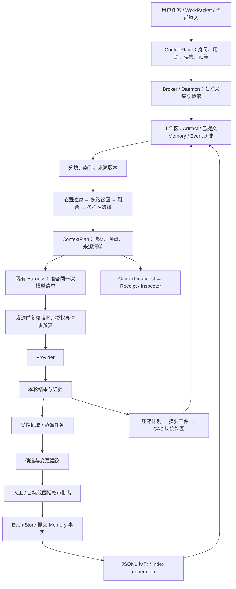

# Roadmap 专项：Context / Memory 专项

> 返回 [Kiana 执行路线图](../roadmap.md) 的总图与当前窗口。本文保留原专项编号、状态、依赖、验收口径和证据限制；专项步骤完成不会自动改变 P 阶段状态。

<a id="context-memory-design"></a>

## 24. Context / Memory 专项：代码设计与完整处理流程（2026-09-12 追加）

> 对应 [module-map.md](../module-map.md) 的第 6 模块。本专项把“本次模型输入”和“跨任务知识”接成可解释、可恢复、可撤销的一条资料处理链。以下是实施设计与验收要求，**不是新增完成声明**；`CM-00`–`CM-39` 初始均为 ⏳，测试名称为待落地的验收目标。

### 24.1 范围、交接与旧计划的修正

按本次用户指示，旧文件中的冻结、只能概要设计、不能扩展、必须停下等限制，如与本专项冲突，不再作为实施阻塞。本次给出完整目标及步骤，包括真实本地 embedding、可用的压缩、记忆治理、后续图检索与扩展资料接入。普通库选择和内部拆分可由实施者按下述合同完成。产品的权限隔离、来源可查、失败可见仍是本次设计本身的要求。

当前 agent 先收口正在执行的切片，再从 `CM-00` 做差异核对。已有代码能满足卡片时补产品链证据即可；存在缺口才修改，不按旧“现状”栏重新写一遍。`CM-*` 是本专项的工作分解号，沿用原 P 单元登记进度，不建立第二套里程碑。

| 原单元 / 已有专项 | 本专项接续范围 | 交接方式 |
|---|---|---|
| `P1-J2-01/03/04`、H20 | 类型化 ContextPlan、角色与资料来源、逐步编译 | CM-01/15/17；复用 PromptBundle、角色包与 ResolvedStepContext |
| `P1-J2-02`、H07/H21、Provider §16 | 最终请求计数、输出预留、稳定前缀 | CM-16/21；模型 profile、wire 编译和 usage 继续由 Provider 专项负责 |
| `P1-J3-01/02` | 候选准入、六层授权、检索与命中收据 | CM-02–06/12/14/22–24/27；保留已有服务端身份派生 |
| `P1-J3-03/04` | 抽取、语义索引与 hybrid | CM-08–12/25；不是用 token-vectors 或 hash embedding 关闭 ONNX 目标 |
| `P1-L4-01`、H30 | 代码快照、repo map、统一检索 | CM-07/13/14；编译器事实与启发式图边分别标记 |
| H15/H22/H23/H24 | 输出外置、真实摘要、压缩提交与恢复 | CM-18–20/29；共用一份 CompactSummary/ContextCheckpoint |
| `P2-K7-01`、CP-06/07/18、CAP-19 | 唯一提交点、来源撤销、删除传播、数据恢复 | CM-04–06/21/28/29；复用现有事务帧、Artifact 和执行监督 |
| `P4-J3-05`、`P4-E-03`、CO-37 | run 教训、已发布决议、跨部门知识交接 | CM-26/36；蒸馏只产候选，组织事实仍来自 Company 对象 |
| `P1-L1-01`、`P1-J8-01`、UI 专项 | 质量评测、Context/Memory Inspector、用户操作 | CM-27/30–32/38/39；同一 protocol/client/DaemonHost |

需要显式纠正的旧设计差异：

1. [2026-09-10 记忆计划](../superpowers/plans/2026-09-10-memory-j3-01-j3-02.md) 把共享模型和打分放进 `kiana-types`；当前 WIP 已把记录放到 `kiana-domain`。本专项保留 domain 合同，将算法归 `kiana-query`，不新建兼容 crate 的业务权威。
2. [旧记忆 spec](../superpowers/specs/2026-09-10-memory-architecture-design.md) 将无来源 v1 默认为 qualified；当前代码缺省为 Unknown/Candidate/Draft。本专项采用显式导入和可追踪人工核准，不能把字段缺失解释成用户批准。
3. 旧 spec 同时称“分层 JSONL 是唯一事实”和“账本写失败不得有状态变化”。本专项明确：**现有 EventStore 的已提交 Memory 事实决定可见性；分层 JSONL 是可重建投影**，受保护的正文先持久保存再提交引用。沿用 JSONL 格式，但不保留两个可独立生效的状态源。
4. 旧卡把 `promote` 混用于“同 collection 准入”和“跨层发布”。本专项区分 `approve_candidate` 与 `publish_to_scope`；跨层形成新目标记录和 `promoted_from`，同范围内容更新才使用 `supersedes`。旧命令保留兼容转换，不能靠命名推断额外权限。
5. 旧文档把每 turn 抽取与 run 终态蒸馏混写。目前 WIP 是终态队列；本专项另补用户 turn 抽取。用户 turn 指一次用户输入到本轮结束，工具/模型 step 不各触发一份抽取。
6. “模型 hash 不符降级”和“hash 不符 fail-closed”旧文案冲突：未配置或部署缺失可按显式策略退到 sparse；**配置完整性不符直接拒绝该检索**。由操作者另行选择 sparse profile 后才能继续，不能静默掩盖损坏。

### 24.2 本次源码核对：可以复用的基础与未闭合的行为

采样基线为 `db77c2485bcafecbb1da17ec57ee509ad2ee32b4` 加共享 WIP，取样时间 `2026-09-12T10:23:59.843507+00:00`。下表是取样源码事实，不把本地源文件存在写成测试通过；旧证据仍只绑定各自快照。

| 代码入口 | 本次看到的基础 | 实施时要补齐的合同 / 验证 |
|---|---|---|
| [domain/prompts.rs](../../kiana-domain/src/prompts.rs) | PromptSection、Product/Context authority、PromptBundle、来源 hash、TokenBudget 已存在 | 缺选材清单、来源版本、生命周期与最终 wire 一致性；UTF-8 字节加常量是估算，不能宣称任意 provider 的精确 tokenizer 或普适硬上界 |
| [query/index.rs](../../kiana-query/src/index.rs) | 文件索引、内容 hash、搜索、pack、artifact/ingest/cache | 索引以文件为主，向量为 64 维确定性 hash；补可追溯 chunk、总扫描上限、授权数据快照及跨索引代际切换 |
| [query/repo_map.rs](../../kiana-query/src/repo_map.rs) | 路径稳定排序、忽略规则、少量符号、token 预算、内容 hash | 当前符号为行文本启发式；`map_file` 全量读文件，输出预算不等于扫描内存预算；补任务相关排序与读取时身份复核 |
| [core/context_query.rs](../../kiana-core/src/context_query.rs)、[daemon/context_query.rs](../../kiana-daemon/src/context_query.rs) | context 命令经授权转 broker；读操作与 cache/ingest 写操作有区分 | 复用这条路径做自动选材；补 typed scope/read set、取消和 freshness，不能在 Harness 内直接扫描工作区 |
| [domain/memory.rs](../../kiana-domain/src/memory.rs) | v2、Unknown、candidate/qualified/ephemeral、revision、CJK 分词；hit 的 `verified=false` | 缺类型化主体/逻辑 scope、完整敏感标签、purpose/有效期、来源依赖；admission 与业务状态组合须有一个合法性检查 |
| [daemon/harness_memory.rs](../../kiana-daemon/src/harness_memory.rs) | 模型写入 candidate；scratch 即时可见；人工 review、revision 检查、文件锁及 sync；v1 不默认提升 | 写文件和外层结果事件不是同一提交点；批量 proposal 可多次 append；补操作幂等、原子批次、跨层发布和崩溃对账 |
| [daemon/memory_retrieval.rs](../../kiana-daemon/src/memory_retrieval.rs) | BM25+CJK、cosine、RRF60、MMR0.7；manifest/hash 检查和可见降级 | dense 是加载 JSON token-vectors 后求和归一化；无 ONNX 推理。每次检索重分词/嵌入记录，缺可复用版本化索引；空结果也须返回降级状态 |
| [core/memory_proposals.rs](../../kiana-core/src/memory_proposals.rs)、[core/memory_distillation.rs](../../kiana-core/src/memory_distillation.rs) | 来源事件、终态排队、CAS claim、内部模型 run、引文校验、人工接受候选 | 已有 [本地蒸馏说明](../local-memory-distillation.md)；补每 turn 捕获、持久调度限额、失败重试语义、跨进程验收与抽取质量评测 |
| [runner/compact.rs](../../kiana-runner/src/compact.rs)、[runner/harness.rs](../../kiana-runner/src/harness.rs) | 保留 system 和最近 user，记录 compact 元数据，模型前做预算校验 | 当前丢弃 assistant/tool 历史并放 `(no summary available)`；缺真实工作摘要、近期调用配对、源 cursor/CAS 与删除失效 |
| [core/receipts.rs](../../kiana-core/src/receipts.rs) | 从 capability 完成事件折叠 memory_hits 并关联 retrieval_event_id | 检索命中不等于最终请求采用；补 retrieved/selected/sent/cited 的区别和有权限的引用解析 |
| [daemon/data_governance.rs](../../kiana-daemon/src/data_governance.rs) | 撤销策略与清理代码已存在 | 当前有 `source.contains` 判定、宽范围 purge 和 JSONL 原地截断；补精确 SourceRef 依赖图、可恢复删除作业，禁止把它当作已完成选择性删除证明 |

### 24.3 reference 全目录覆盖与取舍

本次重新枚举得到 **72 个非隐藏项目目录 + 1 个 `.claude-flow` 运行资料目录 = 73 个目录**。另有 `COMPANYOS-REFERENCES.md`、`agentdb.rvf`、`agentdb.rvf.lock`、`ruvector.db` 四个顶层文件；数据库/运行资料只登记，不把内容当成源码或质量证据。覆盖指目录、README 与候选入口筛查；下节列出定向阅读的关键源码，未声称逐行审计 73 个目录。

| 类别 | 本次纳入的全部项目目录 | 对本专项的用途 |
|---|---|---|
| coding context / runtime（14） | `aider`、`codex`、`continue`、`cline`、`Roo-Code`、`roo-code`、`opencode`、`goose`、`pi`、`deepseek-harness`、`grok-build`、`crush`、`mini-swe-agent`、`strix` | 历史表示、预算、压缩切点、代码资料与工具结果回取 |
| 长期记忆（9） | `MemPalace`、`memorix`、`mem0`、`graphiti`、`claude-memory`、`claude-mem-candidate`、`letta-code`、`letta`、`letta-oss` | 分层、抽取、相似旧记录、冲突、时间有效性、用户记忆 |
| RAG / 代码图（5） | `llama-index`、`GitNexus`、`graphify`、`Archon`、`Archon-Knowledge` | ingestion、chunk/metadata、增量失效、符号/依赖/来源图 |
| Agent 框架（13） | `langchain`、`langgraph`、`adk-python`、`openai-agents-python`、`agent-framework`、`autogen`、`agno`、`crewAI`、`agency-swarm`、`MetaGPT`、`ChatDev`、`OpenHands`、`pydantic-ai` | session state 与 memory 分开；component/port 组织和上下文编辑 |
| 编排 / 任务 / 隔离（11） | `ruflo`、`beads`、`gastown`、`architect-loop`、`claude-task-master`、`gpt-pilot`、`orca`、`herdr`、`emdash`、`temporal-sdk-python`、`container-use` | 有界后台任务、fresh context、任务状态交接、恢复与索引工作区隔离 |
| 方法 / 技能 / 文档（14） | `12-factor-agents`、`ai-coding-guide`、`awesome-agent-skills`、`ECC`、`everything-claude-code`、`get-shit-done`、`gsd-core`、`gstack`、`OpenSpec`、`planning-with-files`、`pm-skills`、`skills`、`spec-kit`、`superpowers` | 工作记录的组织和渐进加载；这些文档不会自动成为 Kiana 的运行状态或授权来源 |
| 协议参考（2） | `a2a`、`mcp-servers` | 外部资料/resource 作为带来源的数据；MCP memory server 不能替代本地治理 |
| 特殊源码资料（3） | `claude-code-main (2)`、`claude-code-rev-main`、`claude-code-rust` | 目录/公开行为对照，未使用还原源码作为待复制实现 |
| 空资料目录（1） | `promptfoo-full` | 本次目录无可读项目文件、无独立 git HEAD；其 git 命令可能向上找到 Kiana，不能误记为参考项目提交 |

去重与版本漂移：`Roo-Code`/`roo-code` 的 HEAD 同为 `b867ec914575`，`letta`/`letta-oss` 同为 `4511fa0bc91f`，`claude-memory`/`claude-mem-candidate` 同为 `1f1c13c981a7`，各计一个来源而非两个独立佐证。`letta` 当前是导向 letta-code 的页面；`MemPalace` 当前是 TypeScript 移植版；`Archon` 当前是代码影响分析项目，知识/工作流项目是 `Archon-Knowledge`；`OpenHands` 当前 README 为 Agent Canvas。旧审计中的路径只能当线索。

### 24.4 重点实现与外部项目研究结论

| 参考快照 / 实际入口 | 采用的机制 | Kiana 的具体处理 |
|---|---|---|
| Aider `5dc9490bb35f`：[repomap.py](../../reference/aider/aider/repomap.py) | tree-sitter 符号、引用图排名、按预算选择 map | CM-13：优先明确路径和符号，再补依赖邻域；标明 parser/hash，未解析边不伪装成编译器事实 |
| Continue `5522c6f44ca0`：[refreshIndex.ts](../../reference/continue/core/indexing/refreshIndex.ts) | 以目录、branch、artifact/cache key 维护增删改 | CM-07/11：branch 只是标签，实际身份还绑定 worktree 内容与 dirty overlay，避免同分支两工作树共享陈旧内容 |
| Codex `d6489472f3c1`：[history.rs](../../reference/codex/codex-rs/core/src/context_manager/history.rs)、[normalize.rs](../../reference/codex/codex-rs/core/src/context_manager/normalize.rs) | 版本化历史，裁剪时处理 call/output 配对，归一化模型视图 | CM-18–20：近期完整调用组保留；被裁剪组以结构化引用表示，执行事实仍在账本 |
| OpenCode `d6855b6b47a8`：[compaction.ts](../../reference/opencode/packages/core/src/session/compaction.ts) | anchored summary、旧摘要与新对话合并、输入输出余量 | CM-19/20：覆盖范围和新输入 CAS 必须保留；当前真实路径为 `packages/core`，不沿用旧 `packages/opencode` 链接 |
| Goose `5e90925962f0`：[structured.rs](../../reference/goose/crates/goose-context-management/src/structured.rs)；Pi `96617628e852`：[compaction.ts](../../reference/pi/packages/agent/src/harness/compaction/compaction.ts) | 结构化目标/文件/未完任务；压缩切点和近期窗口 | CM-19：摘要要能恢复任务；保留拒绝、Unknown、验证失败，不能只保留“完成内容” |
| DeepSeek Harness `c389f96bf3a9`：[spill.ts](../../reference/deepseek-harness/packages/context/session-reference/src/spill.ts) | 有界预览关联完整会话资料引用 | CM-18：工具输出只给必要预览，完整资料通过有权限的分页引用回取 |
| Memorix `3a5a3c700e4d`：[context-assembly.ts](../../reference/memorix/src/knowledge/context-assembly.ts)、[context-receipt.ts](../../reference/memorix/src/knowledge/context-receipt.ts) | 选中/省略/治理理由、freshness、诊断收据 | CM-15/27/30：让操作者看得见为什么提供某项资料；诊断本身不重复塞进模型上下文 |
| Mem0 `dae67f74f5cc`：[memory/main.py](../../reference/mem0/mem0/memory/main.py) | 当前 `_add_to_vector_store` 是 additive 分阶段批处理：先找旧记忆、一次抽取、batch embed、hash 去重 | CM-25：借鉴候选生成和服务端 ID 映射；不把老版 ADD/UPDATE/DELETE 抽取叙述套到此快照，也不让模型自己提交修改 |
| MemPalace `000524b111e7`：[vector.ts](../../reference/MemPalace/src/storage/vector.ts)、[types.ts](../../reference/MemPalace/src/core/types.ts) | 本地分类抽屉、批量 embedding、LanceDB 检索 | CM-36：用户能整理、预览和纠正知识；wing/room 是组织方式，不等同六层 ACL |
| Letta Code `6bc41be9f4a9`：[memory-filesystem.ts](../../reference/letta-code/src/agent/memory-filesystem.ts)、[memory-constraints.ts](../../reference/letta-code/src/agent/memory-constraints.ts) | 明确 memory 文件区、树预览、文件预算 | CM-36：常用偏好以有界投影加载；模型编辑私有文件不直接改可信 system/角色规则 |
| Graphiti `b943c9e8486c`：[edges.py](../../reference/graphiti/graphiti_core/edges.py)、[search.py](../../reference/graphiti/graphiti_core/search/search.py) | group 过滤、episode 来源、valid/invalid/expired 时间及多路检索 | CM-03/24/33：写入时间与事实有效时间分开；“现在是什么”和“过去是什么”显式查询 |
| Ruflo `a295c6870315`：[hybrid-backend.ts](../../reference/ruflo/v3/@claude-flow/memory/src/hybrid-backend.ts)、[consolidator.ts](../../reference/ruflo/v3/@claude-flow/memory/src/consolidator.ts) | 存储适配、检索路由、去重整理 | CM-04/24/37：借鉴组件分工；其并行 dual-write 不能证明跨存储原子性，跨 namespace 去重也不能直接用于私有记忆 |
| Claude Memory `1f1c13c981a7`：[search.py](../../reference/claude-memory/src/claude_memory/search.py) | FTS5、语义可选、RRF 与回退 | CM-12：各通道评分可解释，零命中也带健康/降级信息，不能把故障变成普通空列表 |
| LlamaIndex `d2ac544a27c7`：[pipeline.py](../../reference/llama-index/llama-index-core/llama_index/core/ingestion/pipeline.py)、[schema.py](../../reference/llama-index/llama-index-core/llama_index/core/schema.py) | transformation hash、doc/chunk 来源、送入 LLM 与 embedding 的 metadata 分离 | CM-08/11：正文版本和转换器版本都进 key；私有治理字段不直接成为 embedding 文本 |
| LangGraph `81bf17b23123`：[store/base](../../reference/langgraph/libs/checkpoint/langgraph/store/base/__init__.py)；LangChain `e670c7a03ba3`：[context_editing.py](../../reference/langchain/libs/langchain_v1/langchain/agents/middleware/context_editing.py) | namespace/key/TTL 与会话 checkpoint 分离；按调用组清理旧结果 | CM-03/18/29：TTL 是否随读取续期由显式 retention 策略决定；namespace 字符串不是身份认证 |
| ADK `b0180620f4c2`：[base_memory_service.py](../../reference/adk-python/src/google/adk/memory/base_memory_service.py)；Agents SDK `f355af660416`：[session.py](../../reference/openai-agents-python/src/agents/memory/session.py) | 记忆服务与会话历史接口分别建模 | CM-01/14：只统一检索输出，不把事件事实、会话历史和长期记录揉成可任意覆盖的同一表 |
| GitNexus `b1d87c1f33d7`：[pipeline.ts](../../reference/GitNexus/gitnexus/src/core/ingestion/pipeline.ts)；Graphify `67f99bd0059d`：[detect.py](../../reference/graphify/graphify/detect.py) | 分阶段代码分析、增量检测及解析版本 | CM-13/33：先符号/引用等确定性关系，再做有证据的知识扩展 |
| MCP Servers `d73f99efbfd4`：[memory/index.ts](../../reference/mcp-servers/src/memory/index.ts) | entity/relation/observation 的简单持久化接口 | CM-35：作为外部资料适配输入；不能因同名 memory 工具而取得 Kiana 的审批或内部存储权 |

另核对以下官方项目/资料（访问日 2026-09-12）；这些用于形成 Kiana 的设计判断，不是已经安装的依赖或 Kiana 的性能证明：

| 外部一手资料 | 得到的设计判断 |
|---|---|
| [Qdrant Hybrid Queries](https://qdrant.tech/documentation/search/hybrid-queries/)、[Filtering](https://qdrant.tech/documentation/search/filtering/) | 各路先限制候选，显式融合/重排；不要假设数据库默认 RRF 参数等于本项目的一基排名 `1/(60+rank)`，适配器必须归一化 |
| [Haystack DocumentJoiner](https://docs.haystack.deepset.ai/docs/documentjoiner) | 检索器与融合组件分开；候选去重、权重和 top-k 作为版本化策略，算法可独立评测 |
| [FastEmbed-rs](https://github.com/Anush008/fastembed-rs) | Rust 本地 ONNX/Tokenizer 接入候选；其默认首次使用会下载模型，Kiana 需独立预置包和禁止运行期隐式下载的装配，不照抄默认初始化 |
| [LightRAG](https://github.com/HKUDS/LightRAG) | 图的增量更新/选择性删除需要追踪原文贡献并重建受影响关系；“删除向量”不足以完成知识删除，图能力排在来源依赖闭环之后 |
| [Anthropic Context Engineering](https://www.anthropic.com/engineering/effective-context-engineering-for-ai-agents) | 结合少量预取和按需回取；压缩保留续作所需信息，工具结果清理与长期笔记分别治理。具体窗口/预算按 Kiana 评测决定 |

### 24.5 整体代码结构与共同契约

Context 是**本次请求使用的资料投影**；Memory 是**具有生命周期的跨任务知识**；repo index 是**工作区内容的派生检索结构**；compaction 是**历史视图的有损压缩**。四者共享来源、权限、版本和预算合同，各自保留自己的状态语义。



以下是目标模块职责，文件名可按现有布局调整；引用已有类型必须复用，不创建另一套同义 ID、预算或恢复对象。

| 所属 | 应当拥有的内容 | 接缝 |
|---|---|---|
| `kiana-domain` | `SourceRef`、`SourceSnapshot`、`MemoryScope`、版本化记录、Query/Hit/ContextPlan/CompactSummary 的值对象与不变量 | 扩现有 `memory.rs`、`memory_proposals.rs`、`prompts.rs`，新增纯合同 `context.rs`/`knowledge_sources.rs`；算法从 domain 移出时保留薄兼容 re-export |
| `kiana-ports` | 资料读取、检索、embedding、派生索引与受保护正文的接口 | 建议 `ContextSourcePort`、`RetrievalPort`、`EmbeddingPort`、`DerivedIndexPort`；参数接收服务端授权 scope，不接受模型自填身份作凭证 |
| `kiana-query` | scanner 的纯转换、chunker、tokenizer、BM25/dense/RRF/MMR、repo map、pack 选择 | 将算法按 `sources/chunks/retrieval/context_plan` 等职责分开；只接获准数据/句柄，不持有审批或启动 Agent 的权力 |
| `kiana-core` | scope 派生、Memory 变更准入与提交、审批、抽取任务状态、数据撤销 | 新能力沿现有 `context_query`、`memory_proposals`、`memory_distillation`、`data_governance` 接入；提交复用 EventStore/TransitionBatch |
| `kiana-daemon` | 路径解析、文件句柄、正文存储、模型装配、索引 generation、blocking worker、服务注册 | 扩 `harness_memory`/`context_query`/`memory_retrieval`，把直接环境读取变成组合根生成的不可变配置 |
| `kiana-runner` | 每 step 使用 ContextPlan，编辑历史、请求压缩、把结果回灌到当前 run | 复用 H20–H23 的状态机；不新增自身的 Memory 存储、扫描器或检索授权 |
| `kiana-eventlog` | 已提交变更、事务/CAS/幂等、Memory/Context 的只读投影 | 记录 mutation/selection/compaction 引用；索引进度、UI timeline 不充当事实 |
| `kiana-protocol` / client / entrypoints | 查询、解释、候选审阅、纠正、删除、索引状态 DTO | CLI、Workbench、Web、Desktop 调同一个服务；旧 memory CLI 转成协议请求 |

共同数据合同（示意字段，不是假称已有的 Rust API）：

```text
SourceRef {
  source_id, source_kind, scope_id, revision, content_digest,
  locator: File{workspace_id,path,byte_range,line_range}
         | Event{stream,aggregate_id,cursor,event_id}
         | Artifact{id,version,range} | Memory{id,revision},
  authority_label, sensitivity_labels, purpose, retention_policy,
  observed_at, valid_from?, valid_to?, derived_from[]
}
SourceSnapshot {
  workspace_id, head?, dirty_manifest_hash, source_versions[],
  memory_partition_cursors[], policy_epoch, data_epoch,
  parser_version, tokenizer_version, embedding_model_digest?, index_generation
}
MemoryScope {
  owner_principal, company_id?, project_id?, workspace_id?,
  layer, collection_id, department_id?, role_id?, packet_id?, session_id?
}
RetrievalRequest { query, source_kinds, requested_scope_subset, purpose,
                   as_of?, budget, cursor?, algorithm_profile }
RetrievalResult { status, snapshot, hits[], degraded_reasons[], next_cursor?, trace_id }
RetrievalHit { source_ref, bounded_excerpt, rank_components, freshness,
               evidence_status, derivation_refs[], estimated_tokens }
ContextPlan { context_revision, run_id, turn_id, step_id, source_snapshot,
              required_sections[], selected_refs[], omitted_reasons[],
              retrieval_trace_ids[], budget, request_digest }
```

`SourceRef` 指向确切版本，path/URI 只是定位信息，不是身份或权限。`MemoryScope` 的逻辑归属与物理 home/project 路径分开；同一主体跨项目的 user 偏好是显式 scope，不从 `project_root` 子串推出共享权限。六层保留，packet/private 等作为受控访问标签，不额外虚构第七个持久存储层。

**统一可见性谓词**：有效身份和 knowledge/read grants ∩ 请求的范围 ∩ 项目/部门/角色/packet/session 约束 ∩ purpose/敏感性处理许可 ∩ 准入与状态 ∩ 有效期 ∩ 未撤销来源。collection 标签不能代替逐记录过滤。读集与写集分开：获准读依赖库不等于获准修改；不能把 packet 写集机械地拿来裁掉全部合法读取。

敏感性/部门/角色不是一个可按大小比较的等级数；例如 `role:reviewer` 和 `department:planning` 是不同 compartment。搜索、candidate 审阅、引用回取、索引构建、自动预取、摘要恢复和 UI 展示使用同一个 scope resolver。查询也需要限制输出与使用预算，但不会因此得到执行写入的权限。

### 24.6 采集与索引：从真实资料到可复用候选

1. **登记来源与用途**：输入区分工作区文件、已发布业务工件、事件片段、已核准记忆、用户显式导入、connector 资料。project trust 只决定能否加载项目指令；逐资料的读取/处理/外发还看 scope 和 purpose。索引本身的写入使用服务管理目录权限，不借用户 packet 扩大写集。
2. **取得有界快照**：先记录工作区身份和 git/dirty manifest，再用获准句柄读取；文件读取前后核对身份与 digest。ignore/大小/编码/数量/总字节/耗时/深度均受限，symlink、hardlink、路径替换按 CAP 的 resolver 处理。watcher 只是更新提示，不是 fresh 的证明；同 mtime 不同内容也必须发现。
3. **规范化与分块**：UTF-8、换行和 BOM 的转换保留 offset map；代码优先按符号/作用域，Markdown 按标题/段落，超大块再切有界 token 窗口，未知格式明确 fallback。chunk 保存 `source_id + revision + parser/chunker版本 + range + digest`、父/前/后引用。重叠块不能被当成独立证据重复加权。去除/掩码敏感内容后产生新的转换版本，不伪称与原文 digest 相同。
4. **生成派生结构**：路径/符号 exact index、BM25 posting、dense vectors、repo graph 共享该 generation 的 source manifest。向量的输入明确由哪些正文/metadata 组成；来源许可、审批 actor、内部地址等不会无意进入 embedding 文本。
5. **准备 generation**：后台任务按源版本去重，生成临时段、数量与校验和；写全并同步后原子切换 manifest 指针。读者固定旧 generation 或新 generation，不能同时用新 BM25 文档和旧 dense ID。索引不完整时不提前声明 ready。
6. **跟进变化**：按内容 hash 计算 added/changed/deleted/renamed，更新有关 chunk；branch/worktree 切换产生新快照。撤销 epoch 立即阻止读取，不等待慢速重建完成。失败索引可以重建，资料已丢失不能被“索引恢复”伪装成找回原文。

第一版继续用 JSONL 事实/投影和可重建本地派生索引；精确 cosine 作为质量基准。ONNX adapter 优先评估 FastEmbed-rs/ort 的本地包接口，manifest 钉住权重、tokenizer、配置、pooling、query/document prefix、量化方式、维度、归一化、运行库与 provider/device。离线缺包是明确的模式/降级状态，运行中不隐式下载。fixture/hash/token-vectors 只证明路由和算法，不能证明语义召回质量。

### 24.7 检索与每轮上下文组装

1. core 用当前身份与请求目的生成不可伪造的 read scope，未知 collection/撤销/过期先拒绝。**可见性过滤发生在召回与排名前**；不能先从全库取 top-k 再丢弃越权结果。稀疏统计也按可见语料计算或使用明确的安全分区，避免私有语料影响可见分数/解释。
2. 精确 ID/path/symbol 定位、BM25 与 dense 各返回有界候选；不为了搜索每次嵌入全库。CJK 分词、英文、snake/camelCase、错误码和路径有固定版本；exact 引用失败返回失效原因，不拿“最像的另一个文件”代替。
3. 默认 sparse/dense 使用一基排名 RRF：`sum(weight / (60 + rank))`，固定 tie-break 为 scope/source/revision/chunk ID。MMR 在融合候选中作多样性选择，初始 λ=0.7；余弦与 BM25 原始分数不直接相加。权重、候选数、重排阈值都是版本化参数，不声称默认值最佳。
4. 权威/有效期/当前版本先做资格和显式优先序，相关性在合格集合内排序。低相关时允许 `no_match`；和 `degraded`、`unavailable`、`denied`、`cancelled` 分开。上下文预算不足可省略可选检索，但必需证据缺失时返回 `required_source_unavailable`，不能静默作答。
5. 先候选、再 pack：按确切 source 合并重叠范围，限制每文件/record 占比，按相关段落扩展父/邻块。初始 profile 可取每路 64 候选、最终 8 hit、同来源最多 3 chunk，**这只是评测起点**。excerpt 必带 source ref 和省略标记；完整正文按授权范围分页获取。
6. 每个用户 turn 开始构建当前输入、工单/角色、可信规则、近期历史、有效摘要与获准检索。step 间可复用仍有效候选，但在每次发送前检查 scope、源版本和数据 epoch。自动预取与显式 `memory.search` 共用检索服务；自动预取生成同样的授权/检索记录，不偷偷往 system prompt 塞结果。
7. 生成 `ContextPlan` 的选材 manifest 与不可变 `PreparedModelRequest`，携带 provider/model/profile、角色包、tool catalog、wire/request hash；预算与真正发送使用同一编译结果，不在两处重新读 env/配置。
8. 在 core 的发送准入点按最新 epoch/取消状态串行确认并记录所用 context revision，再发起模型 I/O。撤销先于该点则不发送；若发送已先发生，记录 exposure 并取消后续工作，不能承诺收回 provider 已接收的数据。

模型可见资料使用 provider 中立的 `RetrievedData`/tool-result 内容段，与用户真正输入、产品 system 分开；字符串包上标签不足以保证边界，编码层不能把低信任段重分类成 system。检索资料只提供知识，包含的“忽略规则/执行命令”不改变授权。

“本回合注入，下回合重查”的落地：标记每个检索内容的 `turn_id + retrieval_id + validity`，下个用户 turn 编译历史时移除旧正文，以类型化过期引用占位并保留合法 call/result 配对；确有需要重新取当前版本。旧 raw hit 仍可在有权限的审计视图查到，但不会因为还在 transcript、checkpoint 或 summary 里自动重新注入。每 step 不必无意义地重复相同查询。

### 24.8 记忆写入、核准、更新与学习

记忆的内容类别（working/episodic/semantic/procedural/preference/decision/lesson）与六层位置、敏感标签、origin、admission、业务有效状态分别建模。`qualified` 说明通过准入；来源可指认只说明有出处；`verified` 必须绑定独立证据结论，三者互不推出。

| 输入 / 动作 | 默认结果 | 额外条件 |
|---|---|---|
| 模型直接 `memory.write` 到持久层 | candidate + draft；默认检索不见 | 服务端派生 origin/actor/scope；模型提供的 source 字符串只是声明，不能替代核验的 EvidenceRef |
| 模型写 instance scratch | ephemeral、同 session 可检索 | 仍受读写 scope、大小/数量/TTL/取消约束；退出/退休显式清理，重启不无限延长 |
| turn 抽取 / run 蒸馏 / hook 建议 | 有 evidence 的 candidate 或明确 no-op | 提案可建议 ADD/UPDATE/DELETE；不存在“自动批准模型建议” |
| 人工直接记录 | 按人工写入策略和来源类型准入 | `origin=user` 不是通用绕过；没有 review 证据仍不能标为事实已验证 |
| 同 collection 核准候选 | 追加批准事实，成为 qualified/active | 绑定内容 digest、revision、用途、来源版本及目标 scope；作者和审批者身份分开 |
| 跨层/跨 project 发布 | 新目标记录 + `promoted_from`/派生引用 | 明确目标 owner 审批和敏感信息转用许可；源记录不删除，目标 grant 单独推导，不并入源权限 |
| user-private | 仅在有读取/处理许可时创建或展示候选，人工核准 | 普通模型写入口默认保持拒绝；跨项目偏好只在明确授权后生成必要子集 |

**统一提交顺序**（同样用于直接写、审批、批量接受、更新和删除）：

```text
标准化 MemoryMutation（mutation_id、expected revisions、scope、evidence）
  → 预检全部目标、完整验证提案与审批 subject
  → 准备受保护不可变正文（完整写入、digest、同步；未提交不可查询）
  → core 复核 scope/来源 epoch/审批，并以现有事务帧 CAS
     原子提交 Memory 事实 + 审批消费/幂等结果（唯一生效点）
  → JSONL / Index 投影追到 committed cursor
  → 返回 committed_revision + projection_pending? + 可追溯回执
```

不能用“先 append 记录再尽力记录 event”实现原子性。事务内记录正文引用，正文不是第二个可批准状态源；未引用正文按 GC 回收。提交后投影失败，操作仍是 committed，可读路径追赶到最低 cursor 或返回 `index_not_ready`；不能改说失败并重做。提交点无法判定时返回 result_unknown，按 mutation_id 对账，禁止换 ID 盲重试。批量 proposal 同一批全成或全不成；跨 scope 事务如底层不支持，则拆成用户可见的独立批准动作，不能标为一次原子发布。

UPDATE 校验目标确切 revision 并生成 successor；DELETE 保留最小 tombstone，正文删除另走治理任务。`supersedes` 只处理同 scope 的版本替代；`derived_from`/`promoted_from` 跟踪跨来源依赖。相同文本去重必须至少含 scope、kind、purpose、有效时间、来源版本；跨用户私有记录不能通过去重结果泄露存在性。语义相似只生成合并建议，不能自动删除独立证据。

冲突不靠“最新写入获胜”掩盖：两个仍有效但互斥的事实保留 conflict set；处理后附决议引用。记录 `recorded_at` 与 `valid_from/valid_to`，用显式 `as_of` 查历史。检索默认排除未生效、失效、撤销、已替代项；必要历史查询仍受**当前**权限约束，旧快照不恢复旧权限。

抽取任务以 `(source run, user turn, source cursor, extractor profile)` 去重。终态蒸馏另以 source event/job ID 去重，不被自己触发递归。任务先持久入队，通常不延迟用户已完成 turn 的响应；由同一 ControlPlane/Harness/Provider 驱动有界内部 run，tools 为空、不装无关 project skill，预算计入当前主体/项目的学习额度。任务失败产生 incident，可重放 finalize；取消或结果未知不能推断成“验证成功”。`quote` 必须从服务端提供的 source slice 核验，ID、range 和 digest 一同验证；抽取质量还要单独评测。

### 24.9 Compaction、Context Editing 与恢复

压缩不是 Memory promotion，也不是删除 EventLog；Context editing 只清理可重新取得的低价值展示数据。压缩前把大工具输出转成有权限的 artifact ref，保留摘要/分页读取能力和 digest。切点必须位于完整 turn 或完整 tool call/result 组之间；若无法完整配对，就保留整个组或暂停。

`CompactSummary` 最少包含：目标、约束、已确认决定、已完成动作、验证引用、改动文件及 workspace revision、失败/Unknown、未完成事项、下一步、覆盖 event cursor、来源 hash、生成 profile/prompt hash、token 统计、失效 epoch。摘要模型只能引用输入中的 event/source refs；它不能新增完成、审批、文件变化或记忆事实。摘要无效时保留旧视图，受限重试一次；再失败且请求仍超限则返回 `context_budget_exceeded`，不拿占位摘要继续改盘。

压缩提交采用 `artifact write+sync → manifest/CAS commit → active-view switch → receipt`；新 Inbox 输入不在摘要覆盖范围内。恢复按 EventLog、ContextCheckpoint、当前 policy/data epoch 和 source snapshot 重建；provider cache 仅优化同一 prepared request，不能被用作恢复或越权。来源撤销/删除后，相关摘要、cache key、检索 hit 和 UI 选材都标记 invalid 并重新编译；已有 provider exposure 不可回收，只能产生审计事件。

### 24.10 评测、失败语义和可观测性

每条 selection 记录 `source_ref / snapshot / reason / freshness / trust / estimated_tokens`；每条 omission 记录 `token-budget / task-lens / unavailable / denied / stale`。收据同时区分 `retrieved`、`selected`、`sent`、`cited`；“检索到”不表示“模型看到了”，更不表示“答案已验证”。Inspector 默认只展示脱敏的 manifest、计数和摘要，不把隐藏 reasoning、私有正文或 provider secret 回显。

必须分别测试：无命中、越权、候选污染、过期、撤销、embedding 缺失、manifest hash 错、索引 generation 不一致、chunk 版本漂移、摘要伪造、摘要提交崩溃、Memory/Index 投影落后、重复 mutation、同文本跨 scope、路径替换、Unicode/CJK、预算不足、取消和 result_unknown。每种故障写清 `status`（denied/unavailable/degraded/stale/unknown/cancelled）和是否可安全重试；不能用空数组代替所有失败。

质量评测分开测 exact identifier、代码符号/路径、中文/英文自然问题、时间查询、跨层 ACL、freshness、重复/冲突、撤销后不可见、摘要后任务连续性。记录 Recall@k、MRR/nDCG、source citation precision、越权零容忍、p50/p95 延迟、索引重建时间、预算超界率、摘要后重复副作用率；fixture embedder 只测确定性，不替代真实模型的语义质量评测。建立 golden trace 时冻结 source snapshot、policy/data epoch、index generation、model/embedding digest 和算法 profile。

### 24.11 Context / Memory 详细实施步骤（CM-00–CM-39）

顺序不是并行许可；每张卡完成“红测试 → 最小实现 → 聚焦测试 → 相关回归 → 证据块 → roadmap/CURRENT_STATUS 回填”后才进入下一个依赖。可在不改变共享 manifest/lockfile 的情况下并行只读调研；涉及 schema、事务或同一文件的实现由一个写者串行完成。

#### 基线、合同与授权（CM-00–CM-06）

<a id="step-cm-00"></a>


##### CM-00 · 固定源码快照、差异与证据边界　⏳

记录 HEAD、dirty 状态、WIP 文件摘要、参考目录 inventory、关键入口行号和本卡前已有测试。把 `CURRENT_STATUS.md` 历史证据与当前 WIP 分开；不因源文件已有类型提升状态。验收：`context_memory_baseline_is_reproducible`、`reference_inventory_covers_all_directories`。

<a id="step-cm-01"></a>


##### CM-01 · 建立共享来源与 scope 值对象　⏳

在 domain 定义 `SourceRef/SourceSnapshot/MemoryScope/Purpose/Freshness/EvidenceStatus`，明确序列化版本、未知字段、digest、cursor 和 locator；为现有 MemoryRecord/ContextArtifact/PromptSection 提供转换。拒绝从字符串路径、模型 arguments 或 collection 名推导 principal。验收：`source_refs_roundtrip_and_reject_missing_identity`、`scope_resolution_never_uses_model_principal`。

<a id="step-cm-02"></a>


##### CM-02 · 统一 MemoryRecord 生命周期与兼容导入　⏳

补 `kind/purpose/sensitivity/validity/retention/evidence/dependencies` 合同；把旧 v1 行走显式 `legacy_import`，origin Unknown、provenance unverifiable，不能默认 approved/verified。区分 admission、review、state、provenance。验收：`legacy_memory_is_unverifiable_until_reviewed`、`invalid_admission_state_combination_is_denied`。

<a id="step-cm-03"></a>


##### CM-03 · 服务端派生 read/write scope 与 purpose　⏳

由 core 的 authenticated context、project trust、role/department、packet/session、processing grant 派生逻辑读集和写集；调用方只提供意图和范围请求。未知 scope、跨项目 user-private、过期授权 fail-closed。验收：`read_scope_is_intersection_of_all_grants`、`write_scope_cannot_be_widened_by_context_text`。

<a id="step-cm-04"></a>


##### CM-04 · 统一 Memory mutation 与幂等键　⏳

定义 ADD/UPDATE/DELETE/APPROVE/PUBLISH/EXPIRE/REVOKE 的规范 mutation，绑定 expected revision、scope、evidence、policy/data epoch、actor 和 idempotency key；先预检全部目标。验收：`duplicate_memory_mutation_returns_original_receipt`、`stale_revision_never_last_write_wins`。

<a id="step-cm-05"></a>


##### CM-05 · EventStore 唯一提交点与 JSONL/index 投影　⏳

把 memory facts、review decision、正文引用和 projection cursor 纳入现有事务/CAS；投影重放可重建，投影落后返回可解释状态。覆盖崩溃前后、账本失败、重复提交和 torn tail。验收：`memory_commit_has_no_unjournaled_visibility`、`projection_rebuild_matches_committed_memory`。

<a id="step-cm-06"></a>


##### CM-06 · Source dependency graph 与治理 epoch　⏳

记录 Memory→Evidence→Event/Artifact/File、ContextPlan→Memory/Index、Summary→Event/Plan 的依赖；撤销/删除/过期更新 data epoch，所有派生物可查询影响范围。验收：`revoking_source_invalidates_all_derived_context`、`unrelated_scope_is_not_invalidated`。

#### 采集、分块与代码上下文（CM-07–CM-14）

<a id="step-cm-07"></a>


##### CM-07 · Workspace/artifact snapshot 与安全读取　⏳

复用 PathResolver、trust、hardlink/symlink 检查，生成 dirty manifest 和 per-file digest；读取前后核对 file identity，限制总字节、文件数、深度和时间。验收：`workspace_change_between_scan_and_read_is_fenced`、`untrusted_project_resources_are_not_indexed_as_instructions`。

<a id="step-cm-08"></a>


##### CM-08 · 稳定 chunker 与 offset provenance　⏳

代码按符号/作用域，文档按标题/段落，超大内容按有界窗口；保存父邻接、byte/line 范围、parser/chunker 版本和转换 digest。验收：`chunk_ranges_reconstruct_source`、`overlapping_chunks_do_not_double_count_evidence`。

<a id="step-cm-09"></a>


##### CM-09 · 文本规范化、语言和敏感数据边界　⏳

固定 Unicode/CJK/identifier tokenization、BOM/换行策略；扫描密钥/PII 后按策略拒绝、脱敏或只保存引用，embedding metadata 与 LLM metadata 分开。验收：`normalization_is_deterministic_for_unicode_and_cjk`、`secret_never_enters_index_or_embedding`。

<a id="step-cm-10"></a>


##### CM-10 · ContextIndex generation 与原子切换　⏳

把 repo map、exact index、BM25、dense index 绑定同一 source manifest/index generation；临时构建、sync、checksum、原子 manifest switch，失败保留旧 generation。验收：`readers_never_mix_index_generations`、`failed_rebuild_keeps_last_ready_generation`。

<a id="step-cm-11"></a>


##### CM-11 · 增量更新、rename/delete 与缓存失效　⏳

按 content hash + identity 识别 add/change/delete/rename；缓存 key 含 root/worktree/branch/dirty manifest/parser/chunker/config。删除和撤销产生 tombstone/invalid generation，不能仅靠 mtime。验收：`changed_file_invalidates_only_affected_chunks`、`deleted_source_is_absent_after_rebuild`。

<a id="step-cm-12"></a>


##### CM-12 · 统一 sparse/dense/RRF/MMR 检索器　⏳

把 daemon 当前 rank_records、CLI 搜索和 query index 的算法归到一个 `RetrievalPort` 实现；先 ACL 过滤，再 exact/BM25/dense，RRF60、MMR、稳定 tie-break 和版本化 profile。验收：`cli_and_memory_tool_have_identical_rankings`、`acl_filter_happens_before_ranking`。

<a id="step-cm-13"></a>


##### CM-13 · Repo map 任务相关排序和依赖证据　⏳

保留 Aider tree-sitter/引用图的可选机制，但未解析符号标 heuristic；以任务词、路径、符号和 dependency edge 做可解释排序，预算内选材。验收：`repo_map_budget_is_stable`、`heuristic_symbol_is_not_reported_as_compiler_fact`。

<a id="step-cm-14"></a>


##### CM-14 · 检索结果 provenance、freshness 与 health　⏳

统一 `RetrievalHit` 输出 source ref、revision、rank components、freshness、verified/provenance、degraded/denied/unavailable 状态；空结果和回退必须带原因。验收：`every_hit_has_source_and_generation`、`embedding_failure_is_visible_and_retryable_only_when_safe`。

#### ContextPlan、预算与 Provider 接线（CM-15–CM-17）

<a id="step-cm-15"></a>


##### CM-15 · ContextPlan 选材与 omission 解释　⏳

将 Product/system、role、task、packet、workspace snapshot、history、Memory、repo map、live results 分成 authority/type；按固定优先级和来源预算选择，记录 omitted reason。验收：`context_plan_selection_is_explainable`、`untrusted_text_cannot_enter_product_section`。

<a id="step-cm-16"></a>


##### CM-16 · 真实 wire budget 与稳定前缀　⏳

沿 Provider profile 使用 tokenizer/精确计数；无 tokenizer 时标出保守估算并留 margin。计算 system、role、history blocks、tools、attachments、framing、output reserve 一次完成；配置/工具/prompt hash 进入 cache key。验收：`provider_request_never_exceeds_declared_budget`、`cache_hit_cannot_bypass_revocation`。

<a id="step-cm-17"></a>


##### CM-17 · ResolvedStepContext 单一快照　⏳

把 scope、prompt bundle/hash、tool catalog、source snapshot、ContextPlan、budget、model profile 编译成不可变 `PreparedModelRequest`；estimate/send/receipt 均消费同一对象。验收：`same_step_snapshot_renders_same_wire_and_provenance`、`route_change_between_prepare_and_send_is_fenced`。

#### 输出外置、压缩和恢复（CM-18–CM-21）

<a id="step-cm-18"></a>


##### CM-18 · 工具结果有界预览与受控 spill　⏳

超大/二进制工具结果写 artifact，给模型有界预览、digest、分页引用；引用绑定 run/turn/capability/source scope 和 TTL。验收：`huge_tool_output_is_bounded_before_buffering`、`foreign_run_reference_is_denied`、`verified_page_retrieval_preserves_digest`。

<a id="step-cm-19"></a>


##### CM-19 · CompactSummary 结构化生成与校验　⏳

替换固定占位摘要；以 tools 为空的受控 ModelClient 生成目标、约束、决定、完成动作、验证、pending/next/source cursor。校验所有引用存在、不能伪造状态，保留 system/role、最新目标和完整近期 call/result 组。验收：`summary_cannot_forge_completed_tool_or_approval`、`compaction_keeps_latest_goal_and_pending_pairs`。

<a id="step-cm-20"></a>


##### CM-20 · ContextCheckpoint CAS 提交和新输入并发　⏳

先保存摘要 artifact，再按 source cursor/context revision CAS 提交 checkpoint；压缩期间 Inbox 新输入不被覆盖，崩溃在各阶段可恢复旧或新视图。验收：`crash_before_compaction_commit_keeps_old_context`、`stale_summary_cannot_overwrite_new_steering`。

<a id="step-cm-21"></a>


##### CM-21 · Resume、cache 和删除失效　⏳

重启从 Event + checkpoint + 当前 policy/data epoch 重建；provider cache 只复用同一 prepared request。源撤销让摘要/selection/cache 失效并重新编译。验收：`compacted_context_rebuilds_to_same_view_after_restart`、`revoked_source_invalidates_summary_and_cache`。

#### Memory 检索、抽取与治理（CM-22–CM-29）

<a id="step-cm-22"></a>


##### CM-22 · 六层 ACL 与逐记录过滤统一化　⏳

让 memory.search、自动预取、review list、引用回取、proposal similar records 共享 scope resolver；collection/path 仅预筛，最终逐记录检查 purpose/sensitivity/state/validity。验收：`memory_acl_holds_in_search_review_and_resume`、`collection_label_cannot_grant_access`。

<a id="step-cm-23"></a>


##### CM-23 · candidate / scratch / user-private 负向门　⏳

保证模型持久写入 candidate/draft 不可检索，scratch 只在 session 内，user-private 默认人工门；模型不能传 origin、actor、classification 或 admission 覆盖服务端。验收：`candidate_never_appears_before_approval`、`scratch_does_not_survive_session_retirement`、`model_cannot_self_approve_private_memory`。

<a id="step-cm-24"></a>


##### CM-24 · 相关性、时效、冲突与历史查询　⏳

补 exact/BM25/dense 结果的 authority/freshness 排序、`as_of` 查询、supersedes 和 conflict set；不要由最新写入覆盖互斥事实。验收：`as_of_returns_only_valid_history`、`conflicting_memories_remain_explicit`。

<a id="step-cm-25"></a>


##### CM-25 · Turn extraction proposal 管线　⏳

在用户 turn 结束一次性收集有界脱敏证据，服务端给相似旧记录，LLM 只能返回严格 `memory-proposal.v1`；quote/event/range/digest 校验，失败不阻塞原 run。验收：`turn_extraction_is_idempotent_and_evidence_bounded`、`invalid_quote_never_creates_proposal`。

<a id="step-cm-26"></a>


##### CM-26 · Distillation、decision 与 lesson 统一入库　⏳

复用现有 queued/claim/started/completed/failed/finalize；run lesson 和已发布 symposium decision 只进入目标部门 candidate，内部 run 不递归。验收：`distillation_never_self_triggers`、`unknown_source_cannot_become_verified_lesson`。

<a id="step-cm-27"></a>


##### CM-27 · Retrieval/selection/citation receipt　⏳

扩 receipt 折叠为 retrieved、selected、sent、cited；保留 query、scope、algorithm、source revision、degraded 和 omission。Reviewer 只能引用带可验证 provenance 的来源。验收：`receipt_distinguishes_retrieved_from_sent`、`reviewer_cannot_cite_unverifiable_memory`。

<a id="step-cm-28"></a>


##### CM-28 · 删除、过期、撤销传播　⏳

以 tombstone/epoch 传播到 Memory JSONL、正文、BM25/dense/repo index、ContextPlan、summary/checkpoint、prompt cache 和 UI；历史 receipt 保留引用但标 invalid/deleted_at。验收：`deletion_propagates_to_memory_and_index`、`historical_receipt_is_preserved_but_not_reinjected`。

<a id="step-cm-29"></a>


##### CM-29 · Projection lag、recovery 与 result_unknown　⏳

投影落后返回 cursor/`projection_pending`，不得读新旧混合；mutation/compaction/embedding/rebuild 崩溃标 result_unknown 并按原 key 对账。验收：`projection_lag_is_visible`、`unknown_mutation_is_not_retried_with_new_id`。

#### 评测、接口与扩展（CM-30–CM-39）

<a id="step-cm-30"></a>


##### CM-30 · Golden ContextPlan / retrieval fixture　⏳

固定 source snapshot、policy/data epoch、index generation、算法/embedding digest，覆盖中英/CJK、identifier、路径、时间和 ACL。验收：`golden_context_plan_is_byte_stable`、`golden_retrieval_has_reproducible_ranks`。

<a id="step-cm-31"></a>


##### CM-31 · Retrieval quality and safety evaluation　⏳

加入 Recall@k/MRR/nDCG、citation precision、越权零命中、freshness、重复、撤销、p95 延迟和预算超界率；区分 fixture 确定性与真实模型语义质量。验收：`retrieval_eval_reports_quality_and_safety_separately`。

<a id="step-cm-32"></a>


##### CM-32 · Context/Memory Inspector 与用户纠正　⏳

通过 protocol/client 暴露脱敏 manifest、来源、选材/省略、命中、候选审阅、纠正、删除和重建状态；UI 不可改写 EventLog，操作走同一审批与 mutation。验收：`inspector_matches_receipt_without_private_leak`、`user_correction_requires_governed_mutation`。

<a id="step-cm-33"></a>


##### CM-33 · Code graph / temporal fact 后置扩展　⏳

在来源依赖和删除闭环稳定后接 GitNexus/Graphify/Graphiti 风格的符号图、valid/invalid/expired 时间边；图边必须指向 source refs，不能替代文本证据或 ACL。验收：`graph_edge_has_source_and_scope`、`graph_delete_rebuilds_affected_edges_only`。

<a id="step-cm-34"></a>


##### CM-34 · Local embedding package and model rotation　⏳

提供离线预置 ONNX/Tokenizer manifest，hash/维度/pooling/device/provider 校验；模型轮换生成新 index generation，旧代仍可只读直到切换，禁止运行期隐式下载。验收：`embedding_manifest_mismatch_fails_closed`、`model_rotation_keeps_generation_consistent`。

<a id="step-cm-35"></a>


##### CM-35 · External context/resource adapter　⏳

把 MCP/resource、connector、导入文档统一成 untrusted SourceRef，经过 trust、processing grant、quota、snapshot 和 provenance；外部描述或结果不能降低风险或扩大 Memory scope。验收：`external_resource_cannot_widen_scope`、`connector_source_is_revocable`。

<a id="step-cm-36"></a>


##### CM-36 · User memory workbench and bulk operations　⏳

提供候选列表、相似记录、冲突、批准/拒绝/发布、过期、删除和导出；批量操作使用 mutation plan/expected revisions，部分失败清晰列出，不把界面删除当物理擦除完成。验收：`bulk_review_is_atomic_or_explicitly_split`、`private_memory_is_redacted_in_list`。

<a id="step-cm-37"></a>


##### CM-37 · Cache, index and retention maintenance　⏳

实现 generation GC、摘要/结果 artifact TTL、tombstone compaction、过期扫描、磁盘 quota、恢复后 orphan 检测；任何清理先核对 Event/receipt 引用与 retention。验收：`gc_never_removes_retained_evidence`、`orphan_artifact_is_reported_and_recoverable`。

<a id="step-cm-38"></a>


##### CM-38 · End-to-end fake Provider / live opt-in evidence　⏳

fake cassette 验证“输入→ContextPlan→Provider request→工具→检索→receipt→candidate→审批→投影→恢复”；live provider 只在显式 opt-in、固定 scope、脱敏 fixture 下做上限证明，不能用 live 结果替代本地拒绝测试。验收：`context_memory_golden_path_is_durable`、`live_provider_evidence_keeps_scope_and_redaction`。

<a id="step-cm-39"></a>


##### CM-39 · 文档、状态和交接收口　⏳

更新 module-map 的入口/调用关系、roadmap 卡状态、CURRENT_STATUS 证据块、用户可运行命令和 schema/迁移说明；记录尚未覆盖的 provider、跨进程、物理和规模限制。验收：`documentation_matches_source_and_receipt_contracts`，并通过 `git diff --check` 与文档链接/编号检查。

### 24.12 依赖批次与并行边界

```text
CM-00
  → CM-01 → CM-02 → CM-03 → CM-04 → CM-05 → CM-06
  → CM-07 → CM-08 → CM-09 → CM-10 → CM-11
  → CM-12 → CM-13 → CM-14
  → CM-15 → CM-16 → CM-17
  → CM-18 → CM-19 → CM-20 → CM-21
  → CM-22 → CM-23 → CM-24 → CM-25 → CM-26 → CM-27 → CM-28 → CM-29
  → CM-30 → CM-31 → CM-32
  → CM-33/34/35/36/37 → CM-38 → CM-39
```

在 CM-01 通过后，CM-07/08/09 可由只读研究分别产出 fixture；CM-12 只能在 CM-02/03 的记录和 scope 适配器稳定后实现。CM-18/19 可准备纯函数 RED 测试，但不得绕过 CM-05/17 直接接入 product path。CM-30 之后才允许评测调参；调参必须修改 algorithm profile 版本并重录 golden trace。CM-33–37 是后置并行扩展，但每项都依赖 CM-06、CM-14、CM-28，不得先引入图库、网络 embedding 或第二存储事实源。

### 24.13 每张卡的证据块与验证命令

每张 CM 卡必须记录：

```text
source_snapshot / worktree_status / command_argv / cwd·environment /
fixture·cassette / exit_code / status change / proof-level change /
limitations / reviewer
```

聚焦验证示例（按改动 crate 选择，daemon/core 串行）：

```bash
cargo test -p kiana-domain --locked --offline memory context
cargo test -p kiana-query --locked --offline
cargo test -p kiana-daemon --lib harness_memory memory_retrieval context_query --locked --offline -- --test-threads=1
cargo test -p kiana-core --test control_plane memory context compact --locked --offline -- --test-threads=1
cargo test -p kiana-runner --locked --offline compact harness
cargo check --workspace --locked --offline
cargo fmt --all --check
cargo clippy --workspace --all-targets --locked --offline
bash scripts/harness-golden-smoke.sh
```

命令中的测试过滤器只是目标示意；目标不存在时先加 RED 测试，不能用“无匹配 0 tests”当通过。对涉及本地文件、模型 manifest 或 provider 的卡，fixture 要记录绝对路径、内容 digest、模型/算法版本和环境变量；不能把网络模型下载、外部服务可用或一次人工观察写成 durable/live 证据。

### 24.14 本次调研边界与局限

```text
source_snapshot: db77c2485bcafecbb1da17ec57ee509ad2ee32b4 + shared WIP
source_capture: 2026-09-12T10:23:59.843507+00:00 UTC；参考目录逐项 inventory，Kiana 入口定向阅读
worktree_status: 既有多 crate、CURRENT_STATUS、roadmap 与 agent WIP；本专项仅追加 roadmap 文档，不回滚或覆盖其他修改
command_argv: git rev-parse HEAD; git status --short; rg --files/rg -n/sed/python inventory；cargo source read；官方 Qdrant/Haystack/FastEmbed/LightRAG/Anthropic pages
cwd·environment: 仓库根；Linux/bash；外部资料访问日 2026-09-12；无 live provider、模型执行或参考项目测试
fixture·cassette: 无；/tmp/kiana-context-memory-research-4iznpflv/snapshot.json 保存本次 105 个源码/文档文件 sha256 与 reference-inventory.json 保存 72 项目录盘点
exit_code: 0（目录/源码调研与文档追加校验）；本专项未运行产品测试、未修改产品源码
status change: 新增 CM-00–CM-39 设计与待实施步骤；不提升 P/J/H/CompanyOS 单元状态或 proof level
proof-level change: none；source research/design only
limitations: 未逐行审计所有 reference；参考 HEAD 是本地快照，不代表远端最新；官方资料用于机制核对而非 Kiana 运行证据；模型质量、规模、跨进程 durable、live/physical 仍待对应卡实测
reviewer: Codex 文档自检；无独立实现 reviewer，无产品行为验收
```

### 24.15 变更与回填规则

CM 卡完成后只在对应 P/H/CompanyOS 证据真实覆盖时提升状态；新增的 context/memory 行为仍需同时回填 `module-map.md` 的实际入口和本账本的限制。发现现状与规范冲突时记录冲突和快照，不改规范来迁就代码；发现实施 agent 已完成某卡但缺乏拒绝路径、来源或恢复证据时，保持 ⏳/🔄，不要仅凭“测试绿”提升为 durable。


---

返回：[路线图总图与当前窗口](../roadmap.md#appendix-navigation) · [文档总入口](../README.md)
