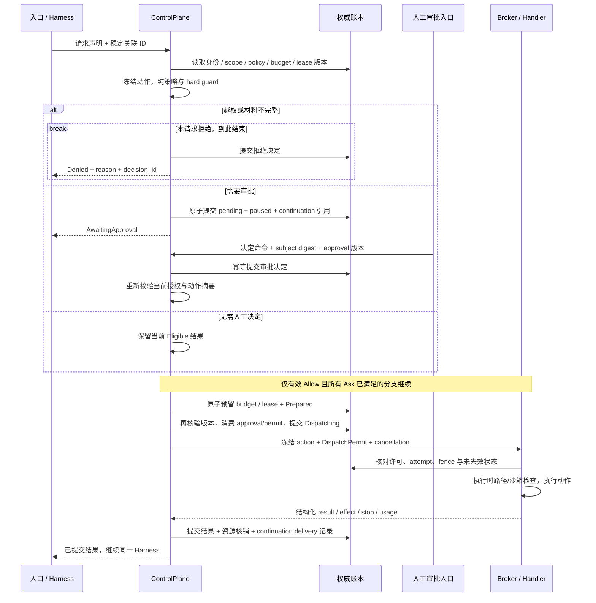

# Roadmap 专项：ControlPlane 专项

> 返回 [Kiana 执行路线图](../roadmap.md) 的总图与当前窗口。本文保留原专项编号、状态、依赖、验收口径和证据限制；专项步骤完成不会自动改变 P 阶段状态。

## 14. ControlPlane 专项追加：设计、处理流程与实施步骤（2026-09-12）

> 对应 [module-map.md](../module-map.md) 的「2. ControlPlane：控制与授权」。本节是**待实现的代码设计与验收补充**，不是完成声明。所有 `CP-*` 步骤初始均为 ⏳；测试名是建议新增或加强的验收用例，未声明本轮运行通过。
>
> 调研基线：`db77c2485bcafecbb1da17ec57ee509ad2ee32b4` 加共享工作树；关键源码于 **2026-09-12 16:48:22 +08:00** 取样，指纹见 §14.8。其他 agent 正在修改源码，执行每一步前须重查相关实现。本文依据用户本次授权直接追加；旧版冻结、等待交接等条款不阻止提出设计改进。保留现有实施顺序与编号，新增内容按下表接入。

**设计结论**：ControlPlane 应当成为一个由事实账本驱动的、可确定性判断的授权与状态转移内核。它签发受约束的执行许可、处理审批和资源账目，并确认执行结果；DaemonHost 提供身份和具体存储，Harness 推进模型循环，Broker 落实执行许可。优先补齐这些边界之间的原子性、关联身份和恢复语义。

### 14.1 如何交给当前实施 agent

`CP-00`…`CP-30` 是本专项的工作步骤，**不是第二套 P 阶段编号**。已有 P 单元保留其进度；CP 步骤提供更精确的实现合同。原单元已有相应实现时，先核验负向条件和产品调用链，满足则复用，不重复造类型或模块。

| 原 roadmap 单元 | 本专项补充 | 接入方式 |
|---|---|---|
| `P0-A-01a/01b/02`、`P0-B-01` | CP-02、03、06、14、28 | 使用已定义的 TurnId / InvocationId / ExecutionId；补版本、状态转移和错误语义 |
| `P0-K1-01` | CP-01、08、17 | 从固定本地主体推进到可验证 assignment、撤销版本与即时失效 |
| `P0-F-01/02/03` | CP-09、10、18、19、22 | 精确审批、单次消费、持久暂停、显式恢复、各入口同一 pending |
| `P0-G-01/02a/02b/03/04` | CP-06、07、18、19、21、28 | 从可查询账本推进到可重建权威；history 重建不能代替执行账本 |
| `P0-J1-01`…`05b` | CP-02、11、15、16、27 | 保留当前 wall-time/max_steps 修复；补跨入口取消、实际停止和累计配额 |
| `P1-H-01/02/03`、`P1-J4-01` | CP-03、04、05、12、13、25 | 统一动作目录、权限交集、执行许可、路径和 MCP 身份 |
| `P1-C-01/02/03`、`P1-D-01/02/03`、`P1-K5-01` | CP-08、11、12、17、24 | 原子资源预留、派生授权、租约 fencing、回收与核销 |
| `P1-J2/J3`、`P4-L3/L5/L6` | CP-08、18、25、26 | 输入来源、数据撤销、版本摘要、技能与 hook 的权限边界 |
| `P2-J5/K3/K4/K6/K7` | CP-17、18、19、20、23、24 | 工作流暂停、人工决定、checkpoint、对账和恢复 |
| `P3-I-01`…`06`、`P4-J6/K2/K8` | CP-23、24 | Company 命令、Swarm、Trigger、Connector 复用同一控制面 |
| `P0-M1`、`P2-M2`…`M7`、`P4-J7/M6`、`P1-J8/L1` | CP-21、22、26、29、30 | 投影、动作卡、事件游标、审计与故障验收 |

建议当前 agent 完成 §2 的在手切片后，先做 CP-00 的差异核验。其后按 §14.6 的依赖执行；已在原队列中做过的工作以验收证据抵扣。实施结果回填原 P 卡及本专项对应行；不把新增的设计文档当成原卡完成证据。

### 14.2 源码核对：已有基础与需要补齐的交界处

以下是取样工作树的**源码观察**；“待验证”不等同于已经复现运行故障。

| 位置 / 符号 | 已观察到的实现 | 本专项要解决的细节 |
|---|---|---|
| [ControlPlane](../../kiana-core/src/lib.rs) | 注入 policy/gates/events/broker/approval/runner；另有 session、pending、cancel、path-lock 等 map | map 的权威边界不一致；把它们变成可按版本重建的投影或进程资源句柄，不让缓存未命中代表授权不存在或允许 |
| [DaemonHost 请求入口](../../kiana-daemon/src/lib.rs) | 用 `local-user` 覆盖 actor，读取 stored ProjectTrust，调用 `bind_session_assignment` | 首次角色仍由请求选择；持久 assignment 不自动等于主体有权选择该角色，尚需服务端授权范围与 authority epoch |
| [三条能力路径](../../kiana-core/src/approvals.rs)、[Harness 路径](../../kiana-core/src/capabilities.rs) | `authorize_and_execute`、`resume_approved_invocation`、`broker_harness_capability` 各自处理部分决策和执行 | direct 路径不经过相同的 hook / invocation claim / cancellation 组合；统一 preflight、dispatch、result finalization |
| [Policy](../../kiana-policy/src/lib.rs)、[Gate](../../kiana-gates/src/lib.rs) | 默认引擎执行 trust、角色、路径、Memory、风险判断；默认 Gate 不放宽 Ask/Deny | core 的 `evaluate_gate` 对一般策略结果仍委托可替换 Gate；以恶意 AllowAllGate 证明 core 自身不会放宽硬拒绝。风险最低值需要覆盖整个操作目录，不只 MCP 等特例 |
| [AuthorizedCapabilityRequest](../../kiana-domain/src/capabilities.rs)、[Broker](../../kiana-capability-broker/src/lib.rs) | 授权类型可公开构造，构造器主要验证非空字符串；Broker 按精确键路由 | 字符串是关联 ID，不是不可伪造授权。派发前验证账本中的 decision、scope、digest、epoch、attempt 与单次使用状态 |
| [审批存储](../../kiana-daemon/src/approval_store.rs)、[审批决定](../../kiana-core/src/approvals.rs) | SHA-256 request hash、nonce、过期、持久文件、stage/activate/decide；新增 `approval.decision_requested` CAS | 审批文件消费与事件追加跨两个存储；intent 事件不能自动弥合崩溃窗口。`policy_version` 当前为固定 schema 字符串，需区分格式版本与内容版本 |
| [事件追加](../../kiana-core/src/events.rs) | 聚合 CAS、幂等键、terminal 防重；payload mismatch 时可能换带 fingerprint 的键重试 | 相同业务请求不同内容应冲突，不能靠换键变成新命令；CAS 冲突后也不能只改版本重写旧授权决定 |
| [CellRegistry](../../kiana-core/src/cell_registry.rs) | 进程内 reserve/commit、grant/lease 校验、并发计数；`begin_capability` 消费 tool/effect，tokens 参数为 0 | token、模型请求成本、Continue 累计限额、跨进程资源账目需要真实接线；`finish_capability` 的 outcome 尚未形成完整核销合同 |
| [路径锁与停止跟踪](../../kiana-core/src/sessions.rs) | 内存锁 + 内核文件锁；停止回执 map 按 RunId 保存 | 单个 Run 多 invocation 时需逐个停止确认；过期租约不等于旧 worker 已停止，不能单凭 TTL 把写集交给新 worker |
| [Invocation 投影](../../kiana-core/src/invocation_projection.rs)、[恢复](../../kiana-core/src/recovery.rs) | 已有只读折叠、snapshot、显式 restore、dispatch claim；脱敏改变 snapshot 后标记不可恢复 | claim 当前用 `run_id:call_id`，没有完整 turn/attempt 身份；claim 先于预算 begin；已有 claim 一律 Unknown 未区分已确认完成。恢复需要处理多 pending、资源重取、重复 resume 和旧材料失效 |
| [终态事件](../../kiana-core/src/events.rs)、[平台目标 §4.4](../company-os-platform-architecture.md#44-run-与-invocation-的合法转移新增) | 当前 terminal 防重以最后一条 `run.prompt` 分轮；Continue 可沿用同一 RunId | 与规范中的“终态 Run 不复活”存在语义差异。CP-02 显式版本化迁移，不能一面按 turn 重新打开、一面声称每 Run 永远只有一个终态 |
| [JSONL](../../kiana-eventlog/src/jsonl.rs)、[Ports](../../kiana-ports/src/lib.rs) | 有进程锁、单事件 CAS、flush/sync_data、尾记录恢复；端口部分默认实现只有兼容能力 | 单条 append 不能同时提交审批消费、预算预留和派发许可；端口需声明并测试事务能力，不能静默降级 |

这里最优先的纵向切片是：**同一动作从 direct、Harness 和 approval-resume 进入时，得到相同的身份校验、硬拒绝、取消屏障和结果分类**。后续新增权限、审批缓存或恢复能力，都应建立在这个统一处理器上。

### 14.3 reference 全目录盘点与吸收结论

#### 14.3.1 覆盖范围

本轮枚举 `reference/` 的 **73 个目录**，核对顶层说明与可用 Git 快照，对非重建源码目录检索 authorization / approval / permission / idempotency / fencing / checkpoint / budget / cancellation，再精读下节列出的关键实现。这里的“全目录覆盖”指完整盘点与相关性筛选，**不表示逐行审计所有源码或运行所有项目**。

| 类别 | 已纳入盘点的目录 | 与 ControlPlane 的关系 |
|---|---|---|
| 编码运行时与权限 | `codex`、`deepseek-harness`、`goose`、`crush`、`opencode`、`cline`、`Roo-Code`、`roo-code`、`continue`、`pi`、`aider`、`mini-swe-agent`、`gpt-pilot`、`grok-build`、`letta-code` | 重点提取工具准入、审批暂停、取消、checkpoint 和历史配对 |
| Agent 与工作流框架 | `agent-framework`、`openai-agents-python`、`pydantic-ai`、`adk-python`、`agno`、`autogen`、`crewAI`、`agency-swarm`、`MetaGPT`、`ChatDev`、`langchain`、`langgraph`、`temporal-sdk-python` | 参考 typed pause/resume、显式结果回灌、持久步骤和定向 handoff；宿主仍需提供授权权威 |
| 多执行器与任务调度 | `beads`、`gastown`、`ruflo`、`architect-loop`、`claude-task-master`、`Archon-Knowledge` | claim、lease、依赖 ready、监督与产物交接；任务分配和权限签发须区分 |
| 隔离及工作台 | `container-use`、`OpenHands`、`emdash`、`orca`、`herdr` | 执行环境、会话归属、断线/恢复展示；不能用 UI 状态或 worktree 存在证明权限 |
| Memory / 检索 / 代码图 | `MemPalace`、`memorix`、`mem0`、`graphiti`、`letta`、`letta-oss`、`claude-memory`、`claude-mem-candidate`、`llama-index`、`GitNexus`、`graphify`、`Archon` | ACL、provenance、数据版本、撤销与索引；检索命中不得增加执行权 |
| 协议与工具参考 | `a2a`、`mcp-servers` | wire 状态、工具 schema、server/resource identity；连接成功不等于动作授权 |
| 开发流程、技能与规范 | `12-factor-agents`、`ECC`、`everything-claude-code`、`get-shit-done`、`gsd-core`、`gstack`、`planning-with-files`、`OpenSpec`、`spec-kit`、`superpowers`、`skills`、`awesome-agent-skills`、`pm-skills`、`ai-coding-guide` | 借鉴步骤合同、证据与开发验收；提示词中的约束不能替代运行时 enforcement |
| 安全/评测补充 | `strix`、`promptfoo-full` | Strix 可作恶意输入与隔离场景来源；`promptfoo-full` 本地仅见 `.git`，没有可审计工作树，未计作已读评测实现 |
| 元数据及重建材料 | `.claude-flow`、`claude-code-rev-main`、`claude-code-main (2)`、`claude-code-rust` | `.claude-flow` 是运行数据；后三者只作目录/公开说明定位，未复制重建或专有实现 |

快照重复和资料漂移也已登记：`Roo-Code`/`roo-code`、`letta`/`letta-oss`、`claude-memory`/`claude-mem-candidate` 各自 HEAD 相同，不当成独立佐证；当前 `Archon` 是代码影响分析项目，工作流引擎实际在 `Archon-Knowledge`；当前 `OpenHands` 顶层为 Agent Canvas，不能直接沿用旧审计中的 Python controller 路径。旧参考索引是定位线索，下面以实际存在的源码为准。

#### 14.3.2 重点源码与适用边界

快照为本地 Git HEAD；符号和文件已经实际检索/读取，未运行其测试。表中“采用”是对 Kiana 的设计建议。

| 来源 / 快照 | 核对入口 | 采用到 Kiana 的细节 / 不能直接推导的保证 |
|---|---|---|
| Codex `d6489472f3c1` | [ToolOrchestrator](../../reference/codex/codex-rs/core/src/tools/orchestrator.rs) | 把 approval、sandbox attempt、重试放在公共执行入口；Kiana 的放宽重试必须绑定新的权限摘要，不能无条件照搬缓存批准。对应 CP-05/13/20 |
| DeepSeek Harness `c389f96bf3a9` | [ToolGuard / prepareExecution](../../reference/deepseek-harness/packages/core/tools/src/index.ts)、[storage contract](../../reference/deepseek-harness/packages/session/session-persistence/src/storage-contract.ts) | 扩展 hook 后再跑只可拒绝的 guard；无审批通道时 Ask 拒绝；校验并快照同一参数值；未知 required event 拒绝解释。对应 CP-03/04/07/25 |
| Goose `5e90925962f0` | [StateMachine::step/apply/run](../../reference/goose/crates/goose-agent/src/machine.rs)、[state-machine 组合](../../reference/goose/crates/goose/src/agents/state_machine/mod.rs) | 分离计算下一步、应用 effect、重新加载状态；该路径有 feature/env 开关，不能说全部默认运行都经过它，更不能推导外部效果 exactly-once。对应 CP-06/14/19 |
| Crush `563d658bccb5` | [permissionService::resolve](../../reference/crush/internal/permission/permission.go)、[drainQueueForStep / publishCanceledQueueDrops](../../reference/crush/internal/agent/agent.go) | 多审批者竞态只允许一个赢家；未启动且有 RunId 的排队请求也要终态通知。其 hook 预批准不能成为 Kiana 项目 hook 的发权方式。对应 CP-10/15/22 |
| OpenCode `d6855b6b47a8` | [PermissionV2](../../reference/opencode/packages/core/src/permission.ts) | pending 列表、resolve、取消清理值得借鉴；`evaluate` 是 last-match，`merge` 为 flat，Kiana 多层权限需做交集。内存 Deferred 不能代替持久 pending。对应 CP-04/10/21 |
| OpenAI Agents SDK `f355af660416` | [RunState](../../reference/openai-agents-python/src/agents/run_state.py) | interruptions、approve/reject、序列化恢复按具体 call 关联；快照中批准字段仍需 Kiana 主体、版本、有效期与单次消费校验。对应 CP-09/18/19 |
| Pydantic AI `62f1e8302a35` | [ApprovalRequiredToolset](../../reference/pydantic-ai/pydantic_ai_slim/pydantic_ai/toolsets/approval_required.py) | 工具边界先抛出 typed approval requirement 再执行；`tool_call_approved` 是库内上下文信号，不是宿主可验证的执行许可。对应 CP-05/09 |
| Agent Framework `aea4dc221e97` | [ToolApprovalRule](../../reference/agent-framework/python/packages/core/agent_framework/_harness/_tool_approval.py)、[FunctionTool](../../reference/agent-framework/python/packages/core/agent_framework/_tools.py) | 区分工具级规则与精确参数级规则，绑定 hosted server；空参数 `{}` 不代表 wildcard。其默认无需批准的工具策略不能决定 Kiana 风险。对应 CP-03/09/25 |
| Agno `f974c175c6f5` | [RunRequirement](../../reference/agno/libs/agno/agno/run/requirement.py)、[approval records](../../reference/agno/libs/agno/agno/run/approval.py) | 区分 confirmation、user input、feedback、external execution；人工输入与授权决定须用不同命令。对应 CP-09/22/23 |
| CrewAI `34199c21b724` | [SQLiteFlowPersistence](../../reference/crewAI/lib/crewai/src/crewai/flow/persistence/sqlite.py) | pending feedback 与 flow state 均可落盘；存下 flow snapshot 不证明审批消费和工具执行原子。对应 CP-07/18/24 |
| LangGraph `81bf17b23123` | [interrupt](../../reference/langgraph/libs/langgraph/langgraph/types.py) | 恢复从节点开头重新执行，多个 interrupt 依顺序匹配；Kiana 需以 InvocationId 查执行结果，并把真实副作用隔离到 Broker。对应 CP-18/19/24 |
| Temporal SDK `22a9e41fd857` | [ActivityCancellationType](../../reference/temporal-sdk-python/temporalio/workflow/_activities.py)、[activity heartbeat](../../reference/temporal-sdk-python/temporalio/activity.py) | 区分请求取消和等到取消完成；attempt、deadline、heartbeat 分开。SDK 重试机制不替代外部服务幂等。对应 CP-15/16/20 |
| Beads `c0d8da42de5f` | [Claimer](../../reference/beads/issueops/claimer.go) | 原子 claim、同持有者幂等、冲突带可读状态；其 actor 明确是 caller-asserted provenance，Kiana 不能将其当 authenticated principal。对应 CP-01/12/24 |
| Ruflo `a295c6870315` | [WorkspaceLeaseRegistry](../../reference/ruflo/v3/@claude-flow/cli/src/services/workspace-lease.ts) | 租约记录位置、续租与监督分工可参考；源码的 best-effort heartbeat、损坏后空表、按锁文件年龄回收不适合作为 Kiana 授权账本。对应 CP-12/17 |
| Container Use `2e43e625e952` | [Environment](../../reference/container-use/environment/environment.go) | 每执行环境显式保存身份与配置；容器/worktree 隔离要和 Grant、预算、fence 绑定，不等于已经授权。对应 CP-12/13/16 |
| Letta Code `6bc41be9f4a9` | [turn approval](../../reference/letta-code/src/websocket/listener/turn-approval.ts) | 审批批次、call IDs、连接恢复与 continuation 各自相关联；断线后重发决定不能重做工具。对应 CP-10/19/22 |
| Grok Build `72a61251fcff` | [checkpoint store](../../reference/grok-build/crates/codegen/xai-grok-workspace/src/session/checkpoint_store.rs) | checkpoint 跟随工作区恢复、缓存前置但磁盘有副本、保留数量有界；工作区 rewind 不回滚权限或外部效果。对应 CP-18/20 |
| 12-Factor Agents `d20c728368bf` / architect-loop `164d32c36eeb` | [暂停恢复](../../reference/12-factor-agents/content/factor-06-launch-pause-resume.md)、[architect-loop 设计说明](../../reference/architect-loop/README.md) | 在选工具与执行工具之间提供暂停点；借鉴每步输入/产物/验收合同。architect-loop 的无审批与宽沙箱是另一种设计取舍，不能当 Kiana 的执行权威。对应 CP-05/30 |

#### 14.3.3 reference 之外的主来源

以下官方资料于 2026-09-12 在线核对。这里只吸收具体机制，不要求部署这些服务。

| 主来源 | 对本设计的约束 |
|---|---|
| [Cedar 授权算法](https://docs.cedarpolicy.com/auth/authorization.html) | principal/action/resource/context 的结构、默认拒绝、forbid 优先。Cedar 会跳过发生错误的策略；Kiana 包装层要显式检查 diagnostics，关键策略错误返回 Deny，不能误称 Cedar 自带 deny-on-error |
| [OPA Decision Logs](https://www.openpolicyagent.org/docs/management-decision-logs) | 决定绑定 decision_id、输入、规则/版本与输出，并脱敏。OPA 周期上传日志不等于 Kiana 的执行前持久提交屏障 |
| [OpenFGA Query Consistency](https://openfga.dev/docs/interacting/consistency) | 默认缓存可能暂时看不到撤销；高一致性模式跳过缓存。Kiana 执行前验证 authority 版本，不能依靠 TTL 内的旧 Allow |
| [Temporal Activity Definition](https://docs.temporal.io/activity-definition)、[Activity Execution](https://docs.temporal.io/activity-execution) | 工具完成但报告前崩溃会带来重复执行风险；取消通知与停止确认分离。采用 attempt 与对账合同，不把 durable orchestration 写成外部 exactly-once |
| [Kubernetes Leases](https://kubernetes.io/docs/concepts/architecture/leases/) | holderIdentity、renewTime 和租期用于协调存活；Kiana 另需在资源操作处验证 fencing token。lease 到期本身不会杀死旧进程——这是本设计的推论与补充 |
| [SQLite Atomic Commit](https://www.sqlite.org/atomiccommit.html) | 一次事务要么全部可见要么全部不可见；持久性受文件系统/同步语义约束。按这一合同测试本地日志批次，不能把多次独立 JSONL append 叫作事务 |
| [MCP 2025-11-25 Tools](https://modelcontextprotocol.io/specification/2025-11-25/server/tools) | schema、server identity、结果校验与 annotations 分开。未受信的 `readOnlyHint`、描述或返回文本不得降低服务端风险；协议版本显式固定 |

### 14.4 目标代码设计

#### 14.4.1 组件职责与接口

复用现有 crate；表中的新类型/方法是建议接口名。新增内部模块只在职责分离确有帮助时进行，不以拆文件数量衡量完成度。

| 所在位置 | 建议合同 | 输入 / 输出与职责 |
|---|---|---|
| `kiana-domain` | `AuthenticatedPrincipalRef`、`AuthoritySnapshot`、`PreparedAction`、`DecisionRecord` | 领域值对象与不可变决策输入；沿用既有稳定 ID，新增字段登记到 contracts |
| `kiana-ports` | `AuthorityReaderPort`、`ControlJournalPort`、`ExecutionPermitVerifierPort`、`ClockPort` | 身份/权限快照读取；带多聚合读版本的提交；许可消费核验；可注入时间。默认不支持应显式拒绝 |
| `kiana-core` 身份/授权 helper | `resolve_authority`、`prepare_action`、`authorize_action` | 将请求声明转换为受信快照；执行纯策略判断与硬边界合并；输出 Deny / AwaitingApproval / Eligible |
| `kiana-core` 提交/派发 helper | `prepare_dispatch`、`commit_transition`、`finalize_execution` | CAS 预留资源和消费许可；收集与提交结果；作为三条现有能力路径的公共实现 |
| `kiana-policy` / `kiana-gates` | 纯策略、业务 Gate 与单调合并 | 不执行 I/O、读环境变量、修改 grant；core 在调用扩展前后强制硬边界 |
| `kiana-daemon` | 受保护身份适配器、时钟、存储、权限更新入口 | 组合和解析配置；所有授权变更进入控制面，不在入口直接修改运行状态 |
| `kiana-eventlog` | 原子 `TransitionBatch`、版本化 reader、投影游标 | 事件事实与授权相关转移使用同一提交单元；内存 adapter 和磁盘 adapter 通过同一合同测试 |
| `kiana-capability-broker` | `DispatchPermit` 消费与精确 handler 路由 | 在副作用前核对不可变 action、decision、attempt、fence；不自行把字符串转成授权 |
| `kiana-runner` / Runner 协议 | 带 Run/Turn/Invocation/Execution 关联的命令和结果 | 只提出工具申请、等待结果；模型请求前消费控制面给出的预算许可；不从 transcript 恢复执行权 |

**进程内信任边界**：不要求为了本地调用立即引入 JWT 或远程授权服务器。许可可以是 core 签发的 opaque handle，Broker 通过端口验证其已提交记录并原子标记使用。公开可构造的 DTO、UUID 或 hash 本身不具备发权能力；同一进程内完全受信的 Rust 代码也不是密码学隔离对象。若后续增加跨进程执行，才在同一许可合同上增加签名、issuer/audience、密钥轮换和 replay 防护。

#### 14.4.2 身份、动作与版本绑定

| 对象 | 必须绑定的内容 |
|---|---|
| 主体与 assignment | authenticated principal、认证方式/凭据代次、ProjectId、项目根身份、SessionId、RoleAssignmentId 或等价稳定引用、role/template/department 版本、父 Cell/Grant 链 |
| 动作 | invocation_id、工具 call_id、operation、最终参数摘要、cwd、sandbox、读写资源、网络目的地、MCP server/tool/schema 版本、secret handle 版本、输出上限、deadline |
| 授权快照 | authority_epoch、trust_revision、policy 内容摘要、role/template revision、packet revision、catalog revision、data epoch、读到的 grant/lease 状态版本 |
| 审批 | approval_id、subject digest、审批者、被授权主体、scope、reason、可选决定、expiry、nonce、原请求与决定请求两个 ID |
| 派发许可 | decision_id、invocation_id、execution_id、attempt、授权快照版本、action digest、预算预留引用、写集 lease/fencing token、有效期、消费状态 |
| 执行结果 | 同一组调用 ID、handler 版本、执行是否开始、进程是否停止、effect 是否可确认、业务 success/failure、usage、结果/产物摘要及证据引用 |

身份字段不再混进普通 JSON 参数充当权限来源。参数可以保留兼容展示字段，但 handler 使用独立的 `ExecutionContext`。规范化后冻结 action；后续补默认值、hook 改写、MCP schema 更新、路径重定位、sandbox 放宽都要重新生成摘要并重新决策。

`schema_version` 表示数据格式，`policy_revision` 表示策略内容，`authority_epoch` 表示撤销代次，`fencing_token` 表示某资源租约持有代次，`stream_epoch` 表示客户端事件桥代次。五者各有作用域，不共用一个数字，也不因 UI 重连自动发新权限。

**Run / Turn 的迁移选择**：采用现有平台目标的 `Session → Turn → Run → Invocation → CapabilityExecution`。一次暂停的 Resume 继续同一 Run；一个终态后的新用户 Continue 创建新 Turn/Run，关联同一 Session 与前序 Run。当前 v1 Continue 复用 RunId 的行为先作为明确标记的 legacy 合同保留；通过能力协商的新请求语义及 reader upcast 迁移，不能悄悄改变旧返回值或放宽原测试。新路径每 Run 一个终态；历史路径按显式 legacy turn 边界解读，不能混写两个证明口径。

#### 14.4.3 权限计算与审批含义

```text
effective_scope = principal 的授权范围
                ∩ project/trust/profile 的允许范围
                ∩ department/role/template 的允许范围
                ∩ parent grant / delegation 的允许范围（若为子任务）
                ∩ WorkPacket 的允许范围（若绑定 packet）
                ∩ 当前 grant 的允许范围
                ∩ 本次 action 声明的最小范围

最终可派发 = action ∈ effective_scope
          ∧ hard invariants 通过
          ∧ policy/gates/hooks 均无 Deny
          ∧ 所有 Ask requirement 有有效的匹配审批
          ∧ budget/lease/cancellation/authority 在提交时仍有效
```

“没有这一层”与“这一层明确允许空集”使用不同值；缺失必需授权材料拒绝，显式空集拒绝全部，不能让 `[]` 自动变成全仓。可表示为 `ScopeConstraint::NotApplicable | Restricted(ScopeSet)`，其中 root authority 自身必须有确定上限。

策略得到 Allow 只表示满足策略，之后才由 core 签发执行许可。人工审批解决某个明确 Ask，并不能覆盖角色越权、trust 撤销、过期预算、取消或路径逃逸。scope 分为 once / turn / session / policy：先完成 once；另外三类作为带次数、资源上限、expiry 和 epoch 的 standing approval 显式接入，不能用字符串前缀缓存扩权。持久 policy approval 的创建本身是单独受保护的授权变更命令。

PreToolHook 可以 Allow/Ask/Deny，但只影响已经允许申请的范围。普通 hook 的 Allow 不能撤销之前的 Deny，也不能解除另一个来源的 Ask。需要执行脚本的 hook 有独立、受限且可审计的运行许可；它不是在审批工具前可以任意写盘的隐藏入口。

#### 14.4.4 一致性与持久化方案

**推荐先扩展现有本地 EventStore 的事务合同**，让同一权威域内的授权事实在一个 `TransitionBatch` 中提交；不为了本切片部署分布式数据库。审批文件、Cell 内存状态和事件账本不再分别承担权威写入。短期使用单日志事务帧实现，未来 SQLite adapter 可复用同一合同；不通过两个存储的 best-effort rollback 伪装原子性。

```rust
// 接口草图，字段类型需复用 domain；不是当前可编译 API。
struct TransitionBatch {
    command_id: RequestId,
    command_digest: Digest,
    expected_versions: Vec<AggregateVersion>, // 包含只读校验的权限/预算/租约版本
    events: Vec<RuntimeEvent>,
}

enum CommitOutcome {
    Committed { commit_id: CommitId, cursor: EventCursor },
    Replayed { original: CommandReceipt },
    Conflict { changed: Vec<AggregateVersion> },
}
```

提交的步骤是：在同一个存储锁/事务内查 command 去重 → 比对**所有 read-set 版本** → 校验并写完整事件批次 → 同步持久化 → 发布提交结果。授权读取与变更必须处于同一权威域；若未来引入跨库授权，不得声称本合同自然支持分布式原子性。

对 JSONL adapter：新增带 schema、batch ID、长度/摘要和完整逻辑事件列表的事务帧；读取只暴露完整校验的帧。已有 v1 单事件记录可读，未知 required 格式拒绝写入。写盘、同步、文件创建目录同步、损坏尾部处理以及 writer 版本检查需逐项实现和测试。**“一行 JSON”不是原子写保证**：部分写、同步返回错误或提交响应丢失都要重新读取同一 command_id 确认，未确认前不发派发许可。

同一 command_id + 同一 digest 返回原回执；同 ID + 不同 digest 返回冲突，不能追加 payload 后缀变成新命令。CAS 冲突后重新读取状态并重新授权；不会因为读到更大版本就把旧 Allow 原样重交。未知 commit outcome 保持停止派发，直到只读确认提交结果。

JSONL 中仅存可审计的安全字段及密文/受保护 payload 引用。需要恢复的原始参数先以不可变对象可靠保存，再提交引用；保存失败无授权提交，引用缺失无执行。无法安全保存原参数时标记不可恢复，不能把 `[REDACTED]` 当原参数执行。

#### 14.4.5 生命周期、资源账目和结果

| 状态域 | 允许推进 | 不允许的推断 |
|---|---|---|
| Run | Queued → Running → Paused / CancelRequested / Completed / Failed / ResultUnknown；Paused 可显式恢复；CancelRequested → Cancelled / ResultUnknown | 终态后 Continue 不能暗中复活新语义的同一 Run |
| Invocation / attempt | Requested → PolicyChecked → AwaitingApproval 或 Eligible → Prepared → Dispatching → Executing → Succeeded / Failed / Cancelled / Unknown；拒绝/未执行取消有独立分支 | Prepared 表示本地预留完成，不表示工具已经开始；Unknown 不能自动降为 Failed |
| Approval | Staged → Active → Approved / Denied / Expired / Cancelled；Approved → Consumed / Expired / Invalidated | “用户同意”不等于已经消耗执行权；审批响应的网络重试不等于再执行一次 |
| Grant / resource lease | Proposed → Reserved → Active → Revoked / Expired → Released；旧 fencing token 永久失效 | TTL 到期不等于进程退出；释放调度占位不等于对外费用退款 |
| Budget reservation | Reserved → Settled 或 Released；不确定费用保持 ReservedUnknown 等待对账 | 超时、取消、模型失联不意味着 token/费用为零 |

预算至少分开记录：模型请求次数、token/cost、tool calls、effects、并发槽、最大累计 wall-time。层级额度按可委派剩余额度预留；多个 child 的总预留不能超过 parent。模型请求在发出前预留成本上界，usage 到达后核销；如果 provider 没有可强制的输出限额或可靠计费信息，就只能声明估算约束，不能声称硬费用上限。Continue 可以重置 per-turn 步数，但不重置项目/Run 链的累计消费。

结果使用两个维度：业务结果与 effect 确认度。`Err(PortError)`、非零退出码、取消请求、future 被 drop 都不能直接证明没有副作用。`StopReport` 至少记录 execution_id、停止方法、确认时间、process-group 状态与 effect 证据；每个在途 invocation 单独收集。确认程序停止也不证明之前写出的文件已经撤回。

### 14.5 完整处理流程

#### 14.5.1 一次工具调用与审批



处理细则：

1. 鉴权失败前不回显其他主体的 run、审批或路径；可在宿主安全审计通道记录最小拒绝信息。合法请求的 policy Deny 写可查询的决定回执；若账本写失败，只返回“未执行、审计写失败”，不伪造 receipt。
2. Catalog 在模型调用前提供可见工具集合，但真正执行时重新核验动作。模型可见数量与授权实现解耦，不以“工具已经展示”作为许可。
3. 每个 invocation 只有一个 immutable action。多个工具调用产生多个 invocation；不能用“同一轮已批准”自动放行未包含在批准范围内的兄弟调用。
4. 等待人类时释放执行并发槽，不长持有数据库事务、Tokio 锁或 OS 写锁。保留待执行意图及原 precondition；审批后重新取得锁、重查文件版本，变了就生成新预览/新审批。
5. Prepared 与 Dispatching 分开：预算不足或锁不可得时还没有执行 claim；取消可中止 Prepared 并释放预留。Dispatching 是可能发生副作用的起点，提交后失联默认 Unknown。
6. 操作开始前最后一次 permit 验证必须与 cancel/revoke 有明确的顺序；如果 cancel 先提交就不能开始。如果 dispatch 先提交，则取消走在途停止和对账，不能承诺“取消按钮之后现实中绝无任何写入”。
7. 结果先提交后回灌 Harness；回灌丢失可按 execution_id 重发**结果**，不会重新运行工具。模型流的临时 delta 可独立推送，不能据此推进权威终态。

#### 14.5.2 取消、撤销与退休

```text
验证取消者和目标作用域
  → 原子提交 CancelRequested / revoke epoch，阻断尚未开始的许可
  → 未启动 invocation：记录 NotExecuted / synthetic tool result
  → 已启动 invocation：逐项发送取消并收集 StopReport
  → 所有停止可确认：Cancelled；任一结果不可确认：ResultUnknown
  → 释放已确认可释放的路径/并发预留，核销已发生 usage
  → 隔离不明资源、创建 reconciliation item
  → 子 Cell 级联撤销完成后记录 retirement receipt
```

关停清理使用独立、有限时长的 cleanup context，不能继承已经取消的 token 导致连终态都写不出去。持久取消命令在重启后重放为待处理控制意图；不会从历史 token 对象恢复权限。级联撤销时先提交父 epoch，让漏扫的 child 也无法派发，再幂等处理各 child 的停止和释放。

#### 14.5.3 重启、恢复与重试

| 恢复时看到的最后事实 | 默认行为 | 允许继续的条件 |
|---|---|---|
| Requested / Active approval | 列入待办，保持暂停 | 显式 Resume + 当前身份/权限重查 + 原材料可验证 |
| Approved 但未 Dispatching | 保留批准事实，不在启动扫描中自动执行 | 重新验证 expiry/epoch/action/precondition，重新取得资源后单次消费 |
| Prepared | 可确认无派发记录时恢复或撤销预留 | command/attempt 身份完整，当前 scope 有效；不靠内存 map 猜测 |
| Dispatching / Executing，缺确认结果 | Unknown，隔离写集或相关外部资源 | 只读对账；有新证据后显式决定是否重试或补偿 |
| 已提交结果，但 Harness 未收到 | 重发结果 delivery | 校验同一 execution_id / result digest；不得执行 handler |
| Snapshot 缺失、脱敏不可逆、损坏、版本未知 | 显式不可恢复 | 补足经验证的材料或新建 Run；不能猜测旧参数 |
| 已有终态 | 只读查询 | 新工作创建新执行身份；对账追加 correction/link，不改历史终态 |

`RetryPolicy` 默认一次尝试。参数完全一样不意味着可重试：shell 可以追加文件，MCP 可以创建远端对象。只对 descriptor 明确支持、且 effect 状态允许的操作重试；每次新 execution_id、attempt 递增、重新预留预算及校验权限。外部 idempotency key 按 handler 的合同复用；它与 command_id、event 幂等键、tool call_id 是不同用途。补偿本身是新的有副作用动作，需要新的授权。

### 14.6 详细实施步骤

每个步骤交付一组可独立审查的代码与对应证据。步骤较大时按下面的 1→2→3 子项继续拆小；负向验收先行。纯函数测试只能证明局部规则，涉及实际执行的退出条件必须观察 Broker/模型调用次数、文件/进程状态及持久事件。

| 步骤 | 交付物 | 前置 CP 步骤 | 状态 |
|---|---|---|---|
| CP-00 | 当前调用路径与拒绝基线 | — | ⏳ |
| CP-01 | 主体、项目身份和不可变 assignment | 00 | ⏳ |
| CP-02 | Run/Turn/Invocation/Execution 合同 | 00 | ⏳ |
| CP-03 | 动作规范化与服务端风险目录 | 01、02 | ⏳ |
| CP-04 | 权限交集与不可绕过的拒绝 | 03 | ⏳ |
| CP-05 | 三条能力路径共用处理器 | 04 | ⏳ |
| CP-06 | 原子状态转移与 command 幂等合同 | 02、04 | ⏳ |
| CP-07 | 磁盘事务帧和恢复 reader | 06 | ⏳ |
| CP-08 | Grant 权威与撤销 epoch | 01、04、07 | ⏳ |
| CP-09 | 审批 subject 与安全执行材料 | 03、07、08 | ⏳ |
| CP-10 | 持久审批决定与消费 | 05、07、09 | ⏳ |
| CP-11 | 模型/工具与层级预算账本 | 02、07、08 | ⏳ |
| CP-12 | 路径租约、内核锁与 fencing | 07、08 | ⏳ |
| CP-13 | 派发许可与唯一开始屏障 | 05、10、11、12 | ⏳ |
| CP-14 | 结果确认、核销与回灌 | 13 | ⏳ |
| CP-15 | 统一取消状态与控制命令 | 02、07、13、14 | ⏳ |
| CP-16 | Shell/Patch/MCP 的停止证据 | 12、13、15 | ⏳ |
| CP-17 | 撤销传播与 Cell retirement | 08、11、12、15、16 | ⏳ |
| CP-18 | 可验证 RunSnapshot 与 checkpoint | 07、09、14、17 | ⏳ |
| CP-19 | 新进程显式恢复同一执行 | 10、14、17、18 | ⏳ |
| CP-20 | Unknown 对账与受控重试 | 14、17、19 | ⏳ |
| CP-21 | 只读投影、收据与查询授权 | 07、10、14、19 | ⏳ |
| CP-22 | 协议、审批卡与多入口一致性 | 10、15、19、21 | ⏳ |
| CP-23 | Company 变更命令纳入权威转移 | 04、07、08、13 | ⏳ |
| CP-24 | 调度、委派与工作流接入 | 11、12、17、23 | ⏳ |
| CP-25 | 扩展、Memory、MCP、Secret 边界 | 03、04、08、13、18 | ⏳ |
| CP-26 | 决策解释、审计与证据关联 | 14、20、21 | ⏳ |
| CP-27 | 非阻塞存储、限额与负载行为 | 07、11、15、21 | ⏳ |
| CP-28 | 旧记录/API/adapter 迁移收口 | 02、07、19、22 | ⏳ |
| CP-29 | 竞态、故障注入与状态机性质测试 | 05、07、13–20、23–28 | ⏳ |
| CP-30 | 产品黄金流程与文档验收 | 21–29 | ⏳ |

<a id="step-cp-00"></a>


#### CP-00 — 固定基线，列出所有有后果的入口

- **承接**：所有原 P 卡；本步骤只确定本轮实际缺口。
- **位置**：`kiana-core/src/{lifecycle,approvals,capabilities,commands,company,sessions}.rs`，DaemonHost、Broker 注册、Runner 入口及相关集成测试。
- **Step 1**：记录 HEAD、相关 WIP 指纹；从每个公开 core 方法追到 handler，列出直接执行、审批继续、Harness、Company、context cache、hook 等路径。
- **Step 2**：做同一 action 的三入口对照 fixture，注入计数 Broker、拒绝策略、过期审批、预取消 token、失败 EventStore；区分源码推断与实际复现。
- **Step 3**：记录哪些已由另一 agent 实现，保留既有 wall-time/max_steps/取消测试，不复制旧卡现状结论。
- **验收**：拟新增 `cp_entry_paths_share_denial_baseline`；负向场景断言 handler 调用为 0，而不只断言返回 error。若暴露差异，记录失败用例并由 CP-04/05 修复后关闭。
- **交付**：入口矩阵、失败分类、精确命中测试数及 source 证据块。

<a id="step-cp-01"></a>


#### CP-01 — 服务端主体与项目身份

- **承接 / 前置**：`P0-K1-01`；CP-00。
- **位置**：`kiana-daemon/src/lib.rs`、`kiana-core/src/sessions.rs`、domain roles、ports、protocol metadata。
- **Step 1**：区分 wire 声明与 `AuthenticatedPrincipalRef`；本地 OS 用户/受保护连接凭据由 daemon 解析，认证失败不创建 assignment。
- **Step 2**：解析稳定 ProjectId 与 canonical root identity；校验主体是否有权创建该角色的 session，再固化 role/department/template。继续、取消、审批、收据都使用同一 owner 检查。
- **Step 3**：把首次 assignment 也走 CAS；服务端支持的角色选择与普通模型参数分离；查询已有 session 不触发新 assignment 写入。
- **验收**：`cp_forged_wire_actor_or_role_never_reaches_broker`、`cp_first_assignment_requires_role_authority`；覆盖新 session、已有 session、跨项目相同 session 文本、旧凭据及合法本地主体。
- **交付**：身份来源表及跨入口 owner 行为证据；不宣称企业多租户认证已实现。

<a id="step-cp-02"></a>


#### CP-02 — 使用既有 ID，明确状态机和 Continue/Resume

- **承接 / 前置**：`P0-A-01a/01b`、`P0-B-01`、`P0-G-03`、`P0-J1-01`；CP-00。
- **位置**：domain ids/contracts/states、Runner 协议、core lifecycle/history/projection、wire DTO。
- **Step 1**：接线现有 TurnId、InvocationId、ExecutionId；call_id 只是模型给出的关联值，不能单独作为账本主键。direct command 用显式 Command scope，不虚构 Harness Run。
- **Step 2**：采用 §14.4.2 的新执行语义，区分新用户 Continue 与暂停 Resume；新增能力协商/请求版本，旧 Continue 保留独立兼容测试。
- **Step 3**：枚举 Run、Invocation、attempt、Approval、lease 的转移及命令幂等语义；历史无 TurnId 的记录经确定性 upcast，歧义记录只能查询。
- **验收**：`cp_reused_call_id_in_new_turn_is_a_new_invocation`、`cp_resume_keeps_run_but_new_turn_does_not_revive_terminal_run`、`cp_legacy_continue_contract_remains_versioned`；重复/乱序终态不可覆盖。
- **交付**：状态转移表、版本边界、ID 关联示例和迁移 fixture。

<a id="step-cp-03"></a>


#### CP-03 — 规范化 action，风险与执行元数据服务端所有

- **承接 / 前置**：`P1-H-01/02`、`P1-J4-01`、`P0-A-02`；CP-01、02。
- **位置**：domain tool_catalog/capabilities/errors，runner tools，policy，daemon handlers。
- **Step 1**：为所有注册 operation 登记 minimum risk、argument/result schema、资源提取、effect 类型、cancel/reconcile/idempotency 能力；未知键和不完整 descriptor 拒绝。
- **Step 2**：校验参数、补默认值、确定 cwd/sandbox/server/version 后生成 immutable PreparedAction 与规范化 SHA-256 digest；拒绝重复 JSON key、非法数值及歧义路径。
- **Step 3**：权限元数据进入独立 ExecutionContext；UI preview、策略、approval hash 和 handler 共用同一动作值。保持 `additionalProperties` 由 schema 明确决定。
- **验收**：`cp_forged_readonly_risk_cannot_downgrade_registered_effect`、`cp_preview_and_execution_use_identical_action`；覆盖 shell、patch、MCP、Memory、直接 Company 能力。
- **交付**：操作目录与 digest 合同；证明 catalog 变化会使旧动作失效。

<a id="step-cp-04"></a>


#### CP-04 — 权限交集与单调决策在 core 强制

- **承接 / 前置**：`P0-K1-01`、`P1-C-01`、`P1-H-01/03`；CP-03。
- **位置**：policy/gates，core approvals，domain scope 与 role/grant helper。
- **Step 1**：实现带 NotApplicable/Restricted 区分的 ScopeSet，逐层求交；path、operation、namespace、network、budget/depth 均不能取并集。
- **Step 2**：纯 `authorize_action(snapshot, action)` 返回决定、命中规则、所有 Ask requirement 和拒绝原因；任何关键输入缺失或策略错误都拒绝。
- **Step 3**：core 合并 policy/gate/hook 时强制 Deny 不可覆盖、Ask 不能被普通 Allow 消去；外部 engine 只提供决策贡献，不直接 mint authorization_id。
- **验收**：`cp_allow_all_gate_cannot_override_hard_deny`、`cp_hook_allow_cannot_discharge_other_approval_requirement`、`cp_child_scope_is_subset_for_every_dimension`；用恶意替代引擎而非只测默认实现。
- **交付**：确定性策略接口与单调性测试；审批无法解除越权的产品证据。

<a id="step-cp-05"></a>


#### CP-05 — 合并三条授权执行路径

- **承接 / 前置**：`P1-H-01`、`P0-F-02`、`P0-J1`；CP-04。
- **位置**：core approvals/capabilities，公共 action/dispatch helper；daemon Broker 组合。
- **Step 1**：抽取 `prepare_action → authorize_action → stage_or_dispatch → finalize`；原三个入口只处理其 scope、协议返回和 continuation。
- **Step 2**：审批继续也传入当前上下文，不能只依赖 PendingInvocation 保存的旧 context；所有路径走相同的 hook、资源检查与结果分类。
- **Step 3**：收紧内部 `send_runner`、raw broker execute 的可达范围；保留查询路径，不把 read-only request 强行变成副作用命令。
- **验收**：`cp_three_entry_paths_have_identical_authorization_semantics`；以过期 grant、cancel、scope 改变、结果不匹配和 EventStore 故障作参数化对照。
- **交付**：单一公共处理器、移除重复分支的 diff；此步只证明行为一致，持久派发保证由 CP-13 完成。

<a id="step-cp-06"></a>


#### CP-06 — 定义原子状态转移端口

- **承接 / 前置**：`P0-G-04`、`P0-F-02`、`P0-A-01b`；CP-02、04。
- **位置**：domain transition/decision 值对象、ports、core events；MemoryEventLog 合同 fixture。
- **Step 1**：定义 §14.4.4 的 TransitionBatch、read-set、CommitOutcome 与存储能力声明；审批/预算/租约关联状态共享同一权威域。
- **Step 2**：同 command_id 同 digest 幂等返回原回执，不同 digest 冲突；所有预期版本一起比较，失败时无部分状态可见。
- **Step 3**：授权转移 CAS 失败要重算决定；禁止沿用 `append_event` 的 payload 后缀重试来消除业务冲突。审计附加事件与授权状态转移使用不同、明确的调用合同。
- **验收**：`cp_transition_conflict_changes_no_aggregate`、`cp_same_command_different_payload_is_conflict`、`cp_stale_allow_is_recomputed_after_cas_conflict`。
- **交付**：内存 adapter 合同测试全覆盖，旧 adapter 缺事务能力显式拒绝。

<a id="step-cp-07"></a>


#### CP-07 — 实现 JSONL 事务帧及失败恢复

- **承接 / 前置**：`P0-G-04`、`P0-A-01b`；CP-06。
- **位置**：eventlog jsonl/event_store_core，daemon 存储组合；不在 core 加磁盘后端依赖。
- **Step 1**：实现批次格式、逻辑事件展开、单次锁内 read-set 验证/追加/同步、事务及事件游标；限制帧大小，大 payload 用引用。
- **Step 2**：区分部分尾写与中间损坏；完整帧才可见；同步/提交响应丢失返回可判定的 commit outcome 或待确认，不返回派发许可。
- **Step 3**：实现 legacy reader 与新 writer 格式门；新格式不被旧 writer 继续追加。持久查询和重启投影看到相同的全有/全无结果。
- **验收**：`cp_jsonl_batch_is_all_or_nothing_after_process_crash`、`cp_two_hosts_cannot_commit_conflicting_transitions`、`cp_unknown_required_record_blocks_authority_rebuild`；使用真实子进程与故障注入。
- **交付**：磁盘合同回执、同步边界说明和损坏 fixture；证明范围注明文件系统，不由一次进程重启测试外推掉电保证。

<a id="step-cp-08"></a>


#### CP-08 — Grant 账本与 authority epoch

- **承接 / 前置**：`P0-K1-01`、`P1-C-01/02`、`P4-L3-01`；CP-01、04、07。
- **位置**：domain capabilities/roles，core sessions/cell_registry，daemon trust/配置适配器。
- **Step 1**：Grant 绑定主体、project、parent、scope、expiry、issuer 与 epoch；root run 也有受限 authority envelope，不能因为没有 Cell 就跳过权限上限。
- **Step 2**：trust 撤销、role/template/policy 更新、packet 范围变化通过受保护命令提交版本；禁止只更新配置缓存。启动时检测配置漂移并暂停不匹配的执行。
- **Step 3**：每次派发读取当前版本，子任务验证祖先链；缓存 key 带相关 revisions，旧 Allow 不因 TTL 尚在而有效。
- **验收**：`cp_revocation_invalidates_cached_and_descendant_authority`、`cp_restored_assignment_cannot_mint_a_wider_grant`；撤销与继续并发必须无越权派发。
- **交付**：授权变更事件、epoch 作用域及 root/child 统一检查证据。

<a id="step-cp-09"></a>


#### CP-09 — 精确审批 subject 与可恢复材料

- **承接 / 前置**：`P0-F-01/03`、`P2-K3-01`；CP-03、07、08。
- **位置**：domain ApprovalChallenge/PendingInvocation，core approvals，daemon approval/payload adapter，protocol。
- **Step 1**：subject 摘要包含最终 action、调用身份、版本、target、scope、expiry；分别记录申请主体和审批者。nonce 使用独立随机挑战值，不能被当作身份凭据。
- **Step 2**：pending 内保存不可变 payload 引用与 preview；原始 secret 用受保护 handle，敏感原文不可进入普通日志。保存失败时不发布可执行 challenge。
- **Step 3**：`available_decisions` 由服务器产生；批准/拒绝、提供输入、取消、创建 standing rule 是不同命令。先接 once，其余 scope 未支持时明确拒绝。
- **验收**：`cp_approval_rejects_changed_args_target_or_policy_revision`、`cp_redacted_preview_cannot_be_replayed_as_execution_payload`；包含无参数 `{}` 与 wildcard 不混淆。
- **交付**：审批 schema、显示/执行材料边界、不可恢复原因码及可复现 preview fixture。

<a id="step-cp-10"></a>


#### CP-10 — 审批决定、单次消费和 pending 持久化

- **承接 / 前置**：`P0-F-01/02/03`；CP-05、07、09。
- **位置**：core approvals/recovery，ApprovalStorePort 与 daemon approval_store adapter。
- **Step 1**：将 pending/decision/consumption 迁入统一事务事实；旧审批文件改为可重建投影或迁移输入。staged 不可见，激活与暂停事实一起提交。
- **Step 2**：审批命令校验 actor、subject、expiry、epoch 和 expected version；同命令重发返回原决定，两个人给相反决定只允许一个提交。
- **Step 3**：Approved 与 Consumed 分离；真正派发时才在 CP-13 的事务中消费。等待期间不持执行锁；重启默认只列 pending，批准本身不从缺失 continuation 中生成新执行。
- **Step 4（once 验收后的独立子切片）**：接入 turn/session/policy scope；服务端限定匹配资源、参数规则、server、次数、expiry、epoch 和受益主体。创建持久规则另验 meta-permission；匹配时仍重新过当前 policy，CP-13 原子扣减使用次数，不依赖前端缓存或文本前缀。
- **验收**：`cp_approval_race_has_one_durable_winner`、`cp_crash_between_decision_and_dispatch_cannot_duplicate_effect`、`cp_expired_approval_never_reaches_broker`。
- **扩大 scope 的附加验收**：`cp_standing_approval_cannot_match_other_turn_server_or_wider_args`、`cp_policy_approval_creation_requires_separate_authority`；未完成这些用例前，相关 scope 保持显式不支持。
- **交付**：approve/deny/cancel/retry 的状态回执与双进程证明；消除“审批已消费但账本不知情”的双写窗口。

<a id="step-cp-11"></a>


#### CP-11 — 模型与工具统一消耗预算

- **承接 / 前置**：`P0-J1-05a/05b`、`P1-K5-01`、`P1-C-02`；CP-02、07、08。
- **位置**：domain usage/BudgetLease，core CellRegistry 与预算 helper，ports、Runner 协议、daemon model_client。
- **Step 1**：明确 per-turn、Run、Project、parent/child 五类预算及 reset 规则；权限上限取交集，环境覆盖只能选择上限内的运行参数。
- **Step 2**：模型请求与工具派发前原子 reserve；记录估算/硬上界、token/cost/tool/effect/concurrency；同步限制请求输出额度。并行 sibling 总预留不超过 parent。
- **Step 3**：usage 按 execution_id 幂等核销；取消不退还已知消费，未知用量保守挂账；expired lease、重启和 Continue 不能重置累计消费。
- **验收**：`cp_parallel_reservations_never_overspend_parent`、`cp_provider_request_is_denied_before_budget_overrun`、`cp_continue_and_restart_preserve_consumed_budget`；保留当前 wall-time/max_steps 产品验收。
- **交付**：预算单位、取整/溢出/缺失 usage 合同与真实 fake-model 调用计数证据。

<a id="step-cp-12"></a>


#### CP-12 — 路径锁、资源租约和 fencing token

- **承接 / 前置**：`P1-H-03`、`P1-D-03`、`P1-C-02`；CP-07、08。
- **位置**：core sessions/cell_registry，daemon harness_sandbox/文件路径 helper，domain lease，ports。
- **Step 1**：统一规范化写集、父子目录重叠判定及锁顺序；root、symlink、hardlink、rename 和新文件父目录都参与 precondition。
- **Step 2**：持久 lease 带 owner run/cell、epoch、递增 fencing token、到期与资源摘要；OS 锁是执行保护，账本是归属事实，二者绑定且有失败释放路径。
- **Step 3**：过期后先阻止旧 token 再考虑回收；旧进程未停止时保持写集隔离，不向新 writer 发有效许可。等待人工批准时释放物理锁，回来重新校验文件版本。
- **验收**：`cp_stale_worker_cannot_write_after_lease_reassignment`、`cp_overlapping_directory_and_file_leases_conflict`、`cp_approval_wait_does_not_hold_writer_lock`。
- **交付**：双进程锁/租约测试、锁顺序和每类资源的 effect-time 检查点。

<a id="step-cp-13"></a>


#### CP-13 — 执行许可与派发线性化点

- **承接 / 前置**：`P1-H-01`、`P0-F-02`、`P0-G-04`；CP-05、10、11、12。
- **位置**：core 公共 dispatch helper/recovery，Broker，ExecutionPermitVerifierPort。
- **Step 1**：以一个事务写 Prepared、预算与资源预留；尚未满足预算/锁时不写 Dispatching。准备失败记录拒绝/等待，不能提前污染为“曾派发”。
- **Step 2**：实际开始前 CAS 核验 cancel、authority、lease、approval、action/precondition 版本；原子消费 once approval、mint permit、写 Dispatching。
- **Step 3**：Broker 消费 opaque permit，核对 action digest、execution_id、attempt 与 fence；同 permit 只能有一个 handler 调用。未注册/错误版本 handler 不回退 shell。
- **验收**：`cp_forged_authorization_string_is_not_a_permit`、`cp_cancel_before_dispatch_commit_starts_no_handler`、`cp_replayed_permit_never_dispatches_twice`；涵盖 direct/Harness/approval-resume。
- **交付**：每一步的线性化点、dispatch 前/后崩溃分类与 Broker 调用计数；不声称跨外部服务 exactly-once。

<a id="step-cp-14"></a>


#### CP-14 — 统一执行结果、核销和结果回灌

- **承接 / 前置**：`P0-A-02`、`P0-G-02b/04`、`P1-K5-01`、`P2-K6-01`；CP-13。
- **位置**：domain CapabilityResult/error，core capabilities/approvals/receipts，ports 与 Runner 协议。
- **Step 1**：结果同时表达业务结果、是否开始、effect 确认度与 stop 证据；取消且未执行的合成结果不能伪装成成功执行。稳定错误码携带 retryability/needs_approval/reconcile 等结构化属性。
- **Step 2**：先校验 invocation/execution/attempt/scope/result schema，再在一个事务中提交结果、预算核销及资源状态；result persistence 失败保持 Unknown。
- **Step 3**：已提交结果才进入 Harness；delivery 记录和消费游标可重建，重复 delivery 不产生第二个模型推进；错配结果隔离并保留证据，不按成功结算。
- **验收**：`cp_port_error_after_possible_effect_remains_unknown`、`cp_result_commit_failure_never_reports_success`、`cp_result_delivery_retry_does_not_repeat_tool_or_model_step`。
- **交付**：三路径共享 finalizer，明确“执行失败”和“确认没有执行”的差异。

<a id="step-cp-15"></a>


#### CP-15 — 统一取消状态，覆盖审批与排队竞态

- **承接 / 前置**：`P0-J1-01/02/04`；CP-02、07、13、14。
- **位置**：core lifecycle/sessions/events，domain states，Runner cancellation 接口。
- **Step 1**：把可持久化 CancelRequested 与进程内 cancellation signal 分开；命令先提交，重启可重发，取消目标是明确 Run/Invocation 集合。
- **Step 2**：与 dispatch、approval consume、terminal 使用同一 read-set/CAS 规则；取消先赢就无新派发，派发先赢则进入停止流程。已终态的 cancel 幂等返回已有结果。
- **Step 3**：排队工具/输入逐个补 NotExecuted 结果与终态；每个 execution 保持独立 stop slot，清理使用有界且不被原 token 中断的上下文。
- **验收**：`cp_cancel_approval_dispatch_race_has_one_legal_outcome`、`cp_every_queued_invocation_gets_a_terminal_result`；保留 mid-stream 无晚到 delta/错误 completed 的既有断言。
- **交付**：取消状态转移表、屏障控制的竞态测试及持久取消重放证据。

<a id="step-cp-16"></a>


#### CP-16 — Handler 真正停止与文件提交证据

- **承接 / 前置**：`P0-J1-03/04`、`P1-H-03`、`P1-J4-01`；CP-12、13、15。
- **位置**：daemon harness_capabilities/harness_sandbox/harness_mcp/mcp_stdio，Broker handler trait。
- **Step 1**：Shell 按 process group/job 管理，取消后信号、超时升级、wait/reap；继承子进程不能因父 PID 消失就被认为全部停止。
- **Step 2**：Patch 在准备和原子提交前各自验证 fence、取消及文件身份；多文件 patch 要有每文件效果清单，不能把多个 rename 宣称为全局原子写。
- **Step 3**：MCP 区分杀本地 stdio server 与撤销远端效果；协议取消只表示请求，缺对账证据归 Unknown。每种 handler 实现 typed StopReport。
- **验收**：`cp_shell_cancel_reaps_descendants`、`cp_patch_fence_rejects_rename_race`、`cp_mcp_disconnect_after_call_preserves_unknown_effect`；断言进程与磁盘实际状态。
- **交付**：平台支持矩阵、stop 确认边界、残留效果和不可确认情况的回执。

<a id="step-cp-17"></a>


#### CP-17 — 撤销、失败清理与 Cell 退休

- **承接 / 前置**：`P1-C-02`、`P1-D-03`、`P2-K7-01`；CP-08、11、12、15、16。
- **位置**：core collaboration/cell_registry/lifecycle/data_governance，daemon 监督调度。
- **Step 1**：父级取消、trust/assignment/grant 撤销先提交 epoch/禁止派发事实，再生成待处理子任务清理清单；祖先检查使未清理 child 也无法继续。
- **Step 2**：分离停止、release、settle、retire 四步并分别幂等；结果未知的资源保持 quarantine，预算 unknown 保留挂账。清理故障不擦除原始失败原因。
- **Step 3**：retirement receipt 引用 grant 撤销、lease/锁释放、usage 核销及未决 Incident；Drop 只做本地兜底，不能充当唯一持久清理机制。
- **验收**：`cp_parent_revocation_blocks_all_descendants_before_cleanup`、`cp_retire_retry_never_double_releases_budget`、`cp_unknown_writer_keeps_resource_quarantined`。
- **交付**：崩溃后可重入的 cleanup 工作项与退休回执。

<a id="step-cp-18"></a>


#### CP-18 — RunSnapshot 与安全 checkpoint

- **承接 / 前置**：`P0-F-03`、`P0-G-02b/04`、`P2-K4-01`；CP-07、09、14、17。
- **位置**：domain RunSnapshot，core recovery/history，Runner checkpoint/restore，daemon payload store。
- **Step 1**：snapshot 绑定准确 commit cursor、schema、run/turn、authority revisions、catalog/model/prompt hashes、workspace precondition、全部 pending invocation 与 usage。
- **Step 2**：仅在可描述的静止边界 checkpoint；在途 effects 只保存账本关联并归入恢复扫描。runner_state 必须先校验关联与 digest，再能 restore。
- **Step 3**：复用 CP-09 的受保护 payload 存储；先可靠写 blob，再提交引用。数据撤销/retention 使引用失效，旧备份或 compaction 不得复活已撤销授权。
- **验收**：`cp_snapshot_missing_payload_never_resumes_execution`、`cp_snapshot_covers_every_pending_invocation`、`cp_data_revocation_invalidates_restore_material`。
- **交付**：snapshot schema、不可恢复原因、磁盘 blob/账本一致性及敏感信息不泄漏证据。

<a id="step-cp-19"></a>


#### CP-19 — 显式 Resume 与新进程重建

- **承接 / 前置**：`P0-G-03/04`、`P0-F-03`；CP-10、14、17、18。
- **位置**：core recovery/projection/invocation_projection，DaemonHost resume 入口，RunnerPort restore。
- **Step 1**：启动只扫描恢复状态和 pending，不执行模型/工具；按账本重建完整调用集，缺内存不等于缺记录，已确认完成不统一误判 Unknown。
- **Step 2**：Resume 校验当前主体、role/grant/trust、动作与数据版本、deadline；重新取得资源，以 CAS 抢占恢复 lease，重复请求返回同一恢复状态。
- **Step 3**：安装 Runner 后仍经统一 `drive_run`；审批待决保持 AwaitingApproval，结果已提交就只回灌，Dispatching 无结果进入 CP-20。恢复中途失败可清理重试，不留下幽灵 Runner。
- **验收**：`cp_fresh_process_resume_waits_for_explicit_authorization`、`cp_two_hosts_resume_only_one_runner`、`cp_resume_after_result_commit_never_reexecutes_handler`。
- **交付**：至少“暂停前、审批后、结果后、安装 Runner 中途”四个真实重启场景的回执。

<a id="step-cp-20"></a>


#### CP-20 — Unknown 对账、重试与补偿

- **承接 / 前置**：`P2-K6-01`、`P2-K4-01`、`P4-K8-01`；CP-14、17、19。
- **位置**：core recovery，domain Incident/Reconciliation/RetryPolicy，Broker descriptor 与只读 reconcile adapter。
- **Step 1**：Unknown 自动创建有 owner、证据、原因、资源和后续动作的待办；对账默认只读，查询本身也经过权限和预算检查。
- **Step 2**：以 handler 定义的 idempotency/verification 合同确认 NotStarted / Applied / PartiallyApplied / Unverifiable；保留原始 Unknown 事件并追加 correction，不重写历史。
- **Step 3**：只有证据支持且当前授权允许才创建新的 attempt/Run；绑定前序 ID、重试次数与 deadline。非幂等 shell/MCP 默认不自动重试，补偿按新 action 走审批。
- **验收**：`cp_unknown_effect_is_never_automatically_retried`、`cp_reconcile_does_not_reexecute_original_action`、`cp_compensation_requires_its_own_authority`。
- **交付**：操作级 retry/reconcile 矩阵、未知资源解除隔离规则及人工可读对账回执。

<a id="step-cp-21"></a>


#### CP-21 — 投影、Receipt 和只读查询

- **承接 / 前置**：`P0-G-01/04`、`P2-M4/M5`、`P2-K3-01`；CP-07、10、14、19。
- **位置**：core projection/invocation_projection/history/receipts，daemon 查询端口。
- **Step 1**：所有投影用同一个 reducer 和 cursor；缓存仅保存已提交版本，落后时增量补齐；未知 required event、ID 断链、矛盾终态阻断权威恢复。
- **Step 2**：PendingApproval、Run、Invocation、Grant、Budget、Incident 均提供有 owner 过滤的查询；查询不能初始化 assignment、消费审批、refresh 授权或调用 handler。
- **Step 3**：Receipt 分别呈现决定、尝试、效果、验证与对账；保留 failed/cancelled 已知文件变化，不能用最后一个状态覆盖所有历史。
- **验收**：`cp_query_changes_neither_ledger_nor_execution`、`cp_fresh_projection_matches_live_receipt`、`cp_cross_project_query_cannot_disclose_pending_or_receipt`。
- **交付**：只读查询合同与缓存全部删除后的重建证据；分页/游标保持稳定顺序。

<a id="step-cp-22"></a>


#### CP-22 — Protocol、动作卡与各入口同一事实

- **承接 / 前置**：`P0-F-01`、`P0-M1-01`、`P2-M2/M3/M5/M7`、`P4-J7/M6`；CP-10、15、19、21。
- **位置**：protocol/client，DaemonHost，CLI/Workbench/Web/Desktop 的现有适配点。
- **Step 1**：统一 pending list/detail、approve/deny、cancel、resume、reconcile、status/receipt DTO；请求带 command_id、subject/version，响应带 committed cursor 与稳定错误码。
- **Step 2**：非交互 CLI 返回可查的 AwaitingApproval，不隐式同意；TTY/Web/Desktop 使用同一动作卡数据，区分提供输入、批准动作和创建持久规则。
- **Step 3**：客户端以 snapshot + stream epoch/cursor 重连；决定重发用同 ID，迟到 terminal 可补读；Pending/CancelRequested/Unknown 必须有文本状态和可执行后续动作。
- **验收**：`cp_all_surfaces_resolve_the_same_pending_once`、`cp_reconnect_replays_terminal_without_replaying_action`、`cp_noninteractive_cli_never_autoapproves_unknown_scope`。
- **交付**：wire schema/exit code/HTTP status 映射、断线 fixture 和四入口交互验证。

<a id="step-cp-23"></a>


#### CP-23 — Company 命令也使用控制面事务

- **承接 / 前置**：`P3-I-01`…`06`、`P2-K3/K7`；CP-04、07、08、13。
- **位置**：core company/artifacts/collaboration/memory_proposals/data_governance，domain Company 命令。
- **Step 1**：把 assignment、packet claim/change、Review/Acceptance、Delivery/Close、memory promote、data revoke 等变更登记为受保护命令；列出允许主体与前置状态。
- **Step 2**：命令使用同一 authority snapshot 和 TransitionBatch；跨对象约束纳入 read-set，例如 criteria snapshot、reviewer 独立性、project 是否已关闭。
- **Step 3**：产物写入通过受控执行或事务 payload 引用，业务命令不得直接制造 receipt/模型结论作为事实。授权审批与交付验收使用不同 subject 和证据要求。
- **验收**：`cp_builder_cannot_self_accept_or_promote_authority`、`cp_company_command_conflict_changes_no_related_object`、`cp_close_cannot_hide_unresolved_effects`。
- **交付**：Company 命令权限表及与执行链共用的拒绝证据；既有业务卡继续负责各自领域验收。

<a id="step-cp-24"></a>


#### CP-24 — 调度、WorkPacket、委派与 Workflow

- **承接 / 前置**：`P1-D-01/02/03`、`P2-J5-01`、`P4-J6/K2/K8`；CP-11、12、17、23。
- **位置**：core collaboration/cell_registry，daemon scheduler，workflow definitions，domain WorkPacket/SpawnPlan。
- **Step 1**：`ready_packets` 纯计算依赖可用性，claim 事务验证 ready 读版本并预留 parent 预算、child scope 与资源；成环/缺依赖/过期 packet 无派发。
- **Step 2**：Trigger/Workflow 只提交带幂等键的控制命令；workflow replay 消费已提交结果。定时器和重试时间持久化，不能靠启动后重新排一遍产生重复 Run。
- **Step 3**：fan-out 有 depth/children/concurrency/TTL/fingerprint；父失败先阻断依赖及未启动子任务，已启动的按明确 fail-fast 策略停止；fan-in 只消费 typed result 与证据。
- **验收**：`cp_two_schedulers_claim_one_packet_once`、`cp_workflow_replay_never_reexecutes_completed_effect`、`cp_child_cannot_gain_parent_missing_scope_or_budget`。
- **交付**：确定性调度输入/输出、claim/reclaim 与父子取消的跨进程回执；不另起模型循环。

<a id="step-cp-25"></a>


#### CP-25 — Skills、Hooks、Memory、MCP 与 Secret 的统一边界

- **承接 / 前置**：`P1-J2/J3/J4`、`P4-L3/L5/L6`；CP-03、04、08、13、18。
- **位置**：daemon harness_skills/pre_tool_hooks/harness_mcp/harness_memory，query 的受控端口，Broker descriptor。
- **Step 1**：项目资源在 trust 校验后读取，绑定内容摘要/来源/版本；模型文本、Memory、skill allowed-tools、MCP annotation 只能贡献输入，不能修改 authority。
- **Step 2**：运行 hook 也要有明确的 sandbox、I/O、时间与递归上限；优先纯验证，带副作用 hook 用独立受控 action，不能在“preflight”中偷偷执行副作用。
- **Step 3**：MCP reconnect/schema drift、skill 更新、secret rotation、memory/data revoke 使相关 action/approval/snapshot 失效；secret handle 仅在 handler 执行点解析，发给 provider 的敏感上下文须检查目的地许可。
- **验收**：`cp_untrusted_extension_cannot_inject_execution_authority`、`cp_mcp_schema_change_invalidates_pending_approval`、`cp_secret_handle_cannot_cross_actor_or_destination`。
- **交付**：扩展生命周期与撤销失效表；覆盖只读 Memory/query 的数据披露权限，而不只检查写盘权限。

<a id="step-cp-26"></a>


#### CP-26 — 决策解释、审计关联与证据

- **承接 / 前置**：`P1-J8-01`、`P1-L1-01`、`P2-M4-01`；CP-14、20、21。
- **位置**：domain DecisionRecord/RuntimeEvent，core events/redaction/receipts，daemon telemetry。
- **Step 1**：每项决定能回答谁、什么 action、用了哪些 authority/rule 版本、为什么 Allow/Ask/Deny、批准是谁给的、哪个 attempt 执行及效果是否确认。
- **Step 2**：分开 policy decision、authorization commit、dispatch、result、verification/correction 事件；统一 correlation/causation，trace_id 不替代业务 ID。
- **Step 3**：在落盘前脱敏，拒绝码不依赖敏感文本匹配；指标可以异步降级，授权事实写失败必须阻止派发。提供只读 explain，输出明确为诊断而非执行许可。
- **验收**：`cp_decision_trace_links_every_effect_to_its_authority`、`cp_secret_never_appears_in_error_event_receipt_or_explain`、`cp_explain_does_not_consume_grant_or_approval`。
- **交付**：一次成功、一次硬拒绝、一次 Unknown 的完整证据链示例。

<a id="step-cp-27"></a>


#### CP-27 — 非阻塞存储、时钟和资源限额

- **承接 / 前置**：`P0-J1`、`P1-K5-01`、`P2-M5-01`；CP-07、11、15、21。
- **位置**：daemon I/O adapters，eventlog，core 版本化投影，ports ClockPort。
- **Step 1**：磁盘锁/同步读取置于专用有界 worker 或 `spawn_blocking`；业务 mutex 不跨模型、网络或用户等待。按 stream/cursor 增量读取，避免每次 tool call 全量 `read_all`。
- **Step 2**：对 pending 数、排队深度、事件/payload 大小、snapshot、结果输出、日志磁盘占用设上限；达到上限返回稳定拒绝并释放尚未提交的预留。
- **Step 3**：持久 expiry 用服务端时间，运行时 timeout 用单调时钟；检测到回退即使相关审批/租约失效，跨重启无法确认时间可信时要求重新授权，不恢复旧 Instant。故障注入用 fake clock 和 barrier，不用脆弱 sleep 猜竞态。
- **验收**：`cp_slow_storage_does_not_starve_cancellation`、`cp_clock_rollback_cannot_extend_authority`、`cp_pending_and_event_limits_fail_without_resource_leak`。
- **交付**：有代表性负载下的延迟/内存/日志增长基线，注明环境、数据规模和阈值依据。

<a id="step-cp-28"></a>


#### CP-28 — 迁移、兼容 adapter 与旁路收口

- **承接 / 前置**：`P0-A-01b`、`P0-G-03/04`、现有入口兼容项；CP-02、07、19、22。
- **位置**：contracts/upcaster，eventlog migration，daemon 构造器，entrypoint 路由及 dependency boundary 测试。
- **Step 1**：按版本处理旧 request/run 事件、单独审批文件、无 epoch 的 snapshot、旧 Continue；缺乏授权来源的旧记录保留查询，要求重新授权后才能执行。
- **Step 2**：迁移先 dry-run 与导出核对，原数据保留，切换只有一个权威 writer；new/old daemon 不得同时写不同事实源，失败可回到受限只读查询。
- **Step 3**：产品构造器强制要求事务/恢复能力，兼容默认方法不能冒充 durable；清查 direct Runner/Broker/legacy CLI 调用，仅让经控制面的产品路由到达执行器。
- **验收**：`cp_legacy_authority_records_require_reauthorization`、`cp_old_writer_cannot_mutate_new_journal`、`cp_every_product_constructor_enforces_the_same_boundary`；保留旧 wire fixture，新增版本单独断言。
- **交付**：迁移矩阵、升级/降级处理说明与架构边界测试；移除旧分支依据实际调用可达性。

<a id="step-cp-29"></a>


#### CP-29 — 状态机性质、并发与崩溃验收

- **承接 / 前置**：原 P 卡负向验收的联合补充；CP-05、07、13–20、23–28。
- **位置**：core/daemon/eventlog/Broker 的合同和集成测试；新增 `control_plane_authority` 类测试 target 可按现有测试布局拆分。
- **Step 1**：按 §14.7 的矩阵逐项注入失败；先用最小确定性反例验证 deny，再跑成功闭环。测试不能只匹配日志字符串。
- **Step 2**：生成状态转移序列，验证权限只减、预算守恒、terminal 不复活、相同 command 不重复 effect、完整重放与在线投影一致；针对同步临界区可使用已有性质测试设施或小型状态空间枚举。
- **Step 3**：真实子进程 kill/restart 覆盖写帧、同步、批准、准备、派发、结果与回灌边界；两个 host 竞争相同 authority/lease，断言真实文件/进程结果与 ledger。
- **验收**：`cp_adversarial_command_sequences_preserve_invariants`、`cp_crash_matrix_preserves_authority_and_effect_uncertainty`；每个故障注入点都有预期结果及命中统计。
- **交付**：机器可运行的故障矩阵、逐切片失败/通过回执与未覆盖平台清单。

<a id="step-cp-30"></a>


#### CP-30 — 产品流程和证据收口

- **承接 / 前置**：相关原 P 卡与 module-map；CP-21–29。
- **位置**：daemon/entrypoints 集成测试、现有 release smoke，必要时新增 `scripts/control-plane-smoke.sh`；CURRENT_STATUS/USER/module-map。
- **Step 1**：以同一 DaemonHost 运行三条黄金流程：只读低风险任务；写文件→审批→完成→收据；有 parent/packet 的任务→取消/重启→显式恢复或对账。
- **Step 2**：四入口对同一 run/approval/result 达成一致；进程重启后只靠账本和受保护材料恢复，删除缓存仍可查证。测试模型使用 cassette/fake，副作用使用临时目录与受控 MCP fixture。
- **Step 3**：按 §14.7 跑聚焦检查及必要回归，记录命令/环境/退出码/限制；有证据才回填各 CP/P 状态与 proof level。文档区分可查询、可恢复、已确认现实效果。
- **验收**：`cp_product_approval_restart_and_receipt_roundtrip`、`cp_product_cancel_and_reconcile_roundtrip`；已有 release-smoke 等门禁通过并绑定实际快照。
- **交付**：最终来源/实现/测试/限制对照表；提交、推送和 CI 状态按实施时实际授权及回执记录，本次调研不产生代码完成或发布声明。

### 14.7 联合验收矩阵与验证命令

#### 14.7.1 先拒绝，再成功

| 场景 | 必须观察的失败/拒绝行为 | 必须同时断言的外部事实 | 主责步骤 |
|---|---|---|---|
| 伪造 actor/role/department、跨项目 scope | identity/scope 拒绝 | 无其他用户数据、无 handler 调用、无非法 assignment | 01、04、21 |
| 模型降低 risk、篡改 sandbox、未知 operation | catalog/authority 拒绝 | 没有更宽 handler fallback | 03、05、13 |
| child 工具/路径/网络/预算超过 parent | attenuation 拒绝 | 无部分预留、无新 worker | 04、11、24 |
| Gate/Hook Allow 覆盖 policy Deny/Ask | 保留原限制 | 执行计数 0，决定链说明拒绝来源 | 04、25 |
| 参数/target/schema/precondition 在审批后变化 | subject/version 不符 | 不消费旧批准、不执行旧预览之外的动作 | 09、10、12、25 |
| Approve/Deny/Cancel/Expiry 竞争 | 同一版本只有一个合法提交 | 单次消费；同决定重发只返回原回执 | 10、13、15 |
| 同 command 不同 payload，CAS 后 grant 被撤销 | 冲突、重新授权后拒绝 | 不换幂等键规避冲突、不派发旧 Allow | 06、08、13 |
| 并行预留、重复 usage、Continue、重启 | 不超父额度；不重复扣/退 | 实际模型/工具调用受限，累计消费守恒 | 11 |
| TTL 到期但旧 worker 仍活着 | 旧 token 失效，新 writer 不冒进 | 无两个有效 writer；未知资源仍隔离 | 12、16、17 |
| symlink/hardlink/rename/mount 身份变化 | effect-time precondition 拒绝 | 目标外无写入；不只检查 lexical path | 12、16 |
| 取消发生在 Prepare/Dispatch 前后 | 按提交先后阻断或停止 | 每个 queued call 有结果；无错误 completed/晚到 delta | 13、15、16 |
| Handler 返回后账本不可写、request/attempt 错配 | Unknown | 不把失败结算成成功，不重复原 effect | 14、20 |
| Shell 子进程/stdio server 无法确认停止 | Unknown + StopReport | 查进程、资源隔离和未决对账条目 | 16、17 |
| snapshot 缺失/篡改/脱敏/数据撤销 | 显式不可恢复 | Runner/模型/handler 启动计数 0 | 18、19 |
| 两 host 同时 Resume/claim | 一个恢复或派发赢家 | 一个 worker，另一个返回幂等结果/冲突 | 12、19、24 |
| 已提交结果但回灌中断 | 重发结果，不重发动作 | invocation/effect 数不增加，history 配对不重复 | 14、19 |
| Query、断线重连、慢消费者 | 查询/重连不执行动作 | ledger 不被只读查询改写；terminal 可补读 | 21、22、27 |
| corrupt journal、未知 required event、磁盘满 | 拒绝权威恢复/新派发 | 不回退空账本，不凭旧缓存放行 | 07、27、28 |
| Reference/Skill/Memory/MCP 注入“已批准” | 仅按不可信内容处理 | role/grant/approval/真实权限没有变化 | 25 |
| 正常允许、一次审批、完成后查收据 | 同一执行链成功 | 真实临时文件/结果、匹配事件/usage/Receipt | 30 |

**崩溃点必须逐个覆盖**：payload 写入前后、事务帧写入中、同步后响应前、审批决定后消费前、Prepared 后、Dispatching 后进入 handler 前、handler 发生效果后返回前、result commit 后 delivery 前、cancel 提交后 stop 前、retire 清理中途。判据不是“进程能再次启动”，而是重启后 authority 与 effect 确认度都正确。

#### 14.7.2 每步验证顺序

以下是**后续实施命令**，不是本次调研的测试回执。先确认新测试 target/测试名真实存在且命中数非零；新增 target 后应把它列入相应聚焦命令。

```bash
# 每一小步：对应 crate/target 的聚焦负向与正向用例
cargo test -p kiana-core --test control_plane --locked --offline -- --test-threads=1
cargo test -p kiana-daemon --test daemon_host --locked --offline -- --test-threads=1

# 按改动涉及的边界选用：存储、授权、Broker 合同
cargo test -p kiana-eventlog --locked --offline -- --test-threads=1
cargo test -p kiana-policy -p kiana-gates -p kiana-capability-broker --locked --offline

# 集成收口：静态检查与串行控制面回归
cargo check --workspace --locked --offline
cargo fmt --all --check
cargo clippy --workspace --all-targets --locked --offline
cargo test --workspace --locked --offline --no-fail-fast -- --test-threads=1
bash scripts/release-smoke.sh
bash scripts/harness-golden-smoke.sh
bash scripts/v10-workbench-smoke.sh
bash scripts/v10-p0-closeout-smoke.sh
```

只修改文档时检查引用、步骤依赖、编号和 diff；无需为了文档追加运行变化中的整个 Rust 工作树。实现阶段先按实际改动选测试，再在集成点跑完整门禁；缺平台能力、缺离线依赖或已有基线失败须单独记录，不能删除断言换取通过。

### 14.8 本次调研证据与证明限制

```text
source_snapshot: db77c2485bcafecbb1da17ec57ee509ad2ee32b4 + WIP
source_capture: 2026-09-12T08:48:22.638785+00:00
worktree_status: 预先存在多个 crate、CURRENT_STATUS、roadmap 的未提交改动；
                 本专项仅追加 docs/roadmap.md，不将其他 agent 的 WIP 当成本次实现
command_argv: git status --short --branch; git rev-parse HEAD;
              rg --files / rg -n / sed / Python 顶层目录与源码摘要盘点；
              web open/find 官方来源；文档链接与 CP 依赖校验
cwd/environment: 仓库根目录；Linux/bash；在线资料访问日期 2026-09-12
fixture/cassette: 无；本轮未执行产品模型、工具 handler 或 Rust 测试
exit_code: 0（目录盘点、本地引用/CP 依赖校验、git diff --check）；无产品测试回执
status change: 新增 CP-00…CP-30 待办与验收合同；原 P 单元状态不因本节提升
proof-level change: 无；设计与静态源码核对范围为 source
limitations: 73 目录是完整盘点/相关性筛选，重点源码是定向精读；
             未逐行审计全部 reference，未运行其测试，未核对所有远端最新 HEAD；
             promptfoo-full 没有可读源码；共享工作树之后仍可能变化；
             新接口/事务格式/测试名称是实施目标，不代表已经存在或已获行为证明
reviewer: Codex 静态调研与文档自检；尚无独立实现评审
```

关键 WIP 文件的 SHA-256 前 16 位如下，用于识别本次读到的文件版本；重新实施时取完整摘要并绑定测试回执。

| 文件 | 取样摘要 |
|---|---|
| `kiana-core/src/lib.rs` | `f260b5538b97b80c` |
| `kiana-core/src/approvals.rs` | `059346d392de1adf` |
| `kiana-core/src/capabilities.rs` | `6e02c3e4e62a92b9` |
| `kiana-core/src/events.rs` | `8564e2610f8f7d86` |
| `kiana-core/src/sessions.rs` | `d9d1e8f9ecf25b1e` |
| `kiana-core/src/recovery.rs` | `d741b7f00c355661` |
| `kiana-core/src/cell_registry.rs` | `b9e3f08638aefbb8` |
| `kiana-core/src/invocation_projection.rs` | `e22f3a1697cee39b` |
| `kiana-daemon/src/lib.rs` | `86f976e043c3d691` |
| `kiana-daemon/src/approval_store.rs` | `dea4416e7b04e7e9` |
| `kiana-domain/src/capabilities.rs` | `4682b43b472a1f26` |
| `kiana-policy/src/lib.rs` | `1421398775a1cb3f` |
| `kiana-gates/src/lib.rs` | `b240b7e74dedb7f7` |
| `kiana-ports/src/lib.rs` | `bf25b2c3120977cc` |
| `kiana-eventlog/src/jsonl.rs` | `c80e113bcd991a68` |

---

返回：[路线图总图与当前窗口](../roadmap.md#appendix-navigation) · [文档总入口](../README.md)
