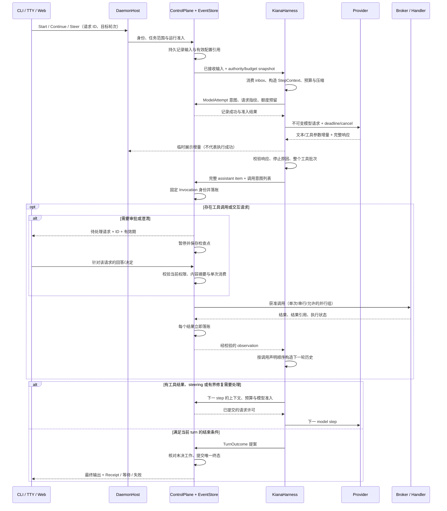

# Roadmap 专项：Harness 专项

> 返回 [Kiana 执行路线图](../roadmap.md) 的总图与当前窗口。本文保留原专项编号、状态、依赖、验收口径和证据限制；专项步骤完成不会自动改变 P 阶段状态。

<a id="harness-runtime-plan"></a>

## 15. Harness：Agent 运行时设计与实施步骤（2026-09-12 追加）

> 范围：补全 [module-map 的 Harness 模块](../module-map.md) 的代码设计、处理流程和实施颗粒度。
> 研究依据：[Harness 调研附录](../harness-runtime-research.md)，包含 `reference/` 72 个项目目录的覆盖清单、重点源码、外部一手资料和研究快照。
> 本节是**待实施设计与验收计划**，所有 H 步骤初始为 ⏳；不表示现有 WIP 已验收。涉及共享契约时，实施步骤同时更新其 canonical 规范和测试。
> 按用户本轮授权，旧版文件中与本设计冲突的“冻结”“只许五个工具”“先等架构决定才写计划”等限制不再阻止本节规划。本文选择保留 ControlPlane 授权、事件事实、权限交集和明确结果状态，作为新设计的基础。此次文档任务不执行产品代码修改、提交或发布。

### 15.1 怎样接到现有路线图

`H01`–`H36` 是本节内的稳定 step ID，**不是新的 P 阶段编号**。每步列出对应原单元；原单元覆盖相同范围时直接补它的实现和验收，不另建竞争实现。H 步骤完成不自动让对应 P 单元完成，后者仍需满足其完整退出条件。

当前执行 agent 继续 §2 的 `P0-J1-05a → 05b → P1-J3-01` 顺序。本节提供它后续的细分工作包；遇到本节列出的 WIP 已经实现，先验证接线与负向场景，再补差额。不要重做已经有精确证据的工作。

本节的源码观察固定在 `db77c24 + 2026-09-12 16:44 +08:00 WIP`，详见调研附录的文件 hash。旧源码、活动 WIP 和未来设计分开记录。

**与 §14 ControlPlane 专项共用合同。** CP 步骤负责共享权威接口及其实现，H 步骤负责 Harness 接线和运行时验收。同一个 P 单元可以同时引用两类证据，不能各建一套 ID、预算账本、审批存储或恢复日志。以下是接口合并点；所需合同及聚焦证据已满足即可推进，不必等待整项 CP 的外围工作全部完成。

| Harness 步骤 | 共用的 ControlPlane 步骤 | 接口交付与边界 |
|---|---|---|
| H02、H19、H34 | CP-02、CP-22、CP-28 | Session→Turn→Run、原生 Continue/Resume、legacy v1 适配与 reader upcast 同一份合同 |
| H07、H08、H16、H33 | CP-11、CP-12、CP-15–CP-17 | BudgetLease、资源 lease/fence、取消与 StopReport；runner 仅持引用及本轮计数 |
| H09–H14 | CP-03、CP-06–CP-10、CP-13、CP-14 | PreparedAction、ControlJournalPort/TransitionBatch、DispatchPermit、审批与执行结果；批次格式校验不等于整批已授权 |
| H18、H23–H25 | CP-06、CP-07、CP-18–CP-20 | 输入 claim、压缩提交、checkpoint 使用同一 journal 与恢复许可；Unknown 进入同一对账流程 |
| H26、H27、H32 | CP-21、CP-22 | Human Inbox、终态、Receipt、cursor 和 UI 投影复用公共事件；等待澄清与审批是不同语义 |
| H29–H31 | CP-24、CP-25 | hook/Memory/MCP/子 Cell 的接入、权限和副作用审查复用主链 |

每个 H step 开工先核对这一行的共享合同；缺失时在对应 CP/P 单元补最小接口并一起验收，不在 runner 创建临时的授权旁路。CP 的 JSONL 事务帧与提交未知处理见 §14.4.4；本节的 invocation、inbox 和 compaction 仅向该合同提交事件。

| 当前可复用的起点 | 本次观察到的缺口 | 细分步骤 |
|---|---|---|
| `KianaHarness`、`RunnerPort`、`ControlPlane::drive_run` 已有主循环 | 生命周期集中在多个 map/临时变量和事件分支里；运行中输入、持久状态边界尚不完整 | H02、H03、H18、H19 |
| `ModelClient`、文本流、usage/stop_reason、多个 Provider adapter | `stop_reason` 主要是元数据；缺完整内容块/终止分类；流和聚合结果需统一校验 | H04–H06 |
| steps、重复调用和 wall-time 配置 | Continue 重置与累计额度关系、静默请求超时、工具等待预算需补齐 | H07、H08、H28 |
| 五工具 schema、串行 `pending_tools`、ControlPlane/Broker | invocation 稳定身份、完整批次记录、可恢复结果、并行与后台句柄需要设计 | H09–H17 |
| `PromptBundle`、`TokenBudget`、角色 prompt、模型路由 WIP | 必须验证真实 wire 请求与预算/指纹一致，避免每步漂移或两次拼装 | H20、H21 |
| `compact.rs` 的确定性裁剪 | 旧工具结果被移除，只生成 `(no summary available)` 占位，不能维持长任务状态 | H22、H23 |
| history/Invocation 投影、checkpoint/restore WIP | inbox、完整调用批次、未决结果、配置版本和 crash window 需贯通 | H13、H24、H25 |
| 审批、CLI/TTY/Web、stream 投影 WIP | 澄清和审批要分开；stop contract、重连、清理和三入口一致性仍需证据 | H26、H27、H32–H36 |

### 15.2 总体职责与代码归属

Harness 的职责是：**在一个已授权的执行上下文中，持续接收输入，构造模型请求，理解模型响应，提出能力申请，接收观测，决定继续、等待或结束当前轮次。** CompanyOS 仍负责目标/工单/独立评审，Provider 仍负责模型协议，Broker 仍负责副作用。

采用“可序列化状态 + 确定性状态推进 + 异步 effect”的实现方式。这里的 effect 是“需要调用模型/申请工具/保存检查点”的内部意图，不是新增一种对外工具。状态推进只计算下一步；Host/Core 驱动已有端口执行它，再把结果送回同一状态机。

| 代码归属 | 拟明确的职责与接口 | 必须避免的重复实现 |
|---|---|---|
| `kiana-domain` | 共享 ID、终止/错误分类、Invocation/输入/上下文引用契约；已有类型优先复用 | 不把 Runner 内部队列、Tokio task 放入领域层 |
| `kiana-runner-protocol` | core 与 runner 之间的 Start/Continue/Steer/Inject/Cancel/恢复命令和 Runner 事件 | 用户 wire 仍归 `kiana-protocol`，不另造入口协议或让请求参数直接成为授权 |
| `kiana-runner/src/harness.rs` | 保留 `KianaHarness` 公共门面；适配旧 RunnerPort 调用 | 不在旧门面旁新增另一种完整 agent loop |
| runner 拟新增 `runtime/{state,transition,driver}.rs` | RunFrame、TurnFrame、ModelStep、状态转移；同一 run 的有界 mailbox、单驱动者 | 不持有 map 锁跨模型/工具 await；不另管 policy |
| runner 拟新增 `response.rs`、`tool_batch.rs`、`outcome.rs` | 响应完整性、批次配对、等待原因、结束判定 | 不执行 shell/MCP 或自行批准工具 |
| `model.rs`、`inbox.rs`、`compact.rs` | 模型边界、输入语义、上下文压缩；必要时按职责拆小 | 不把 summary 或 UI transcript 当恢复权威 |
| `kiana-ports` | 模型/摘要之外的跨层接口、Checkpoint/Artifact/Clock 等必要端口；避免上层循环依赖 | 已有端口能表达时扩展它，不为每个策略新增 trait |
| `kiana-core` | 每次 admission、权限/预算/审批、Invocation 状态、事实写入、终态 CAS、恢复许可 | 不与 runner 各自创建互不关联的调用 ID/状态账本 |
| `kiana-daemon` | 注入 Provider、Context/Artifact/进程服务，管理运行驱动者和订阅者生命周期 | 不因 UI 不同重新拼一套服务 |
| `kiana-capability-broker` 与 daemon handlers | dispatch、sandbox、stdio MCP、结果采集、后台进程所有权 | 普通 tool call 和后台 poll/cancel 均不能绕过授权 |
| `kiana-query` | 版本化检索结果、Memory ACL、代码索引与 freshness | 不把索引实现依赖倒灌进 core |
| protocol/client/entrypoints | 输入 ACK、交互请求、进度、终态与 reconnect 投影 | UI 不推断审批成功、工具完成或业务验收通过 |

上述新文件名是建议落点，H01 开工时按最新源码调整。修改 `Cargo.toml`/`Cargo.lock` 仅在确需依赖时由集成负责人统一处理；纯状态机实现先使用现有依赖。

### 15.3 一次任务的完整流程



附加规则：用户在模型流、工具执行或压缩期间仍能提交输入；取消能打断静默 I/O；审批等待不会发送新的模型请求；重启仅重建状态，显式恢复后重新授权；工具结果未知时进入对账，不能自行重跑。

### 15.4 身份、状态与结束语义

现有 `Continue` 复用 `RunId`，因此不能同时把每次 `run.completed` 都解释为永远不可续跑的 run 终态。新设计采用平台目标的 `Session → Turn → Run → Invocation → CapabilityExecution`：原生 Continue 创建新 Turn/Run，暂停后的 Resume 保留原 Run；旧 v1 Continue 单独保留兼容行为。已有 `TurnId/InvocationId/ExecutionId` 直接复用，仅新增缺失的关联字段和必要的 Step/ModelAttempt 契约。

| 身份 | 生命周期 | 唯一性与重试 |
|---|---|---|
| `SessionId` | 用户/工作区的长期会话容器 | 不能跨 owner、project 复用 |
| `TurnId` | 一次新用户需求或显式 Continue，从接收到等待/完成/失败 | 与 Session 关联；Steer/Inject/approval resume 不创建新 turn |
| `RunId` | Turn 内的一次已准入执行；新路径终态不可复活 | 每 Run 恰好一个终态；Resume 保持身份，新 Continue 创建新 Run 并引用 predecessor |
| `StepId` | 一次“请求模型→接受完整响应→结清本批工具”的逻辑迭代 | 模型网络重试只增加 attempt，不伪造新的用户 turn |
| `ModelAttemptId` | 一次实际 Provider 请求 | retry/compact 的费用、延迟和错误分别记录 |
| `InvocationId` | 一个稳定的能力执行意图 | 服务端生成，派发前固定；Provider 的 `call_id` 只在所属 assistant item 内配对 |
| `ExecutionId` | 某 Invocation 下的实际执行 attempt | 与 permit、资源 fence、停止回执和结果绑定；重试获得新 attempt，不冒充旧结果 |
| `InputId` / `InteractionId` | 被接收输入 / 待回答澄清或审批 | ACK、重放、取消和单次消费必须去重 |

`RunClosed` 表示执行上下文关闭/retire；`TurnFinished` 是本轮结果的上层投影，后续 Continue 仍可接着同一 Session 的上下文创建新 Run。新原生路径保留 `run.completed/failed/cancelled` 的终态含义，新增 turn 关联。旧 v1 的同 RunId Continue 用显式 legacy 合同及 reader upcast 解读，不把旧事件重写为新保证。缺少足够 turn 边界的历史只读展示，不猜测可恢复位置。

| 内部阶段（建议名） | 允许的下一步 | 需要检查的结束/拒绝条件 |
|---|---|---|
| `Idle` / `Queued` | 接收输入、创建 turn、取消排队请求 | 重复输入返回原 ACK；不静默丢弃已接收请求 |
| `Preparing` | 构造上下文、压缩、模型准入 | 无额度/不可用模型/不可读资料明确失败或带已声明降级 |
| `ModelPending` | 消费流、完整响应、Steer 入队、Cancel | 无合法结束信号的 EOF、截断的工具参数不得派发 |
| `ToolPending` | 串行/有界并行派发，接收结果 | 所有调用均有配对；旧 epoch/重复/错 run 的结果不能推进当前状态 |
| `AwaitingApproval` / `AwaitingInput` | 对应决定、超时、取消、重启后重建 | 不是工具失败，也不是任务完成；沉默不推进 |
| `Compacting` | 提交新上下文视图或保留旧视图 | 摘要失败不能清空唯一可用历史；期间输入不可丢 |
| `Cancelling` | 排空未启动调用、确认执行器停止 | 未确认停止的副作用只能为 Unknown |
| `TurnFinished` | 同 Session 新 Turn/Run 的 Continue 或 close | 不复活已终态 Run；模型自述不等于工单验收 |
| `RecoveryRequired` | 展示待对账/恢复材料，由 core 决定 | 不把 snapshot 可解析等同于可以继续执行 |

这些是内部设计名，不直接把已有 `ExecutionStatus` 全部重命名。H02/H05 确定 wire 映射，H34 验证旧 reader、cassette 和命令兼容。

### 15.5 必须在实现中说清的细节

**模型与错误。** 将 `end_turn/stop`、`tool_calls`、`length/max_tokens`、`refusal`、`cancelled`、`transport_incomplete`、`provider_error` 归一化；保留 provider 原值供诊断。错误至少包含 `code / phase / retry_class / side_effect_state / safe_message`，不再通过字符串包含关系决定 Unknown。网络重试、格式修复、工具失败后的模型修复、摘要重试分别计数；所有重试共享上层预算。纯模型传输失败并不意味着工具副作用未知，但已经派发、未收到可信终态的工具必须 Unknown。

**工具批次。** 一条完整 assistant item 可声明多个工具。先验证整个列表的 JSON、schema、ID、目录版本、参数配额，再固定批次和 Invocation 身份，最后逐个授权派发。并行只用于 descriptor 允许且资源兼容的调用；不依据模型声称“只读”推断 shell 可并行。默认采用串行屏障，只有证实独立的调用进入受限池。结果按**实际完成顺序落账**，按**声明顺序形成模型上下文**；等待前序调用不能阻止后序已完成结果持久化。

**上下文。** 每个 step 都有一个 `ResolvedStepContext`，记录 role/prompt/provider/tool catalog/authority epoch/workspace revision/检索来源及 hash。组装顺序为产品与角色指令 → 当前用户目标和约束 → packet/plan 状态 → 可验证进度摘要 → 当前所需检索 → 近期完整消息组；具体 wire 布局由 Provider adapter 决定。授权 snapshot 用于一致性，不能代替 dispatch 时的实时检查。

**压缩。** 优先外置大型结果、剔除可重新获取的重复资料；仍超预算时生成带来源的结构化摘要，保留目标、约束、已完成动作/验证、文件 revision、未完成工作和下一步。近期 assistant/tool 组保持完整。摘要没有更高指令权威，不能自行产生 grant、把未决调用写成成功或替代真实验证。压缩生成与提交分开，提交时检查源事件游标；摘要失败原子回退，仍超预算就暂停并说明原因。Provider 原生不透明 compact item 通过专门 adapter 原样保存和传递，不解析其内部。

**时间与预算。** 区分每 turn 步数/活跃执行时间、单 Run 额度、同任务 Run 链/项目的累计 token/调用/重试总额、审批有效期、单次工具超时、Provider connect/idle/total deadline。Continue 只重置已声明的 turn 额度，新 Run 继续消耗同一上层 BudgetLease/预算主体的剩余额度。等待人工输入默认暂停活跃执行时间，但审批绝对到期时间和任务总截止时间继续；时间字段和策略版本写入证据。未知 usage 不按零计费，优先保守预留后结算。

**流与事实。** 文本/工具进度可以是临时展示；完整响应、能力决定/结果、交互、压缩提交和终态是持久事实。UI 断开不取消后台工作；用户 Cancel 才进入取消链。订阅者过慢时丢弃/合并临时 delta 并报告 gap，通过 snapshot 重建；持久事实写失败必须停止后续副作用。用 `epoch + cursor + item_id` 避免重连重复展示，控制结果和最终输出只有一个提交入口。

**长工具与清理。** 后台 shell/MCP 调用返回持久 JobHandle，poll/stdin/terminate 是经授权的后续操作；不要把一次轮询当另一次启动，也不能从 PID 猜测跨重启所有权。持久化进程身份、输出游标与停止证据；无法证明原进程身份时进入恢复流程。关闭任务时 join/清理 model future、工具任务、子进程、锁和预算；保留 Unknown 所需的对账记录。

### 15.6 推荐实施顺序与合并点

| 批次 | 顺序 | 可验收的增量 |
|---|---|---|
| A 内核 | H01 → H02 → H03 → H04 → H05 → H06 → H07 → H08 | 单 run 状态清楚；停止/流/预算/取消不产生假成功 |
| B 工具闭环 | H09 → H10 → H11 → H12 → H13 → H14 → H15 → H16 → H17 | 工具身份稳定；暂停、并行、后台任务均可追踪 |
| C 输入与上下文 | H18 → H19 → H20 → H21 → H22 → H23 | 用户可中途补充；压缩后仍知道已做和未做的事 |
| D 恢复与交互 | H24 → H25 → H26 → H27 → H28 | 断点恢复、澄清、结构化结束和停滞处理可解释 |
| E 集成 | H29 → H30 → H31 → H32 → H33 → H34 | 扩展/记忆/子任务复用主链，UI 和资源生命周期一致 |
| F 验收 | H35 → H36 | 固定场景回放、性能边界、三入口和真实模型证据 |

以上是便于单 agent 顺序推进的默认排法；不要求把所有原 P0–P4 单元先做完。每步依赖的是列出的接口/能力及其证据。已有实现可以缩短步骤，但不能仅凭类型存在就跳过。下面的测试名都是**拟新增或拟强化的验收名**，不存在的 target 必须由相应步骤创建；不是本次运行记录。

### 15.7 详细 step 卡

<a id="step-h01"></a>

#### H01 — 固定接线基线与可执行验收骨架　⏳

**关联原单元**：`P0-J1-05a/05b`、`P0-G-04`、`P1-L1-01`。**依赖**：无；这是源码对账步骤。

1. 记录最新 HEAD、相关 WIP hash、现有测试 target；从 CLI/Host 一直画到 Provider/Broker/Receipt 的实际调用链，逐项核对本节缺口仍否存在。
2. 为 runner 建拟新增 `tests/harness_contract.rs`，为 daemon 建 `tests/harness_runtime.rs`；加入可阻塞模型、可计数 Broker、事件写入故障、注入时钟等测试夹具，保留现有 scripted/cassette 测试。
3. 建立“步骤→原单元→实现符号→测试→证据”表；把本节的生命周期/新接口同步到相应领域、平台规范，不靠改旧断言掩盖冲突。

**先拒绝**：`untrusted_run_never_reaches_model_or_broker`、`runner_event_for_other_run_is_rejected`。**再成功**：`host_model_tool_result_next_step_receipt_roundtrip`，断言真实模型调用次数和 handler 效果。
**交付**：稳定基线和可运行夹具；已有失败分为基线遗留/本步相关，不能声称本步骤已完成后续功能。

<a id="step-h02"></a>

#### H02 — Session / Run / Turn / Step 的身份与生命周期　⏳

**关联原单元**：`P0-A-01a/01b`、`P0-B-01`、`P0-J1-01`。**依赖**：H01。

1. 复用 ID 注册表已有 TurnId/InvocationId/ExecutionId，补 StepId/ModelAttemptId 与必要关联；采用 Session→Turn→Run 的新语义，Run 不作为可无限复活的聊天容器。
2. 新版本 Start/Continue 创建 Turn/Run；Steer/Inject/审批恢复保持原 Turn/Run；同一 session 的用户输入按接收顺序排队，不让两个驱动者竞争当前 turn。
3. core 对原生 Run 终态 CAS 去重，TurnOutcome 从其结果投影；旧 v1 Continue 的公共 RunId/返回值保持明确的 legacy 测试。列明 reader upcast 与请求能力协商，保留历史查询。

**先拒绝**：`duplicate_run_terminal_is_rejected`、`late_result_cannot_complete_a_new_turn`、`continue_closed_run_requires_new_admission`。**再成功**：`native_continue_creates_new_run_while_legacy_contract_is_preserved`。
**交付**：身份/状态转移表、旧事件解释规则；不得把完成一次模型请求解释成完成用户 turn。

<a id="step-h03"></a>

#### H03 — 将 KianaHarness 收敛为单一状态驱动器　⏳

**关联原单元**：`P0-B-01`、`P0-J1-01`。**依赖**：H02。

1. 从 `harness.rs` 提取可序列化 `RunFrame/TurnFrame` 和确定性的 `transition(state, input) -> intents`；时间、ID 分配和外部结果都是输入，纯转移函数不做 I/O。
2. 每个 run 使用有界 mailbox 与一个 driver；下一用户 turn 的队列归 Session/Host，不随旧 run 终止而销毁。模型 await 时仍保留可寻址的 handle，明确 queue 满时的结构化拒绝。
3. 旧 `RunnerPort::send/send_with_events` 都适配到同一 driver；把原 `model_step` 递归改为显式迭代/调度，保留既有能力请求回 ControlPlane 的路径。

**先拒绝**：`second_driver_for_same_turn_is_rejected`、`full_mailbox_does_not_drop_accepted_input`。**再成功**：`blocked_model_does_not_block_other_run_or_cancel`、`stream_and_buffered_calls_share_transitions`。
**交付**：小型职责模块与门面兼容；不能在提取模块时留下第二份分支状态机。

<a id="step-h04"></a>

#### H04 — 结构化模型消息与无损 Provider 转换　⏳

**关联原单元**：`P0-A-01b`、`P0-J7-01`、`P1-J2-01`。**依赖**：H03。

1. 演进 `ModelMessage/ModelOutput`，保留现有 text/tool_calls cassette 的解码；新内容可表达文本、工具声明、工具结果、允许的附件引用和 provider continuation 数据。
2. provider-specific signature/opaque item 绑定所属消息、路由与版本；不要合成、跨模型搬运或展示不可读内部数据。附件先实现受控引用；尚不支持的模态明确拒绝。
3. daemon adapter 负责转成 wire；模型上下文与 UI 文本视图分开，敏感数据使用既有脱敏/受保护引用机制，不能为了重放把秘密抄入普通事件。

**先拒绝**：`opaque_item_cannot_cross_provider`、`unsupported_content_block_fails_before_request`、`orphan_tool_result_is_rejected`。**再成功**：`legacy_cassette_and_typed_items_roundtrip`。
**交付**：有版本的消息编码和每个已接 Provider 的转换 fixture，不能仅测 Rust 内部 serde。

<a id="step-h05"></a>

#### H05 — 统一停止原因、错误与重试分类　⏳

**关联原单元**：`P0-A-02`、`P0-J7-01`、`P1-J8-01`。**依赖**：H04。

1. 给模型响应补归一化 StopReason 与完整性标记，映射各 adapter 的原始 stop/finish/error；Fake 明确产生正常结束，旧 cassette 缺字段走受限兼容策略。
2. 区分 transport retry、model format repair、tool repair、context repair、terminal failure；由 typed error 指定范围，不再通过错误字符串猜是否该重试。
3. 文本被 length 截断、拒答、流未完整关闭均不能进入正常完成；有工具的截断响应整批不执行，保留可诊断的响应记录。

**先拒绝**：`length_stop_never_dispatches_tools_or_completes_turn`、`refusal_is_not_success`、`unknown_stop_reason_fails_closed`。**再成功**：`normal_text_stop_finishes_and_tool_stop_continues`。
**交付**：停止/错误/CLI/wire 映射表；现有 incomplete-stream 拒绝语义继续保留。

<a id="step-h06"></a>

#### H06 — 一个流归一化器产生增量与完整响应　⏳

**关联原单元**：`P0-J7-01`、`P4-J7-02/03`。**依赖**：H05。

1. 用 item ID/index 和 attempt ID 组装 TextDelta、ToolArgumentsDelta、Usage、Stop；分片 JSON 只作缓存，完整结束且参数校验通过后才产生工具意图。
2. 给参数/text/event 数量设配额；处理空 chunk、多字节边界、交错工具块、usage 缺失、重复结束和冲突字段；完整输出由同一 accumulator 产生，不维护两套拼接逻辑。
3. 区分 model attempt 的结束和 turn 的结束；临时文本失败时显示中断状态。取消 fence 生效后不再发布晚到内容。

**先拒绝**：`split_invalid_tool_json_has_zero_dispatches`、`eof_without_stop_never_completes`、`late_delta_after_cancel_is_discarded`。**再成功**：`interleaved_tool_deltas_equal_nonstream_response`。
**交付**：每个 provider 的 wire fixture 与流/非流一致性回执；不能只断言最终字符串包含目标文本。

<a id="step-h07"></a>

#### H07 — 贯通预算配置、预留与累计结算　⏳

**关联原单元**：`P0-J1-05a/05b`、`P1-K5-01`。**依赖**：H05。

1. 先验收现有 role/env/constructor 配置链；非法零值、溢出、非数字 fail-closed。记录配置优先级与来源，最终额度受 authority、role、packet 和部署上限约束。
2. 把模型步骤、attempt、tool 调用、修复、压缩、时间、token 的预算分开；模型请求前预留，usage 返回后结算，失败尝试仍计数，缺 usage 标记 unknown/estimated。
3. 复用 CP-11 的预算预留与模型准入许可；Continue 只重置 turn 层，新 Run 不清零上层任务链/项目的累计消费。tool/Provider 内部重试不可绕过预算；人工等待与绝对 TTL 使用 §15.5 的策略并测试。

**先拒绝**：`continue_cannot_reset_task_chain_total_budget`、`provider_retries_consume_attempt_budget`、`invalid_effective_budget_never_calls_model`。**再成功**：`role_limits_reach_two_product_runs_without_leakage`。
**交付**：预算来源、每次预留/结算和超限原因可在 Receipt 对账，补齐当前 `05a/05b` 而非重写它们。

<a id="step-h08"></a>

#### H08 — 将 deadline 和取消贯穿静默 I/O　⏳

**关联原单元**：`P0-J1-01/03/04`。**依赖**：H03、H06、H07。

1. 每 turn/attempt/invocation 使用可传播的取消信号；选择最早到期 deadline，Provider connect/read/idle、重试 backoff、MCP 与 shell 都消费剩余时间。
2. 模型永不吐 delta 时也能通过 `select!/timeout` 中止；取消控制信号与普通 mailbox 容量分离，清理工作使用有界独立期限。
3. core 区分“已请求取消”“停止已确认”“结果未知”；已完成结果不被晚到取消改写，未确认进程组停止不返回确定性取消成功。

**先拒绝**：`silent_model_is_interrupted_by_deadline`、`cancel_during_retry_wait_prevents_next_attempt`、`unconfirmed_tool_stop_is_unknown`。**再成功**：`cancel_reaps_process_group_and_records_one_turn_terminal`。
**交付**：取消时序和停止证据；保留现有 `cancelling_mid_stream_never_completes_or_emits_a_late_delta` 语义。

<a id="step-h09"></a>

#### H09 — 工具目录成为单一、可版本化的数据源　⏳

**关联原单元**：`P1-H-01/02`、`P1-J4-01`。**依赖**：H04、H05。

1. 复用 WIP `tool_catalog`，统一模型 schema、wire name、Capability 映射、参数/结果 schema、风险、输出上限、执行模式和 replay 分类。
2. 每 step 固定 `ToolCatalogSnapshot`；模型可见性由角色/任务/Provider 能力筛选，真正 dispatch 仍检查当前 policy。目录变化使旧审批失效或重新确认，不能悄悄换实现。
3. 先迁移现有五个工具，建立可扩展注册流程；以后确需 `artifact.read`、澄清或任务工具时由 descriptor+Broker 接入，不继续把“五个”当硬编码架构上限。

**先拒绝**：`unadvertised_tool_and_wire_name_collision_are_rejected`、`catalog_change_cannot_reuse_old_approval`。**再成功**：`schema_mapper_and_broker_resolve_same_tool_version`。
**交付**：目录版本/别名快照和映射测试；本步不批量接入历史工具集合。

<a id="step-h10"></a>

#### H10 — 一次生成、全程稳定的调用身份　⏳

**关联原单元**：`P0-G-02a/04`、`P1-H-02`。**依赖**：H02、H09。

1. 解析完整 assistant batch，验证空/重复 call ID、参数深度/大小、schema、缺失工具；任何格式无效在整批派发前被发现。
2. 用 `(run_id, turn_id, step_id, assistant_item_id, ordinal)` 绑定服务端 InvocationId；保留 provider call ID 仅用于协议配对，跨 step 的同名 call ID 不被误当同一次执行。
3. `capability_for_tool` 拆为确定性解析/映射与显式身份分配；预检查、emit、checkpoint、恢复不重新生成 request ID，记录原始参数 hash 和执行参数 hash。使用 CP-03 的 PreparedAction 规范化合同，hook 或默认值改变执行参数后必须重新决策。

**先拒绝**：`invalid_second_call_prevents_all_batch_dispatch`、`duplicate_call_id_in_one_message_is_rejected`。**再成功**：`invocation_identity_survives_queue_approval_and_restore`。
**交付**：完整批次的稳定身份表；不能只修正当前 pending 首项来掩盖前后不一致。

<a id="step-h11"></a>

#### H11 — 工具结果分类与给模型的可修复反馈　⏳

**关联原单元**：`P0-A-02`、`P1-H-02`、`P2-K6-01`。**依赖**：H05、H10。

1. 在已有 CapabilityResult/Outcome 上区分 succeeded、failed_known、denied、cancelled_not_started、unknown、pending；复用共享错误枚举，避免一套 bool 加随意字符串。
2. 已确认的命令非零退出/patch 上下文冲突可作为结构化 observation 给模型修复；policy deny、过期授权、未知结果不自动重试同一意图；整个 turn 是否阻断由 core 判定。
3. 结果包含调用身份、执行状态、exit code、摘要/完整内容引用和可重试类别；外部输出永远是数据，不能作为系统指令注入。

**先拒绝**：`unknown_result_never_triggers_automatic_retry`、`tool_output_cannot_grant_permissions`。**再成功**：`failed_test_observation_allows_bounded_model_fix`。
**交付**：失败处理矩阵以及每种状态的模型视图/UI/wire 映射，证明出错可继续与必须停止的分界。

<a id="step-h12"></a>

#### H12 — 串行批次先完整闭环，再考虑并行　⏳

**关联原单元**：`P0-J1-02`、`P0-G-02b`。**依赖**：H08、H10、H11。

1. 将 `pending_tools` 改为有 phase 的批次：declared/queued/dispatched/settled；批次完整声明进入事实，再按顺序逐个提交 ControlPlane。
2. 当前批次全部有合法 observation 后才请求下一模型 step；错 ID、重复结果和旧 epoch 结果不能弹出合法 pending 或触发下一个工具。
3. 取消时给每个确定未启动的调用生成带 `not_executed` 的结果；被拒绝后的依赖/尚未启动兄弟调用按 core 的阻断策略收口，不伪造执行过的结果。

**先拒绝**：`wrong_result_does_not_consume_pending_call`、`cancelled_batch_never_dispatches_remaining_calls`。**再成功**：`three_serial_calls_produce_three_ordered_results_before_model`。
**交付**：批次配对完整的 history/Receipt；后续并行和恢复以此语义为基线。

<a id="step-h13"></a>

#### H13 — Invocation 账本与结果立即持久化　⏳

**关联原单元**：`P0-G-04`、`P1-J8-01`。**依赖**：H10、H11、H12。

1. 通过 CP-06/CP-07 的 ControlJournalPort/TransitionBatch 记录 declaration、admission、dispatch intent、outcome 与上下文放置游标，派生已有 Invocation 投影。只在持久提交确认并取得 CP-13 的 DispatchPermit 后调用 Broker；写失败或提交结果未知均不得执行。
2. 每个可信结果到达立即持久化，形成 `outcome_ready` 等价状态；history materialization 可稍后进行，但重启不能把已落盘结果重跑。
3. 以稳定 InvocationId/CAS 处理重复回包；dispatch 之后结果未落账的崩溃窗口保持 Unknown，提供 reconciliation 引用。明确不承诺任意外部副作用 exactly once。

**先拒绝**：`event_append_failure_prevents_dispatch`、`crash_after_effect_before_outcome_requires_reconciliation`。**再成功**：`persisted_outcome_is_reused_without_reexecuting_tool`。
**交付**：逐个 crash window 的状态表、事件和 effect 计数；只读 Invocation 投影本身不算本步完成。

<a id="step-h14"></a>

#### H14 — 审批暂停与原调用恢复　⏳

**关联原单元**：`P0-F-01/02/03`、`P0-G-03`。**依赖**：H12、H13。

1. 复用 pending approval 和 WIP checkpoint 路径，保存原 Invocation、批次剩余调用、Turn/Step、参数 digest、目录/authority epoch；等审批时不给模型伪造 tool failure。
2. 回答绑定审批 ID、owner、nonce/digest、有效期；执行前重新检查 path lock、资源版本、授权与预算，审批决定和消费可去重。
3. 同进程获批后恢复原调用，再接下一工具或模型 step；拒绝/取消/过期收口相关 pending。跨重启的实际恢复由 H24/H25 补齐。

**先拒绝**：`expired_or_changed_approval_never_dispatches`、`duplicate_approval_reply_executes_at_most_once`。**再成功**：`approval_resume_keeps_turn_step_and_invocation_ids`。
**交付**：CLI/TTY/Web 可关联同一 pending；若某入口非交互，只返回明确等待状态和后续处理方式。

<a id="step-h15"></a>

#### H15 — 工具输出有界、完整结果可按需读取　⏳

**关联原单元**：`P1-H-03`、`P2-K4-01`、`P2-K7-01`。**依赖**：H09、H11、H13。

1. handler 采集 stdout/stderr/MCP result 时设置内存、磁盘、行数和字节上限；在数据流入时限额，不等全部读入内存后再截断。
2. 完整可保存内容先脱敏/按密级存入受保护 Artifact，模型接收摘要、截断说明、hash 和 ArtifactRef；过大或不能保存时明确说明丢失范围，不能称“完整结果”。
3. 增加经 descriptor/Broker 的分段读取操作，支持 offset/limit 和稳定游标；读权限按 run/project/数据生命周期验证，不让模型访问任意内部路径。

**先拒绝**：`huge_tool_output_is_bounded_before_buffering`、`artifact_from_other_run_is_denied`、`expired_output_reference_is_not_returned_from_cache`。**再成功**：`truncated_result_can_be_read_in_verified_pages`。
**交付**：内存/磁盘峰值、引用完整性、删除传播测试；二进制输出用类型化引用而非胡乱解码。

<a id="step-h16"></a>

#### H16 — 有界并行工具组与独占屏障　⏳

**关联原单元**：`P1-H-01/03`、`P0-J1-02`、`P1-K5-01`。**依赖**：H08、H09、H12、H13、H15。

1. descriptor 定义执行模式和资源访问声明；在 core/Broker 中调度，未知资源集、任意 shell、写操作先独占。并行额度取 run、部署与角色上限的交集。
2. 给可证明独立的调用用有界 pool；独占调用前 drain，之后才启动下一组。每个调用临执行前重新检查授权，不能让整批首个 allow 覆盖其余调用。
3. 结果到达即按 H13 落账，按 ordinal 形成模型历史；队头阻塞时限制已完成结果缓存，Cancel/deny 阻止尚未派发工作。

**先拒绝**：`write_barrier_never_overlaps_prior_reads`、`revocation_blocks_not_started_parallel_call`、`crash_with_later_outcome_ready_does_not_rerun_it`。**再成功**：`independent_reads_overlap_but_history_is_source_ordered`。
**交付**：用 barrier/计数器证明并发与排序，不能仅靠总耗时推断并行；并发=1 与 H12 行为一致。

<a id="step-h17"></a>

#### H17 — 后台进程和长工具的可恢复句柄　⏳

**关联原单元**：`P1-H-03`、`P0-J1-03`、`P2-K6-01`。**依赖**：H08、H13、H15。

1. 给 shell 长任务定义 start/poll/stdin/terminate 的 capability operation，JobHandle 绑定起始 Invocation、run/turn、project、authority epoch、进程组与进程启动身份。
2. start 一次，poll 返回带 cursor 的新增输出和 running/exited/unknown；模型等待仍计入受限等待预算，不用重复 shell.start 伪装轮询。每次 poll/stdin/terminate 有独立 Invocation/Execution 与许可，关联同一 JobHandle 和起始调用，不能复用已消费的 start 许可。
3. turn 结束默认清理其拥有的临时任务；需持续运行的服务必须有显式 owner/lease/TTL。重启时 PID 不足以认领进程，无法验证归属时交恢复处理。

**先拒绝**：`foreign_job_handle_cannot_receive_stdin_or_cancel`、`pid_reuse_cannot_attach_to_other_process`、`poll_does_not_restart_job`。**再成功**：`long_command_has_one_job_and_distinct_operation_invocations`。
**交付**：启动/输出/完成/停止证据和 CLI/TTY/Web 可见状态；后台化不是取消或 Unknown 的逃生口。

<a id="step-h18"></a>

#### H18 — 持久 Inbox、ACK 与原子消费　⏳

**关联原单元**：`P0-G-02a/02b`、`P0-G-04`、`P1-E-01`。**依赖**：H02、H03、H13。

1. `InboxMessage` 增加 InputId、source、target、目标 turn、接收序号；NextTurn 与 NextStep 分开。输入通过 core 验证并落账后 ACK，同 InputId 重发返回原 receipt。
2. claim 与所属 turn/step 的输入记录在同一 TransitionBatch 提交；在 claim 后崩溃，恢复能确定输入已归哪个 step，而不是删掉后找不到。大 payload 先持久保存受保护引用，再提交 claim，不能用内存队列出队代替消费事实。
3. 持久记录撤回/取消的接收序号边界；Cancel 前已接收和 Cancel 后新输入分清。checkpoint 包含队列/claim 游标；队列满时返回 backpressure，不静默覆盖。

**先拒绝**：`crash_between_claim_and_request_does_not_lose_input`、`duplicate_input_is_consumed_once`、`cross_turn_steering_is_rejected`。**再成功**：`queued_followups_survive_restart_in_accept_order`。
**交付**：输入从 accepted 到 consumed/discarded 的可查状态；不要直接让外层调用 runner.steer 绕过身份和记录。

<a id="step-h19"></a>

#### H19 — Continue / Steer / Inject 的产品接线　⏳

**关联原单元**：`P0-M1-01`、`P1-E-01`、`P2-M3-01`。**依赖**：H08、H18。

1. 协议经能力协商 additive 扩展：原生 Continue 表示下一 Turn/Run，显式恢复仍用 Resume；Steer 指向 `expected_turn_id`，在下一安全边界影响当前工作；Inject 提供带来源的上下文、不唤醒 idle turn。旧 v1 Continue 由兼容适配器保留原公共返回值。
2. CLI/TTY/Web 通过同一 client/host 调用；模型流、工具、审批或压缩期间都可接收输入并看到 accepted/queued 状态，不因 `ActiveRun` 暂时移出 map 报不存在。
3. Steer 不修改当前已派发工具的参数或权限；强制停止当前动作必须显式 Cancel。到达终态的竞态由 core 接收序号裁决，失败时提示当前 turn 而非偷偷创建新 turn。

**先拒绝**：`steer_cannot_change_sandbox_or_model_profile`、`stale_turn_steer_does_not_target_next_turn`。**再成功**：`steer_during_stream_is_seen_by_next_step_without_duplicate_prompt`。
**交付**：三入口同一语义的交互回执；inject/steer/follow-up 不再只是测试可调用的 helper。

<a id="step-h20"></a>

#### H20 — 不可变 StepContext 与可解释的上下文编译　⏳

**关联原单元**：`P1-J2-01/03/04`、`P1-C-03`、`P1-L4-01`。**依赖**：H04、H09、H18。

1. 复用 PromptBundle 和 role packs，将角色、operator/project 资料、packet、当前目标/steering、历史摘要、检索资料编译为 ContextPlan；每项注明来源、权限范围、revision、优先级和 token 估计。
2. 生成唯一 `ResolvedStepContext`，固定 Provider/model profile、prompt bundle/hash、目录版本、workspace revision；计算预算和实际发送复用同一对象，避免 `request_context()` 与 `complete()` 分别读到不同环境。
3. 系统/角色规则与不可信文件、Memory、tool output 明确分层；按需加载技能/代码资料，记录采纳/剔除原因。Provider 原生 wire 前缀变化必须可观察。

**先拒绝**：`untrusted_project_instruction_never_enters_privileged_section`、`route_change_between_estimate_and_send_is_fenced`。**再成功**：`same_step_snapshot_renders_same_request_and_provenance`。
**交付**：真正送到 fake provider 的请求断言和 ContextPlan 解释；不是只检查 PromptSection 存在。

<a id="step-h21"></a>

#### H21 — 真实请求预算与稳定缓存前缀　⏳

**关联原单元**：`P1-J2-02`、`P1-K5-01`、`P4-L3-01`。**依赖**：H07、H20。

1. 预算覆盖 system、role、历史 content blocks、tool schemas、附件开销、provider framing 与输出预留；输出 cap 与预留使用同一有效配置，不能两个固定常量各算各的。
2. 支持 provider/tokenizer 的精确计数能力；缺失时使用显式标记的保守本地估计和余量，不把 bytes/4 或固定 framing 宣称成任意模型的硬上界。CJK、代码、emoji、长 schema 都有边界 fixture。
3. 固定稳定前缀顺序和工具顺序；检索/时间等动态资料放适当后缀。缓存 key 包含 profile/prompt/catalog/数据版本；权限收紧或数据删除后不能复用失效内容。

**先拒绝**：`huge_schema_or_system_prompt_exhausts_request_budget`、`cache_hit_cannot_bypass_data_revocation`。**再成功**：`context_fits_actual_wire_budget_and_preserves_stable_prefix`。
**交付**：估算/实际 usage 差值、预算覆盖项和缓存失效原因；不预设节省比例。

<a id="step-h22"></a>

#### H22 — 真正保留工作状态的 Compaction　⏳

**关联原单元**：`P1-J2-01/02`、`P1-J3-03`、`P1-L1-01`。**依赖**：H05、H11、H15、H20、H21。

1. 将 compact 分为 plan/generate/validate：先外置大结果和去重复，再选择较旧的完整消息组；保留 system/role、最新目标、未决输入及近期完整 assistant/tool 组。
2. 定义版本化 `CompactSummary`：goal、constraints、decisions、completed actions、verification refs、workspace revisions、pending work、next action、source event range。真实摘要经已准入的 ModelClient 请求生成，purpose=compaction、tools 为空，使用独立且有界的预算。
3. 摘要只允许引用存在的证据，不改变 Invocation/approval/任务状态；校验来源、容量、最近指令和边界。摘要失败可尝试一次受限重试或保留原视图；仍超上下文就暂停，不能用无摘要占位继续失忆执行。

**先拒绝**：`summary_cannot_forge_completed_tool_or_approval`、`compaction_keeps_pending_pairs_and_latest_goal`。**再成功**：`agent_continues_task_after_two_compactions_without_repeating_completed_edit`。
**交付**：替换当前占位压缩器的产品证据；验证保留语义和后续行为，而不仅是 token 数下降。

<a id="step-h23"></a>

#### H23 — 压缩结果提交、来源和失效传播　⏳

**关联原单元**：`P0-G-02b/04`、`P2-K7-01`、`P4-L3-01`。**依赖**：H13、H18、H22。

1. 摘要 artifact 先完整保存并验证 hash，再以源事件 cursor/上下文 revision 做 CAS，记录 `compaction.applied` 的等价事实；确认提交后才切换有效视图，旧事实仍可查询。
2. 压缩期间的新输入进入 Inbox；提交时若源范围已变化，保留新输入/安全合并或重建计划，不能让晚到摘要覆盖它。失败留下的无引用 artifact 按正常 GC 回收。
3. 记录摘要使用的 source IDs、prompt/profile/hash、预算和旧/新 context revision；源数据撤销/删除使衍生 summary/cache 失效。原生 opaque compact 支持按 provider 能力启用，切换模型需要重新编译上下文。

**先拒绝**：`crash_before_compaction_commit_keeps_old_context`、`stale_summary_cannot_overwrite_new_steering`、`revoked_source_invalidates_summary`。**再成功**：`compacted_context_rebuilds_to_same_view_after_restart`。
**交付**：先保存 artifact、再提交引用这一顺序的 crash fixture、摘要来源链和恢复视图；这不是跨存储的分布式两阶段提交，artifact 文件存在不等于视图已提交。

<a id="step-h24"></a>

#### H24 — 完整检查点与显式 Resume　⏳

**关联原单元**：`P0-F-03`、`P0-G-03/04`、`P2-K6-01`。**依赖**：H13、H14、H17、H18、H23。

1. 补齐 WIP RunSnapshot/HarnessCheckpoint：Turn/Step、状态、完整批次与 outcomes、history/summary 引用、Inbox 游标、pending interaction、累计预算、deadline、配置/授权版本、JobHandle 和 source cursor。
2. 启动时只折叠并标记可恢复/待对账，不自动发网络请求。显式 Resume 校验 owner、ProjectTrust、当前目录/权限/角色、path lock、过期审批、数据引用和 checkpoint schema；只取得一个持有 fencing token 的恢复驱动者。
3. 恢复到同一 driver 的安全边界：有可信 outcome 则重放结果，有 pending approval 则等待，有 dispatch 无结果则对账；不能盲目调用 Start 从头再执行。

**先拒绝**：`stale_checkpoint_or_second_resumer_cannot_dispatch`、`missing_source_or_revoked_authority_blocks_resume`。**再成功**：`new_daemon_resumes_pending_approval_with_original_tool_queue`。
**交付**：跨进程结果和 effect 计数；旧 snapshot 缺字段应明确只读/迁移/拒绝，不用默认空 inbox 隐藏材料缺失。

<a id="step-h25"></a>

#### H25 — 重放、故障注入与 Unknown 对账　⏳

**关联原单元**：`P0-G-04`、`P2-K6-01`、`P1-L1-01`。**依赖**：H13、H16、H23、H24。

1. 建立 replay-only 模式：模型回复、时间、随机 ID 和工具结果来自记录；模型、Broker、网络适配器被替换为“若被调用则失败”的端口。
2. 在输入 ACK/claim、model response 接受、dispatch intent、工具副作用后、outcome 落账后、compaction CAS、terminal 写入前后设置 failpoint，比较恢复状态和 effect 次数。
3. 对账流程按实际执行器读取可验证证据：本地文件 revision、受保护 JobHandle 等；证据不足保持 Unknown。人工决定是新增事实，不覆盖未知记录或伪造旧工具结果。

**先拒绝**：`replay_never_calls_model_or_real_broker`、`contradictory_terminal_or_result_blocks_recovery`。**再成功**：`each_crash_window_recovers_without_duplicate_confirmed_effect`。
**交付**：故障点矩阵、第一次 replay divergence 的稳定报告；具备跨进程证据的场景才可分别标 durable。

<a id="step-h26"></a>

#### H26 — 澄清请求与权限审批分离　⏳

**关联原单元**：`P0-F-01`、`P2-K3-01`、`P2-M3-01`。**依赖**：H09、H14、H18、H19、H24。

1. 使用统一 Human Inbox 外壳，但明确 `question` 与 `approval` 两种内容/应答契约；问题包含 InteractionId、目标 turn、文本/可选项、是否必答、有效期和取消规则。
2. 给模型一个按角色注册的受控澄清能力；结果通过 core 持久化并送回原 turn。用户普通文字回答不能消费 CapabilityApproval，回答也不能更改模型工具权限。
3. TTY/Web 显示同一问题；一次性非交互 CLI 返回 waiting_for_input 和可操作 ID。必答问题等待到回答/取消/超时，选项默认值不是自动回答。

**先拒绝**：`question_answer_cannot_consume_tool_approval`、`duplicate_or_foreign_answer_does_not_resume_twice`。**再成功**：`answer_after_restart_reaches_original_model_step`。
**交付**：问答 UI/协议/恢复闭环；无权限变化的问题不误用高风险审批提示。

<a id="step-h27"></a>

#### H27 — 结构化输出与准确的 TurnOutcome　⏳

**关联原单元**：`P0-B-01`、`P0-M1-01`、`P3-I-04`。**依赖**：H05、H11、H14、H26。

1. 定义 `TurnOutcome`：answered/completed、awaiting_input、awaiting_approval、blocked、cancelled、failed、result_unknown；明确 awaiting 是可恢复等待状态，不提交永久终态。
2. 可选 `OutputContract` 来自用户任务/RoleSpec/WorkPacket；用 schema/确定性 validator 验证响应，格式不合格只做有界输出修复，不重新执行已完成工具。
3. 结束前检查 outstanding invocation、后台任务所有权、待消费 steering、所需验证与必答问题；Harness 的“完成”只是执行结果，工单 Acceptance 仍由 CompanyOS 的既有独立路径裁决。

**先拒绝**：`text_done_cannot_hide_pending_tool_or_question`、`invalid_final_schema_never_reports_completed`。**再成功**：`valid_output_contract_returns_artifacts_and_verification_refs`。
**交付**：终态映射和结束谓词；不新增一个让模型直接把 Packet 标为 accepted 的捷径。

<a id="step-h28"></a>

#### H28 — 进度、停滞检测与有界修复策略　⏳

**关联原单元**：`P0-J1-05a`、`P1-J8-01`、`P2-K6-01`。**依赖**：H07、H11、H17、H27。

1. 保留现有重复工具阈值负向行为，同时定义进度指纹：有效 observation hash、文件/产物 revision、验证结果、JobHandle cursor；不能只听模型说“我在推进”。
2. 增加有界窗口内的 A→B→A 循环、相同失败反复修复、无工具空回答、永不完成 stop hook；按策略选择反馈一次、压缩、请求澄清或 blocked，不能无限追加催促消息。
3. 合法的长工具 poll 以同一 JobHandle 和变化的 cursor/heartbeat 判断，受等待总额与 backoff 限制；新模型配置不得默认解除重复调用保护。

**先拒绝**：`alternating_failed_calls_hit_no_progress_limit`、`stop_hook_cannot_extend_turn_indefinitely`。**再成功**：`progressing_job_poll_is_bounded_without_false_loop_failure`。
**交付**：progress/stop reason/预算消耗记录；证明减少空转且不误杀有观测进展的任务。

<a id="step-h29"></a>

#### H29 — 有序、受约束的 Hooks / Skills 扩展点　⏳

**关联原单元**：`P4-L5-01`、`P4-L6-01`、`P1-J2-04`。**依赖**：H09、H20、H27、H28。

1. 沿现有 Skills/PreToolUse 扩展有限生命周期点：input accepted、before model、before tool、after tool、before compact、before stop；为每点定义可读输入、可写输出、顺序、超时和失败政策。
2. trust 校验在加载前，扩展快照在 turn/step 中固定；observer 只观测，transformer 只能修改允许的上下文字段，不能自行发 grant、改历史或直接执行副作用。
3. 若 hook 改工具参数，重新计算 schema/hash/风险/审批绑定；hook 自身需要的 shell/MCP 通过受控 capability。停止 hook 仅在有额度时返回有界反馈。

**先拒绝**：`hook_argument_change_invalidates_prior_approval`、`untrusted_skill_or_hook_is_not_loaded`、`hook_timeout_does_not_bypass_policy`。**再成功**：`trusted_hook_order_and_version_are_reproducible`。
**交付**：扩展 ABI/生命周期表、来源回执和回放 fixture；不引入可随意接管主循环的万能插件回调。

<a id="step-h30"></a>

#### H30 — 检索、Memory 与代码索引进入同一 ContextPlan　⏳

**关联原单元**：`P1-J3-01/02/03/04`、`P1-L4-01`、`P2-K7-01`。**依赖**：H15、H20、H21、H23、H29。

1. 复用记忆线已实现的 candidate/ACL/retrieval；让 Memory、repo map、代码检索共同返回 source ID、snapshot、freshness、权限标签和相关性，按当前任务预算挑选。
2. 区分稳定角色资料、当前工作草稿、跨任务长期知识；摘要/lesson 只能产生带证据的候选，不在 compact 或 turn 完成时自动升级为公司事实。
3. 检索 cache 和摘要引用遵循数据撤销；上下文显示过期资料状态，必要时重新检索。索引构建失败可按声明的文本搜索回退，不能伪造“无匹配”。

**先拒绝**：`memory_acl_holds_during_retrieval_compaction_and_resume`、`candidate_lesson_cannot_self_promote`。**再成功**：`small_context_pack_answers_with_current_source_references`。
**交付**：从实际 Provider 请求验证资料/来源/预算；不在 runner 重写另一套向量库或记忆准入规则。

<a id="step-h31"></a>

#### H31 — 受控子 Agent 的 Harness 接缝　⏳

**关联原单元**：`P1-C-02`、`P1-D-01`、`P4-J6-01`。**依赖**：H07、H09、H13、H24、H27、H30。

1. 定义父 Harness 请求委派的 typed intent，core 复用 SpawnPlan/WorkPacket/Cell 准入；子任务也使用同一个 KianaHarness 实现，不能由模型或 entrypoint 直接启动任意 Agent 进程。
2. 子输入为最小任务包/引用，权限、预算、工具目录、路径集和深度只缩小；父级可等待或继续被允许的独立工作，取消和超时沿所有权关系传播。
3. 子结果以 outcome+artifact/evidence refs 汇回，结果文字不成为父级系统指令；合并/评审仍用现有 CompanyOS 契约。规划会/监控会的参会规则不在 Harness 内重复定义。

**先拒绝**：`child_cannot_expand_parent_tools_paths_or_budget`、`parent_cancel_stops_or_marks_unknown_children`。**再成功**：`child_result_returns_to_parent_without_copying_entire_transcript`。
**交付**：一个受控子任务闭环和资源隔离证据；不为此建设自由消息总线或第二个 swarm 调度器。

<a id="step-h32"></a>

#### H32 — 事实流、展示流与三入口状态一致性　⏳

**关联原单元**：`P4-J7-02/03`、`P2-M2-01`、`P2-M4-01`、`P2-M5-01`。**依赖**：H06、H13、H18、H24、H26、H27。

1. 扩展共享 RuntimeEvent/协议投影，覆盖输入、model attempt、工具、等待、压缩、usage 和 turn outcome；建立 envelope ID、epoch、cursor、turn/item 关联。
2. 临时 delta 用有界队列/合并策略；控制事件和已提交终态通过持久游标/snapshot 可补读。客户端 ACK、断线或慢读不能决定服务端执行结果；日志写失败与显示失败分开。
3. CLI JSON、TTY、Web 共用归一化状态；Desktop 复用 Web。重连从 snapshot 水合后按 cursor 接续，旧 epoch 的 delta 不重复追加或覆盖新终态。

**先拒绝**：`slow_subscriber_cannot_grow_unbounded_or_lose_terminal_state`、`old_epoch_delta_cannot_mutate_new_snapshot`。**再成功**：`three_surfaces_show_same_turn_outcome_after_reconnect`。
**交付**：订阅延迟/断线/重连 fixture；不能靠 UI 本地计时把 waiting/cancelling 改为 completed。

<a id="step-h33"></a>

#### H33 — 运行资源、关闭和异常退出的完整清理　⏳

**关联原单元**：`P1-C-02`、`P0-J1-03`、`P2-K6-01`、`P4-M6-01`。**依赖**：H08、H17、H24、H31、H32。

1. 用显式 run/turn scope 管理模型任务、工具 future、MCP 连接、临时文件、JobHandle、path lock、budget lease 和订阅；每份资源有 owner 和释放条件。
2. 正常结束、取消、panic、日志失败、daemon graceful shutdown 分别走有界清理；只有停止已确认才释放会允许新写者进入的资源，Unknown 资源隔离并留对账信息。
3. 限制 retained run/frame 数量与 history 内存；已关闭上下文可从持久视图查询。Host drop/重启不以丢 map 的方式宣称进程已停止。

**先拒绝**：`unconfirmed_process_cannot_release_write_ownership_to_next_run`、`panic_does_not_leave_untracked_background_work`。**再成功**：`many_short_runs_return_handles_locks_and_memory_to_baseline`。
**交付**：资源基线对比、shutdown 恢复测试和 Unknown 清理路径；没有证据的停止保持明确不确定。

<a id="step-h34"></a>

#### H34 — 旧协议、cassette 与入口迁移　⏳

**关联原单元**：`P0-A-01b`、`P0-G-03`、`P0-M1-01`、§10 旧 runner 路径。**依赖**：H02、H04、H19、H24、H27、H32、H33。

1. 验证旧 JSON/cassette/Run 事件、同 host Continue、receipt 查询；新增字段采用 additive 兼容，不能在必须唯一的 Turn/Invocation 字段上静默填随机 ID。
2. 从真实可达 CLI/Workbench/Web/desktop/旧 resident 入口排查第二模型循环；需要保留的产品行为迁到 DaemonHost。无法一一映射的 legacy 行为明确报告不支持和迁移方式，不保持隐蔽旁路。
3. 以功能开关切换同一实现的能力，不维护永久双引擎；能力检测用于旧客户端降级。配置默认值按最新产品说明记录，不从过时的 provider 冻结文档反推。

**先拒绝**：`legacy_entry_cannot_execute_tools_outside_control_plane`、`unknown_checkpoint_version_is_not_resumed`。**再成功**：`legacy_readers_and_new_turn_aware_clients_share_same_receipt`。
**交付**：迁移矩阵和真实入口回归；本步骤允许为接入需要调整入口代码，不把无关 CLI 大拆分当目标。

<a id="step-h35"></a>

#### H35 — Harness 轨迹评测与性能验证　⏳

**关联原单元**：`P1-L1-01`、`P1-J8-01`、`P4-L3-01`。**依赖**：H25、H27、H28、H30、H34。

1. 建立 §15.8 的固定夹具和 GoldenTrace，绑定源码/模型与 prompt 版本/工具目录/输入/工作区 hash；离线重放禁用真实副作用，差异报告定位首个错误转移。
2. 评估有效任务完成率、协议完整性、重复副作用、权限拒绝正确性、压缩后的语义保持、无进展循环、取消延迟、峰值内存/输出和请求成本；usage 不完整单列。
3. 对串行/并行、旧裁剪/新摘要、上下文选择、额外验证策略做同一任务集 A/B；先记录基线再定义阈值。任何安全性/结果完整性回归直接阻止推广，性能收益不抵消它。

**先拒绝**：`golden_trace_detects_missing_result_or_extra_side_effect`、`eval_replay_has_no_network_or_process_execution`。**再成功**：`task_and_context_regression_suite_passes_on_pinned_snapshot`。
**交付**：可重复的评测命令、case 数、失败分类和性能报告；不拿其他项目 README benchmark 当本项目结果。

<a id="step-h36"></a>

#### H36 — 三入口集成、真实 Provider 和证据收口　⏳

**关联原单元**：`P0-M1-01`、`P0-J7-01`、`P3-I-06` 及本节涉及的原单元。**依赖**：H35。

1. 在固定源码上运行 runner/core/daemon/entrypoints 聚焦回归，再做 workspace check/fmt/clippy/test 和既有 smoke；daemon/control-plane 相关用例串行，报告命中数和基线问题。
2. CLI、TTY、Web 分别走短任务、工具修复、中途 steering、取消、审批、压缩、重启恢复；Desktop 另外确认壳内状态。先 cassette，再在已有明确配置与额度内做少量 live provider 验证。
3. live 测试记录精确 Provider/model/profile、请求和 Receipt 引用、增量时间、取消/错误行为；原来只有单 DeepSeek 路径的证据不能覆盖新入口。未验证 Provider 保持独立状态，不声称全模型支持。

**先拒绝**：`product_entrypoints_agree_on_denied_cancelled_unknown`，以及真实环境可控的断线/超时场景。**再成功**：`coding_task_survives_compaction_approval_and_restart_with_verified_result`。
**交付**：按每个实际验证场景更新 CURRENT_STATUS 证据和 P/H 关联状态；提交/推送/CI/发布按执行该步时的用户授权处理，不因本文存在而自动取得权限。

### 15.8 必须覆盖的端到端场景

| 场景 | 输入/故障安排 | 必须观察到的结果 | 主步骤 |
|---|---|---|---|
| 短问答 | 纯文本正常终止 | 一个 turn 终态、零工具调用、正确 stop reason | H02、H05、H27 |
| 编码闭环 | 搜索→读文件→patch→测试失败→修复→再测 | 每次动作经过 Broker；最终引用真实验证，不从模型文字推断通过 | H11、H27、H35 |
| 坏的工具批次 | 第二个 call JSON/schema 无效 | 第一项也未派发；完整诊断，零副作用 | H06、H10 |
| 流截断 | 参数只到一半、无 stop、重复 stop | 无工具派发/假完成；可见中断与正确 attempt 费用记录 | H05、H06、H07 |
| 静默 Provider | 请求不返回任何 chunk | Cancel/deadline 仍能停止；没有晚到完成或无限 await | H08 |
| 乱序工具结果 | A 阻塞，B/C 已完成后崩溃 | B/C 结果已落账，恢复不重跑；模型历史保持声明顺序 | H13、H16、H25 |
| 工具未知结果 | patch/MCP 已执行但结果写账前崩溃 | Unknown 与对账；不能自动重试或仅靠 snapshot 标成功 | H13、H25 |
| 审批变化 | 等待时撤销 trust/改变参数/过期/重复回复 | 不执行原调用；决定有记录，剩余队列有明确收口 | H14、H24 |
| 输入竞态 | 流、压缩、工具执行期间 Steer；同时 Cancel | 输入 ACK 后不丢失，不污染下一个 turn；取消先后有确定规则 | H18、H19、H23 |
| 多窗口任务 | 大结果 + 两次 compaction | 保留目标/约束/最新输入/完成证据；不重复修改已完成产物 | H15、H22、H23 |
| 恢复材料缺失 | 旧版本、坏 hash、失效 artifact、空队列伪造 | 只读或明确拒绝；不“尽力”恢复出第二次执行 | H24、H25、H34 |
| 后台命令 | start→多次 poll→stdin→exit；取消/重启/PID 复用 | 始终一个 JobHandle/启动副作用；所有权、输出 cursor 和停止证据正确 | H17、H33 |
| 澄清等待 | 问题无回复、拒绝、重复回答、重启后回答 | waiting 不是完成；回答不能替代工具审批 | H26 |
| 大输出/敏感资料 | 超限 stdout、MCP 超大结果、工具内容注入、密钥 sentinel | 缓冲有界，结果有截断/引用语义；跨 scope 不可读，数据不升级成指令 | H04、H15、H20、H30 |
| 子任务 | 子权限扩张、父取消、子失败、合法独立任务 | 扩张被拒绝；取消/预算/结果按父子关系收敛 | H31 |
| 重连与慢客户端 | CLI/TTY/Web 比较，Web 断开后再订阅 | 服务端继续；snapshot+cursor 恢复；一个终态，不重放已显示文本 | H32、H36 |
| 停滞与正常等待 | A/B 重复错误对比有进展的后台 poll | 无进展有界停止；合法进展不被相同工具名误伤 | H28 |
| 清理与隔离 | 多轮短任务、异常退出、日志故障、关闭窗口 | 锁/进程/任务句柄有归属；正常清理回基线，未知结果可对账 | H33 |

### 15.9 实施验证与完成口径

每个 step 采用“先观察失败或证明缺口 → 最小实现 → 拒绝/异常 → 成功 → 相邻回归 → 文档证据”。对不适用的风险写出具体理由；不能用“已有安全测试”笼统代替调用身份、取消、恢复、注入与 TOCTOU 的针对性验证。

拟新增测试 target 建好后，聚焦命令示例：

```bash
cargo test -p kiana-runner --test harness_contract --locked --offline -- --test-threads=1
cargo test -p kiana-daemon --test harness_runtime --locked --offline -- --test-threads=1
cargo test -p kiana-core --test control_plane --locked --offline -- --test-threads=1
cargo test -p kiana-entrypoints --test cli_run --locked --offline -- --test-threads=1
cargo test -p kiana-entrypoints --test cli_resume --locked --offline -- --test-threads=1
cargo test -p kiana-entrypoints --test cli_stream_json --locked --offline -- --test-threads=1
```

按用例过滤运行时必须核对实际命中的测试数，`0 tests` 不算通过。上述新 target 和测试函数名称属于计划；实施时同步为真实位置。每步先跑相邻回归，整批集成收口再跑全部门禁，不要求每个文档/纯类型小改都启动真实模型。

固定实现快照的完整门禁：

```bash
cargo check --workspace --locked --offline
cargo fmt --all --check
cargo clippy --workspace --all-targets --locked --offline
cargo test --workspace --locked --offline --no-fail-fast -- --test-threads=1
bash scripts/harness-golden-smoke.sh
bash scripts/v10-workbench-smoke.sh
bash scripts/v10-p0-closeout-smoke.sh
bash scripts/release-smoke.sh
```

测试应使用受控 barrier/虚拟时间/真实子进程故障点按需组合；不用脆弱的固定 sleep 假装证明竞态。生成的 summary、tool catalog、output contract、event schema 和 Provider route 都绑定版本；涉及实际磁盘持久性必须验证进程重启与写入确认，不能用内存重建测试代替。

| 检查项 | 收口要求 |
|---|---|
| 事实与副作用 | 不多执行、不漏配对；确认不了就 Unknown；replay 的真实网络/工具调用数为零 |
| 用户体验 | 中途补充可追踪；等待、取消、失败、结束可区分；大输出可按需读；三入口一致 |
| 长任务 | 两次压缩后仍能完成预定任务；已完成修改/验证不因压缩丢失而重复 |
| 稳定性 | mailbox/output/retained state 有界；deadline 覆盖静默等待；关闭后资源正常回收 |
| 性能 | 报告 TTFT、工具组耗时、取消延迟、峰值内存、压缩耗时、上下文大小、tokens/attempt；阈值在固定基线测得后登记 |
| 证据等级 | source、local_behavior、durable、live 分场景记录；单元测试、cassette、真实服务各自只证明对应范围 |

H 步骤使用 ⏳ → 🔄 → 已验证的进度记录；若沿用全文 ✅ 标记，仍附源码/CI/证据引用。当前任务只产生计划，不能把 H 标为实现完成。本文不要求先放宽断言或删除失败场景来适配新设计；确需语义迁移时保留旧语义的兼容测试，并给新语义独立用例。

每步证据最少包括：

```text
step: Hxx; linked roadmap units: ...
source_snapshot: commit + relevant WIP hashes
worktree_status: changed paths; unrelated changes preserved
command_argv: exact commands and matched test counts
cwd/environment: workspace, OS, runtime config, provider profile if used
fixture/cassette: version and content hash; fault injection point if applicable
exit_code: each check result; baseline failures listed separately
status change: implementation and verification scope, separately
proof-level change: only the exercised path
limitations: untested providers/platforms/restart windows, known behavior limits
reviewer: actual reviewer, or self-review explicitly
```

### 15.10 本次追加的文档核验记录

本次只添加 [调研附录](../harness-runtime-research.md) 并在 roadmap 末尾追加本节；此前各 P 单元的状态、当前执行窗口和其他 agent 的实现改动均保留。文档校验检查 72 个目录覆盖、H01–H36 无重号、依赖无环、步骤关联的 P 单元存在、本地文件链接和追加前正文保留。测试名、目标 API 与完整门禁命令均是后续实施计划，本次没有运行 Cargo、CI 或真实 Provider，也没有提升 CURRENT_STATUS 中的能力声明。

---

返回：[路线图总图与当前窗口](../roadmap.md#appendix-navigation) · [文档总入口](../README.md)
