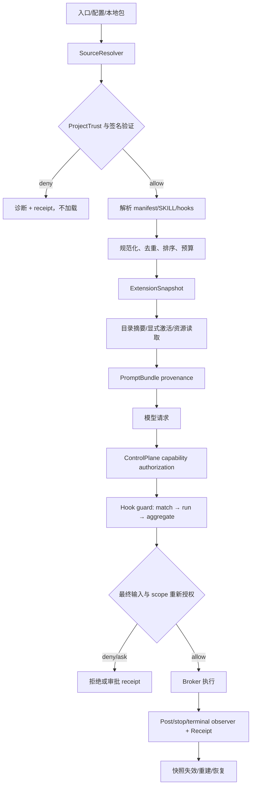

# Roadmap 专项：Skills / Plugins / Hooks 专项

> 返回 [Kiana 执行路线图](../roadmap.md) 的总图与当前窗口。本文保留原专项编号、状态、依赖、验收口径和证据限制；专项步骤完成不会自动改变 P 阶段状态。

## 25. Skills / Plugins / Hooks 专项：调研结论与实现路线（2026-09-12 追加）

本节把 [module-map.md](../module-map.md) 的第 7 模块拆成可以交给实现 agent 的工程步骤。它补充 P4-L5-01、P4-L6-01、CP-25、H29、CAP-18、CAP-20–22、CAP-30 和 CAP-34；不替换这些卡已有的授权、事件和恢复契约。旧版本文档中的限制性描述不作为本专项的能力上限，但所有扩展仍必须回到同一个 `DaemonHost → ControlPlane → Broker → EventLog` 事实链，不能在入口、插件或 Hook 中另起执行循环。

### 25.1 现状基线与目标边界

完整的 reference 盘点、重点项目源码位置、外部规范对照和本次关键源码哈希见 [skills-plugins-hooks-design-research.md](../skills-plugins-hooks-design-research.md)。本节只保留实施所需的结论。

截至本次调研，代码已经有 Skill 目录扫描、项目 `ProjectTrust`、插件 Skill 加载、Prompt 注入、签名 Skill 包注册，以及 PreToolUse 的 Hook 适配；还没有一个统一的扩展快照。主要缺口是：

1. `kiana-skills` 的静态缓存、`dynamic.rs` 的进程级动态表和 `harness_skills.rs` 的 Prompt 组装没有统一 generation、失效和 provenance；路径 Skill 的激活导出函数没有完整接到产品路径。
2. Hook 定义混合环境变量、项目配置和插件文件；PreToolUse 的输入更新目前 fail-closed，Ask/UpdateInput 的语义、超时、子进程后代清理、重放和 PostToolUse 接缝没有完整事件证据。
3. `ExtensionRegistry` 能验证并持久化签名 Skill 包，但只有 Skill 类型进入 enabled；Capability、Workflow、Memory、Provider、UI 组件尚属 staged，插件 manifest、依赖、配置、secret、迁移和回滚没有统一绑定。
4. `allowed-tools` 是 Skill 元数据，不是授权事实；`PromptBundle.extensions` 只能作为提示来源，不能被模型或客户端当成权限。最终请求必须由 ControlPlane/Broker 重新解析 scope、包 hash、角色、effect、网络和 approval。

目标是可发现、可解释、可撤销、可恢复的扩展目录，先交付本地、签名、可重放的 Skill 与受控 Hook。其他组件只有在拥有 adapter、拒绝测试和恢复证据后才可改变 enabled 状态。

### 25.2 统一对象、状态和处理流程

| 对象 | 唯一身份 | 运行时状态 | 事实来源 | 允许的副作用 |
|---|---|---|---|---|
| `SkillDescriptor` | `source/namespace/name@version` + content hash | discovered → eligible → active → stale/revoked | 受信目录或签名包快照 | 默认只读上下文；resource read 需显式 capability |
| `HookDescriptor` | `plugin/source/event/matcher/id` | discovered → scheduled → running → allow/block/ask/timeout/unknown | 合并后的 Hook snapshot | Guard 可改变决策；observer 只能记录/补充上下文 |
| `PluginManifest` | `publisher/plugin/version` + package hash | inspected → staged → enabled → disabled/revoked/rolled_back | `ExtensionRegistry` + CAS event | 只声明组件；组件各自经过 adapter 和 policy |
| `ComponentBinding` | `plugin + component id + destination` | bound → pending_approval → executable → invalidated | ControlPlane snapshot | 不得扩大 packet、角色、scope 或预算 |
| `ExtensionSnapshot` | `snapshot_id/generation` | prepared → used → invalidated | EventLog/receipt 投影 | 一次模型请求和后续 capability 使用同一代或显式重建 |

固定合并顺序为 `trust → source precedence → schema validation → duplicate diagnostic → policy eligibility → quota → snapshot`。来源、目录根、项目 trust、包 hash、manifest version、匹配结果、预算消耗和失效原因进入 descriptor 或 receipt；“目录里存在”不能推导“模型可见”或“工具可执行”。



处理顺序必须先证明拒绝：未信任目录、路径逃逸、包 hash/signature 不匹配、重复身份、预算超限、Hook 超时/取消、组件依赖环、撤销包和过期 approval 都要在 happy path 前有 fixture。Hook 的 `updatedInput` 若被接受，必须对最终输入重新过 policy、gate、PathLock、Hook 和 approval；PostToolUse 只能记录或拒绝后续动作，不能伪造已经发生的工具结果。

### 25.3 执行卡总览

所有卡初始状态为 `⏳ target`。`实现` 只表示源码完成，`local_behavior` 需要拒绝与成功测试，`durable` 需要新进程/故障点回放，`live` 和 `physical` 仍要有各自环境证据。测试名是目标测试名；测试不存在时先建立 RED fixture，不能用“无匹配 0 tests”当通过。

| ID | 步骤 | 依赖 | 主要落点 | 退出产物 |
|---|---|---|---|---|
| EXT-00 | 固定基线、冲突表与扩展合同 | — | docs、CURRENT_STATUS | snapshot、gap matrix、决策回执 |
| EXT-01 | 下沉 ID、错误码、SourceRef 与 snapshot 类型 | EXT-00 | `kiana-domain`/`kiana-protocol` | schema、round-trip、错误映射 |
| EXT-02 | 统一来源解析、信任和路径根 | EXT-01 | `kiana-skills`/`kiana-daemon` | SourceResolver、trust matrix、路径 fixture |
| EXT-03 | 严格 Skill/manifest/hooks 解析 | EXT-02 | `kiana-skills`/`kiana-types` | parser、schema 校验、诊断 |
| EXT-04 | 确定性 catalog、优先级和重复处理 | EXT-03 | `kiana-skills` | 排序算法、collision receipt、golden catalog |
| EXT-05 | generation 缓存、失效和并发快照 | EXT-04 | `kiana-skills`/`kiana-daemon` | cache key、invalidation、竞态测试 |
| EXT-06 | 三层渐进披露与目录查询 | EXT-05 | `harness_skills`、protocol、entrypoints | list/search/load 合同、预算报告 |
| EXT-07 | 显式激活和 resource read | EXT-06 | `kiana-skills`/Broker | 包内路径守卫、按需读取、审计事件 |
| EXT-08 | 条件/路径 Skill 与参数化调用 | EXT-07 | `dynamic.rs`、runner | activation snapshot、参数边界测试 |
| EXT-09 | Prompt 注入 provenance 与上下文预算 | EXT-05/06 | `harness_skills`、`prompts.rs` | section hash、截断/拒绝、快照关联 |
| EXT-10 | Skill 命令兼容与显式用户调用 | EXT-08/09 | `kiana-skills`、entrypoints | invocation policy、参数转义、权限不升级证明 |
| EXT-11 | Hook schema、事件和 dialect adapter | EXT-02 | `kiana-types`/`kiana-query` | normalized HookDescriptor、兼容矩阵 |
| EXT-12 | Hook discovery、matcher、排序和合并 | EXT-11/04 | `kiana-query`/daemon | deterministic HookSnapshot、来源诊断 |
| EXT-13 | 受控进程执行、环境、超时和取消 | EXT-12 | `kiana-ports`/daemon | ProcessSupervisor、限额、child cleanup 证据 |
| EXT-14 | Hook outcome 聚合和失败策略 | EXT-13 | `kiana-core`/`kiana-query` | deny sticky、ask、unknown、observer 隔离 |
| EXT-15 | PreTool 更新输入的重新授权 | EXT-14 | `capabilities.rs`、Broker | final-input recheck、TOCTOU fixture |
| EXT-16 | 全生命周期事件接线 | EXT-14 | runner/entrypoints/daemon | lifecycle trace |
| EXT-17 | 取消、递归、异步 observer 与幂等 | EXT-13/16 | daemon/ports | abort reason、recursion guard、retry policy |
| EXT-18 | Hook receipt、重放和恢复 | EXT-15/16/17 | eventlog/core | replay 不执行、unknown recovery |
| EXT-19 | Plugin manifest v2 与导入适配器 | EXT-03/04 | domain/daemon | manifest schema、component index、namespace |
| EXT-20 | 包验证、供应链和不可变存储 | EXT-19 | `extensions.rs`/`local_packages.rs` | hash/signature/license/size fixture |
| EXT-21 | 组件依赖图和绑定 | EXT-19/20 | daemon/core/policy | DAG、cycle/unsatisfied deny、binding snapshot |
| EXT-22 | inspect/stage/install/enable/config 生命周期 | EXT-20/21 | ExtensionRegistry、protocol | CAS event、approval、配置来源 |
| EXT-23 | upgrade/disable/revoke/rollback/uninstall | EXT-22 | daemon/core/eventlog | 状态机、approval 失效、回滚边界 |
| EXT-24 | secret、state、migration 和持久化隔离 | EXT-22/23 | domain/daemon | handle-only、备份、unknown、保留策略 |
| EXT-25 | 签名 Skill 与 scope 的服务端绑定 | EXT-07/09/21 | harness/ControlPlane | scope receipt、hash recheck、角色交集 |
| EXT-26 | Plugin Hook/MCP/capability adapter | EXT-15/21/22 | daemon/broker | adapter registry、无任意代码执行证明 |
| EXT-27 | 动态工具/Skill 可见性投影 | EXT-06/25/26 | protocol/entrypoints | 五入口一致 snapshot、搜索不泄权 |
| EXT-28 | CLI/workbench/web 的 inspect/list/revoke 投影 | EXT-22/23/27 | entrypoints/UI | 命令契约、权限错误、审计关联 |
| EXT-29 | 本地 fake 全链路 golden | EXT-10/18/25/28 | daemon tests/scripts | deny+allow trace、receipt、快照 digest |
| EXT-30 | 重启、故障注入、恢复和结果未知 | EXT-18/23/24/29 | eventlog/core/daemon | durable evidence、恢复决策表 |
| EXT-31 | 性能、供应链回归、文档和发布门 | EXT-29/30 | scripts/docs/CURRENT_STATUS | benchmark、smoke、状态回填 |

### 25.4 Wave 0：合同、来源和 Skill 目录

<a id="step-ext-00"></a>


#### EXT-00 · 基线与决策回执　✅

记录 `git rev-parse HEAD`、工作树状态、研究文档哈希和 agent WIP 文件清单，把“现有行为 / 目标行为 / 未证明”分成三列；对 P4-L5、P4-L6、CP-25、H29、CAP-18、CAP-20–22、CAP-30、CAP-34 做交叉引用，标出重复字段、命名冲突和要复用的 port；产出 `extension-gap-matrix` 与 schema 变更清单。本卡不改变产品状态。

拒绝验收：出现第二个 runner loop、入口自行判断权限、或 Prompt 字段被当作 capability 来源时，保持 ⏳ 并记录架构阻断。

<a id="step-ext-01"></a>


#### EXT-01 · 稳定扩展领域合同　✅

当前 source slice 与 CI-only 证据见 [`extension-contracts-baseline.md`](extension-contracts-baseline.md)。

在 `kiana-domain` 定义 `ExtensionId`、`ComponentId`、`SourceRef`、`SnapshotId`、`HookRunId`、`ExtensionError` 和版本化状态；协议层只暴露可序列化 DTO，不泄出文件路径、secret 原值或内部锁。为 `SkillDescriptor`、`HookDecision`、`PluginLifecycle`、`ExtensionSnapshot` 建立 round-trip、未知字段和稳定错误码测试。所有 scope 使用交集计算。

<a id="step-ext-02"></a>


#### EXT-02 · SourceResolver、ProjectTrust 与路径根　✅

当前 source slice 与 CI-only 证据见 [`source-resolver-baseline.md`](source-resolver-baseline.md)。

把用户级、`KIANA_HOME`、项目级、bundled、签名 package、插件 component 和显式外部 source 统一成 `SourceRef`；先解析实际 root，再做 `ProjectTrust`，最后 canonicalize 路径。拒绝 symlink 逃逸、`..`、绝对路径、重复 root、未信任 `.claude/.kiana/.agents` 资源和超出 package root 的 resource。输出 trust decision、source precedence 和 root digest。

<a id="step-ext-03"></a>


#### EXT-03 · 严格解析器与兼容层　✅

当前 source slice 与 CI-only 证据见 [`strict-extension-parsers-baseline.md`](strict-extension-parsers-baseline.md)。

实现 Agent Skills `SKILL.md` 解析：目录名与 frontmatter `name` 分开，name 规范化为小写 hyphen、长度上限 64；description、body、license、compatibility、metadata、allowed-tools 和 `version` 做长度/类型校验。Hook 与 Plugin manifest 使用 versioned schema，旧格式只能通过显式 adapter 进入 normalized DTO；坏 YAML/JSON、重复 component id、缺少入口和超限资源给出结构化诊断。兼容层不得绕过 trust 或签名。

<a id="step-ext-04"></a>


#### EXT-04 · Catalog、优先级、重复和可解释性　✅

当前 source slice 与 CI-only 证据见 [`catalog-baseline.md`](catalog-baseline.md)。

对 source scope、namespace、name、version、hash 排序，禁止依赖 filesystem iteration 顺序。重复 Skill/Hook/Plugin 不静默覆盖：按规则选中一个，并在诊断和 receipt 中列出 shadowed candidates、选择原因和 hash。目标验收：`skill_name_collision_is_deterministic_and_audited`、`hook_matcher_order_is_replayable`。

<a id="step-ext-05"></a>


#### EXT-05 · 快照与失效　✅

当前 source slice 与 CI-only 证据见 [`snapshot-invalidation-baseline.md`](snapshot-invalidation-baseline.md)。

缓存键包含 cwd canonical identity、trust decision、source roots digest、package registry generation、配置 digest 和 schema version；缓存值不可变，动态激活创建新 generation。目录/信任变更、install/upgrade/revoke、配置或 secret binding 变化、上下文重建都显式 invalidation。旧 snapshot 只完成当前只读操作；新 capability 发现过期时暂停并重建，不能静默混用。

### 25.5 Wave 1：Skill 可见性、激活和上下文

<a id="step-ext-06"></a>


#### EXT-06 · 三层渐进披露　✅

当前 source slice 与 CI-only 证据见 [`ext06-progressive-disclosure-baseline.md`](ext06-progressive-disclosure-baseline.md)。

`kiana-skills` 现在提供 metadata-only `list/search`、显式完整 `load_skill_body` 和 package-relative `read_skill_resource`；目录条目携带 source/trust/status、package hash 与 content digest，资源返回 package hash、规范化相对路径和 quota。正文与资源均按 UTF-8 bytes 和有界 token 估算，超限返回 `over_budget`，不得截断后宣称完整加载。Harness 适配层在自动披露超预算时显式记录 omission reason。

<a id="step-ext-07"></a>


#### EXT-07 · 显式激活与包内资源　✅

当前 source slice 与 CI-only 证据见 [`ext07-skill-activation-baseline.md`](ext07-skill-activation-baseline.md)。

Skill 被目录命中不等于激活；`activate_skill` 生成绑定 package hash、source、snapshot generation、reason 和 expiry 的 activation record。`read_skill_resource` 在 active activation 校验通过后才执行 package-root containment、symlink、大小/quota 检查；脚本只作为不可执行资源读取，未来若开放执行必须走独立 capability adapter 和 approval。验收覆盖激活篡改、过期、撤销、路径逃逸和资源预算拒绝。

<a id="step-ext-08"></a>


#### EXT-08 · 条件 Skill、路径和参数　✅

当前 source slice 与 CI-only 证据见 [`ext08-dynamic-skills-baseline.md`](ext08-dynamic-skills-baseline.md)。

把 `paths` 编译成带 digest 的确定性 `PathGlobAst`，记录触发路径、匹配顺序和 activation reason；`DynamicSkillStore` 按 session/snapshot 隔离，revoke 会把动态 Skill 从可见集合移除并产生 receipt。参数走结构化 argv 校验，不拼接 shell；缺失、过长、NUL、未知 named 参数和未声明参数先拒绝。

<a id="step-ext-09"></a>


#### EXT-09 · Prompt provenance 与预算　✅

当前 source slice 与 CI-only 证据见 [`ext09-prompt-provenance-baseline.md`](ext09-prompt-provenance-baseline.md)。

`PromptBundle.skill_provenance` 绑定每个 Skill context section 的 source identity、skill id/version/hash、trust、activation reason、budget usage 和 snapshot id。模型消息只接收预算内正文；完整 body 记录 complete，verified extension 超限正文记录 `truncated`，普通 Skill 超限记录 omission。Provenance 只属于 Context，不携带可直接执行的 capability grant；Bundle 校验拒绝 provenance section 漂移和 Product authority 混用。

<a id="step-ext-10"></a>


#### EXT-10 · Skill invocation 兼容　✅

当前 source slice 与 CI-only 证据见 [`ext10-skill-invocation-baseline.md`](ext10-skill-invocation-baseline.md)。

保留已有 `kiana skills` 命令作为兼容 adapter，分成 `catalog`、`invoke`、`resource_read` 三种动作；调用前检查 user_invocable、session/snapshot scope、结构化参数和只读 approval disposition，调用结果只是普通 invocation/resource envelope，不另起模型或工具执行。`disable_model_invocation` 不阻断显式 user invoke；`allowed-tools` 只作为候选提示，返回 `does_not_grant_tools=true`，最终集合仍由 policy/Broker 决定。

### 25.6 Wave 2：Hook 运行、重新授权和生命周期

<a id="step-ext-11"></a>


#### EXT-11 · Hook schema 与事件　✅

当前 source slice 与 CI-only 证据见 [`ext11-hook-schema-baseline.md`](ext11-hook-schema-baseline.md)。

定义 normalized events：`SessionStart`、`UserPromptSubmit`、`BeforeModel`、`PreToolUse`、`PostToolUse`、`PostToolFailure`、`Compaction`、`Stop`、`SessionEnd`、`Terminal`。`NormalizedHookDescriptor` 声明 matcher、phase（guard/observer）、timeout、input/output schema、source digest、effect、required scope 和 version；Claude/Gemini/本地旧格式通过 adapter，固定 deny-sticky、ask-preserved 和 update re-authorization，未知事件 fail-closed。

<a id="step-ext-12"></a>


#### EXT-12 · Discovery、匹配和聚合输入　✅

当前 source slice 与 CI-only 证据见 [`ext12-hook-discovery-baseline.md`](ext12-hook-discovery-baseline.md)。

Hook discovery 与 Skill/Plugin descriptor 使用同一来源/trust 前置结果。纯 discovery 层按规范化 event、glob/regex 编译结果、source priority、specificity、declaration order、id 固定顺序，保存匹配 descriptor ids、未匹配原因和 input digest；Guard/Observer 分组独立输出，后续聚合层可保持 guard deny sticky 且不隐藏 observer receipt。

<a id="step-ext-13"></a>


#### EXT-13 · ProcessSupervisor　✅

当前 source slice 与 CI-only 证据见 [`ext13-hook-process-baseline.md`](ext13-hook-process-baseline.md)。

现有 Hook executor 复用受控进程边界：固定 cwd、清空宿主环境、minimal PATH、Unix process group、kill-on-drop、timeout/cancel 传递和 bounded UTF-8 output。Hook 不继承 secret 原值或任意 workspace write set；无法证明后代退出的完整 stop confirmation 仍保留 Unknown/阻断边界，后续 durable supervisor slice 继续收口。

<a id="step-ext-14"></a>


#### EXT-14 · Outcome 与失败策略　✅

当前 source slice 与 CI-only 证据见 [`ext14-hook-outcome-baseline.md`](ext14-hook-outcome-baseline.md)。

新增闭合 `HookOutcome` 与 strict stdout adapter，统一 `Allow`、`Block(reason)`、`Ask(approval_ref)`、`UpdateInput(patch)`、`AdditionalContext`、`Timeout`、`Cancelled`、`Unknown`；解析拒绝多 JSON、未知字段、超限 patch、缺 approval ref 和非法 update。PreTool guard 的 error/timeout/cancel 保持 fail-closed，observer 只能记录，不隐藏 receipt。

<a id="step-ext-15"></a>


#### EXT-15 · PreTool 最终输入重新授权　✅

当前 source slice 与 CI-only 证据见 [`ext15-hook-reauthorization-baseline.md`](ext15-hook-reauthorization-baseline.md)。

顺序固定为：原始 request → policy/gate → 匹配 Hook → guard → 校验 patch → 生成新 request identity/scope material → 重新运行 identity、scope、PathLock、policy/gate、approval 和 Hook（带 recursion guard）→ Broker。若 patch 改变路径、命令、MCP server、memory scope、secret ref 或 effect，旧 approval 立即失效；工具未执行前任何 Ask/Block/Unknown 都不得进入 Broker。

<a id="step-ext-16"></a>


#### EXT-16 · 全生命周期事件接线　✅

当前 source slice 与 CI-only 证据见 [`ext16-hook-lifecycle-baseline.md`](ext16-hook-lifecycle-baseline.md)。

新增统一 lifecycle dispatcher contract，覆盖 session-start/user-prompt、BeforeModel、PostToolUse、PostToolFailure、Compaction、Stop、SessionEnd、Terminal；每个 event 带 run/session/snapshot id、sequence 和 payload digest。dispatcher 只产出 Runner/ControlPlane 事件，不执行 capability；PostToolUse/PostToolFailure 必须先有 committed result，不能重写已提交事实。

<a id="step-ext-17"></a>


#### EXT-17 · 取消、递归、异步 observer　✅

当前 source slice 与 CI-only 证据见 [`ext17-hook-cancellation-baseline.md`](ext17-hook-cancellation-baseline.md)。

同一 Hook 在同一 run 的重复触发使用 run/hook/invocation identity 和幂等键；Hook 触发工具或模型请求必须有 recursion depth/visited set。同步 guard 有界完成；异步 observer 只允许读取事件副本和在 Unknown 时重试。取消终态区分 confirmed cancelled 与 Unknown，后续 supervisor 负责进程组 stop evidence。

<a id="step-ext-18"></a>


#### EXT-18 · Receipt、重放和恢复　✅

当前 source slice 与 CI-only 证据见 [`ext18-hook-receipt-baseline.md`](ext18-hook-receipt-baseline.md)。

`HookReceipt` 记录 snapshot、输入/输出 digest、决策、审批引用、退出码、timeout/cancel、patch 前后 hash 和 process cleanup。replay 只读取 receipt 并返回 `executed=false`，不再次执行 Hook、脚本或外部资源；恢复遇到 Unknown/cleanup Unknown 先 fence 后由 ControlPlane 选择重试、人工确认或终止。

### 25.7 Wave 3：Plugin 包、组件和生命周期

<a id="step-ext-19"></a>


#### EXT-19 · Plugin manifest v2　✅

当前 source slice 与 CI-only 证据见 [`ext19-plugin-manifest-v2-baseline.md`](ext19-plugin-manifest-v2-baseline.md)。

新增 `NormalizedPluginManifestV2` adapter，提供稳定 `plugin_id`、publisher、component list、entrypoint kind、source/license、required/optional dependencies、config/state schema 和 migration refs；组件 id 在 package 内唯一，namespace 由服务端按 publisher/plugin_id 派生，不由包内容自定义。旧 manifest 继续通过已有 adapter，所有来源保留原始 source digest。

<a id="step-ext-20"></a>


#### EXT-20 · 供应链和不可变包　✅

当前 source slice 与 CI-only 证据见 [`ext20-extension-supply-chain-baseline.md`](ext20-extension-supply-chain-baseline.md)。

复用 canonical signing bytes、Ed25519 trusted keys、content hash、文件数/大小/UTF-8/path/migration 限制，以及现有 license/publisher/revocation/compatibility 检查；cache/package hash mismatch 和没有 `extension.lifecycle` 事实的 cache 继续 fail-closed/inert。拒绝 unsigned、签名 key 不受信、hash mismatch、路径逃逸、旧版本重放和超限包。

<a id="step-ext-21"></a>


#### EXT-21 · 依赖图与 binding　✅

当前 source slice 与 CI-only 证据见 [`ext21-extension-binding-baseline.md`](ext21-extension-binding-baseline.md)。对 Skill、Hook、MCP、Capability、Memory、Provider、UI component 构建有向图，先检测 cycle、缺失版本、scope 不交集和 platform mismatch，再生成 inert binding snapshot。binding 绑定 destination、packet、role、data class、network policy、secret handle、budget、expiry 和 snapshot；父 scope 任何缩减都会使子 binding 失效。依赖声明不是授予能力的凭据，ControlPlane/Broker 仍是唯一授权执行边界。

<a id="step-ext-22"></a>


#### EXT-22 · inspect → stage → install → enable　✅

当前 source slice 与 CI-only 证据见 [`ext22-extension-lifecycle-baseline.md`](ext22-extension-lifecycle-baseline.md)。`inspect` 只读验证；stage/install/enable mutation 绑定 exact package hash、dependency snapshot、expected registry version、idempotency key、actor、reason、trust revision，enable 额外要求 approval 与 config snapshot。配置按 host/user/project/run scope 合并并记录每字段来源；已有 `extension.manage` → ControlPlane → daemon append-only CAS 仍是唯一 mutation path。

<a id="step-ext-23"></a>


#### EXT-23 · upgrade、disable、revoke、rollback、uninstall　✅

当前 source slice 与 CI-only 证据见 [`ext23-extension-controls-baseline.md`](ext23-extension-controls-baseline.md)。upgrade/revoke/uninstall 变更要求暂停新请求并使 pending approval、PromptBundle、binding snapshot 失效；rollback 只能回到签名已验证、policy 仍允许且未撤销的旧 generation；uninstall 记录配置、state、cache 与 receipt 引用的保留/清理结果。现有 daemon lifecycle CAS 仍是唯一状态权威。

<a id="step-ext-24"></a>


#### EXT-24 · secret、state 和 migration　✅

当前 source slice 与 CI-only 证据见 ext24-secret-state-baseline.md。插件配置只保存 secret handle，不在 manifest、Prompt、Hook diagnostics 或 receipt 中保存原值；adapter 在执行点按 destination/expiry 再授权。迁移是独立受控 action：校验 old schema/hash → 隔离备份 → bounded migration → 验证新 schema/hash → 一次 CAS 切换。迁移异常留下旧版本和 unknown；state 与只读 package cache 分离并按 publisher/plugin/scope 隔离。

<a id="step-ext-25"></a>


#### EXT-25 · 签名 Skill 服务端绑定　✅

当前 source slice 与 CI-only 证据见 ext25-signed-skill-binding-baseline.md。

将 `ExtensionRegistry::skill_context` 生成的 scope 变成 ControlPlane 可验证引用：每个引用绑定 package hash、registry generation、role、effect、capability diff、network/secret policy、expiry。`KianaHarness` 可把它作为 request metadata 传递，但 Broker 必须从 registry snapshot 重新查证，客户端和模型不能伪造 `_extension_scopes`。包升级、撤销、角色变化和新 approval 都触发 recheck。

<a id="step-ext-26"></a>


#### EXT-26 · Plugin component adapter　✅

当前 source slice 与 CI-only 证据见 [`ext26-plugin-component-adapter-baseline.md`](ext26-plugin-component-adapter-baseline.md)。daemon 从已验证 package 构造确定性 adapter registry，descriptor 绑定 package/manifest/source/snapshot/binding digest、registry generation、lifecycle revision、effect、network policy 和 approval；Broker 在既有 `ExtensionAdmission` 后再次检查 component binding。Skill 只投影 context/resource，Hook 只允许受控 adapter，MCP 只保留声明式 stdio connector 目录；Capability/Workflow/Memory/Provider/UI 保持 `not_supported`，原生/脚本/宿主文件/网络路径 fail-closed。无直接进程、socket 或网络执行，运行时副作用、receipt 和恢复仍归 ControlPlane/Broker 及后续切片。

### 25.8 Wave 4：入口投影、全链路和发布证据

<a id="step-ext-27"></a>


#### EXT-27 · 动态可见性投影　🔄

当前 source slice 与 CI-only 证据见 [`ext27-extension-visibility-baseline.md`](ext27-extension-visibility-baseline.md)。CLI、Workbench、Web、Desktop 的 list/search/inspect/activate/revoke 读取同一个 `ExtensionVisibilitySnapshot`；投影只展示用户有权看到的摘要、状态、来源和风险，不展示未信任正文、secret、隐藏路径或内部 command。结果带 snapshot id 和 generation，`require_generation` 拒绝跨代 UI 缓存；动作只是 intent，仍须返回 ControlPlane/Broker 重检。与 CAP-30 对接时，工具仍须经过受控工具集合和 Broker。

<a id="step-ext-28"></a>


#### EXT-28 · 命令与 UI 合同　⏳

为 `extension.list`、`extension.inspect`、`extension.install`、`extension.enable`、`extension.disable`、`extension.revoke`、`extension.rollback` 定义 versioned protocol DTO、结构化错误和权限边界；只读 inspect 不需要 mutation approval，状态改变都要 actor/reason/idempotency/expected version。Workbench/Web/Desktop 只投影事件和 receipt，不在前端执行 Hook、解析包或自行决定 scope。

<a id="step-ext-29"></a>


#### EXT-29 · 本地 fake golden　⏳

用固定 fixture 覆盖可信/不可信项目 Skill、同名 Skill、路径资源、预算超限、Hook block/ask/update/timeout/cancel、签名包 install/upgrade/revoke、依赖环、MCP connector deny、五入口同一 snapshot。golden trace 至少包含输入、snapshot digest、policy/gate、Hook outcome、最终 capability request、Broker result 和 receipt；先跑 deny，再跑 allow。

<a id="step-ext-30"></a>


#### EXT-30 · Durable、故障注入和恢复　⏳

在临时包未 rename、rename 后未 event、event 后未 projection、upgrade 切换中、Hook 执行中、approval 即将过期、Broker result unknown 等边界注入 crash。启动新进程重建 registry、snapshot、pending approval 和 fence；重复命令必须幂等，unknown 必须显示并等待明确恢复决策。单进程重建或内存测试不能替代本卡。

<a id="step-ext-31"></a>


#### EXT-31 · 性能、供应链回归和文档收口　⏳

测量 cold/warm catalog、正文加载、resource read、Hook latency、package verify、snapshot rebuild 的 p50/p95 和内存/磁盘 quota；基准 fixture 固定机器、Rust/toolchain、包大小和并发。将拒绝矩阵、hash、测试命令、未覆盖 provider/平台/远程分发写入 `CURRENT_STATUS.md`，把实际调用入口回填 `module-map.md`，运行 release/harness smoke 后再决定 proof-level 提升。

### 25.9 依赖波次与并行边界

```text
Wave 0: EXT-00 → EXT-01 → EXT-02
Wave 1: EXT-03 → EXT-04 → EXT-05 → (EXT-06 → EXT-07 → EXT-08 → EXT-09 → EXT-10)
Wave 2: EXT-11 → EXT-12 → EXT-13 → EXT-14 → (EXT-15 → EXT-16 → EXT-17 → EXT-18)
Wave 3: EXT-19 → EXT-20 → EXT-21 → (EXT-22 → EXT-23 → EXT-24) → EXT-25 → EXT-26
Wave 4: EXT-27 → EXT-28 → EXT-29 → EXT-30 → EXT-31
```

EXT-03/11/19 的 schema 与 fixture 可在 Wave 0 结束后由只读研究并行准备；EXT-06/12/20 的纯函数测试可先写 RED，但不得在 SourceResolver、trust、签名验证未落地前接 product path。EXT-15、EXT-21、EXT-25 是授权接缝，由同一个集成负责人合并；任何 agent 不能新增第二个执行循环、额外工具、网络来源或绕过 ControlPlane 的 adapter。daemon/control-plane 测试串行运行，跨入口 golden 在 EXT-29 前不得宣称一致。

### 25.10 专项验收门与证据格式

| 门 | 必须先证明的拒绝 | 成功路径 | 最低 proof-level |
|---|---|---|---|
| Source/Skill | untrusted、collision、path escape、over budget | trusted catalog → explicit load → resource read | local_behavior |
| Hook | block/ask/timeout/cancel/unknown、bad patch | allow → final-input recheck → Broker | local_behavior |
| Plugin | unsigned/hash mismatch/replay/dependency cycle/revoked | inspect → approval → stage → enable | local_behavior |
| Lifecycle | stale snapshot、pending approval invalidation、recursive hook | upgrade/disable/revoke 后重建并继续 | durable（新进程） |
| Replay | receipt 重放再次执行副作用 | 只投影事件，不运行 Hook/脚本 | durable |
| Entry projection | UI/CLI 缓存泄权或跨代 | 四入口读取同一 snapshot | local_behavior |
| Release | quota、性能回归、文档与代码不一致 | smoke/golden/recovery 有回执 | 由实际命令决定 |

每张 EXT 卡的回执必须包含：

```text
source_snapshot / worktree_status / command_argv / cwd·environment /
fixture·cassette / exit_code / status change / proof-level change /
limitations / reviewer
```

本专项完成前，不能用“manifest 可解析”“Prompt 出现了 Skill”“cache 中有包”“Hook 进程返回 0”推导 capability 已授权、插件已启用、后代进程已清理、现实工具结果正确或跨重启 durable。若实现与本设计冲突，先记录冲突、快照和候选方案，再由架构负责人决定是否调整合同；不通过放宽断言、跳过测试或把 `target` 改成 `implemented` 来收口。

<!-- ui-entrypoints-design -->


---

返回：[路线图总图与当前窗口](../roadmap.md#appendix-navigation) · [文档总入口](../README.md)
