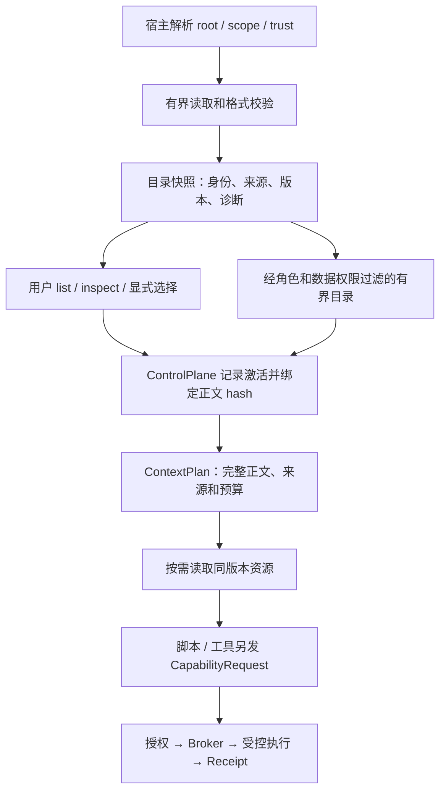
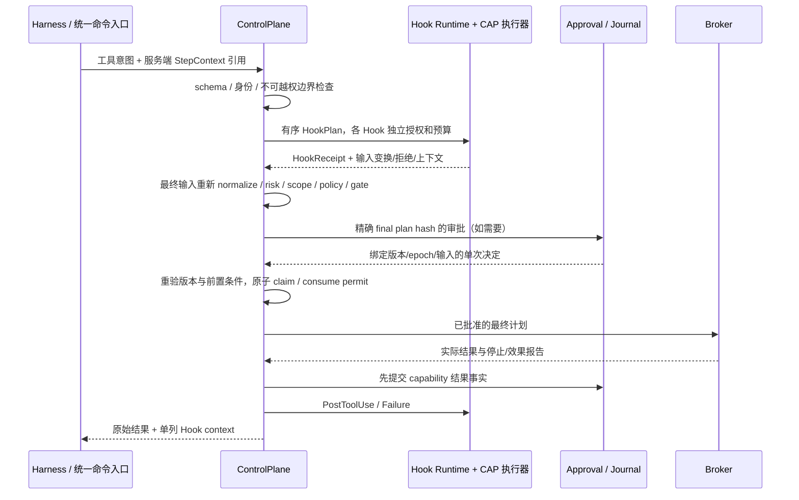

# Skills / Plugins / Hooks：代码设计与处理流程调研

> 2026-09-12；对应 [module-map.md](module-map.md) 第 7 模块。本文是待实施设计，执行卡见 [roadmap.md](roadmap.md) §25。
> 源码基线：`db77c2485bcafecbb1da17ec57ee509ad2ee32b4` + 当日 WIP；读取时间、文件摘要及研究范围见 §10。不把未测试源码记成已交付能力。
> 按本次用户指示，旧文档的冻结、五工具上限、单写者交接等限制若与本专项冲突，不作为设计或文档追加的阻塞。授权、数据隔离、单一执行主路径和证据准确性仍是本设计主动保留的产品性质。

## 1. 结论和交付范围

扩展系统应由一个 daemon 所有的目录与生命周期服务，把三类对象接到现有运行链：

| 对象 | 用户得到什么 | 运行时职责 | 与其他对象的关系 |
|---|---|---|---|
| Skill | 按需使用某种专业方法、模板、参考资料和脚本 | 发现、选择、激活、资源读取、上下文来源与预算 | 可以独立存在，也可以由 Plugin 打包；读取脚本不等于运行脚本 |
| Plugin | 安装、配置、启停、升级一组相关能力 | 管组件、依赖、版本、可信来源、配置和资源生命周期 | 包含多个 Skill / Hook / MCP / 工具声明；包本身不是另一个 Agent |
| Hook | 在明确阶段检查、补充上下文或提出后续动作 | 固定输入/输出、触发时机、排序、执行隔离、记录和恢复 | 是 Plugin 或可信配置贡献的组件；不能凭返回值给动作发权限 |

第一轮交付完整的本地工作流：发现 → 解释来源 → 按需激活 Skill → 执行受控 Hook → 安装组件包 → 使用包内 Skill/Hook/MCP/工具 → 升级或撤销 → 四入口查询同一记录。后续分别交付 WASI 执行和远程分发；不把远程商店建设绑成本地扩展可用的前置。

关键选择如下：

1. **统一目录，按消费者生成视图。** 人类列表、模型目录、Hook 计划、MCP 配置、工具目录都引用同一个已准入快照；不能分别扫描磁盘后各自推断 enablement。
2. **按需加载 Skill。** 启动时只给有界目录，激活才给完整正文，资源再单独取。目录里有 100 个 Skill，不等于本轮启用了 100 个权限限制。
3. **Plugin 优先做声明式组件包。** 可执行组件首选已有受控子进程/MCP；不直接在 daemon 内 `import()` 项目 JS 或装载任意动态库。
4. **Hook 的决策与执行分开。** 规划和合并是纯函数；进程、MCP 或模型调用借用已有 Capability/Provider 执行面。修改工具输入后重新走最终参数授权。
5. **可解释地更新。** 安装、启用、选入目录、激活正文、实际执行是不同事实；更新产生新快照，旧审批和旧上下文不能偷偷套到新版本上。

## 2. 当前实现与缺口

以下是静态读取所得，未在本次运行 Rust 测试；函数和测试存在不能代替当前产品回执。

| 入口/对象 | 当前源码能确认的行为 | 本专项要补的内容 |
|---|---|---|
| [skills/lib.rs](../kiana-skills/src/lib.rs) `load_all_skills_with_trust` | 按 cwd/trust/plugin root 集缓存；普通来源合并后按名称 first-wins，再加入 bundled/dynamic | daemon 所有的有界缓存；完整来源/内容版本；所有来源统一冲突处理。不能把现有注释中的优先级当成稳定合同 |
| [skills/loader.rs](../kiana-skills/src/loader.rs) | 用户 `.claude/skills`、`KIANA_HOME/skills` 与受信项目 `.claude/skills`/`.kiana/skills`；项目扫描止于 trust root | `.agents/skills` 互操作；统一 root resolver；有界读、路径身份、确定性扫描、编辑后失效 |
| [skills/types.rs](../kiana-skills/src/types.rs) | `allowed-tools` 只接受数组；`paths` 为字符串并裁掉 `/**`；name 取目录，frontmatter name 仅显示；另有 model/context 等字段 | 显式格式版本；字符串/数组兼容；保留 glob 语义；字段支持矩阵；不能“解析成功”却不执行声明语义 |
| [skills/dynamic.rs](../kiana-skills/src/dynamic.rs) | conditional/dynamic/activated 三个进程全局表按名称保存；激活将条目移到另一个表 | session/run 隔离；同名不同项目不串用；path trigger 真正接到产品上下文准备。产品目录搜索未找到该激活函数的调用 |
| [skills/plugins.rs](../kiana-skills/src/plugins.rs) | 接受 `.codex-plugin/plugin.json`、`.claude-plugin/plugin.json`、`plugin.json`；前缀为 `plugin:skill`；项目插件经过 trust；manifest 的 skills 路径直接 join | 路径穿越、绝对路径、symlink/TOCTOU 的统一防线；项目来源不标成 UserSettings；来源 root 与内容 hash 同时进入缓存键 |
| [daemon/harness_skills.rs](../kiana-daemon/src/harness_skills.rs) | Start 时给每个 model-invocable Skill 注入最多 4,000 字符正文；使用 Context authority；蒸馏路径排除 Skill | catalog/body/resource 三层加载；总预算和明确省略原因；显式激活；完整正文不能静默切掉末尾规则 |
| [domain/extensions.rs](../kiana-domain/src/extensions.rs)、[daemon/extensions.rs](../kiana-daemon/src/extensions.rs) | WIP 有签名 JSON 包、精确依赖、Ed25519/content hash、安装/升级/撤销/回滚、事件 CAS；仅 Skill 为 enabled，其他类型 staged | 多组件包、配置/启停、适配器可用性、完整权限 diff、撤销传播；保持现有签名编码可复验 |
| `ExtensionRegistry::skill_context/check` | 加载所有 enabled 且角色匹配的签名 Skill；每次派发检查当前 registry、包签名/内容/依赖；运行旧包的请求在当前包变化后可能被拒 | 目录可见与正文激活分离；精确说明旧运行如何暂停/换快照，不能把“提示词未变”说成“旧运行仍可继续执行” |
| [runner/harness.rs](../kiana-runner/src/harness.rs) 的 `_extension_scopes` 接线 | 从系统 PromptBundle 提取已加载包限制并覆盖模型提供的来源，Broker 检查交集 | provenance 下沉到服务端持久 StepContext/执行信封；检查 direct、approval resume 等路径也不能伪造、删除来源 |
| [types/hooks.rs](../kiana-types/src/hooks.rs) | 配置是 event→字符串命令列表；不等同于 Claude/Gemini 的 nested matcher 配置 | 带版本的标准 HookDefinition 与外部格式 adapter；matcher/timeout/async 等不能被静默忽略 |
| [query/stop_hooks.rs](../kiana-query/src/stop_hooks.rs) | 有多个 Hook helper、环境/用户/项目/plugin 来源及结果解析；`run_hook_command` 自行 spawn shell、`wait_with_output` | 所有 I/O、输出、stdin 阻塞和进程树纳入 CAP 的监督器；子进程 cwd/env 明确绑定；不靠 helper 名推断主链覆盖 |
| [daemon/pre_tool_hooks.rs](../kiana-daemon/src/pre_tool_hooks.rs)、[core/capabilities.rs](../kiana-core/src/capabilities.rs) | PreToolUse 接入授权；Allow 不抹去上游拒绝；UpdateInput 显式拒绝；Ask 的 updated_input 未传入端口；abort Notify 在 adapter 内新建 | 改写后的审批合同、真实 run cancel、来源和 HookReceipt；其他生命周期点接到同一个 Harness/Core |
| [daemon_host tests](../kiana-daemon/tests/daemon_host.rs) | 有 trusted/untrusted Skill、PreTool 阻断/改写拒绝/无人审批测试；其他 Hook 调用可在兼容 entrypoints/runner 找到 | 保留这些负向语义，新增整条产品链用例；兼容入口通过不等于 DaemonHost 主路径通过 |

同时存在两种现状：普通目录插件走兼容 loader；签名包走新的 ExtensionRegistry。只完善其中一个，会留下来源、禁用、缓存、资源读取和 Hook 装配不一致的问题。迁移目标是一个准入与版本来源，旧公开 API 变为兼容 facade。

## 3. 调研来源、借鉴与差异

### 3.1 全 reference 覆盖方法

对 `reference/` 的全部 **73 个一级目录**做文件清单、扩展相关路径和根 README 筛查；§9 逐目录登记。关键词命中只是导航：React hooks、IDE extension、A2A skill metadata、Git hook 不自动视为 Agent 扩展执行器。下表所列是进一步定向阅读的代码/合同。

两组重复内容分别是 `Roo-Code`/`roo-code`、`claude-memory`/`claude-mem-candidate`；`letta`/`letta-oss` 当前是相同的小型快照。空目录或非独立仓库不得借用父仓库 HEAD。没有执行 reference 中的安装器、Hook 或 Skill 指令。

### 3.2 重点代码

| 项目与本地 HEAD 前缀 | 已读入口 | 对 Kiana 的具体启发与取舍 |
|---|---|---|
| Codex `d6489472f3c1` | [plugin manifest](../reference/codex/codex-rs/plugin/src/manifest.rs)、[namespace](../reference/codex/codex-rs/ext/skills/src/loader/namespace.rs)、[root merge](../reference/codex/codex-rs/ext/skills/src/loader/host_merge.rs)、[hook discovery](../reference/codex/codex-rs/hooks/src/engine/discovery.rs)、[pre tool](../reference/codex/codex-rs/hooks/src/events/pre_tool_use.rs) | 包组件资源统一映射、Skill namespace、加载快照、required-load-error 值得采用；该快照竞争改写按完成顺序选最新，Kiana 选择声明顺序串行变换，使输入可重放 |
| OpenCode `d6855b6b47a8` | [skill](../reference/opencode/packages/opencode/src/skill/index.ts)、[plugin lifecycle](../reference/opencode/packages/opencode/src/plugin/index.ts)、[PluginInput](../reference/opencode/packages/plugin/src/index.ts) | 统一插件上下文和有类型的输入/输出扩展点；其 BunShell/client 注入不能直接成为 Kiana 项目插件的权限入口 |
| Pi `96617628e852` | [skills](../reference/pi/packages/coding-agent/src/core/skills.ts)、[extension runner](../reference/pi/packages/coding-agent/src/core/extensions/runner.ts)、[lifecycle docs](../reference/pi/packages/coding-agent/docs/extensions.md) | Skill diagnostics、资源来源、reload/shutdown、工具前置有序阻断；Kiana 不允许插件任意替换事实消息、工具结果或 provider 凭据 |
| DeepSeek Harness `c389f96bf3a9` | [skill registry](../reference/deepseek-harness/packages/skill/skill/src/index.ts)、[skills contract](../reference/deepseek-harness/docs/subsystems/skills.md)、[host runner](../reference/deepseek-harness/packages/extensions/cordis-host-runner/README.md) | provider/candidate/definition 分离、complete snapshot、有界缓存与失效、不可变 package 版本；其文档明确 node:vm 不是安全边界，不能把它用作 Kiana 的隔离执行器 |
| Goose `5e90925962f0` | [supporting files](../reference/goose/crates/goose/src/skills/supporting_files.rs)、[Stop operation](../reference/goose/crates/goose/src/agents/state_machine/ops_stop_hook.rs) | 资源读取的目录内约束/有界 UTF-8；Stop 是主状态机的一步，拒绝结束要形成可追踪反馈 |
| Crush `563d658bccb5` | [catalog](../reference/crush/internal/skills/catalog.go)、[hook aggregate](../reference/crush/internal/hooks/hooks.go) | 用户目录展示来源与有效集合；deny sticky、配置顺序与 Hook 个别结果；其 shallow merge 与 Claude replacement 不同，兼容层须显式转换 |
| Cline `fc28a5fe3331` | [HookControl](../reference/cline/sdk/packages/shared/src/hooks/contracts.ts)、[hook extension](../reference/cline/sdk/packages/core/src/hooks/hook-extension.ts)、[subprocess runner](../reference/cline/sdk/packages/core/src/hooks/subprocess-runner.ts) | Hook 作为 extension contribution；argv/cwd/env 与 stdin EPIPE 有专门处理；Kiana 仍需自己的输出上限和进程树停止确认 |
| Google ADK `b0180620f4c2` | [skill toolset](../reference/adk-python/src/google/adk/tools/skill_toolset.py)、[plugin manager](../reference/adk-python/src/google/adk/plugins/plugin_manager.py) | list/search/load/resource 分工，plugin 名唯一、close deadline；其 first non-None early exit 不能让一个 allow 跳过 Kiana 的其他 guard |
| Microsoft Agent Framework `aea4dc221e97` | [skills source/resource/runner](../reference/agent-framework/python/packages/core/agent_framework/_skills.py)、[design ADR](../reference/agent-framework/docs/decisions/0037-agent-skills-design.md) | 多来源组合、过滤/去重/缓存与 ScriptRunner 接口；采用资源/执行器分离，不采用不可信代码进程内 callable |
| CrewAI `34199c21b724` | [registry refs](../reference/crewAI/lib/crewai/src/crewai/skills/registry.py) | 来源、名称、精确版本分开；Kiana 进一步将最终 bytes hash 纳入计划/审批，不能用 latest 作恢复身份 |
| OpenAI Agents SDK `f355af660416` | [lifecycle](../reference/openai-agents-python/src/agents/lifecycle.py) | LLM/agent/tool/handoff 的有类型通知；通知 Hook 与有权暂停执行的 guard 应是不同接口 |
| Temporal SDK `22a9e41fd857` | [worker plugin](../reference/temporal-sdk-python/temporalio/worker/_plugin.py) | worker 与 replayer 扩展接缝分别定义；Kiana 重放使用既有 Hook 事实，不重新执行外部脚本 |
| Superpowers `b36e0829c6d0` | [hooks.json](../reference/superpowers/hooks/hooks.json)、[session-start](../reference/superpowers/hooks/session-start) | 实际样本包含 nested matcher、plugin root、平台不同 context 字段；必须用兼容 fixture 验证，不声称改目录名就完全兼容 |
| GSD Core `c6df4e1e463c` | [managed hook registry](../reference/gsd-core/hooks/managed-hooks-registry.cjs) | 更新器需要知道自己拥有的文件/注册项；卸载不能删除用户自写 Hook，废弃条目要可识别 |

ECC、Spec Kit、Planning with Files、GitNexus、Memorix、Beads、Gstack 等作为真实组件布局、安装/同步和 Hook 使用场景的补充；未将这些项目全部实现逐行审计。`claude-code-rev-main`、`claude-code-main (2)`、`claude-code-rust` 仅作目录/公开说明对照，不复制相关实现。

### 3.3 reference 外的公开一手资料

访问日期均为 2026-09-12；在线文档可能与本地 clone 版本不同，下面不是“所有生态均支持”的声明。

| 来源 | 核对的机制 | 本设计如何使用 |
|---|---|---|
| [Agent Skills specification](https://agentskills.io/specification) | SKILL.md、frontmatter、相对资源、渐进披露；`allowed-tools` 是实验字段 | 规范格式走严格校验；兼容旧格式单列诊断；Kiana 将 allowed-tools 保持为提示/适用性信息，不接受其预授权含义 |
| [Agent Skills integration guide](https://agentskills.io/integrate-skills) | `.agents/skills` 约定、多来源发现、目录/正文/资源三层访问 | 补互操作与加载预算；目录惯例和建议并非格式规范强制项，Kiana 的优先级/安全读取自行定义 |
| [Claude plugin reference](https://code.claude.com/docs/en/plugins-reference) | 多组件包、安装 scope、组件路径、包缓存与持久数据分离 | 导入时保留原格式/路径来源，区分 immutable package 与 state；不隐式运行依赖安装/生命周期脚本 |
| [Claude hooks reference](https://code.claude.com/docs/en/hooks) | 事件专属输出、完整 updatedInput、async observer | 外部形状转换成 Kiana typed outcome；allow 只代表本 Hook 未增加拒绝；异步结果不能追溯批准或撤销已执行动作 |
| [Gemini extension reference](https://geminicli.com/docs/extensions/reference/) | bundle、commands/skills/hooks/MCP、local link、配置与敏感设置 | 增加 Gemini importer；本地开发重新生成内容快照，MCP 命名空间及 secret 由宿主绑定 |
| [Gemini hooks reference](https://geminicli.com/docs/hooks/reference/) | JSON stdin/stdout、matcher、串并行组、exit 2 与其他错误的不同含义 | dialect adapter 保存原 exit 与归一化结果；Kiana guard 的错误默认阻断，不从兼容格式继承宽松失败政策 |
| [Wasmtime security](https://docs.wasmtime.dev/security.html) | WebAssembly 隔离及宿主显式提供的能力 | 后续 WASI adapter 限制 host imports、preopens、内存/执行预算；宿主导入仍回到相同授权链 |

## 4. 代码归属与版本化合同

### 4.1 模块安排

在现有 crate 内扩展；下列模块/类型是目标名字，已有等价实现优先复用。

| 层 | 代码落点 | 负责什么 |
|---|---|---|
| Domain | `extensions.rs`，按需要增加 `skills.rs`、`hooks.rs` | ID、快照、声明、状态、错误码；无 OS/Tokio/legacy 类型依赖 |
| Ports | 现有 `PreToolHookPort` 与拟增 catalog/content/hook 端口 | 查询、准入快照、资源读取、Hook 请求/结果契约；保持底层依赖方向 |
| Skills adapter | `kiana-skills/src/{loader,plugins,types}.rs`，新增 format adapters | 有界解析、外部格式转换、发现诊断；逐步淘汰 mutable global registry，兼容函数委托同一服务 |
| Daemon | `extensions.rs`、`harness_skills.rs`、`pre_tool_hooks.rs`，拟增 catalog/hook runtime 模块 | 组合根、来源 resolver、包存储 adapter、缓存、组件实例生命周期；执行借用 CAP 环境与监督器 |
| Core | 现有 commands/capabilities/approval/recovery，加扩展状态推进 | 操作主体、配置/激活/撤销决策、审批、事实事务、失效屏障；不在 adapter 中重建一个权限系统 |
| Harness | `harness.rs` 与 StepContext/ContextPlan 接缝 | 消费固定目录/激活上下文，在指定事件请求 Hook；只有原来的模型循环 |
| Broker | catalog/binding/ExtensionAdmission | 将扩展工具和脚本绑定到受控执行器；不信任模型传入来源或包自报 readonly |
| Query | context/index + 现有 stop_hooks 兼容面 | 目录检索、预算与上下文 provenance；产品路径停止从 query 直接 spawn |
| Event / Protocol / UI | 既有 RuntimeEvent、Receipt、Client、四入口 | 一套状态、命令、错误、审计与恢复投影；UI 不扫描目录或运行安装脚本 |

不是一开始就拆新 crate。先把有副作用的调用移到已有端口，再保留兼容 re-export；同时避免 core→skills/query/types 的反向依赖。

### 4.2 必要合同

| 合同 | 最少字段/不变量 |
|---|---|
| `ExtensionSourceRef` | origin kind、authority scope、canonical root identity、publisher/source ID、manifest/content digest、dialect/version；显示路径不是授权 locator |
| `SkillDescriptor` | stable ID、qualified name、description、invocation flags、path predicates、content/resource refs、provenance、diagnostics；未激活时不携带正文进 Prompt |
| `ExtensionCatalogSnapshot` | snapshot ID、project/actor/role、root/trust/config/registry revisions、parser version、sorted descriptors、`complete` 与 source failures、digest |
| `SkillActivation` | activation/run/turn IDs、descriptor snapshot、trigger（human/model/path/host）、arguments digest、body/resource hashes、context provenance、有效约束集合 |
| `HookDefinition` | hook ID、source、event、match rule、kind（guard/transformer/observer）、implementation ref、priority、deadline、I/O limits、failure policy、required 标志 |
| `HookPlan` / `HookInvocation` | cause event ID、run/turn/step/capability/attempt IDs、ordered definitions、source/config/input hashes、depth、budget、execution ref、decision |
| `HookOutcome` | `Continue` / `Deny` / `RequireApproval` / `ReplaceToolInput` / `AddContext` / `RequestFollowup` 等受事件约束的 variant；原 exit/stdout digest 单列 |
| `ExtensionPackagePlan` | 原/目标 package digest、组件/依赖锁、权限/config/state diff、所需 adapter、计划 hash、registry expected version、准入决定 |
| `ExtensionBinding` | package + component + scope + config revision + handler binding + schema digest；不得仅用未限定名称绑定 |
| `ExtensionReceipt` / `HookReceipt` | 操作/触发原因、版本、授权/审批、执行尝试、输入输出摘要、效果/停止确认、限制；由已有事实派生 |

`ExtensionManifest` v1 使用 `deny_unknown_fields` 和固定签名编码，不能直接加 `hooks`/`components` 后仍称 v1 兼容。新多组件清单用独立 v2 envelope/parser，v1 原字节验签后 upcast 为内部对象；不能对 upcast 结果重算旧签名。日志和 wire DTO 的读写兼容门与 CP 的 schema 机制共用。

签名与哈希至少区分：package 原字节 hash、规范 content tree hash、manifest 签名、最终 activation plan hash。JSON/YAML 重复 key、大小写/Unicode 路径碰撞、超限、未知关键字段必须有明确拒绝或兼容诊断，不能让签名者和读取者解释不同内容。

## 5. Skill 的完整流程

### 5.1 发现、选择与缓存



1. `DaemonHost` 一次性解析用户、KIANA_HOME、项目和插件来源。项目根由现有 trust/root resolver 确定；向祖先查找不能越过根。配置指向项目内的所谓“用户路径”仍按实际根身份分类。
2. 扫描 `.kiana/skills`、`.agents/skills`、兼容 `.claude/skills` 和显式包组件；最大目录数、深度、文件数、文件/总字节与 deadline 都有上限。先准入，再给模型读取 metadata；人工 inspect 可以给隔离诊断视图，不等于自动激活。
3. 所有来源保留稳定 ID。普通短名默认保持已有 user-before-project 兼容顺序；项目内 root-before-descendant 的旧行为先固化为 fixture。新 profile 可显式选择 project-nearest-first，切换产生新的配置版本和遮蔽 diff。宿主保留名不可替换，同优先级不同内容冲突返回 ambiguity；完全同源同 hash 可去重。插件始终可用限定名精确选择。
4. UI 同时解释 selected/shadowed/disabled/untrusted/invalid/incompatible。格式警告与安全错误分开；一个可选 Skill 坏了可以隔离该条目，但必需 Hook/显式请求的 Skill 不可静默消失。
5. 缓存键至少包含 root identity、trust/config/catalog revision、来源内容摘要、parser version。目录结构和内容变化都失效；不能仅用插件 root 字符串。watcher 只是失效提示，读取点还要重验；失效/读取异常不能退回已撤销快照发权。`complete=false` 与空目录不同。
6. 缓存由 daemon/context 实例持有，有容量/并发上限；不要持有全局锁跨 await 读取整棵目录。多个 cwd、不同 trust、不同 config 和 run 的条件激活不能共用名称级全局表。

### 5.2 格式与字段语义

| 字段/语法 | Kiana 目标语义 |
|---|---|
| name / description / license / compatibility / metadata | 标准 profile 按固定 Agent Skills 版本校验；legacy 无 frontmatter Skill 显式标 `legacy_markdown`，生成诊断和稳定目录 ID |
| `disable-model-invocation`、`user-invocable` | 两个独立开关；四种组合都测试。显式人类选中可绕过“禁止模型自动选择”，不能绕过 user-invocable=false 或 trust |
| `allowed-tools` | 标准空格分隔字符串与历史数组均可解析，保存原 dialect；仅提示/适用性元数据，不能映射成 Grant，也不从模糊 Bash pattern 猜安全权限 |
| `paths` | 保存完整 glob、相对根、否定规则和 matcher version；命中只决定上下文候选，不扩大写集 |
| `$ARGUMENTS` / 命名参数 | 作为文本或结构化 JSON 注入；严格定义引号/空参数；不能作 shell interpolation |
| 动态命令插值 | 不在解析/发现期执行；导入器输出 unsupported finding，或者转换为独立可预览、可审批 action |
| `model` / `context: fork` / `agent` | 是请求意图；经角色/model profile 与现有受控 Cell/SpawnPlan 决策。尚无对应 adapter 时显式不支持；不悄悄降级成 inline，也不新建循环 |
| frontmatter 内 hooks / agents / MCP | 只形成候选组件；与包组件一样准入、绑定和执行。格式字段存在不表示当前已启用 |

### 5.3 激活、预算和工具面

模型目录只含适用 descriptor 和说明；转义结构分隔符/控制字符，不能让名称或描述伪装成 Product system section。目录预算与正文预算、tool schemas、资源预算和模型输出预留一并进入 H20/H21 的 ContextPlan。超预算需返回 `skill_content_over_budget` 或可解释的候选缩减，不能把截断正文报告为已完整加载。

第一步提供 host 的 `skill.list/inspect/activate` CommandIntent，四入口调用同一个服务。随后复用 CAP-30 的 ToolProfile 扩展 model-visible `skill.search`、`skill.activate`、`skill.read_resource`：每个操作都有 catalog ID、schema、数据披露 policy 和回执；Skill 只是读取上下文也须查 project/role/source/destination。旧五工具 profile/cassette 显式保留旧集合，新 profile 不受旧上限阻塞。不给模型通用 install/enable/self-grant 权限。

资源 locator 绑定包与内容 hash；本地运行可以物化为只读包目录，但只能由现有 PathResolver/EnvironmentPort 映射，不能把整个宿主 home 挂给 shell。读取 `scripts/x.py` 返回字节不会启动解释器；执行必须形成独立 script/tool plan，解释器、脚本 hash、argv、cwd、scope 都可核验。资源正文不能驱动自动递归下载/执行。

### 5.4 权限归属和上下文留存

仅在目录中看见 Skill 不增加它的执行约束。正文/Hook context 真正进入模型上下文后，宿主维护其来源集合；签名包声明的约束与角色、packet、approval 等取交集。不能根据模型声称“这次只用了 Skill A”就跳过已加载 Skill B 的限制。

旧 PromptBundle 已加载的全部 scope 继续有效，迁移不能清空它们。新设计只对实际激活内容加入 scope，但 **compaction、continue、摘要和后续 turn 中保留其派生内容时，约束同样保留**。移除显示条目不能立即放宽权限；要么完整重建无该来源的上下文并重新授权，要么新建干净 run。两个包的交集为空时，激活前显示冲突，允许用户选择包或分成不同受控 run。

来源存在服务端 StepContext / journal 引用中，不存在可由调用者修改的工具参数里。模型、兼容命令、恢复请求都不能伪造/删除 `_extension_scopes`。包升级、trust/key/data 撤销导致当前快照失效后，不继续依赖旧提示词自动派发。

## 6. Hook 的完整流程

### 6.1 事件与允许输出

采用 Kiana 原生事件名，外部事件经带版本 adapter 映射；以下每点均为待实施合同。

| 原生点 / 常见兼容名 | 唯一触发位置 | 允许输出与精确边界 |
|---|---|---|
| `SessionStart` | 已建立授权 session/run、首次上下文编译前；reason 区分 startup/resume/new | AddContext / Deny；不能把查询旧 session 当新触发，也不能改 actor/role |
| `InputAccepted` / UserPromptSubmit | 服务端接受输入、形成新 turn 之前 | AddContext / Deny；保留原始用户输入；第一版不支持替换或吞掉输入 |
| `BeforeModel` | 每个 model attempt 的最终 ContextPlan 编译、预算预留之前 | 有界 ContextProposal / Deny；不改 provider 凭据/endpoint/model grant，补充后重新预算与检查目的地 |
| `PreToolUse` | 规范化工具意图后、最终审批/permit 消费之前 | Deny / RequireApproval / ReplaceToolInput / AddContext / Continue；改写只限业务参数 |
| `PostToolUse` / `PostToolUseFailure` | 工具最终结果已落账后、回灌模型前；每个 invocation 的结果事实一次 | AddContext / RequestFollowup / observer；原结果、exit、效果确认、Receipt 不可覆盖 |
| `BeforeCompact` / `AfterCompact` | H22/H23 的候选摘要提交前/已提交后 | 前者建议保留来源/上下文；后者 observer；不能把待批准状态或来源 ACL 从摘要中擦掉 |
| `BeforeTurnComplete` / Stop | 模型提出结束、服务端尚未提交成功终态时 | 有预算的修复反馈或 Deny；不直接制造 Acceptance/Completed，不重新打开已终态 run |
| `RunCancelled` / `RunFailed` / `SessionEnd` | 真实状态转移落账后 | observer/清理通知；不能阻止取消、自动恢复或改变终态 |
| `WorkPacketCompleted` / TaskCompleted | 业务 packet 完成事件落账后 | observer 或提议下一项 workflow；不是任何一次 assistant 文本结束 |
| `CellRetired` 等组织事件 | 对应 Company/Core 事实提交后 | 定向 observer；不能把 TeammateIdle 名字自动映射为自由消息或子 Agent 生成 |

`PermissionRequest` 外部 Hook 如需导入，只能提出额外审批要求/上下文，不能替人类选择 approve。未知 event/type、unsupported required component 不能静默成功。

### 6.2 准入、排序和结果合并

Hook 输入使用 typed envelope：schema、hook ID、source digest、cause event、session/run/turn/step/invocation IDs、canonical tool name、最终候选业务参数、受限结果视图、cwd 逻辑引用、取消/deadline。只传该 Hook 被授权读取的字段，默认不传完整 transcript、环境变量或 secrets。

matcher 先按 catalog 中规范工具名匹配，兼容别名用固定映射；精确名/glob 与 regex 是不同类型，regex 需限制长度/复杂度，不能直接用无界回溯表达式。顺序是宿主强制规则，然后配置的 before/after DAG 与 priority，再以 source ID/hook ID 排序；依赖环、重复 ID、未知 required dependency 在激活前拒绝。

第一版 guard/transformer 全串行。任一 deny 不被后续 allow 抹掉；ask 合并为同一具体 subject 的待满足要求；附加上下文按声明顺序收集并计预算。transformer 接收上一个确定输入，返回完整替换对象，最多每个 Hook 一次、全链有上限；Crush 的 patch 风格只能由其 adapter 显式合成 replacement。匹配集合以原规范工具身份固定，不因改写重新无限扫描。

Hook 的 mandatory/observer/failure_policy 由可信配置批准，项目声明不能把必需 guard 改成“失败也继续”。guard/transformer 超时、非零错误、坏 JSON、非法字段、输出超限默认阻断当前动作；仅声明为 observer 的错误可隔离并记诊断。保留原生态 exit code 用于调试，不能将所有非零统一解释为业务 deny 或统一忽略。

### 6.3 PreToolUse 与审批的执行次序



初次 hard deny 不运行项目可执行 Hook。只读 guard 的获准资源不能继承尚未批准主工具的写权限；有副作用的前置脚本必须是单独 Invocation，其结果先落账。审批后验证不能重跑它；若输入/依赖变化，建立新尝试或重新审批，不能在等待期间反复执行。

`ReplaceToolInput` 或 `RequireApproval { replacement }` 先应用再计算最终 subject；尚不支持的改写继续保持 `hook_update_input_unapplied` 拒绝。宿主所有身份、根、sandbox、grant、package ref 字段不可被改写。审批命中须同时核对最终输入、HookPlan、package/config/trust/catalog revision、scope 与 expiry。过期/变更/重复回复走既有 CP 错误和 Unknown 语义。

### 6.4 Hook 自身如何执行

所有 command/script Hook 经 CAP-18 的 EnvironmentPort/ProcessSupervisor：argv 与可选明确 shell dialect 分开；cwd 显式设置；package 只读；写集由该 Hook 的 grant/packet 限定；默认断网，env 只传声明且获准值。stdin 写入、等待、输出读取同受总 deadline/cancel，stdout/stderr 有字节限额，超出不无限分配内存。

进程执行、stdio MCP、后续 WASI 使用同一个停止监督和 effect fence。取消覆盖子孙进程；没确认停干净进入 Unknown/quarantine，不因 drop future 就放锁。source 禁用/撤销可取消相关未完成 Hook，但保留它已造成的事实。

内部 Hook action 带宿主签发的 origin/parent execution；递归抑制不能由模型传 `skip_hooks=true` 控制。第一版不为 Hook 再触发相同生命周期 Hook，硬 policy/隔离仍执行；任何 followup action 重新回 Core，并按 cause/depth/总次数做有界检查。

Stop feedback 默认每 turn 最多两次，且受剩余 run budget 限制；重复 feedback digest、取消、超时或预算不足都不得再请求模型。异步 observer 不占据审批链，通过已提交事件的 outbox 排队，ACK/重试有上限；它的晚到结果只能成为新事实或未来上下文，不能改写旧终态。需要超出 run 寿命的工作显式转为受控 workflow。

### 6.5 恢复

Hook delivery key 至少由 `(cause_event_id, hook_binding_version, occurrence)` 构成，attempt 单独编号。已提交 HookReceipt 由重放读取，不重执行；崩溃在外部效果和提交之间时保留 Unknown。observer 的 at-least-once delivery 要求接收方幂等，不承诺外部 exactly-once。纯决定可以在绑定完全相同的输入/代码/配置时验证性重算，但重放路径禁用进程/网络/模型副作用。

## 7. Plugin 的完整流程

### 7.1 包、组件和来源

v2 包是有身份的分发单位，`components[]` 是各自可验证的 Skill、Hook、MCP、tool/command、workflow/template 或 UI 声明。组件有 ID、资源、required/optional、adapter kind/version、输入/输出 schema、scope 要求；必需组件 adapter 不可用则 staged，optional 组件给明确降级清单。不能因为枚举里有 Provider/Ui/Memory 就声称任意代码已支持。

原生签名包沿用 v1 的受限容器形式，不先引入 tar/npm 任意解包。外部 Claude/Codex/Gemini/松散目录 importer 只读取、校验并生成 `ImportReport + PackagePlan`；解析期不运行 shell 展开、npm/pip install、postinstall 或 hook。错误报告分 unsupported syntax、missing adapter、trust denied、invalid path、permission diff，保留原始来源。

本地用户自编 Skill 不强制先成为发行者。普通 Skill 按用户/项目信任加载；可执行的未签名开发 Plugin 需要宿主显式批准 **具体 snapshot digest**，标记 `local_approved_unsigned`，与 signed distribution 分开。文件修改后失效，不能靠 symlink 开发模式无限继承旧批准。注册中心页面、star 数或签名都不自动赋予执行权限。

### 7.2 生命周期与事务边界

```text
Discover / Fetch / Import
  → QuarantinedCandidate
  → VerifyContent + VerifySource + ResolveExactDependencies
  → InspectDiff + BuildActivationPlan
  → Human/Policy Decision on exact plan
  → PublishImmutableCache
  → Commit registry event with expected version
  → Staged or Enabled binding snapshot
  → Runtime component activation on a safe boundary
  → Disable / Upgrade / Rollback / Revoke / Uninstall
```

cache 写成功而事件未提交不启用。多组件目录的权威切换只有一次；runtime 装配 readiness 与 enablement 是不同维度。启动 MCP/脚本有副作用时，也须先产生授权执行记录，不能在“安装 dry run”中直接探测运行。

已有 daemon Registry 可以继续做存储 adapter，但生命周期决策、scope、审批与事务计划由 Core/现有 journal 控制；不再让一个新的 RegistryManager 另建状态文件。依赖在 prospective whole registry 校验，形成精确版本+hash 的锁；先支持精确版本，semver 范围是后续独立功能，不能当作已实现。必须覆盖循环依赖、同版本异内容、publisher 变化、降级、重复幂等键和并发 CAS 冲突。

### 7.3 更新、禁用、撤销和卸载的区别

| 操作 | 目录和新动作 | 正在运行的动作与上下文 | 历史/恢复 |
|---|---|---|---|
| install/stage | 缓存/验证完成；缺必需 adapter 仍不可激活 | 不影响已有 run | 记录 installed/staged，不伪报 enabled |
| enable | 明确 scope/config/component binding 生效 | 下一安全边界才能选择；当前 step 不变 | 绑定版本入快照 |
| configure/upgrade/reload | 新 revision，旧待批/待派发 subject 失效 | 已 dispatch 动作可按原 permit 收口；下一派发暂停，显式重建上下文/重新激活后继续。权限增加需新批准 | 旧 bytes/引用保留；绝不悄悄用新包恢复旧 run |
| disable | 该 scope 隐藏并停止新派发 | 已加载的约束不因隐藏而消失；有限排空/停止在 Receipt 标明 | 可人工 enable，同样产生新 revision |
| revoke/key revoke | 吊销目标 package/publisher 在适用 scope 的执行资格 | 立即建立屏障，取消相关在途执行；不确认停止则 Unknown | tombstone 保留，rollback 不得复活被吊销摘要 |
| rollback | 选择历史可用包并重新检查依赖/权限/配置 | 仍是新 activation plan，不重用旧 approval | 保留所有前后版本和原因；状态迁移不自动可逆 |
| uninstall/GC | 移除绑定；先列出受影响依赖与资源 | 等待活动 execution/ref 消失；不删仍被 checkpoint 引用的内容 | 保留 receipt/tombstone；数据保留/清理是明确独立动作 |

第一轮无需同时保持同一 scope 的两个运行版本。若未来支持旧 run 继续使用旧版本，应另加版本租约、撤销范围与 GC 合同；不能从“immutable cache 里还留着旧包”推导出旧包仍被授权。

### 7.4 配置、状态与供应链

配置按宿主/用户/项目/运行 scope 确定性合并，记录每字段来源；未知关键字段和无效值拒绝。secret 只保存宿主拥有的 handle，UI/Prompt/Hook 诊断不给原值；执行点按 component/destination/expiry 解析，变更会使相关 snapshot/approval 失效。

包目录只读；持久 state 另放受控的 `publisher/plugin/scope` 命名空间，session 临时目录再分开。所有存储根从既有路径解析器获得，不能依赖工作区 `.kiana` 是安全根。Package cache 并不是插件任意写状态的位置。

无状态迁移复用当前 `stateless` receipt。有状态迁移独立计划：验证旧 schema/hash → 限定备份和隔离工作区 → 受控迁移 action → 验证 → 一次切换状态/绑定引用；故障保留旧版本或 Unknown，不猜测回滚成功。卸载清理同样记录精确资源及保留策略。

本地 pack/validate/dry-run/test 先交付；联网分发只做显式来源的 pinned fetch，记录 commit/bytes hash、许可证和发行身份，阻止来源自动迁移、旧版本重放、包大小/解包膨胀与凭据泄露。签名 key 的引入、轮换和撤销属于宿主信任配置，包不能自带公钥给自己发信任。

## 8. 验收结构与交付顺序

| 门 | 验证的实际链条 | 不能推导的结论 |
|---|---|---|
| 解析/目录门 | fixture → parser → descriptor → 过滤/排序/诊断 | 目录显示代表工具可执行 |
| Skill 本地门 | 显式激活 → 捕获最终模型请求 → resource read → 普通 capability | Skill 被提及代表已使用；单测代表整个产品路径验收 |
| Hook 本地门 | 真子进程 → 限额/取消 → 决策 → 最终工具输入 → Receipt | `kill_on_drop` 代表所有后代停止；post hook 失败代表工具没发生 |
| Plugin 本地门 | inspect → approval → install/enable → components → revoke | manifest 字段存在代表 adapter 已启用 |
| durable 门 | 磁盘 adapter + 新进程 + 明确故障点 + 效果计数 | 同进程 rebuild 等于跨进程恢复；observer 重试等于 exactly-once |
| 分发/WASI 门 | 所选 transport/backend 的真实环境验证 | 本地 filesystem 包可用代表任意远端、任意平台可用 |

每张 EXT 卡列出依赖、落点、实施动作、先拒绝场景、成功路径和退出产物。CP-25 管权限/撤销，H29 管生命周期接缝，CAP-18 管 Hook 进程，CAP-20–22 管 MCP，CAP-30 管动态工具；EXT 补目录/组件/语义/产品流程，并验收这些接缝，而不是重写它们。

## 9. reference 逐目录覆盖登记

`重点` 表示 §3.2 的定向代码阅读；`样本` 表示布局/说明/少量合同筛查；`邻接` 表示 README 与路径筛查，只作领域边界输入；`限制` 表示空目录、重复或来源限制。HEAD 为该目录独立仓库的本地快照，破折号不借用父仓库版本。

<!-- EXT_REFERENCE_INVENTORY -->

| reference 目录 | 覆盖级别 | 本地 HEAD（前 12 位） | 观察 |
|---|---|---:|---|
| `.claude-flow` | 限制 | — | 空/占位目录，未形成独立快照 |
| `12-factor-agents` | 样本 | `d20c728368bf` | 代理循环、外部事件与模块化边界 |
| `Archon` | 样本 | `55ef3bc7bff2` | SPI 插件、语言扩展和项目级 skill |
| `Archon-Knowledge` | 样本 | `fa2740050f18` | skill 安装、工作流 hooks 与资源 |
| `ChatDev` | 样本 | `4fb2db0ea903` | skills.yaml、workflow hooks、`.agents/skills` |
| `ECC` | 样本 | `5064474d4d76` | plugin/schema/hooks schema 与安装测试 |
| `GitNexus` | 样本 | `b1d87c1f33d7` | `.agents/plugins`、session-start hook、skill 同步 |
| `MemPalace` | 样本 | `000524b111e7` | 记忆保存与 precompact hooks |
| `MetaGPT` | 样本 | `11cdf466d042` | skill loader、skill action 与 manifest 示例 |
| `OpenHands` | 样本 | `f7fb0c4b21f5` | skills scope/category/install 事件测试 |
| `OpenSpec` | 样本 | `e062b9572be9` | skill 生成、第三方扩展 catalog |
| `Roo-Code` | 样本 | `b867ec914575` | VS Code 扩展状态和 `.roo/skills` |
| `a2a` | 样本 | `98853be376c8` | extension/binding 治理文档与 QuerySkill 议题 |
| `adk-python` | 重点 | `b0180620f4c2` | SkillToolset 分层、PluginManager 顺序/关闭 |
| `agency-swarm` | 样本 | `5cd5a0d9c4ad` | agent hooks 与 MCP OAuth hook |
| `agent-framework` | 重点 | `aea4dc221e97` | 多源 skills、resources/scripts、路径防护 ADR |
| `agno` | 样本 | `f974c175c6f5` | tool/team hook 与 guardrail 测试 |
| `ai-coding-guide` | 样本 | `d187dbdb83fa` | 中文插件、skill、hook 机制综述 |
| `aider` | 邻接 | `5dc9490bb35f` | 无独立扩展路径，用于代理产品边界对照 |
| `architect-loop` | 样本 | `164d32c36eeb` | skill library、sandbox temp/cache、hook 输出 |
| `autogen` | 样本 | `027ecf0a379` | Python 扩展包和生命周期 hook 样本 |
| `awesome-agent-skills` | 邻接 | `8873794bcb26` | skill 目录索引，无运行时实现 |
| `beads` | 样本 | `c0d8da42de5f` | plugin/skill 安装、资源和 hook setup |
| `claude-code-main (2)` | 限制 | — | 参考材料来源限制，不作为可复制实现 |
| `claude-code-rev-main` | 限制 | — | 参考材料来源限制，不作为可复制实现 |
| `claude-code-rust` | 重点 | `4b87a363fd20` | Rust skills/plugins/hooks 目录与测试形状，邻接参考 |
| `claude-mem-candidate` | 样本 | `1f1c13c981a7` | SessionEnd 自动提取 hook |
| `claude-memory` | 样本 | `1f1c13c981a7` | 与 candidate 相同快照，记忆 hook 对照 |
| `claude-task-master` | 样本 | `c0c98d367c55` | marketplace 与多类工作流 hook |
| `cline` | 重点 | `fc28a5fe3331` | HookControl、取消、输入覆盖、EPIPE |
| `codex` | 重点 | `d6489472f3c1` | plugin manifest、组件路径、namespace、宿主快照 |
| `container-use` | 邻接 | `2e43e625e952` | 沙箱/容器边界，无独立扩展实现 |
| `continue` | 样本 | `5522c6f44ca0` | skills、扩展目录与 IDE 插件边界 |
| `crewAI` | 重点 | `34199c21b724` | 版本化 skill registry 与精确引用/cache |
| `crush` | 重点 | `563d658bccb5` | catalog/source、effective set、hook deny 聚合 |
| `deepseek-harness` | 重点 | `c389f96bf3a` | provider/candidate/definition、catalog、VM 宿主 |
| `emdash` | 样本 | `c811c072b342` | 扩展路径较多，用于工作流/插件布局筛查 |
| `everything-claude-code` | 样本 | `432485ba6b92` | Claude plugin、skills、hooks 安装说明 |
| `gastown` | 样本 | `649b832b7672` | 多 agent 工作流与扩展目录 |
| `get-shit-done` | 样本 | `bdcaab2c752d` | GSD skills、commands、hooks 组织方式 |
| `goose` | 重点 | `5e90925962f0` | supporting_files 路径/UTF-8 限额、stop hook 状态机 |
| `gpt-pilot` | 样本 | `9b763fdaf002` | on-event extension 与 IDE 连接 |
| `graphify` | 样本 | `67f99bd0059d` | skill 安装与 hooks/资源组织 |
| `graphiti` | 邻接 | `b943c9e8486c` | 知识图谱项目，无扩展运行时路径 |
| `grok-build` | 样本 | `72a61251fcff` | MCP/skills/plugins/hooks 的 Rust 目录 |
| `gsd-core` | 重点 | `c6df4e1e463c` | managed-hooks registry、更新/卸载保护用户 hook |
| `gstack` | 样本 | `0530392821c2` | skill template、canary 与 hook 测试 |
| `herdr` | 样本 | `9e01168b140c` | plugin marketplace 与 agent-facing workflow |
| `langchain` | 样本 | `e670c7a03ba3` | plugin/tool 集成，非完整 skill runtime |
| `langgraph` | 样本 | `81bf17b23123` | extensions projection 与 event hooks |
| `letta` | 邻接 | `4511fa0bc91f` | 极小镜像目录，无独立扩展实现 |
| `letta-code` | 样本 | `6bc41be9f4a9` | skills、prompt、permissions hooks 与自配置模型 |
| `letta-oss` | 邻接 | `4511fa0bc91f` | 与 letta 相同镜像快照 |
| `llama-index` | 样本 | `d2ac544a27c7` | plugin integration 与 readers/tool 扩展 |
| `mcp-servers` | 样本 | `d73f99efbfd4` | MCP extension 文档，用于 connector 边界 |
| `mem0` | 样本 | `dae67f74f5cc` | skills、plugin marketplace 与 release metadata |
| `memorix` | 样本 | `3a5a3c700e4d` | plugin release、hooks、mini skills e2e |
| `mini-swe-agent` | 邻接 | `04d809ceab9d` | sandbox agent 对照，无扩展目录 |
| `openai-agents-python` | 重点 | `f355af660416` | LLM/agent/tool/handoff callback 与 guard/observer 分离 |
| `opencode` | 重点 | `d6855b6b47a8` | skill/plugin index、扫描、重复诊断、生命周期 |
| `orca` | 样本 | `12f53da542d0` | 大型插件示例与 skill guide |
| `pi` | 重点 | `96617628e852` | parser、扩展生命周期、trust、tool/session/compaction |
| `planning-with-files` | 样本 | `0d21b6c4aa5f` | skill/hook dispatch parity 与 stop hook 测试 |
| `pm-skills` | 样本 | `a5115727700b` | 大型产品 skill/resource 模板库 |
| `promptfoo-full` | 限制 | — | 空目录，无法形成可审计观察 |
| `pydantic-ai` | 样本 | `62f1e8302a35` | skill 示例、测试与 deferred capability 对照 |
| `roo-code` | 样本 | `b867ec914575` | 与 Roo-Code 重复快照，保留一次观察 |
| `ruflo` | 样本 | `a295c6870315` | hooks、plugin contract audit 与协作扩展 |
| `skills` | 样本 | `3cca18b368ae` | 通用 skill 目录和写作规范 |
| `spec-kit` | 重点 | `4a7341a93d94` | extension 注册、更新 hardening、内容陈旧检测 |
| `strix` | 样本 | `52b19233477a` | SKILL.md 兼容、load_skill、hook 测试 |
| `superpowers` | 重点 | `b36e0829c6d0` | hooks.json/session-start、插件根、跨平台输出 |
| `temporal-sdk-python` | 重点 | `22a9e41fd857` | worker/replayer hook 分离与确定性约束 |

## 10. 调研证据与限制

```text
source_snapshot: db77c2485bcafecbb1da17ec57ee509ad2ee32b4 + WIP
source_capture: 2026-09-12T10:30:19.404579+00:00; per-file, non-atomic
worktree_status: 已有多个 crate、CURRENT_STATUS、docs 的未提交变化；其他 agent 正在实施
command_argv: git status --short; git log -1; git rev-parse HEAD;
              rg --files --hidden; rg -n; sed -n; Python 目录/README/摘要盘点;
              官方文档 web open/find; 文档引用/依赖/原文保留校验
cwd/environment: repository root; Linux/bash; online docs accessed 2026-09-12
fixture/cassette: 无产品运行；参考 Hook/插件只读，未执行
exit_code: 具体文档校验结果由 roadmap §25 的本次回执记录
status change: 新增 target 设计与 EXT 待办；未提升任何产品完成状态
proof-level change: 无；本次是源码阅读和设计，不是行为/耐久/live 证明
limitations: 全部 73 目录均做相关性筛查，重点入口定向阅读，非逐行全库审计；
             未跑 Rust/参考项目测试、CI、安装器、实际模型或远程包安装；
             WIP 持续变化、在线文档可更新，实施前重新固定快照；
             新类型/API/测试名是目标合同，不能当成现在能调用的入口
reviewer: Codex 文档自检，无独立实现评审声明
```

以下完整 SHA-256 绑定本次关键 WIP 读取内容；实施时重新采样。

<!-- EXT_SOURCE_HASHES -->

| Kiana 文件 | SHA-256 |
|---|---|
| `kiana-skills/src/lib.rs` | `d729994b0a2ada2b4426e06ca4e62a1b9293ca9f15d7dbbbad23c3f3c37c9527` |
| `kiana-skills/src/loader.rs` | `b57a20cebad07171b7bcc2a3a4d0a0e3004da5ba013e57219857e5d4b9e99a05` |
| `kiana-skills/src/types.rs` | `ddddc5efae6539a6370a93782be0ff72d26727fb06f7b6523f3da9ae5f12ca2e` |
| `kiana-skills/src/plugins.rs` | `a67c651651adaa92fdf5443a024df63c9d25aa00b58d4d025f839fcec0bf109a` |
| `kiana-skills/src/dynamic.rs` | `a6e0a96de5b78d95b053e4ccc50803f23cc4b728aec6d6eba452344bb6aac7a4` |
| `kiana-skills/src/bundled.rs` | `ca9576a11d32c59a2a02532ea69eea0654cfb2765a5f4ece76f9c01cfb370e5f` |
| `kiana-skills/src/mcp.rs` | `61611d67f1f47709bd3294056f3f2d9270d4823586104595e4a1ab0032f90cfe` |
| `kiana-daemon/src/harness_skills.rs` | `e7367ac406de9ab6007314a0ab896381d91203134176f5ff9a0900c88892bafd` |
| `kiana-daemon/src/pre_tool_hooks.rs` | `3bf82691fcad41fc21853391a6802825f7472c0ef827bcc853a8981896dc12f5` |
| `kiana-daemon/src/extensions.rs` | `10f286eb39cde24b08a5b6959bece116c14ff46b3504b5dbc2700f88996b0c50` |
| `kiana-daemon/src/local_packages.rs` | `02745b8640c7a7be8b35f81ad1d86e8bf4dc3feda904cc284fb28e1ae35423b8` |
| `kiana-daemon/src/lib.rs` | `1afe6ef543c3aa3701bed4aefafb94d257343935d53f1d535d1a5998864e81e5` |
| `kiana-domain/src/extensions.rs` | `0bbd1ca44fb7f64ab59e958d6732249ef9aa214444ce1468ad929b325f8434ea` |
| `kiana-domain/src/prompts.rs` | `ddcf19d5f449d11fac615a0e1ebff4c25900da183e359e9285a38e4f48bb69bd` |
| `kiana-query/src/stop_hooks.rs` | `dd1f83f56197ccccf046ebad75c644e8ac9ffa8b5af51099bf4d669f330f8797` |
| `kiana-core/src/capabilities.rs` | `9bcb788213fc7ff43bb9a10c2434e81fb098acb04d27ccdcc4524432f3ee3b60` |
| `kiana-ports/src/lib.rs` | `b4dde37fad89ecd1a43111196f4195b6ae21fbe33b6a455c4b61ba86d3215b81` |
| `kiana-runner/src/harness.rs` | `60bfaa8dc2e27f1d03cd48e50ee977c7e6faeacb968a22667e4c8303669159cf` |
