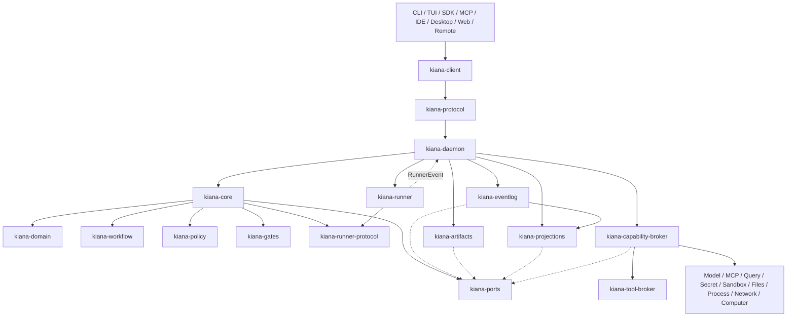

# Kiana 控制平面架构重整设计

**日期：** 2026-07-17  
**状态：** 已批准，进入分阶段实施  
**适用范围：** Kiana Core、Daemon、Runner、Command、Tool、Service、Query、Workflow、持久化和全部产品入口  
**上位规格：** `docs/superpowers/specs/2026-07-14-kiana-complete-ai-agent-product-design.md`

## 1. 背景与问题

当前 workspace 已有入口、命令、工具、服务、查询、任务和共享类型 crate，但缺少能够强制统一执行路径的控制平面边界：

- `kiana-entrypoints::runner` 直接构造 `ToolRegistry`，并直接调用工具执行、Provider 和 Query 实现；
- `kiana-commands` 直接依赖 `kiana-tools`、`kiana-services`、`kiana-query` 和 `kiana-tasks`；
- `CommandContext` 与 `ToolContext` 通过无类型 `HashMap<String, Value>` 传播安全和运行状态；
- `kiana-coordinator` 主要提供 coordinator 模式和提示词，不是 Core 或 Daemon；
- CLI、TUI、SDK、MCP、Remote 和未来 Desktop/Web 可以分别组装运行逻辑，无法机械保证一致 policy、event 和 recovery 行为。

这使以下越权路径在编译期合法：

```text
RUN -> TOOL / SERVICE / QUERY
CMD -> TOOL / SERVICE / TASKS / QUERY
SURFACE -> IMPLEMENTATION
```

本设计的目标不是新增一组空 crate，而是建立唯一控制平面、唯一组合根和唯一副作用出口，并通过 Cargo 依赖测试阻止旧路径继续增长。

## 2. 目标与非目标

### 2.1 目标

1. `kiana-core` 成为 command、run、workflow、policy、gate 和 capability decision 的唯一控制平面。
2. `kiana-daemon` 成为具体 adapter、持久化实现、Runner 和 transport 的唯一组合根。
3. 所有产品入口通过 `kiana-client` 和 `kiana-protocol` 使用同一请求、响应和事件合同。
4. `kiana-runner` 只运行模型循环并产生 `CapabilityRequest`，不得直接访问 Tool、Service、Query、Secret 或 Sandbox 实现。
5. 所有外部副作用通过 `kiana-capability-broker`，其中工具调用由 `kiana-tool-broker` 子系统负责。
6. EventLog 是事实来源，Artifact 保存可验证产物，Projection 是可重建读模型。
7. 迁移期间保持现有 CLI、SDK、MCP、workflow 和测试可用，并对 legacy 依赖建立只减不增的显式债务表。

### 2.2 非目标

- 本设计不改变 Kiana 的 Rust 2021、Tokio 和 Cargo workspace 技术栈。
- 第一阶段不批量移动当前有大量未提交改动的 `runner.rs`、`tasks.rs` 或 command 模块。
- 第一阶段不删除现有 `kiana-types`、`kiana-tasks`、`kiana-tools` 或 `kiana-services`。
- 不把模型消息总线、MCP transport 或 UI 状态当作授权边界。
- 不在架构迁移期间降低 ProjectTrust、审批、沙箱、证据或商业发布门禁。

## 3. 目标架构



图中的运行时调用与 Cargo 依赖必须保持一致：高层只能依赖稳定合同，具体实现只能从 Daemon 组合根注入。

## 4. Crate 责任与依赖规则

| Crate | 唯一责任 | 允许依赖的内部 crate | 禁止依赖 |
|---|---|---|---|
| `kiana-domain` | ID、actor/project context、command/run/capability/event 领域模型和不变量 | 无 | 所有实现 crate |
| `kiana-protocol` | 可版本化 wire request/response/event DTO | `kiana-domain` | Core、Daemon、Tools、Services |
| `kiana-client` | transport 抽象、连接、重试、请求构造和事件消费 | `kiana-protocol` | Core、Daemon、Commands、Tools、Services、Tasks、Query |
| `kiana-ports` | Runner、Capability、Event、Artifact、Projection、Catalog trait | `kiana-domain`、`kiana-runner-protocol` | 具体 adapter |
| `kiana-policy` | 纯 policy decision point | `kiana-domain` | 文件、网络、进程和工具实现 |
| `kiana-gates` | 纯 approval/verification/completion gate | `kiana-domain` | transport 和执行实现 |
| `kiana-workflow` | 纯 workflow aggregate、DAG 和 transition | `kiana-domain` | Commands、Tools、Daemon |
| `kiana-runner-protocol` | RunnerCommand、RunnerEvent、CapabilityRequest/Result 配对 | `kiana-domain` | Runner 和 Daemon 实现 |
| `kiana-core` | command/run use case、orchestration、policy/gate 调用和事件协调 | Domain、Ports、Workflow、Policy、Gates、Runner Protocol | Tools、Services、Query、Commands、Daemon |
| `kiana-runner` | 模型 turn/stream/context loop，输出 RunnerEvent | Runner Protocol、Domain | Tools、Services、Query、Secret、Sandbox |
| `kiana-capability-broker` | 授权后 capability 路由、预算、审计和结果归一化 | Domain、Ports | Client、UI |
| `kiana-daemon` | transport、session supervisor、生命周期和依赖组装 | Protocol、Core、Ports、Runner 和 concrete adapters | UI 业务逻辑 |
| `kiana-eventlog` | append-only event store | Domain、Ports | Core 业务决策 |
| `kiana-artifacts` | artifact blob、manifest、hash 和 provenance | Domain、Ports | Core 业务决策 |
| `kiana-projections` | 从 event 重建 read model | Domain、Ports | 独立事实写入 |

`kiana-types` 在迁移期间作为兼容层保留；新共享合同进入上述明确 owner crate，稳定后再缩减 `kiana-types`。

## 5. 统一执行流程

### 5.1 Command

```text
Surface
  -> kiana-client 构造 CommandRequest
  -> kiana-protocol 序列化
  -> kiana-daemon 校验 identity/session/project
  -> kiana-core dispatch use case
  -> policy/gates/workflow/capability ports
  -> ProtocolResponse + RuntimeEvent
```

Command adapter 只负责解析和呈现。创建任务、访问网络、调用工具或变更配置的业务规则不得留在客户端 command handler 中。

### 5.2 Runner 与 Capability

```text
Core -> RunnerPort -> RunnerCommand
Runner -> RunnerEvent::CapabilityRequested
Daemon -> Core::authorize_capability
Core -> PolicyDecision -> GateDecision
Core -> CapabilityBrokerPort::execute(AuthorizedCapabilityRequest)
Broker -> concrete adapter
Broker -> CapabilityResult + evidence refs
Core -> EventLog -> RunnerCommand::CapabilityResult
```

Runner 不能持有 `ToolRegistry`、Provider client、Query index 或 secret handle。Model 调用也属于 capability，由 Model Gateway 执行。

### 5.3 Event、Artifact 与 Projection

```text
Core decision -> EventStore.append
External result -> ArtifactStore.put -> ArtifactRef
EventLog -> ProjectionStore.apply
Projection/Event stream -> Client/UI
```

- EventLog 保存顺序、因果、actor、policy decision、attempt 和 outcome；
- Artifact 保存大输出、diff、测试、引用、外部回执和完整性 hash；
- Projection 保存 session、workflow、task、audit 和 dashboard 读模型；
- Projection 损坏时必须从 EventLog 重建，不得反向覆盖事实。

## 6. 安全与错误语义

所有路径 fail closed，并使用结构化状态：

| 状态 | 含义 |
|---|---|
| `accepted` | 请求已进入控制平面，但尚未完成 |
| `denied` | Policy 明确拒绝 |
| `awaiting_approval` | Gate 需要外部批准 |
| `running` | 已创建受控执行 attempt |
| `completed` | 必需结果、事件和证据均已写入 |
| `failed` | 执行失败且结果确定 |
| `result_unknown` | 外部动作可能发生，禁止自动重放 |
| `blocked` | 合同、完整性、恢复或外部依赖阻塞 |

Secret value 不进入 Domain、Protocol、EventLog、Artifact metadata、Projection 或 Runner context。Broker 只接受 secret reference，并在具体 adapter 内解析。

## 7. 迁移程序

### M0：边界冻结

- 新增 dependency policy 与自动化测试；
- 记录现有 legacy 越权边，只允许减少；
- 建立 Core、Daemon、Client、Protocol、Domain、Ports 和 Runner Protocol 空间。

### M1：可运行控制平面纵向切片

- 实现 typed command request、policy decision、gate、event 和 response；
- 实现 in-process client/daemon transport；
- 让一个只读系统 command 走完整新路径；
- 新路径默认 deny 未注册 capability。

### M2：Command 切换

- 将 `kiana-commands` 拆为客户端 command parser 与 Core use case；
- 按只读、本地写入、workflow、外部副作用顺序迁移；
- 删除 `kiana-commands -> tools/services/tasks/query` 依赖。

### M3：Runner 切换

- 将模型循环迁入 `kiana-runner`；
- Provider、Tool 和 Query 调用转换为 CapabilityRequest；
- 删除 `kiana-entrypoints::runner -> tools/services/query` 路径；
- 所有 ToolUse/ToolResult 使用 runner protocol 配对。

### M4：Broker 与持久化切换

- 建立 Capability Broker 及 Model、Tool、Query、Secret、Sandbox adapters；
- 将 workflow EventLog、artifact 和 projection 接入 Ports；
- 执行恢复、幂等、结果未知和投影重建测试。

### M5：Surface 与 Legacy 清理

- CLI、TUI、SDK、MCP、Remote 全部改用 Client/Protocol；
- `kiana-entrypoints` 只保留二进制启动和 surface adapter；
- 删除 legacy dependency exceptions；
- 运行 workspace、schema、release、package 和平台矩阵。

## 8. 测试策略

1. Domain、Policy、Gate 和 Workflow 使用纯单元测试覆盖状态与拒绝路径。
2. Ports 使用 contract tests，所有 adapter 必须通过同一行为套件。
3. Client/Protocol/Daemon/Core 使用 in-process 集成测试验证完整请求和 event stream。
4. Runner 使用 fake model stream，验证 capability 请求不能直接执行。
5. 架构测试解析 Cargo manifests，禁止新越权依赖并追踪 legacy 边减少。
6. EventLog、Artifact 和 Projection 使用 crash、partial write、replay 和 corruption 测试。
7. 每次迁移保持 `cargo fmt --all --check`、focused tests 和 `cargo test --workspace --locked --offline --no-fail-fast` 可运行。

## 9. 完成标准

架构重整只有在以下条件全部满足时才完成：

- 产品入口只通过 Client/Protocol 进入 Daemon；
- Core 不直接依赖 concrete tool/service/query/persistence；
- Runner 不直接依赖 Tool、Service、Query、Secret 或 Sandbox；
- Commands 不直接依赖 Tool、Service、Tasks 或 Query；
- 所有副作用都有 capability request、policy decision、gate decision、event 和 result；
- EventLog 可以重建全部权威 workflow/session projection；
- dependency policy 中不存在 legacy exception；
- workspace、合同、恢复、安全和 release gates 全部通过。

