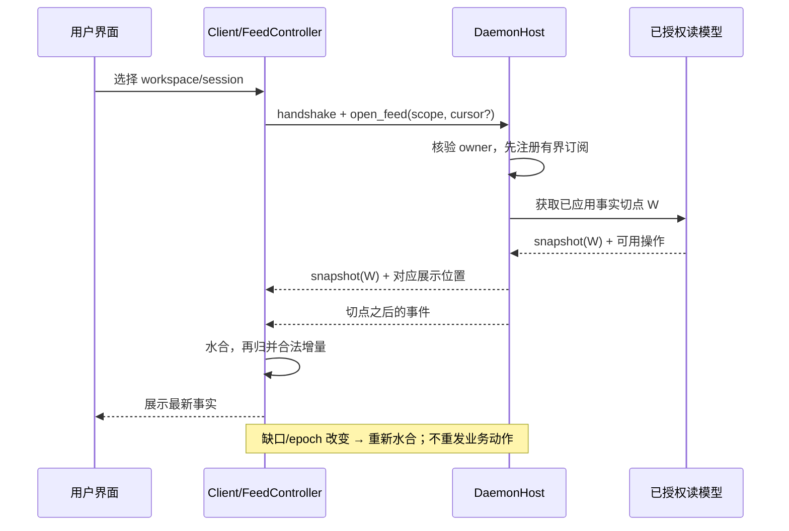

# UI / Entrypoints：源码调研与实现设计

> 日期：2026-09-12。对应 [module-map.md](module-map.md) 第 9 模块。
> 本文是待实施设计及研究记录；执行卡见 [roadmap.md](roadmap.md) §25–§27 的 `UI-00`–`UI-41`。
> 当前事实仍以 [CURRENT_STATUS.md](../CURRENT_STATUS.md) 及其绑定的测试快照为准。出现于源码中的类型、按钮、WIP 不等于已经验收。

## 1. 结论与范围

Kiana 的入口需要形成一套完整的用户操作链：**选工作区 → 了解当前权限与可用能力 → 提交任务 → 观察执行 → 处理人工待办 → 检查文件和证据 → 明确取消、恢复或收尾**。CLI、终端工作台、Web、Desktop 使用同一套版本化命令、查询和事件合同；桌面承载 Web，终端拥有适合键盘和管道的呈现。

本次按用户指示处理旧限制：允许为本设计逐步拆分 `cli.rs`、Web 大文件，调整入口技术栈、补本地 transport 和 IDE adapter；不再以旧冻结表为这些步骤的停止条件。原 P 单元、CP/H/Provider/CO/CAP 专项的编号与已有工作保留。此处提出的是实现方案，不自动提升产品状态，不授权提交、发布或真实外部业务操作。

最关键的五个设计决定：

1. **读模型在 daemon 生成。** 页面和 TTY 不再各自从散落的 JSON 猜状态；它们只保存可丢弃的展示状态和用户草稿。
2. **快照、事件、动作使用不同版本。** 持久事实水位、展示流序号、对象版本和 authority epoch 各司其职；一次 token 更新不应让另一个项目的审批过期。
3. **“请求已收到”与“业务动作已完成”分开。** 响应丢失时按原操作 ID 查询/重投原请求；不能换一个 ID 再执行。
4. **运行状态、连接状态、输入提交状态分开。** 浏览器断线不产生 Run Failed；关闭窗口不产生 Run Cancelled；工具结果未知不能由绿色聊天气泡覆盖。
5. **界面只暴露实际可执行的动作。** 人工卡、模型选择、工作流控制、文件恢复均来自服务端能力与前置条件，最终在 ControlPlane 重新核验。

## 2. 研究方法与全部 reference 的覆盖

### 2.1 范围与取样

本次盘点 `reference/` 全部 **73 个一级目录**，对目录结构、可用 README 和 UI 相关路径筛查，对下节列出的重点入口定向阅读；不是对所有文件逐行审计。重点项目的历史快照可能与上游版本不同，结论只描述本地所读代码。没有执行 reference 的安装脚本、测试、agent 或模型。

Kiana 取样基线为 `db77c2485bcafecbb1da17ec57ee509ad2ee32b4` 加 WIP；取样开始于 `2026-09-12T10:31:51.119309+00:00`，39 个相关文件按文件复制，**不是原子工作树快照**。后续实施必须重新绑定快照。源码仍由另一 agent 持续完善。

以下分组完整覆盖 73 目录，各目录只列一次；“筛查”表示不主张已读完该项目的 UI 实现。

| 相关性 | 目录 | 本专项吸收或排除理由 |
|---|---|---|
| 用户入口重点 | `codex`、`opencode`、`OpenHands`、`cline`、`Roo-Code`、`roo-code`、`continue`、`goose`、`emdash`、`crush`、`pi`、`aider`、`letta-code`、`deepseek-harness`、`grok-build`、`herdr`、`orca` | 协议、流式对话、输入编辑、审批、Diff、桌面生命周期；源码阅读范围见 §2.2。两个 Roo 目录分别登记，不能当作两项独立设计佐证 |
| 工作流/组织 UI 与编排筛查 | `Archon`、`Archon-Knowledge`、`ChatDev`、`MetaGPT`、`agency-swarm`、`agent-framework`、`agno`、`autogen`、`crewAI`、`gastown`、`gpt-pilot`、`ruflo` | 任务/DAG/部门观察、待办和运行详情。Archon 当前 README 描述代码依赖分析，不能仅凭旧名字写成旧知识库产品；Archon-Knowledge 的 workflow store 定向读取 |
| 运行时与协议筛查 | `a2a`、`adk-python`、`langchain`、`langgraph`、`mini-swe-agent`、`openai-agents-python`、`pydantic-ai`、`temporal-sdk-python`、`container-use`、`mcp-servers`、`strix`、`claude-code-rust` | 借用状态/事件/暂停恢复的边界概念；不把框架的 executor、编辑器端执行器或远端 runtime 接成第二套 Kiana 循环 |
| Memory/检索筛查 | `GitNexus`、`MemPalace`、`claude-mem-candidate`、`claude-memory`、`graphify`、`graphiti`、`letta`、`letta-oss`、`llama-index`、`mem0`、`memorix` | 上下文来源、检索结果与候选记忆的观察入口；不据相似仓库名推断同版本，少量文件的快照不等于完整实现 |
| 方法/规格/技能筛查 | `12-factor-agents`、`ECC`、`OpenSpec`、`ai-coding-guide`、`architect-loop`、`awesome-agent-skills`、`beads`、`claude-task-master`、`everything-claude-code`、`get-shit-done`、`gsd-core`、`gstack`、`planning-with-files`、`pm-skills`、`skills`、`spec-kit`、`superpowers` | 规划产物、可追踪任务与按步骤验收；不把 Markdown 计划文件当运行状态或自动授权 |
| 特殊输入 | `.claude-flow`、`promptfoo-full`、`claude-code-main (2)`、`claude-code-rev-main` | `.claude-flow` 为本地辅助资料；`promptfoo-full` 本次普通文件扫描为空；后两者只登记目录/公开行为，不复制或使用逆向源码实现 UI |

一级非目录输入也已登记：`COMPANYOS-REFERENCES.md` 是索引；`agentdb.rvf`、`agentdb.rvf.lock`、`ruvector.db` 是数据/锁文件，不作为 UI 设计证据，也未加载其内容。

### 2.2 重点参考与具体取舍

| 本地来源 | 实际阅读位置/层级 | 可以吸收 | Kiana 的具体调整 |
|---|---|---|---|
| Codex | [历史投影](../reference/codex/codex-rs/app-server-protocol/src/protocol/thread_history_projection.rs)、[输入编辑器](../reference/codex/codex-rs/tui/src/bottom_pane/chat_composer.rs) | Turn/Item 的稳定身份、从完成记录投影历史；输入、弹层、粘贴、历史回退分开的状态机 | 映射既有 Session/Run/Turn/Invocation；不复制它的状态枚举，也不把文本发送成功当 Kiana 完成 |
| OpenCode | [bootstrap](../reference/opencode/packages/app/src/context/global-sync/bootstrap.ts)、[event reducer](../reference/opencode/packages/app/src/context/global-sync/event-reducer.ts)、[eviction](../reference/opencode/packages/app/src/context/global-sync/eviction.ts) | 查询装配、事件归并、按 scope 缓存和有界淘汰 | Kiana 以明确水位同步，不把任意客户端 cache 当授权依据；待办和活动对象不能被普通 LRU 静默丢弃 |
| OpenHands | [事件 store](../reference/OpenHands/src/stores/use-event-store.ts)、[WebSocket hook](../reference/OpenHands/src/hooks/use-websocket.ts) | 持久事件去重与临时 delta 区分；替换连接后的迟到回调隔离；退避和避免逐 token 顶层刷新 | 采用服务端 sequence 排序，不能沿用 timestamp 排序裁决 Kiana 事实；先保留 HTTP/SSE，不为参考项目使用 WS 就重做传输 |
| Cline | [ProtoBus client](../reference/cline/apps/vscode/webview-ui/src/services/grpc-client-base.ts)、ExtensionStateContext 路径筛查 | request ID 关联、流订阅可释放、类型化边界 | 增加 deadline、响应丢失查询和 listener 清理验收；名称含 gRPC 不意味着 Kiana 应迁移 gRPC |
| Roo-Code / roo-code | [BatchDiffApproval](../reference/Roo-Code/webview-ui/src/components/chat/BatchDiffApproval.tsx)、两个目录的同类入口筛查 | 服务端生成 Diff 与统计，前端折叠查看 | 文件预览必须绑定 Artifact/revision/digest；折叠文件或勾选部分文件不能悄悄改变原审批载荷 |
| Continue | [IdeMessenger](../reference/continue/gui/src/context/IdeMessenger.tsx)、[协议目录](../reference/continue/core/protocol) | typed message、请求和流式响应的桥接 | 不吸收通用自动重试对有副作用消息的处理；IDE 的文件操作也须经 Kiana 授权 |
| Goose | [useChatSession](../reference/goose/ui/desktop/src/hooks/useChatSession.ts)、[preload](../reference/goose/ui/desktop/src/preload.ts) | session store 与视图 hook 分离、后台通知、Desktop API 类型化 | 通知根据服务端终态/待办事实产生；preload 只暴露窄 API，不能复制完整 shell 能力 |
| Emdash | [hydration reconciler](../reference/emdash/apps/emdash-desktop/src/core/features/conversations/browser/stores/conversation-hydration-reconciler.ts)、[流客户端路径](../reference/emdash/packages/wire/src/live/event-stream/client.ts) | desired attachment 与 starting/running/stopping 分离，关闭与启动竞态协调 | attach 只是订阅；恢复展示不能隐式恢复 Run。第二处仅定位，不声称已审计其整套网络语义 |
| Pi | [stdin buffer](../reference/pi/packages/tui/src/stdin-buffer.ts)、[TUI 路径](../reference/pi/packages/tui/src/tui.ts) | 跨 chunk 的按键/粘贴序列解析；完整序列再交给编辑器 | Ratatui/Crossterm 入口保留，增强 bracketed paste、Unicode、取消键优先级，不把输入内容当终端控制命令 |
| Crush | [tool result renderer](../reference/crush/internal/ui/chat/tool_result_content.go)、[权限弹层路径](../reference/crush/internal/ui/dialog/permissions.go) | 有界 JSON/Diff/文本呈现、折叠详情 | 内容外观不能决定业务类型；由服务端 Item kind/MIME 指定，并过滤 OSC/ANSI 控制 |
| Letta Code | [approval recovery test](../reference/letta-code/src/headless-approval-recovery.test.ts) | 审批恢复不可盲目再执行工具这一问题分解 | 读到的是源码字符串断言，不是行为证明；Kiana 用 effect 计数和新进程验证，不能照抄测试作为完成证据 |
| Herdr | [session save](../reference/herdr/src/app/session.rs)、README | 保存工作区/窗格布局时 debounce、非阻塞写入 | 只保存布局、草稿策略和对象引用；恢复窗格不自动 launch/approve/resume |
| Orca | [PTY 切页恢复测试](../reference/orca/tests/e2e/terminal-tab-switch-sigwinch-restore.spec.ts)、README | 隐藏标签页、尺寸变化、重启恢复要有现实 PTY 场景 | shell 输出预览与可交互终端区分；PTY 能力依赖 CAP-27，不能在 renderer 自行 spawn |
| Archon-Knowledge | [workflow store](../reference/Archon-Knowledge/packages/web/src/stores/workflow-store.ts) | 工作流节点、当前步骤、产物和活动的组织方式 | 采用 workflow/packet 事实投影；不根据前端 active 节点推算“ready”或发起执行 |
| Aider / DeepSeek Harness / Grok Build | [Aider README](../reference/aider/README.md)、[gui.py 路径](../reference/aider/aider/gui.py)、[DeepSeek README](../reference/deepseek-harness/README.md)、[Grok README](../reference/grok-build/README.md)，目录/说明筛查 | CLI/Web/TUI 的用户入口覆盖、启动诊断与审阅工作流作为对照 | 本次不声称深读三者的全部 UI；不因支持自然语言 shell 或自动 Git 操作就照搬授权语义 |

### 2.3 reference 之外的官方资料

访问日均为 2026-09-12。以下资料支撑协议或平台行为，后文的 Kiana 选型和流程是基于这些资料作出的设计决定。

| 官方来源 | 本次采用的范围 |
|---|---|
| [Zed External Agents](https://zed.dev/docs/ai/external-agents) | 编辑器承载会话，外部 agent 拥有 runtime；作为后续 IDE 入口对照 |
| [ACP v1 Overview](https://agentclientprotocol.com/protocol/v1/overview)、[Prompt Turn](https://agentclientprotocol.com/protocol/v1/prompt-turn) | 请求、session update、permission 和取消；版本必须显式固定。v1 建议的客户端抢先 cancelled 展示只能映射成本地“取消中”，Kiana 最终停止仍等服务端确认 |
| [VS Code Webview API](https://code.visualstudio.com/api/extension-guides/webview)、[UX Guidelines](https://code.visualstudio.com/api/ux-guidelines/webviews) | 最小资源范围、CSP、消息桥及编辑器内无障碍，不在 Webview 复制整个 IDE |
| [Electron Security](https://www.electronjs.org/docs/latest/tutorial/security) | IPC sender 校验、context isolation、导航和新窗口限制；安全标志不能代替调用来源校验 |
| [WHATWG Server-sent events](https://html.spec.whatwg.org/multipage/server-sent-events.html) | `id`、`Last-Event-ID`、分帧与重连；SSE 自身不提供事件落盘或命令幂等 |
| [WCAG 2.2](https://www.w3.org/TR/WCAG22/) | 键盘、焦点、缩放、可感知状态；以实际页面/读屏检查验收，不能仅凭 aria 属性声称达标 |
| [React 的独立应用构建说明](https://react.dev/learn/build-a-react-app-from-scratch)、[Vite 静态构建](https://vite.dev/guide/build.html) | 评估本地静态 SPA；采用 React/TypeScript/Vite 是本设计选择，不是仓库当前事实或强制使用最新版本 |

## 3. Kiana 当前接线与具体缺口

以下是取样源码观察，未运行失败复现；每条先在 `UI-00` 复核。当前源码已包含增量改进，不能把这些项目全部写成“从零实现”。

| 边界 | 已有源码 | 下一步必须补的细节 |
|---|---|---|
| wire | [protocol](../kiana-protocol/src/lib.rs) 已有 `UiCursor`、`UiSnapshot`、`UiAction`、六类已知 RunStreamEvent | pending/data 仍有 `Value`；run 事件缺完整 Turn/Item 关联；`u64` 直接进 JS number 有精度边界；旧规范“尚无对应类型”已过时 |
| client | [client](../kiana-client/src/lib.rs) 封装 RequestEnvelope，transport 只有 send | 查询、订阅、断线与 action 结果查询不统一；入口直接依赖 host。复用 DaemonHost 类型不代表几个进程连着同一个存活实例 |
| server projection | [daemon](../kiana-daemon/src/lib.rs) 的 `ui_snapshot` 从 owned events 投影 | UI cursor 在异步读取事件前采样，stream tail 后取，缺少可证明的一致切点；历史全量扫描与跨模块待办需统一分页 |
| action fence | [run_stream](../kiana-daemon/src/run_stream.rs) 的 `claim_ui_action` 检查 epoch/全局 UI sequence，保留 1024 个 key | 队列是内存去重，未绑定命令 digest/owner/目标版本与持久结果；不等于 core 的事务幂等；token 更新与用户冲突不应共享版本域 |
| Web | [web.rs](../kiana-entrypoints/src/web.rs) 已有 approvals/resume/command、loopback/Host/token 防护 | `claim_ui_headers` 全部缺省时放行；trust handler 直接写 trust；active/sandbox/role 存在应用级状态；health 未认证返回 folder；这些需要按实际作用域复核 |
| Web 同步 | [web_page.html](../kiana-entrypoints/src/web_page.html) 有 cursor 过滤、gap 提示和轮询 | EventSource URL 携带实例 token；HTTP/SSE/轮询分别写页面状态；“历史”和“可操作”需逐动作表达；人工动作仍要求用户填 JSON |
| 时间线 | [web_thread](../kiana-entrypoints/src/web_thread.rs) 把 Response 转为 Turn/Item；`web.rs` 另折叠 ledger | item 没独立稳定 ID，整轮状态赋给每项，部分标题固定 Builder；容易丢真实工具顺序、角色和关联 |
| CLI/TTY | [stream_render](../kiana-entrypoints/src/stream_render.rs)、[workbench_chat](../kiana-entrypoints/src/workbench_chat.rs) 处理 Delta/Terminal | 一些 Usage/ToolCall/Error 分支不呈现；TTY 转发使用 unbounded channel；输入、订阅、动作和 draw 耦合；各入口需要同一错误语义 |
| Desktop | [main.js](../contrib/desktop/main.js)、[worker](../contrib/desktop/lib/worker.js) 已有串行切工作区、进程组停止和安全 WebPreferences | IPC handlers 未校验 sender；未见导航/新窗口 allowlist；从日志解析 URL 作为 readiness；scratch autoTrust 请求不携带 Web token，不可据此声称成功；worker 退出不等于全部执行停止 |
| 人工与业务命令 | [human API](human-operations-api.md)、[Company API](company-command-api.md) 及当前 WIP | 已有 revision/idempotency 与原命令调用，UI 应消费并加强合同；不能另起第二套 human inbox 数据库或把通用 JSON 面板当完整产品 |

旧 [overview](company-os-overview.md) 的“尚无 live/streaming”、[UI 规范](company-os-ui-ux.md) 的“尚无 UiSnapshot”与状态账本/新源码不一致。保留规范的目标，后续在实测切片内更新其事实段；本次不篡改既有证据，也不将源码存在改写成行为已验证。

## 4. 目标代码结构与技术路线

### 4.1 组件边界

```text
kiana-domain               既有 ID / 状态 / 操作目标 / 错误语义
kiana-protocol             UI 查询、快照、事件、动作 DTO / schema 导出
kiana-core                 命令准入、对象版本 CAS、审批、幂等结果、生命周期
kiana-daemon
  ui/projection.rs         从 core/event facts 生成安全读模型（拟新增）
  ui/query.rs              owner 过滤、分页、Artifact 引用（拟新增）
  ui/feed.rs               快照切点、订阅、retention、gap（拟新增）
  local_service.rs         实例身份、受保护本地连接、生命周期（拟新增）
kiana-client
  query.rs / subscription.rs / action.rs / transport/*（拟新增）
kiana-entrypoints
  dispatch.rs              唯一产品参数/命令分派（拟新增，逐路由迁移）
  cli/*                    参数、输出、signals（拟新增）
  workbench/*              model / input / controller / render（拟新增）
  web/*                    auth / routes / sse / assets（拟新增）
contrib/workbench           TypeScript + React 静态 SPA（拟新增）
  src/protocol/generated/   从 canonical schema 生成的边界
  src/client/              transport、action tracker、feed controller
  src/state/               纯 reducer、归一化 entity store、selectors
  src/features/            workspace/chat/inbox/run/project/context/settings
  src/components/          状态、动作卡、Diff、证据引用等纯组件
  src/platform/            Browser/Desktop/IDE 窄适配
contrib/desktop             window / ipc / worker / lifecycle / preferences
```

这里所有“拟新增”是落点建议；若另一 agent 已抽出等价模块，沿用其模块，不重复创建。依赖仍向 domain/protocol/ports；client 不依赖 daemon，in-process adapter 在组合处实现。UI 不调用 provider、shell、git 或 MCP 执行器。

### 4.2 Web 与构建选择

推荐 **React + TypeScript + Vite 的纯静态应用**，理由是页面将包含有状态人工表单、复杂时间线和可复用 Web/Desktop 组件。保持 Rust daemon 服务 API 和静态资源；无需 Node 生产服务、SSR 或浏览器模型 SDK。既有 Ratatui/Crossterm 继续用于终端，不将 TTY 换成 WebView。

迁移顺序是合同和 controller → 迁入一条 Chat/Inbox 纵向路径 → 逐页替换 → parity 门通过后收掉旧页面。`contrib/workbench/package.json` 与 lockfile 单独管理，版本在实施时锁定；根 package.json 无 scripts 这一事实不改变。

离线 Rust 构建需可用：将经固定 Node/依赖版本生成的发布静态资源及 manifest 放入受版本管理的 `kiana-entrypoints/assets/workbench/`，daemon 只服务 manifest 中列出的资源。manifest 记录 UI/API schema、资源 hash 和工具链版本；CI 从源码重建并比较，避免旧 bundle 掩盖新 UI 源码。Cargo build 不运行 npm 或联网。开发模式由同源 gateway 提供已构建资源；任何 HMR 模式另配显式开发入口，不能放宽生产 Origin/CSP 检查。

### 4.3 本地实例与传输

“同一个 DaemonHost”分两层证明：复用相同组合代码；不同入口确实 attach 到同一个服务实例。后者需要 `instance_id`、boot epoch、workspace binding、协议能力握手与本地 transport。

目标为每个已规范化工作区的受保护 runtime 目录登记一个可发现实例；注册位置使用现有 KIANA_HOME 路径解析。Linux/macOS 用权限受限 Unix socket 与对端身份校验，Windows 用限制账户的 named pipe。启动竞争由 host ownership lock 和 incarnation 解决；不能只根据一个旧 PID 或端口文件信任服务。loopback Web gateway 持有到该实例的 client，CLI/TTY/desktop attach 复用；standalone CLI 可以显式拥有临时实例，但这种模式不能声称跨入口共享 live run。

关闭一个客户端默认 detach；只有实例 owner 的显式停止动作可排空服务。若远程网络/多租户将来需要接入，应另补身份模型，不由此本地 transport 顺便开放。对当前版本无法恢复的运行，重连只读后提示可用的恢复动作，不自动续跑。

## 5. 共享数据与状态合同

以下字段是目标增量；优先扩展已有类型，旧字段兼容读取并有明确迁移期。

| 合同 | 最低信息 | 核心规则 |
|---|---|---|
| `UiScope` | instance、workspace、principal 的安全标识；project/session/run/turn 可选引用 | scope 来自已认证连接与服务端绑定，调用参数只是选择请求 |
| `UiSnapshot` | schema/capabilities、scope、projection watermark、对象版本、连接 incarnation、实体页、pending summaries、stream position、生成时间 | 表示某个已应用事实切点；缺页/权限不足/不支持/未加载分别标明 |
| `UiItem` | 稳定 item_id、run/turn/invocation、kind、阶段、内容/Artifact refs、actor/role、安全输出摘要 | delta 与最终 item 使用同一身份；工具卡使用自身 outcome；最终文本替换临时文本，不再追加一遍 |
| `UiEvent` | schema、scope、事件/实体 ID、sequence、epoch、kind、typed payload、事实或临时展示类别 | 持久事实需有 EventLog 引用；token 只带展示位置；未知展示事件可忽略并推进合法游标，未知状态不可推断成功 |
| `UiAction` | action_id、target type/id、expected target revision、command+typed payload、idempotency key、必要 challenge | actor/effective role 服务端派生；UI 数据不成为权限来源 |
| `ActionResult` | accepted/rejected/conflict/pending 等提交结果、原 action_id、稳定 code、receipt/event refs、可执行后续动作 | accepted 表示接单；结果丢失可查询。相同 key+相同内容返回原结果，相同 key+不同内容拒绝 |
| `HumanActionCard` | kind、对象摘要、最终预览引用、required fields、available decisions、target revision、expires_at、处置状态 | 表单来自有限字段 schema，不接受任意 server HTML/JS；无权、不支持、已过期显示原因 |

必须区分四类版本：

- **事实水位**：EventLog/投影已应用到哪里，用于快照和增量同步；跨 aggregate 使用存储提交位置或可重建的向量，不拿各 stream 的 sequence 做全局相加。
- **展示流位置**：`instance/boot epoch + run/turn + sequence`，只用于去重和判断缺口。
- **目标对象 revision**：命令的 CAS 前置条件；若多目标，携带每个受影响对象的版本集合。
- **authority/data epoch**：服务端授权或数据可见性发生变化，使许可、缓存或敏感视图失效。

所有可能超出 JavaScript 安全整数范围的版本/序号，以协议约定的十进制字符串或 opaque cursor 表达；不能无提示 Number 转换。旧 numeric 字段只在已验证范围兼容，超出即要求新协议。

客户端保存三份互不覆盖的状态：`ConnectionState(connecting/syncing/live/stale/offline/incompatible)`；服务端 Run/Turn/Invocation 状态；`SubmissionState(draft/sending/accepted/rejected/delivery_unconfirmed)`。`delivery_unconfirmed` 表示该 HTTP/IPC 请求是否接收未知，不等同于产品 `result_unknown`。新文本不会把既有 Run 终态“复活”；继续输入遵循 H02/H19 的 Run/Turn 合同。

## 6. 处理流程

### 6.1 打开、快照水合、重连



实现一致切点可用串行 projector/actor 消息屏障，或同等一致读事务。不能在一个随时变化的序号前后各做一次查询然后称为原子。持久投影落后时返回实际水位与 freshness；快照生成和返回间的新事件已在订阅缓冲中。缓冲溢出返回 gap，客户端废弃不完整拼接后重新读；缺失 token 可以显示“此段实时输出未保留”，最终 item/Receipt 仍按事实恢复。

浏览器按 `scope + connection generation` 隔离迟到结果，切会话要关闭旧订阅/请求并保留该会话草稿。终态事件优先投递且可查询补回；后台页可降刷新频率，不得丢待办。重连使用有上限退避/抖动，401、协议不兼容和权限撤销进入明确状态，不无限重试。历史查询不会写事件或启动模型。

### 6.2 提交、响应丢失与后续输入

1. 编辑器保存原稿及显式附件引用；客户端只做格式/配额提示，不做授权。普通文本、slash command、排队补充、steer 的意图明确区分。
2. 在一次用户提交时产生 action/idempotency ID，保留到结果确定；实际请求绑定 workspace/session、目标版本与 provider/profile 请求。
3. daemon 解析身份、规范化动作；core 验权并在既有 journal 中原子记录接收/拒绝与幂等结果，再驱动现有 Harness。
4. UI 先显示“已接收/排队”，收到规范的 Turn/Invocation 事实后更新卡片；输入框清空和失败恢复以可确认接收为边界。
5. HTTP 响应与流事件可能任意先到；按同一个 action/turn/item 归并。发送后超时先查询原 action；重投也保留原内容与 key，用户主动修改才生成新意图。
6. 运行中输入使用持久 inbox 的 ACK/queued/applied/rejected 事实。后端未支持 steer 时允许保存草稿或明确排队，不能偷偷 cancel+start。刷新/打开历史不会自动送出本地队列。

### 6.3 人工动作与文件审阅

`human.inbox` → 选择对象 → 读取精确预览 → 填有限类型表单 → 提交已有 command/challenge → core 校验版本、期限、身份 → 唯一决定记录 → 刷新卡及运行。

审批卡展示最终命令、工作目录、写集/目标、影响、有效期、允许决定和变更摘要；审批消费与授权失效使用 CP/CAP 合同。澄清问题只补充任务信息，不能返回 approve；Review/Acceptance 使用独立角色与 evidence，对象拒绝与工具 deny 分开。取消、批准、过期、另一个页面同时操作时，败方显示最新决定，不新建“等价审批”替代原决定。

文件详情先读不可变 Artifact/Diff（base/target hash、生成者、所属 invocation、实际写入状态）；“建议修改”“已写入”“回滚”“结果未知”不混用。编辑级 undo 先 preview，确认当前 revision 和相关运行可停止后，提交 checkpoint restore 命令；历史聊天不删，旧审批失效由服务端完成。Binary/大文件/不支持恢复的外部效果有明确说明。

### 6.4 取消与恢复

用户取消 → action accepted → **取消中** → daemon/core 停止已启动工作 → StopReport/事实 → Cancelled 或 ResultUnknown。取消按钮只更新 submission 状态；AbortController、关闭 SSE、关窗口、杀 worker 都不能直接决定 Run 已取消。若用户离开页面，服务按实例所有权/显式 close policy 工作。

重启 → 握手新 incarnation → 历史只读快照 → 服务端给出 available recovery actions → 用户显式 Resume/新 Attempt/对账。没有恢复材料就提供明确原因；不能把旧 prompt 再发一遍冒充 Resume。新 Attempt 使用新执行身份并关联前次，Unknown 先对账，补偿是新的获准动作。

### 6.5 Desktop 和编辑器

Desktop 生命周期：`stopped → starting → ready → stopping → stopped/unconfirmed`，启动失败单独 `failed`。主进程从受保护 readiness channel 获取 instance/workspace/schema 信息并验证 health；日志仅诊断，不能解析任意输出作为可信 URL。切工作区先完成旧实例的 detach/stop 决定，再串行 attach 新实例；旧 worker 的迟到 exit 不得关闭新窗口。

欢迎页可选择目录、创建受控 scratch 或打开历史；这些不自动 trust。系统目录选择器/窗口操作归平台 adapter，项目资源加载/创建及 trust 变更使用 daemon 的既有授权路径。preload 校验 sender frame/webContents/origin，导航只允许 bundled app 与本实例的明确 origin；外链经过窄 opener，禁止 `javascript:`/任意 `file:`/命令 URI。通知点击仅定位对象，绝不批准或恢复。

后续 ACP/IDE 是额外投影 adapter：初始化协商、session/update、权限请求和取消均映射同一合同；在 handler 安装后再请求 session。编辑器提供的 file write/terminal 能力若没有 Kiana executor 的完整授权闭环则不宣称支持。外部客户端抢先绘制 cancelled 的惯例不能改变 Kiana 的 StopReport/Receipt。

## 7. 页面、输入与表现层细节

| 表面 | 用户任务 | 交付要求 |
|---|---|---|
| 工作区入口 | 打开、切换、检查连接与 trust | 展示当前目录/身份/权限与可用模型；连接问题有可执行诊断，后端未支持的能力有原因 |
| 工作台 | 提交、跟进、看当前活动 | 会话列表、输入编辑器、Timeline、可选详情栏；窄屏变页签。保留阅读位置和草稿，用户滚回历史时不强制滚底 |
| 人工待办 | 审批、澄清、复核、验收、异常对账 | 未处理数、责任人、期限和对象定位；普通用户填写表单，原始 JSON 放诊断详情 |
| Run 详情 | 看工具、停止原因、Diff、用量、Receipt | 由稳定 ID 相互定位；使用量区分估算/实测，ToolCall 预览与执行结果分开 |
| 项目/Workflow | 了解目标、工单依赖、阻塞与交付 | 列表先可用，再图形；ready/blocked 来自服务端。Run completed 不自动等于业务验收通过 |
| Context/Memory | 查看引用、检索范围、候选和保留策略 | provenance、freshness、ACL、candidate/published；不展示 secret 或私有推理载荷 |
| 设置/诊断 | 模型连接、扩展、沙箱、运行健康 | 展示服务端可用选项和生效范围；credential 只写不回显，不经浏览器直接请求 provider |

TTY 输入覆盖中文、组合字符、emoji、宽字符、粘贴、多行、历史搜索、resize、终端恢复；Web 覆盖 IME `isComposing`、提交快捷键、粘贴大文本提示、附件失败重试。Esc 优先关闭弹层/补全，再依实际状态请求取消；不能在输入中文候选时意外取消任务。非 TTY 与 `TERM=dumb` 有纯文本模式；`--json` 输出不混进动画/日志。

样式采用语义 token、亮/暗/系统主题与 forced-colors；状态同时用文字和图标表达。读屏播报待办和阶段变化，不逐 token 朗读；焦点 trap/返回、缩放和选择复制必须实测。通用组件的安全文本、Markdown allowlist、Diff 和 artifact preview 共用受控渲染策略。

长历史使用服务器分页、实体归一化与按范围订阅；客户端内存同时按 item 数和字节数限额。token 合并在帧/时间窗口刷新，最终 item 和待办不被低优先级 delta 挤掉。性能验收先在固定机器建立预算，再比较首屏、输入延迟、首 token、重连时间、内存和 DOM 数；不能用删历史或关闭安全检查换指标。

## 8. 本次研究的证据边界

```text
source_snapshot: db77c2485bcafecbb1da17ec57ee509ad2ee32b4 + per-file WIP capture
source_capture: 2026-09-12T10:31:51.119309+00:00; non-atomic
worktree_status: 已有跨 crate/状态账本/roadmap WIP；本任务只写此研究文档及追加 roadmap
command_argv: git status --short --branch; git rev-parse HEAD;
              rg --files / rg -n / sed / Python 目录筛查与 SHA-256 取样；
              官方网页 open/search/find；追加内容链接、编号、依赖与原文保留校验
cwd/environment: 仓库根；Linux/bash；外部资料访问日 2026-09-12
fixture/cassette: 无；未运行 Rust/Node 产品测试、模型、参考项目或 CI
status change: 增加待实施 UI 设计与 UI-00–UI-41 卡；不更改当前产品状态
proof-level change: 无；研究与文档核验不是 local_behavior/durable/live 证据
limitations: reference 全目录筛查、重点文件定向阅读；未逐行审计全部项目；
             未核对每个 upstream HEAD、未验证参考项目测试；工作树持续变化；
             API/目录/测试建议为目标，须复用后续已有等价实现
reviewer: Codex 文档自检；没有独立实现评审或人工验收声明
```

文档校验的实际结果与取样摘要见 roadmap §26–§28。本地临时取样位于 `/tmp/kiana-ui-entrypoints-research-20260912/`，只供本次交接核对，不充当长期发布工件。
